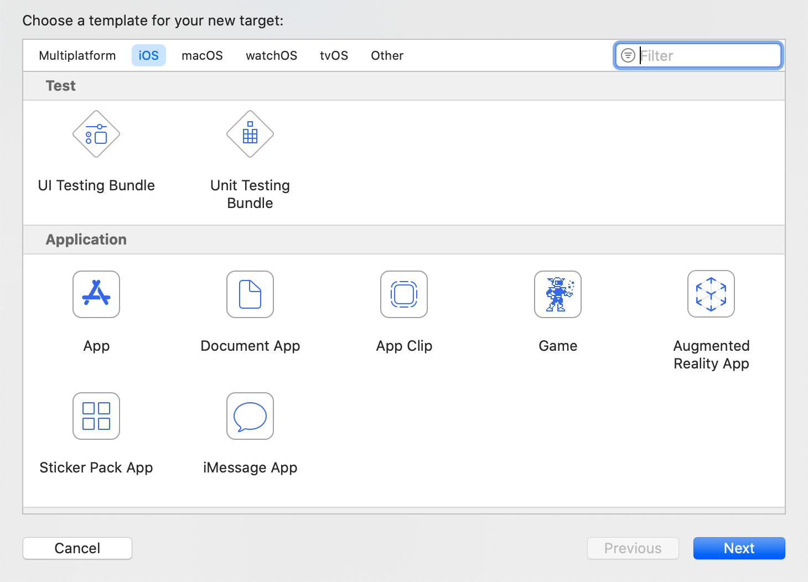
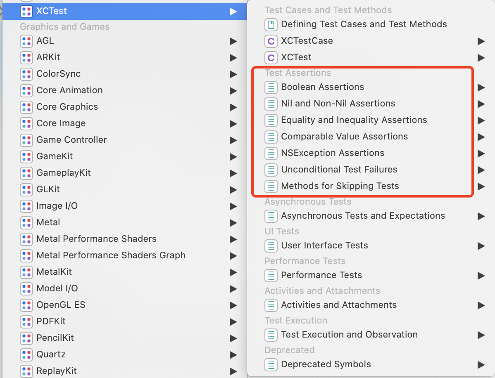

## iOS单元测试

相关文章 [作为移动应用开发者应该了解APP测试](./2016-8-7-作为移动应用开发者应该了解APP测试.md)

Xcode 在创建项目是就能够自带 XCTest，包含`Unit Testing Bundle`（单元测试）和 `UI Testing Bundle`（UI 测试）。

在新建项目时，勾选`Include Unit Tests`和`Include UI Tests`,即可为项目添加单元测试和 UI 测试。当然也可以给没有测试的工程，添加 target。文章主要讲一下单元测试。




### 方法简单介绍

> ```objectivec
> - (void)setUp;
> - (void)tearDown;
> - (void)testExample;
> - (void)testPerformanceExample;
> ```
>
>  `setUp` 方法会在`XCTestCase`的测试方法每次调用之前调用，所以把一些测试代码需要用的初始化代码和全局变量写在这个方法里;
>
> `tearDown` 在每个单元测试方法执行完毕后，`XCTest`会执行`tearDown`方法，所以可以把需要测试完成后销毁的内容写在这个里，以便保证下面的测试不受本次测试影响
>
> 测试用例。所有测试的方法都需要以`test`为前缀进行命名，比如`- (void)testExample`
>
> 为业务类创建测试类。对于每一个业务类，我们都会有一个对应的测试类，所有的测试类需要继承`XCTestCase`，比如：`NetService`对应`NetServiceTest`，如果类的内容太多，可以通过`Category`进行分类，如果某个方法暂时不想测试了，可以加一个`Disable`前缀（disable 只是为了提高阅读性）。


### 单元测试应用

#### 1. 步骤

1. 准备输入
2. 运行正在测试的代码
3. 验证输出

#### 2. 注意

1. 不是所有的方法都需要测试，主要针对对外开放的API
2. 关注异常情况和边界值
3. 注意用例之间的依赖（a,c 依赖 d，那么比较合理的是，把d 抽象出来，a、c 的 `setup` 方法执行 d）
4. 用例可通过 `test{001}XXX`  来控制用例的执行顺序，可灵活应用
5. 关于代码覆盖率（勾选 Gather coverage for xxx target）


##### 1>准备输入

1. 准备方法的入参
2. 准备方法执行的上下文

首先，最麻烦也是最容易出错的地方是：**设置依赖，处理各种编译错误**。

其次，**Mock 数据**。

**1.1> 在单元测试中引入 framework**

1.1.1 Runpath Search Paths 设置

> In the Test target under the Build Settings tab, add `@loader_path/Frameworks` to the *Runpath Search Paths* if it isn't already present.


1.1.2 Podfil

```ruby
def import_common_pods
    pod 'KL3rdFramework', :path => '../KL3rdFramework'
end

target "KLSDK", :exclusive => true do
    import_common_pods
  	    pod 'xxx'
  	# other target
    target 'KLSDKUnitTests' do
     		# ！！！关键点：测试 target 集成了 KLSDK 的依赖 KL3rdFramework 和 xxx
        inherit! :search_paths
        # Pods for testing
        pod 'OCMock'
      	# ...
    end
end

```

参考：

> [inherit!](https://guides.cocoapods.org/syntax/podfile.html#inherit_bang)
>
> #### inheritanceSymbol
>
> The inheritance mode to set.
>
> **Available Modes:** + `:complete` The target inherits all behaviour from the parent. + `:none` The target inherits none of the behaviour from the parent. + `:search_paths` The target inherits the search paths of the parent only.


1.1.3 对于那些不是通过 pod 依赖的三方库

切到工程文件的 **Build Settings Header Search Paths** 加入头文件路径

你可能还遇到了问题，那就需要根据具体情况来处理了。


##### 2.1>异步测试

异步测试场景：网络请求、动画、后台线程中执行的服务等等

XCode 提供了 **`XCTestExpectation` **来处理异步。

**新建期望** 

```objective-c
// Creates a new XCTestExpectation with the provided description.
- (instancetype)initWithDescription:(NSString *)expectationDescription;

// A human readable string used to describe the expectation in log output and test reports.
@property(copy) NSString *expectationDescription;
```


**等待期望被履行**

```objective-c
// Waits until the test fulfills all expectations or until it times out.
- (void)waitForExpectationsWithTimeout:(NSTimeInterval)timeout 
                               handler:(XCWaitCompletionHandler)handler;
```

> ## Important
>
> This method waits on expectations created with `XCTestCase`’s convenience methods only. This method does *not* wait on expectations created manually through initializers on `XCTestExpectation` or its subclasses.
>
> To wait for manually created expectations, use the `waitForExpectations:timeout:`or `waitForExpectations:timeout:enforceOrder:`methods, or the corresponding methods on `XCTWaiter`, passing an explicit list of expectations.

根据初始化方式的不同，等待的方法也不用。important 说的比较清楚了，不再赘述！

**履行期望**

```objective-c
// Marks the expectation as having been met.
- (void)fulfill;
```


应用举例：

```objective-c
- (void)testDemoRequest {
    
    // 1、创建 XCTestExpectation
    XCTestExpectation *exp = [self expectationWithDescription:@"这个请求太慢了"];

    // 2、具体的网络请求
    [BMRequestManager getDataWithSuccessBlock:^{
        // 收到数据了
        // 发送 fulfill 消息
        [exp fulfill];
    }];

    // 3、定义预期需要在 xxx 时间内获取到数据
    NSTimeInterval time = 5.0;

    // 4、如果超过 5s 就报错
    [self waitForExpectationsWithTimeout:time handler:^(NSError * _Nullable error) {
        if (error) {
            NSLog(@"Timeout Error: %@", error);
        }
    }];
}
```


**`XCTWaiter`**

> Waiters can be used with or without a delegate to respond to events such as completion, timeout, or invalid expectation fulfillment. `XCTestCase` automatically conforms to the `XCTWaiterDelegate` protocol and will automatically report timeouts and other unexpected events as test failures.
>
> Waiters can be used without a delegate or any association with a test case instance. This allows test support libraries to provide convenience methods for waiting without having to pass test cases through those APIs.

**新建期望**

```objective-c
// Creates a new waiter with the specified delegate.
- (instancetype)initWithDelegate:(id<XCTWaiterDelegate>)delegate;
```


**等待期望被履行**

```objective-c
// Waits on a group of expectations for up to the specified timeout.
- (XCTWaiterResult)waitForExpectations:(NSArray<XCTestExpectation *> *)expectations 
                               timeout:(NSTimeInterval)seconds;

// Waits on a group of expectations for up to the specified timeout, optionally enforcing their order of fulfillment.
- (XCTWaiterResult)waitForExpectations:(NSArray<XCTestExpectation *> *)expectations 
                               timeout:(NSTimeInterval)seconds 
                          enforceOrder:(BOOL)enforceOrderOfFulfillment;

// Creates a waiter that waits on a group of expectations for up to the specified timeout.
+ (XCTWaiterResult)waitForExpectations:(NSArray<XCTestExpectation *> *)expectations 
                               timeout:(NSTimeInterval)seconds;

// Creates a waiter that waits on a group of expectations for up to the specified timeout, optionally enforcing their order of fulfillment.
+ (XCTWaiterResult)waitForExpectations:(NSArray<XCTestExpectation *> *)expectations 
                               timeout:(NSTimeInterval)seconds 
                          enforceOrder:(BOOL)enforceOrderOfFulfillment;
```


**XCTWaiterDelegate**

> Defines methods that are called when `XCTWaiter` expectations are fulfilled correctly or incorrectly.

代理方法，响应异常情况。

**Timeout Event**

```objective-c
// Invoked when not all waited on expectations are fulfilled during the timeout period. Required.
- (void)waiter:(XCTWaiter *)waiter 
didTimeoutWithUnfulfilledExpectations:(NSArray<XCTestExpectation *> *)unfulfilledExpectations;

// Invoked when the waiter is interrupted prior to its expectations being fulfilled or timing out. Required.
- (void)nestedWaiter:(XCTWaiter *)waiter 
wasInterruptedByTimedOutWaiter:(XCTWaiter *)outerWaiter;

```


**Order of Fulfillment Events**

```objective-c
// Invoked when a waiter is enforcing fulfillment order and an expectation is fulfilled in the wrong order. Required.
- (void)waiter:(XCTWaiter *)waiter 
fulfillmentDidViolateOrderingConstraintsForExpectation:(XCTestExpectation *)expectation 
requiredExpectation:(XCTestExpectation *)requiredExpectation;
```


**Inverted Expectation Events**

```objective-c
// Invoked when an expectation whose inverted property is set to YES is fulfilled. Required.
- (void)waiter:(XCTWaiter *)waiter 
didFulfillInvertedExpectation:(XCTestExpectation *)expectation;
```


##### 2.2>性能测试

设置`baseLine` 来评估测试通过或者失败。

```objective-c
- (void)testPerformanceExample {
    // This is an example of a performance test case.
    [self measureBlock:^{
        // Put the code you want to measure the time of here.
    }];
}

/**
XCode 打印：
Test Case '-[MTMTDemoTests testPerformanceExample]' measured [Time, seconds] average: 0.003, relative standard deviation: 19.845%, values: [0.004521, 0.002918, 0.003346, 0.002568, 0.002956, 0.002812, 0.004086, 0.003223, 0.002421, 0.002853], performanceMetricID:com.apple.XCTPerformanceMetric_WallClockTime, baselineName: "", baselineAverage: , maxPercentRegression: 10.000%, maxPercentRelativeStandardDeviation: 10.000%, maxRegression: 0.100, maxStandardDeviation: 0.100
Test Case '-[MTMTDemoTests testPerformanceExample]' passed (0.319 seconds).
Test Suite 'MTMTDemoTests' passed at 2020-11-17 14:54:12.377.
	 Executed 1 test, with 0 failures (0 unexpected) in 0.319 (0.320) seconds
Test Suite 'MTMTDemoTests.xctest' passed at 2020-11-17 14:54:12.378.
	 Executed 1 test, with 0 failures (0 unexpected) in 0.319 (0.321) seconds
Test Suite 'Selected tests' passed at 2020-11-17 14:54:12.379.
	 Executed 1 test, with 0 failures (0 unexpected) in 0.319 (0.323) seconds
 */
```

下边这个是更加灵活的方法：

```objective-c
- (void)measureMetrics:(NSArray<XCTPerformanceMetric> *)metrics 
automaticallyStartMeasuring:(BOOL)automaticallyStartMeasuring 
              forBlock:(void (^)(void))block;
```

> Call this method from within a test method to measure the performance of a block of code. This method provides more granular control over performance measurement than the `measureBlock:`method, and should be used when you need to customize the points at which measurement starts and ends within the block, or wish to measure multiple metrics for the block.

```objective-c
- (void)testMyFunc {
    [self measureMetrics:[self class].defaultPerformanceMetrics automaticallyStartMeasuring:NO forBlock:^{

        // Do setup work that needs to be done for every iteration but you don't want to measure before the call to -startMeasuring
        SetupSomething();
        [self startMeasuring];

        // Do that thing you want to measure.
        MyFunction();
        [self stopMeasuring];

        // Do teardown work that needs to be done for every iteration but you don't want to measure after the call to -stopMeasuring
        TeardownSomething();
    }];
}
```


> 通常是用到 `CFAbsoluteTimeGetCurrent()` 或者 `CACurrentMediaTime()` 函数，通过差值来计算出时间间隔。


##### 3>验证输入

没有达到预期的结果就是我们验证的异常情况。其中穿插着各种断言的使用：




```objective-c

XCTFail(format…) // 生成一个失败的测试； 
XCTAssertNil(a1, format...) // 为空判断，a1为空时通过，反之不通过；
XCTAssertNotNil(a1, format…) // 不为空判断，a1不为空时通过，反之不通过；
XCTAssert(expression, format...) // 当expression求值为TRUE时通过；
XCTAssertTrue(expression, format...) // 当expression求值为TRUE时通过；
XCTAssertFalse(expression, format...) // 当expression求值为False时通过；
XCTAssertEqualObjects(a1, a2, format...) // 判断相等，[a1 isEqual:a2]值为TRUE时通过，其中一个不为空时，不通过；
XCTAssertNotEqualObjects(a1, a2, format...) // 判断不等，[a1 isEqual:a2]值为False时通过；
XCTAssertEqual(a1, a2, format...) // 判断相等（当a1和a2是 C语言标量、结构体或联合体时使用, 判断的是变量的地址，如果地址相同则返回TRUE，否则返回NO）；
XCTAssertNotEqual(a1, a2, format...) // 判断不等（当a1和a2是 C语言标量、结构体或联合体时使用）；
XCTAssertEqualWithAccuracy(a1, a2, accuracy, format...) // 判断相等，（double或float类型）提供一个误差范围，当在误差范围（+/-accuracy）以内相等时通过测试；
XCTAssertNotEqualWithAccuracy(a1, a2, accuracy, format...) // 判断不等，（double或float类型）提供一个误差范围，当在误差范围以内不等时通过测试；
XCTAssertThrows(expression, format...) // 异常测试，当expression发生异常时通过；反之不通过；（很变态） XCTAssertThrowsSpecific(expression, specificException, format...) 异常测试，当expression发生specificException异常时通过；反之发生其他异常或不发生异常均不通过；
XCTAssertThrowsSpecificNamed(expression, specificException, exception_name, format...) // 异常测试，当expression发生具体异常、具体异常名称的异常时通过测试，反之不通过；
XCTAssertNoThrow(expression, format…) // 异常测试，当expression没有发生异常时通过测试；
XCTAssertNoThrowSpecific(expression, specificException, format...) // 异常测试，当expression没有发生具体异常、具体异常名称的异常时通过测试，反之不通过；
XCTAssertNoThrowSpecificNamed(expression, specificException, exception_name, format...) // 异常测试，当expression没有发生具体异常、具体异常名称的异常时通过测试，反之不通过
```


## 参考文献

- [XCTest](https://developer.apple.com/documentation/xctest?language=objc)

- [About Testing with Xcode](https://developer.apple.com/library/archive/documentation/DeveloperTools/Conceptual/testing_with_xcode/chapters/01-introduction.html#//apple_ref/doc/uid/TP40014132-CH1-SW1)

