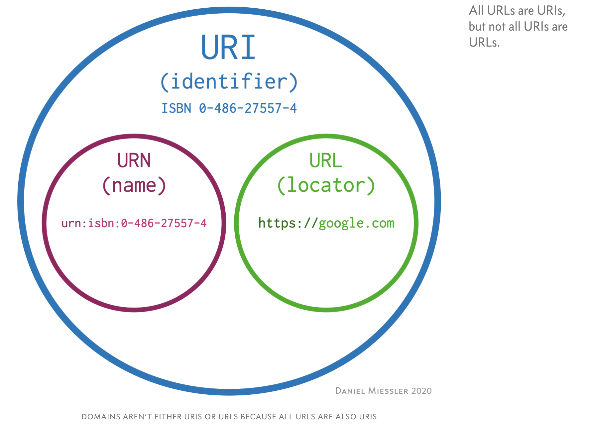

## URL 编解码


相关文章 [敲代码时遇到的乱码问题](./articles/敲代码时遇到的乱码问题.md)


### URL 和 URI 概念

> The terms “URI” and “URL” are often used interchangeably, but they are not exactly the same.
>
> 1. A UR**I** is an **identifier** of a specific resource. Like a page, or book, or a document.
> 2. A UR**L** is special type of identifier **that also tells you how to access it**, such as `HTTPs`, `FTP`, etc.—like https://www.google.com.
> 3. If the protocol (`https`, `ftp`, etc.) is either present or implied for a domain, **you should call it a URL**—even though it’s also a URI.
>
> 
>
> 来源：[What’s the Difference Between a URI and a URL?](https://danielmiessler.com/study/difference-between-uri-url/)


### URL 编码

> **百分号编码**（英语：Percent-encoding），又称：**URL编码**（URL encoding）是特定上下文的[统一资源定位符](https://zh.wikipedia.org/wiki/统一资源定位符) （URL）的编码机制，实际上也适用于[统一资源标志符](https://zh.wikipedia.org/wiki/统一资源标志符)（URI）的编码


[RFC 1738](http://www.ietf.org/rfc/rfc1738.txt) 规定：

> "...Only alphanumerics [0-9a-zA-Z], the special characters "$-_.+!*'()," [not including the quotes - ed], and reserved characters used for their reserved purposes may be used unencoded within a URL."
>
> "只有字母和数字[0-9a-zA-Z]、一些特殊符号"$-_.+!*'(),"[不包括双引号]、以及某些保留字，才可以不经过编码直接用于URL。"

这意味着，如果URL中有汉字，就必须编码后使用。但是麻烦的是，RFC 1738没有规定具体的编码方法，而是交给应用程序（浏览器）自己决定。可以看一下阮老师的这篇文章 [关于URL编码](http://www.ruanyifeng.com/blog/2010/02/url_encoding.html)

当前标准，2005年1月发布的 [RFC 3986](https://www.ietf.org/rfc/rfc3986.txt)  可参看第2章的内容：

```
 2.  Characters . . . . . . . . . . . . . . . . . . . . . . . . . . 11
       2.1.  Percent-Encoding . . . . . . . . . . . . . . . . . . . . 12
       2.2.  Reserved Characters  . . . . . . . . . . . . . . . . . . 12
       2.3.  Unreserved Characters  . . . . . . . . . . . . . . . . . 13
       2.4.  When to Encode or Decode . . . . . . . . . . . . . . . . 14
       2.5.  Identifying Data . . . . . . . . . . . . . . . . . . . . 14
```


### iOS 端的 URL 编解码

#### iOS 9 之前

##### 方式1

> 'stringByAddingPercentEscapesUsingEncoding:' is deprecated: first deprecated in iOS 9.0 - Use -stringByAddingPercentEncodingWithAllowedCharacters: instead, which always uses the recommended UTF-8 encoding, and which encodes for a specific URL component or subcomponent since each URL component or subcomponent has different rules for what characters are valid.

```objective-c
// 编码
NSString *encodingStr = [urlStr stringByAddingPercentEscapesUsingEncoding:NSUTF8StringEncoding];
```

> 'stringByReplacingPercentEscapesUsingEncoding:' is deprecated: first deprecated in iOS 9.0 - Use -stringByRemovingPercentEncoding instead, which always uses the recommended UTF-8 encoding.

```objective-c
// 解码
NSString *decodedStr = [encodingStr stringByReplacingPercentEscapesUsingEncoding:NSUTF8StringEncoding];
```


##### 方式2

> 'CFURLCreateStringByAddingPercentEscapes' is deprecated: first deprecated in iOS 9.0 - Use [NSString stringByAddingPercentEncodingWithAllowedCharacters:] instead, which always uses the recommended UTF-8 encoding, and which encodes for a specific URL component or subcomponent (since each URL component or subcomponent has different rules for what characters are valid).

```objective-c
// 编码
NSString *encodeStr = (NSString *)CFBridgingRelease(CFURLCreateStringByAddingPercentEscapes(kCFAllocatorDefault, (CFStringRef)urlStr, NULL, (CFStringRef)@"这里可以自定义字符集编码", kCFStringEncodingUTF8));
```

> 'CFURLCreateStringByReplacingPercentEscapesUsingEncoding' is deprecated: first deprecated in iOS 9.0 - Use [NSString stringByRemovingPercentEncoding] or CFURLCreateStringByReplacingPercentEscapes() instead, which always uses the recommended UTF-8 encoding.

```objective-c
// 解码
NSString *decodedStr = (NSString *)CFBridgingRelease(CFURLCreateStringByReplacingPercentEscapesUsingEncoding(kCFAllocatorDefault,(CFStringRef)encodedString,CFSTR("这里可以自定义字符集不解码"),kCFStringEncodingUTF8));
```


#### iOS 9 以后

通过上述的引用部分，我把编译器提示贴出来了，相信你也看到了，iOS 9 以后使用新的 API


#### 网上看到的一篇文章

[全面深度解析iOS端URL编码和解码过程](https://juejin.im/post/6844903937364099079) **作者：择势勤**

1. 在 URL 组装拼接前对各个部分的可能会引起歧义的字符串进行全量 UTF-8
2. 在需要解码的地方，需要先拆分字符串，在分段解码使用
3. 在需要将已组装的数据，进行重组时，需要先拆解，再分别解码后再编码，最后在重组。
4. 服务端会对请求进行 UTF-8 解码一次，请确保请求中的字符只进行一次 UTF-8 编码

注意：

`URLUTF8EncodingString` UTF-8编码可以无限制调用多次，`stringByRemovingPercentEncoding`方法的特殊性是字符串不是UTF-8编码格式，调用时返回为`nil`，因此解码时只需调用一次`URLUTF8DecodingString`即可将所有字符彻底UTF-8解码。


```objective-c
/**
 对字符串的每个字符进行UTF-8编码
 
 @return 百分号编码后的字符串
 */
- (NSString *)URLUTF8EncodingString
{
    if (self.length == 0) {
        return self;
    }
    NSCharacterSet *characterSet = [NSCharacterSet characterSetWithCharactersInString:@""];
    NSString *encodeStr = [self stringByAddingPercentEncodingWithAllowedCharacters:characterSet];
    return encodeStr;
}

/**
 对字符串的每个字符进行彻底的 UTF-8 解码
 连续编码2次，需要连续解码2次，第三次继续解码时，则返回为空
 @return 百分号编码解码后的字符串
 */
- (NSString *)URLUTF8DecodingString
{
    if (self.length == 0) {
        return self;
    }
    if ([self stringByRemovingPercentEncoding] == nil
        || [self isEqualToString:[self stringByRemovingPercentEncoding]]) {
        return self;
    }
    NSString *decodedStr = [self stringByRemovingPercentEncoding];
    while ([decodedStr stringByRemovingPercentEncoding] != nil) {
        decodedStr = [decodedStr stringByRemovingPercentEncoding];
    }
    return decodedStr;
}
```

