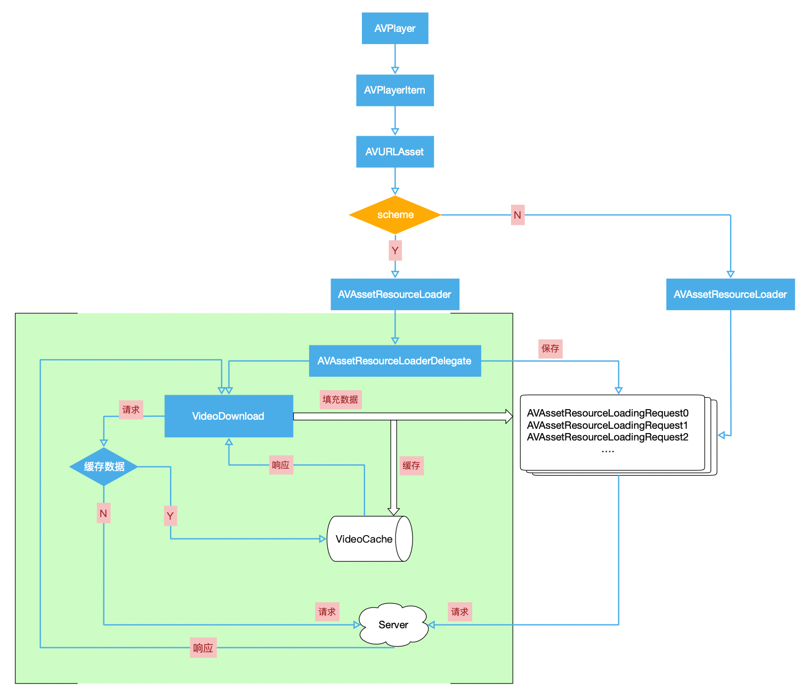
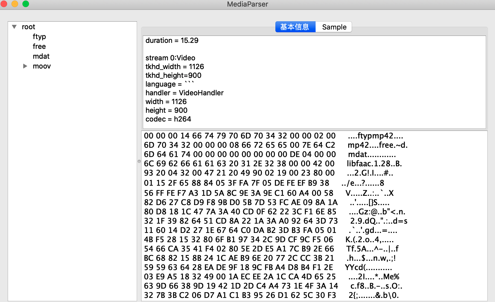
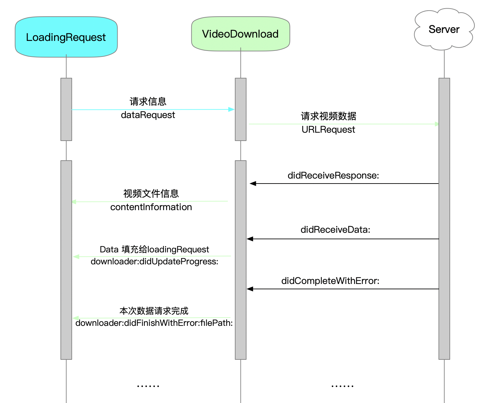

## AVPlayer 边下边播

### AVPlayer

> An `AVPlayer` is a controller object used to manage the playback and timing of a media asset. You can use an `AVPlayer` to play local and remote file-based media, such as QuickTime movies and MP3 audio files, as well as audiovisual media served using HTTP Live Streaming.


### AVPlayer 整体播放流程



注意！在初始化 `AVURLAsset` 的时候需要把目标视频 URL 地址的 **scheme** 替换为系统不能识别的 **scheme ** 否则不能触发代理方法！！！

```objective-c
AVURLAsset *asset = nil;
if (download) {
    NSURLComponents *components = [[NSURLComponents alloc] initWithURL:videoURL resolvingAgainstBaseURL:NO];
    components.scheme = @"klp";
    NSURL *fakeURL = [components URL];
    asset = [AVURLAsset URLAssetWithURL:fakeURL options:nil];
    self.videoLoader = [KLVideoLoader loaderWithVideoURL:videoURL];
    [asset.resourceLoader setDelegate:self.videoLoader queue:dispatch_get_main_queue()];
} else {
    asset = [AVURLAsset assetWithURL:videoURL];
}
self.urlAsset = asset;
self.playerItem = [AVPlayerItem playerItemWithAsset:asset];
self.player = [[AVPlayer alloc] initWithPlayerItem:self.playerItem];
```


 `AVAssetResourceLoader` 将 `AVAssetResourceLoadingRequest` 传给 `AVAssetResourceLoaderDelegate`， 我们先**保存**这些请求，然后通过 `URLSession` 自己构建**下载**任务。每次收到响应后把数据**填充**给 `AVAssetResourceLoadingRequest`， 并对数据进行**缓存**，就完成了边下边播。

### 实现细节注意事项

#### 1 前提

1. 视频文件的`moov(container for all the metadata)`需要在最前面，后面跟随`mdat(media data container)`

2. 如果`moov`在最后，则需要整个文件下载完成才可以播放，此时超时时间大约18s

**20210204补**

使用 **MediaParser** 工具分析视频：

MP4 文件主要由 `ftyp` `mdat` `moov` 三部分组成。

- `ftyp` 记录了mp4 格式，编码格式之类的一些基本信息

- `mdat` 记录了视频媒体信息（`mdat`的体积往往非常的大，几乎等于MP4总大小）

- `moov` 是如同检索表一样的存在，里面记录了每一帧对应的数据在哪里等等


1. `moov` 在最后的情况



2. `moov` 在 `mdat` 之前的情况

    

#### 2 ResourceLoader

##### AVAssetResourceLoaderDelegate

1. ```objective-c
   - (BOOL)resourceLoader:(AVAssetResourceLoader *)resourceLoader 
   shouldWaitForLoadingOfRequestedResource:(AVAssetResourceLoadingRequest *)loadingRequest;
   ```

> Asks the delegate if it wants to load the requested resource.

播放器发出的数据请求从这里开始，我们**保存**从这里发出的所有请求存放到数组，自己来处理这些请求。当一个请求完成后，对请求发出`finishLoading` 消息，并从数组中移除。正常状态下，当播放器发出下一个请求的时候，会把上一个请求给 `finish`。

同时，开启下载任务。ps. 下文会提到

2. ```objective-c
   - (void)resourceLoader:(AVAssetResourceLoader *)resourceLoader 
   didCancelLoadingRequest:(AVAssetResourceLoadingRequest *)loadingRequest;
   ```

> Informs the delegate that a prior loading request has been cancelled.

播放器自己关闭了这个`loadingRequest`，不需要再对这个请求进行处理，包括：移出下载任务的回调列表（停止填充）等。


#### 3 VideoDownload



在 `shouldWaitForLoadingOfRequestedResource` 回调中异步开启下载任务。下载回调中拿到的响应数据对 `loadingRequest` 进行填充。并对数据进行缓存。


#### 后记

对于：

- `VideoCache` 响应数据的缓存
- `VideoDownload` 下载回调与状态记录
- `AVPlayer` 播放控制、回调以及状态记录
- 播放器 `UI` 定制

本文不再赘述。[附上源码仓库](https://github.com/likenow/AVPlayerDemo)
