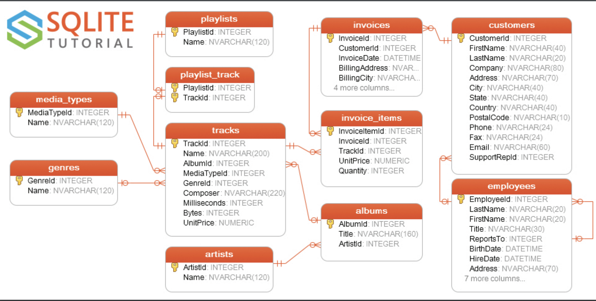
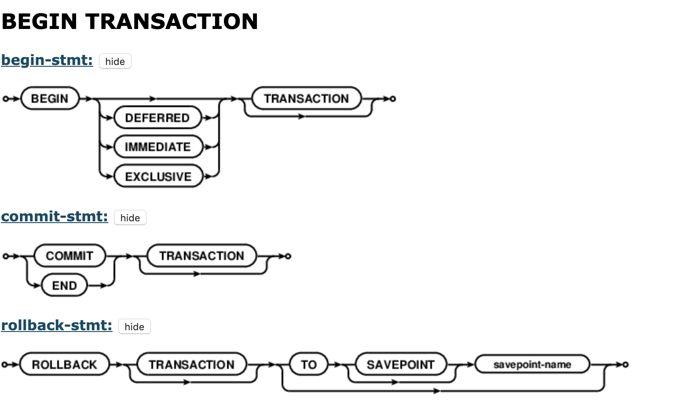
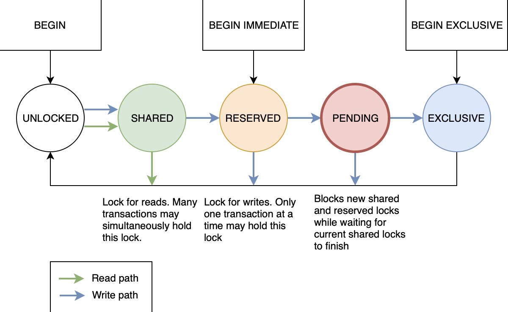

# 了解SQLite

> 昨天和一朋友游百望山，程序员之间避不开的话题就是编程啦。有个话题是他要基于 SQLite 封装一个数据库相关的工具库。我调侃了一句“FMDB、WCDB。。。 不香吗？非要自己造轮子”

回家以后，我对他要造一个数据库工具类的想法对自己进行了反思。我真的了解SQLite 吗？翻看笔记，我发现16年的时候我写过一篇 [FMDB](https://github.com/likenow/blog/blob/master/articles/2016-5-14-FMDB%E4%BD%BF%E7%94%A8.md) 相关的文章，就在也没找到关于 SQLite 相关的内容了。突然觉得自己对他的调侃只是过嘴瘾罢了。。。

## 名词简介

几个名词先解释一下：

**关系型数据库**
> 关系数据库，是创建在关系模型基础上的数据库，借助于集合代数等数学概念和方法来处理数据库中的数据。现实世界中的各种实体以及实体之间的各种联系均用关系模型来表示。关系模型是由埃德加·科德于1970年首先提出的，并配合“科德十二定律”。现如今虽然对此模型有一些批评意见，但它还是数据存储的传统标准。 [维基百科](https://zh.wikipedia.org/wiki/%E5%85%B3%E7%B3%BB%E6%95%B0%E6%8D%AE%E5%BA%93)

**非关系型数据库**
> NOSQL(Not Only SQL)是对不同于传统的关系数据库的数据库管理系统的统称。 [维基百科](https://zh.wikipedia.org/wiki/NoSQL)

**ORM**
ORM 实现了通过实例对象的语法，完成关系型数据库的操作

> 对象关系映射（英语：Object Relational Mapping，简称ORM，或O/RM，或O/R mapping），是一种程序设计技术，用于实现面向对象编程语言里不同类型系统的数据之间的转换。从效果上说，它其实是创建了一个可在编程语言里使用的“虚拟对象数据库”。如今已有很多免费和付费的ORM产品，而有些程序员更倾向于创建自己的ORM工具。[维基百科](https://zh.wikipedia.org/wiki/%E5%AF%B9%E8%B1%A1%E5%85%B3%E7%B3%BB%E6%98%A0%E5%B0%84)

**SQLite**

[大图](https://www.sqlitetutorial.net/wp-content/uploads/2018/03/sqlite-sample-database-diagram-color.pdf)

> SQLite是遵守ACID的关系数据库管理系统，它包含在一个相对小的C程序库中。与许多其它数据库管理系统不同，SQLite不是一个客户端/服务器结构的数据库引擎，而是被集成在用户程序中。 SQLite遵守ACID，实现了大多数SQL标准。它使用动态的、弱类型的SQL语法。 [维基百科](https://zh.wikipedia.org/wiki/SQLite)

## 开始了解SQLite

引言里我提到了 [FMDB](https://github.com/ccgus/fmdb) 和 [WCDB](https://github.com/Tencent/wcdb) 都是比较流行的iOS数据持久化解决方案。相较于FMDB，WCDB上到OC层的ORM，下到SQLite源码，都做了很多工作。具体怎么选择还是看场景和具体需求。这里不赘述

直接从开发的时候比较产遇到问题的点开始吧

### SQLite 线程安全

[Using SQLite In Multi-Threaded Applications](https://www.sqlite.org/threadsafe.html)

> **Overview**
> SQLite supports three different threading modes:
> - Single-thread 0. In this mode, all mutexes are disabled and SQLite is unsafe to use in more than a single thread at once.
> - Multi-thread 2. In this mode, SQLite can be safely used by multiple threads provided that no single database connection is used simultaneously in two or more threads.
> - Serialized 1. In serialized mode, SQLite can be safely used by multiple threads with no restriction.
> 
> The threading mode can be selected at compile-time (when the SQLite library is being compiled from source code) or at start-time (when the application that intends to use SQLite is initializing) or at run-time (when a new SQLite database connection is being created). Generally speaking, run-time overrides start-time and start-time overrides compile-time. Except, single-thread mode cannot be overridden once selected.
> The default mode is serialized.

我就不翻译了，相信大家一眼就能看明白。比较关心的是，我们开发时Xcode下导入的 SQLite 是上述的3中线程模式的哪一种呢？通过 `sqlite3——threadsafe()` 可以获取编译时的配置项，进而获得系统自带的 SQLite 在编译时的配置。---结论是： **2 Multi-thread**
也就是说，苹果系统自带的 SQLite 支持并发访问 API

### SQLite 事务与并发
#### 事务
在数据库系统中，一个事务是指：由一系列数据库操作组成的一个完整的逻辑过程。它具有四个属性：原子性、一致性、隔离性、持久性，即所谓 [ACID](https://zh.wikipedia.org/wiki/ACID)，关于它的概念本文不过多赘述。

##### 读事务/写事务与锁

#### 并发
而通过上述我们知道 SQLite 的线程安全问题相对来说是比较容易搞定的，可以通过配置合适的线程模型，或者在应用层通过队列等手段来规避（*ps.FMDB 就是内部维护了一个串行队列来保证线程安全*） ,但并发问题就复杂得多。

SQLite 是否支持**并发事务**?

- **SQLite 支持并发执行读事务，即可以同时开启多个进程/线程从数据库读数据**
- **SQLite 不支持并发执行写事务，即不能多个进程/线程同时往数据库写数据**

参考资料：
- [Using SQLite In Multi-Threaded Applications](https://www.sqlite.org/threadsafe.html)
- [SQL As Understood By SQLite](https://www.sqlite.org/lang_transaction.html)
- [SQLite 事务](https://www.sunzn.com/2017/11/24/SQLite-%E4%BA%8B%E5%8A%A1/)
- [从FMDB线程安全问题说起](https://crmo.github.io/2019/01/28/%E4%BB%8EFMDB%E7%BA%BF%E7%A8%8B%E5%AE%89%E5%85%A8%E9%97%AE%E9%A2%98%E8%AF%B4%E8%B5%B7/)
- [漫谈 SQLite](https://zhangbuhuai.com/post/sqlite.html)
- [Understanding SQLITE_BUSY](https://activesphere.com/blog/2018/12/24/understanding-sqlite-busy)