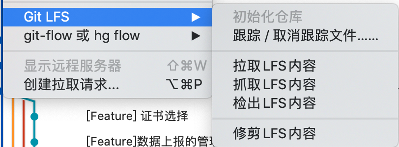
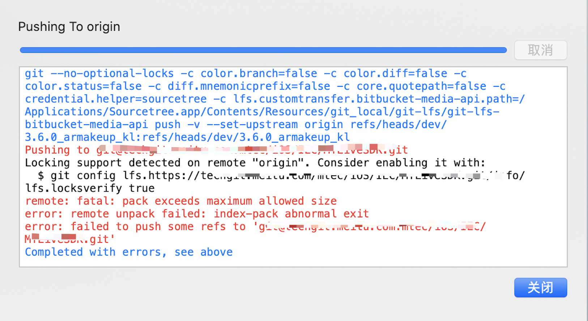

# 使用Source Tree

## source Tree 大文件




## git 推送大文件buffer设置

1. 打开`SourceTree`,点击右上角的设置

2. 在弹出的框中,点击左下角的编辑配置文件

3. 在弹出的文本文件（Git 配置文件）中最下行加入如下代码:

```
[http]
    postBuffer = 524288000
```


## Push 大文件报错



1. 修改仓库的单次提交大小
2. 实在不行就乖乖，分次拆分开提交吧

