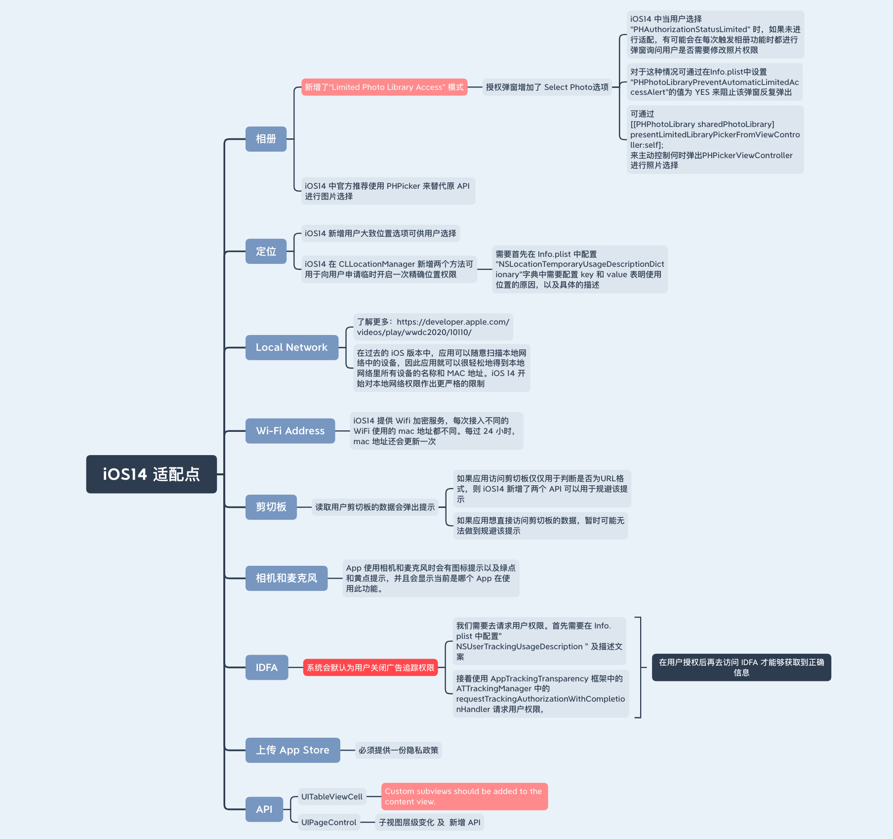

# iOS适配

## iOS 14 适配点




### 关于用户画像

要识别用户，首先就是要选择一个标识符，通过这个标识符来识别这个用户的设备（而不是用户），这个标识符要能够保证一个设备上返回的值是一样的，并且在其他设备上不会出现相同的值。

在iOS7之前，曾经有过很多方法来识别用户的设备，从最原始的设备udid、mac地址，到被各广告统计平台广泛使用的开源方案 OpenUDID。

但随着AppStore开始拒绝接受使用udid的应用，到mac地址在iOS7上所有设备上都返回相同的值，再到iOS7上对剪贴板的限制，导致OpenUDID无法被不同应用共享相同的值，注定了上面提到的这些id们不得不退出历史的舞台。大家开始使用  IDFA 作为唯一标识。当然，也有很多开发团队使用一些算法得到一个自己的唯一标识。

随着iOS14的到来，IDFA 需要获得用户授权。没有获得用户授权的设备将不能获取到 IDFA。这样让用户能够把控自己的隐私，充分表明了是苹果对用户隐私保护的决心。


### UIWebView -> WKWebView

#### 1 检查项目中使用 UIWebView 

```
// 检查源码中的使用
grep -r 'UIWebView' .

// 检查framework 中的使用
nm xxx.framework/xxx | grep -i UIWebView

```

