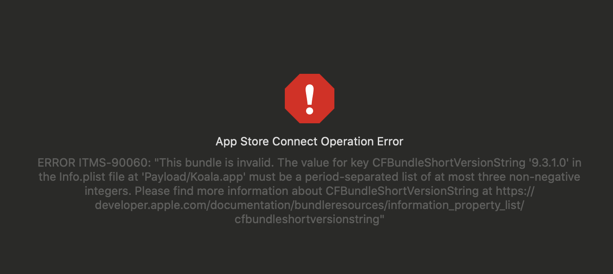
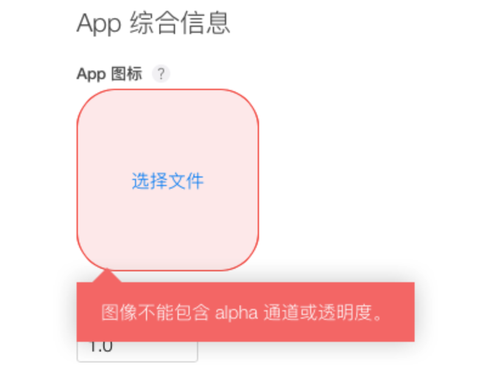
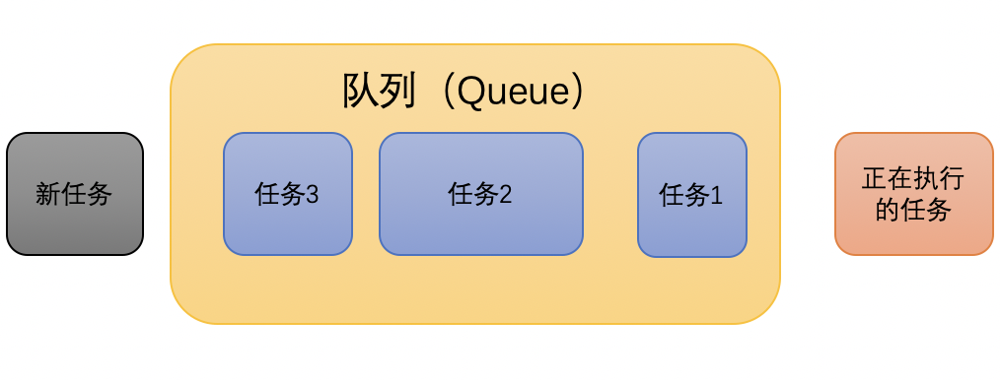

## iOS 问题

### 1. 发版问题

1. 版本命名问题




> ERROR ITMS-90060: "This bundle is invalid. The value for key CFBundleShortVersionString '9.3.1.0' in the Info.plist file at 'Payload/Koala.app' must be a period-separated list of at most three non-negative integers. Please find more information about CFBundleShortVersionString at https://developer.apple.com/documentation/bundleresources/information_property_list/cfbundleshortversionstring"

#### 解决办法

基本实现思路：

添加一个自己管理的配置项值 sys-clientVersion，（所有展示相关全用该值），上传App Store，新版本写成 sys-clientVersion 一样的值即可。

参考：[iOS APP从打包到发布appStore完整流程（含4位版本号实现）](https://www.jianshu.com/p/860fdd8860cc)


2. 在iTunes Connect 里新建了项目，导入icon图片时，遇到以下问题




### 2. AFNetworking

**报错:(415 Domain=com.alamofire.error.serialization.response Code=-1011 "Request failed: unsupported media type (415)")**

解决：在对请求数据格式和响应**数据格式**初始化的时候,将之前的父类（AFHTTPRequestSerializer）换成了它的子类(AFJSONRequestSerializer）

```objective-c
manager.requestSerializer = [AFJSONRequestSerializer serializer];
manager.responseSerializer = [AFJSONResponseSerializer serializer];
```


### 3. GCD

我之前的文章：

[多线程编程知识整理](./articles/2018-12-02-iOS-多线程编程知识整理.md)

[iOS-多线编程之线程安全](./articles/2018-12-11-iOS-多线编程之线程安全.md)

[iOS多线程之同步异步、串行并行](./articles/2018-12-18-iOS多线程之同步异步、串行并行.md)

[Runloop与线程保活](./articles/2018-12-15-iOS-Runloop与线程保活.md)


iOS 开发中，我们经常使用 GCD 来处理并发。我们并不关心线程的管理，开多少线程是由 GCD 封装的线程池决定的（建议3~5条），线程池由系统自动来维护。我们通常的操作是向**队列**中添加**任务**，队列调度即可！



问题：取消操作（任务） 在 GCD 中，是没办法对添加到 `queue` 的 `task` 进行 `cancel`操作的！**ps. 这里的取消只针对尚未执行的任务，对正在执行的任务不起作用！！！**

方案1：**dispatch_block_cancel**

iOS 8 以后，可以调用 **dispatch_block_cancel** 来取消用 **dispatch_block_create** 创建的 **dispatch_block_t**

```objective-c
- (void)gcdBlockCancel{
    dispatch_queue_t queue = dispatch_queue_create("com.gcdtest", DISPATCH_QUEUE_CONCURRENT);
    
    dispatch_block_t block1 = dispatch_block_create(0, ^{
        sleep(5);
        NSLog(@"block1 %@",[NSThread currentThread]);
    });
    
    dispatch_block_t block2 = dispatch_block_create(0, ^{
        NSLog(@"block2 %@",[NSThread currentThread]);
    });
    
    dispatch_block_t block3 = dispatch_block_create(0, ^{
        NSLog(@"block3 %@",[NSThread currentThread]); // 该代码块取消执行
    });
    
    dispatch_async(queue, block1);
    dispatch_async(queue, block2);
    dispatch_block_cancel(block3);
}
```


方案2：**定义外部变量，用于标记 block 是否需要取消**

该方法其实就是在参考 **NSOperation** 状态机制，在执行 block 前先检查标记变量 `isCancelled == YES `。

在 block 中及时的检测标记变量，当发现需要取消时，终止后续操作。

```objective-c
- (void)gcdCancel{
    
    dispatch_queue_t queue = dispatch_get_global_queue(DISPATCH_QUEUE_PRIORITY_DEFAULT, 0);
    
    __block BOOL isCancelled = NO;
    
    dispatch_async(queue, ^{
        NSLog(@"任务1 %@",[NSThread currentThread]);
    });
    
    dispatch_async(queue, ^{
        NSLog(@"任务2 %@",[NSThread currentThread]);
    });
    
    dispatch_async(queue, ^{
        NSLog(@"任务3 %@",[NSThread currentThread]);
        isCancelled = YES;
    });
    
    dispatch_async(queue, ^{
        // 模拟：线程等待3秒，确保任务3 标记变量isCancelled＝YES完成
        sleep(3);
        if(isCancelled){
            NSLog(@"任务4已被取消 %@",[NSThread currentThread]);
        }else{
            NSLog(@"任务4 %@",[NSThread currentThread]);
        }
    });
}
```


既然提到了  NSOperation 的 **- (void)cancel;** 方法，那就展开讲一下。没有什么比官方文档更懂😁：

> This method does not force your operation code to stop. Instead, it updates the object’s internal flags to reflect the change in state. If the operation has already finished executing, this method has no effect. Canceling an operation that is currently in an operation queue, but not yet executing, makes it possible to remove the operation from the queue sooner than usual. 
>
> In macOS 10.6 and later, if an operation is in a queue but waiting on unfinished dependent operations, those operations are subsequently ignored. Because it is already cancelled, this behavior allows the operation queue to call the operation’s `start` method sooner and clear the object out of the queue. If you cancel an operation that is not in a queue, this method immediately marks the object as finished. In each case, marking the object as ready or finished results in the generation of the appropriate KVO notifications. 
>
> In versions of macOS prior to 10.6, an operation object remains in the queue until all of its dependencies are removed through the normal processes. Thus, the operation must wait until all of its dependent operations finish executing or are themselves cancelled and have their `start` method called. 
>
> For more information on what you must do in your operation objects to support cancellation, see [Responding to the Cancel Command](doc://com.apple.documentation/documentation/foundation/nsoperation?language=objc#1661262).