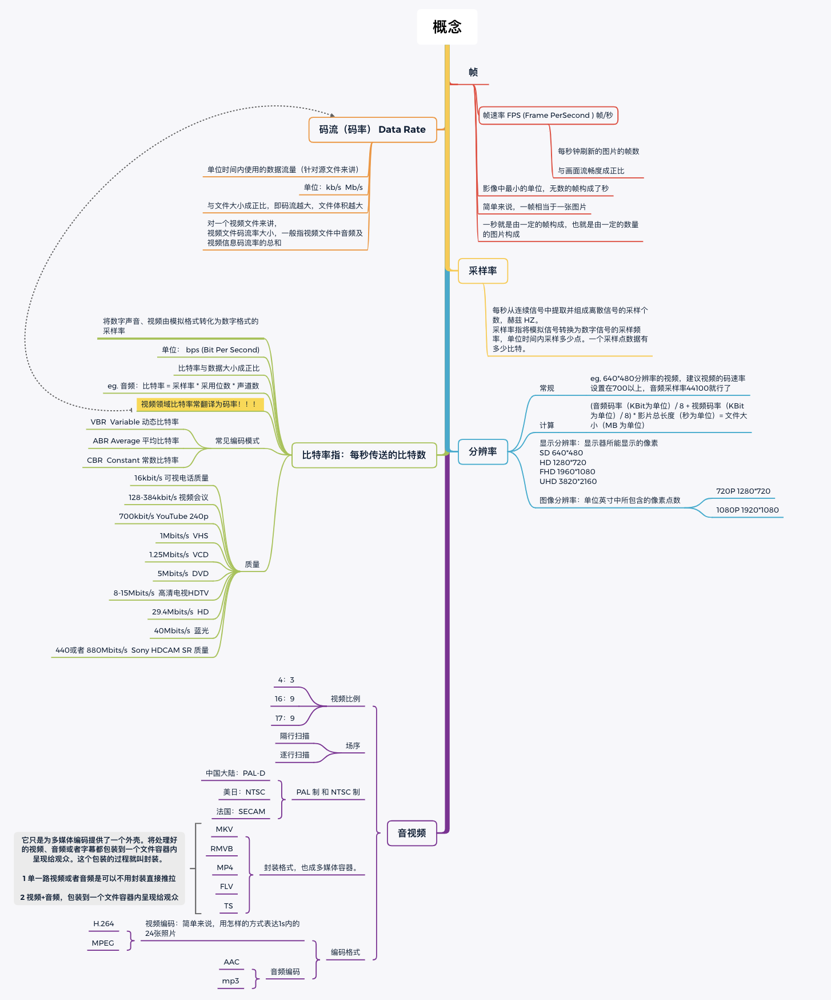

# 音视频相关


## 专业术语





### 1、采样频率、采样位数、位速、比特率、码率

- 采样频率

> 采样频率是指单位时间内对声音模拟信号的采样次数。

**采样频率越高(人耳感知范围内)，音质越好。**

> 采样率类似于视频的帧数，比如电影的采样率是 `24Hz` 。当我们把采样到的一个个静止画面再以采样率同样的速度回放时，看到的就是连续的画面。同样的道理，把以 `44.1kHZ` 采样率记录的 CD 以同样的速率播放时，就能听到连续的声音。显然，这个采样率越高，听到的声音和看到的图像就越连贯。当然，人的听觉和视觉器官能分辨的采样率是有限的。对同一段声音，用 `20kHz` 和 `44.1kHz` 来采样，重放时，可能可以听出其中的差别，而基本上高于 `44.1kHZ` 采样的声音，比如说 `96kHz` 采样，绝大部分人已经觉察不到两种采样出来的声音的分别了。之所以使用 `44.1kHZ` 这个数值是因为经过了反复实验，人们发现这个采样精度最合适，低于这个值就会有较明显的损失，而高于这个值人的耳朵已经很难分辨，而且增大了数字音频所占用的空间。我们所使用的 CD 的采样标准就是 `44.1kHz`。

- 采样位数

> 采样位数可以理解为采集卡处理声音的解析度。

> **采样位数越大，解析度就越高，录制和回放的声音就越真实。**

> 我们首先要知道：电脑中的声音文件是用数字`0`和`1`来表示的。连续的模拟信号按一定的采样频率经数码脉冲取样后，每一个离散的脉冲信号被以一定的量化精度量化成一串二进制编码流，这串编码流的位数即为采样位数，也称为量化精度。

- 位速/比特率/码率

> 位速/比特率/码率描述的都是一个东西，代表了 MP3 数据的压缩质量，现在常用的码率有 `128kbit/s`、`160kbit/s`、`320kbit/s` 等等，这个值越高声音质量也就越高，声音文件也越大。因此在实际应用中我们需要权衡比特率大小与文件大小的关系，选择合适的比特率：

```c
32kbit/s: AM 无限电广播的质量
48kbit/s: 很长的语音对话
64kbit/s: 正常长度的语音对话的比特率
96kbit/s: FM广播
128kbit/s: MP3音乐
329kbit/s: CD的比特率
500kbit/s~1411kbit/s: 无损音频编码格式,比如LPCM
// 可以看到，在语音场景中比特率可以适当降低，音乐场景对比特率有较高要求。
```


- PCM

> 对声音进行采样、量化过程被称为脉冲编码调制（`Pulse Code Modulation`），简称`PCM`。`PCM`数据是最原始的音频数据完全无损，所以`PCM`数据虽然音质优秀但体积庞大。理论上在播放资源充足的情况下，使用`PCM`数据直接播放是最佳选择，因为速度快且音质好。但在实际应用中音频数据往往都需要进行一定程度的压缩，比如最常见的MP3文件。


### 2、音频文件格式与数据格式

##### 文件格式又称为音频容器

常见的有`MPEG-1`、`MPEG-2`、`CAF`、`WAVE`等，通常在iPhone中使用的容器格式就`CAF`,因为它可以用来封装iPhone所支持的所有音频数据格式

##### 数据格式又称为编码格式

分为无损压缩编码(`ALAC`、`APE`、`FLAC`等)与有损压缩编码(`MP3`、`AAC`、`OGG`、`WMA`等)


### 3、CoreAudio

以播放MP3文件为例，一个MP3文件从加载到最后播放，内部实际上走了以下流程：

> 1、读取MP3文件
> 2、解析采样率、码率、时长等信息，分离MP3中的音频帧(frame)
> 3、对分离出来的音频帧解码得到PCM数据(最原始的音频数据，完全无损)
> 4、对PCM数据进行音效处理（均衡器、混响器等，非必须）
> 5、把PCM数据解码成音频信号
> 6、把音频信号交给硬件播放
> 7、重复2-6步直到播放完成

iOS对上述流程进行分层，封装接口集合就称为[CoreAudio](https://developer.apple.com/library/archive/documentation/MusicAudio/Conceptual/CoreAudioOverview/WhatisCoreAudio/WhatisCoreAudio.html)，所以我们常说的CoreAudio其实是一个虚拟集合，实际有多个不同层次的framework组成：

> [图片出自苹果文档](https://developer.apple.com/library/archive/documentation/MusicAudio/Conceptual/CoreAudioOverview/CoreAudioEssentials/CoreAudioEssentials.html#//apple_ref/doc/uid/TP40003577-CH10-SW1)


音频播放流程：

> 1、读取MP3文件
>
> 2、解析采样率、码率、时长等信息，分离MP3中的音频帧 -> Audio File Services，负责读写音频数据; Audio File Stream Services, 负责解码
>
> 3、对分离出来的音频帧解码得到PCM数据 -> Audio Converter services，负责数据转换
>
> 4、**对PCM数据进行音效处理（均衡器、混响器等，非必须）-> Audio Processing Graph Services，负责音效处理**
>
> 5、把PCM数据解码成音频信号 -> Audio Unit Services，或者Audio Queue Services，高级接口，可以进行录音和播放
>
> 6、把音频信号交给硬件播放 -> Audio Queue Services，高级接口，可以进行录音和播放
>
> 7、重复2-6步直到播放完成
>
> AVAudioPlayer与AVPlayer作为高级接口，可以完成上述完整的音频播放过程，但无法进行音效处理


### 4、直播中的音视频数据流

数据采集，推流到流媒体服务器


### 5、AVAudioSession

`AVAudioSession` 是iOS音频开发中一座必须直面的大山，在使用上有不少坑点。

对于一台iOS device，音频IO设备就一套，供所有app共享。那如何协调app对音频设备的使用呢？iOS给出的解决方案就是`AVAudioSession`。它是一种管理app音频上下文的工具，始终以单例的形式提供服务(`[AVAudioSession sharedInstance]`)

#### 5.1 AVAudioSessionCategory

那到底什么时候需要会用到`AVAudioSession`?可以看看下面的情形：

> - 设备静音键被按下时app如何表现？
> - 要求声音从扬声器播还是从听筒播？
> - 插拔耳机前后app如何表现？
> - 音频播放过程中来电或者闹钟响起app如何表现？
> - 要录音还是播放？
> - 还在播放过程音频过程中被切到其他app改如何处理?
> - ...

当`AVAudioSession`处于默认设置时，设备的音频播放具有以下默认行为：

> - 静音键开启时app内所有音频必须静音
> - 系统被锁屏后者app进后台，app内所有音频静音
> - 只能播放不能录制
> - 其他app在播放过程中切到你的app并播放，则其他app的音频被暂停
> - 其他app在播放过程中切到你的app并播放，则其他app的音频被暂停，返回到其他app，音频依旧暂停

要想改变默认行为，则需要改变`AVAudioSession` 的 **`category`**，使用接口`[[AVAudioSession sharedInstance] setCategory:aCateogry error:&error]`.

`AVAudioSession` 的 `category`以及对应的属性：

| 类别                                  | 说明                                        | 当按“静音”或者锁屏后是否静音 | 是否引起不支持混音的App中断 | 是否支持录音和播放   |
| :------------------------------------ | :------------------------------------------ | :--------------------------- | :-------------------------- | :------------------- |
| AVAudioSessionCategoryAmbient         | 混音播放，可以与其他音频应用同时播放        | 是                           | 否                          | 只支持播放           |
| AVAudioSessionCategoryAudioProcessing | 硬件解码音频，此时不能播放和录制            | N/A                          | 都不支持                    | N/A                  |
| AVAudioSessionCategoryMultiRoute      | 多种输入输出，例如可以耳机、USB设备同时播放 | 否                           | 是                          | 既可以录音也可以播放 |
| AVAudioSessionCategoryPlayAndRecord   | 播放和录音，此时可以录音也可以播放          | 否                           | 默认不中断                  | 既可以录音也可以播放 |
| AVAudioSessionCategoryPlayback        | 后台播放，独占                              | 否                           | 默认中断                    | 只用于播放           |
| AVAudioSessionCategoryRecord          | 录音模式                                    | 否                           | 是                          | 只用于录音           |
| **AVAudioSessionCategorySoloAmbient** | 独占播放                                    | **是**                       | **是**                      | **只用于播放**       |

以上7种类别实际上代表了7中不同的场景，在实际开发中显然过于粗略，无法满足音频开发的需求。对此，iOS允许我们通`options`选项在大场景下进行一定的微调。比如两个app混音播放时希望突出本身app的声音，压低其他app的背景音，可以通过设置`categoryOption`为`AVAudioSessionCategoryOptionDuckOthers`达到目的。更多`option`可以看：

| 微调项                                       | 适用类别                                                     | 作用                          |
| :------------------------------------------- | :----------------------------------------------------------- | :---------------------------- |
| AVAudioSessionCategoryOptionMixWithOthers    | AVAudioSessionCategoryPlayAndRecord, AVAudioSessionCategoryPlayback, and AVAudioSessionCategoryMultiRoute | 是否可以和其他后台App进行混音 |
| AVAudioSessionCategoryOptionDuckOthers       | AVAudioSessionCategoryAmbient, AVAudioSessionCategoryPlayAndRecord, AVAudioSessionCategoryPlayback, and AVAudioSessionCategoryMultiRoute | 是否压低其他App声音           |
| AVAudioSessionCategoryOptionAllowBluetooth   | AVAudioSessionCategoryRecord and AVAudioSessionCategoryPlayAndRecord | 是否支持蓝牙耳机              |
| AVAudioSessionCategoryOptionDefaultToSpeaker | AVAudioSessionCategoryPlayAndRecord                          | 是否默认用免提声音            |

在iOS9还提供了 `AVAudioSessionCategoryOptionInterruptSpokenAudioAndMixWithOthers`

最新的iOS10又新加了两个

`AVAudioSessionCategoryOptionAllowBluetoothA2DP` 支持蓝牙 `A2DP` 耳机

``AVAudioSessionCategoryOptionAllowAirPlay` 用来支持 `AirPlay`

可以通过`|`运算给每个`category`同时设置多个`option`。

#### 5.2 播放中断的处理

app在播放音频过程中很有可能被打断，中断事件来源主要有来电、切到其他app播放音频、音频设备突然变更等。中断事件发生时我们的app该如何响应呢？最常用的场景当然是先暂停，待恢复的时候再继续。那我们的App要如何感知到这个终端以及何时恢复呢？于是问题转化到了中断事件感知上。

当中断发生时`AVAudioSession`会发出特定的`notification`告知我们，具体的事件整理如下：

| 通知                                                | 包含key                                                      | 备注                                 |
| :-------------------------------------------------- | :----------------------------------------------------------- | :----------------------------------- |
| AVAudioSessionInterruptionNotification              | AVAudioSessionInterruptionTypeBegan表示中断开始，AVAudioSessionInterruptionTypeEnded表示中断结束 | 来电、闹钟响、低电量弹窗等一般性中断 |
| AVAudioSessionSilenceSecondaryAudioHintNotification | AVAudioSessionSilenceSecondaryAudioHintTypeBegin： 表示其他App开始占据Session，AVAudioSessionSilenceSecondaryAudioHintTypeEnd: 表示其他App开始释放Session | AudioSession资源被其他app占用        |
| AVAudioSessionRouteChangeNotification               | AVAudioSessionRouteChangeReasonKey表示被改变的原因           | 音频设备改变，比如插拔耳机           |

此处不再详细展开。

#### 5.3 AVAudioSession坑点

整理如下，欢迎补充

##### 5.3.1 `AVAudioSessionCategoryPlayAndRecord` 类别下默认音频输出设备竟然是听筒而不是扬声器

解决方案：通过调用`api`把音频输出强设为扬声器(`speaker`)，有两种解法：

```objective-c
// 1
[audioSession setCategory:AVAudioSessionCategoryPlayAndRecord withOptions:AVAudioSessionCategoryOptionDefaultToSpeaker error:&error];
// 2
[audioSession overrideOutputAudioPort:AVAudioSessionPortOverrideSpeaker error:&error];
```

1和2的区别：

- 过渡平滑度不同，具体可以参考这篇[强制设置speaker官方文档](https://developer.apple.com/library/content/qa/qa1754/_index.html)，简而言之后者在声音的过渡上更加平滑；
- 连接耳机时前者不会导致声音外放，但后者不管连不连耳机都会导致外放(有坑)

##### 5.3.2  `setCategory`接口不宜频繁调用

解决方案：按需调用。原则上并不推荐频繁调用`setCategory`接口，因为该接口内部实现比较复杂，而且在主线程执行任务，更重要的是会导致一系列不可预测的音频问题。引用老外的NOTE:

> In fact, in most cases you should only set is once. Why? For one thing it is a complex operation. If it’s executed on the main thread, it will make your UI unresponsive for a second. But more importantly, setting the category all over the place might lead into strange behavior

------

##### 5.3.3 AVAudioSession 小总结：

`AVAudioSession`构建了一个音频使用生命周期的上下文，是我们处理音频行为的有力武器，只有在全面理解`AVAudioSession`特性的前提下才能准确快速地完成产品需求。


### 6、流数据的边下边播解决方案

实际开发中除了播放本地音频文件，也需要播放一个远程音频`URL`，对于播放器来说拿到的都是实时的音频流数据。与直接读取一个本地完整音频文件不同，音频流数据的特性决定了客户端无法等到所有音频流都下载到本地后再开始播放，必定要支持播放过程中的任意拖拽，也即可以`Seek`到任意时间点进行播放。要达到任意`seek`的目的，需要我们考虑一套支持一边下载一边播放的方案，搭配合理的缓存机制。

#### 6.1 方案一: loading+预缓冲

需要自行实现音频数据的请求在请求的过程中把数据缓存到磁盘，然后使用系统提供的播放器（如`AVAudioPlayer`、`AVPlayer`进行播放）

实现：

通过`KVO`监听`AVPlayerItem`的`loadedTimeRanges`以及`status`属性，可以实时知道当前的**缓冲进度**以及播放状态。一旦播放状态处于`AVPlayerStatusReadyToPlay`并且缓冲进度超过设定的经验值则开放交互，停止`loading`并触发播放逻辑:

```objective-c
[myPlayerItem addObserver:self forKeyPath:@"status" options:NSKeyValueObservingOptionNew context:nil];
[myPlayerItem addObserver:self forKeyPath:@"loadedTimeRanges" options:NSKeyValueObservingOptionNew context:nil];
```

这种实现方式中需要注意的是：

- 要播放的音频文件需要预先缓存一定量之后才能够播放，**具体缓存多少完全频个人经验**，并且有可能会产生播放失败或者播放错误。

- 无法进行任意的 `seek`。

这种方式仅提供一种思路（有点取巧）强烈不推荐。


#### 6.2 方案二: 流播放器+请求拦截

正常情况下，流媒体播放器(比如`AVPlayer`)播放远程音频URL大致遵循这样的逻辑：流播放器直接向服务器发送请求，请求参数包含本次请求的偏移量`offset`以及本次请求时长`length`（类似`range`），服务器收到请求后返回对应`range`的数据。收到数据如何处理全部由流媒体播放器自己处理，我们无法控制，所以会发现`seek`会失败，数据加载完毕后缓存文件无法处理。

想要实现边下边播以及支持任意`seek`，则不能让流媒体播放器掌控缓存逻辑，因此就有了本方案：**请求拦截**。

首先，我们需要一个能够进行流播放的播放器（如Apple提供的`AVPlayer`），通过拦截播放器发送的请求可以知道需要下载哪一段数据，于是就可以根据本地缓存文件的情况分段为播放器提供数据，如遇到已缓存的数据段直接从缓存中获取数据塞回给播放器，如遇到未缓存的数据段就发送请求获取数据，得到`response`和数据后保存到磁盘同时塞回给播放器。 具体实现起来会有以下两种思路：

##### 6.2.1 思路1: 通过App内搭建 `LocalServer` 拦截流请求

首先需要在本地搭建 `LocalServer`，例如可以使用开源的`GCDWebServer`，然后将URL组织成下面的形式：`http://localhostport/?url=urlEncode(audioUrl)`

把组织后的URL交给播放器播放，播放器会把请求发送到`LocalServer`上，`LocalServer`解析到实际的音频地址后发送请求或者读取已缓存的数据。

##### 6.2.2 思路2：使用`AVAssetResourceLoader`拦截 

从iOS6开始，系统提供了`AVAssetResourceLoader`支持，它的作用在于让我们自行掌握`AVPlayer`数据的加载，包括获取`AVPlayer`需要的数据的信息，以及可以决定传递多少数据给`AVPlayer`。

##### 6.2.3 方案的选择：

思路1原理清晰，如果只缓存一个视频是没有问题的，如果缓存多个视频互相切换，本地代理服务器提供的数据很不稳定，crash概率比较大。

思路2不需要引入第三方库来建server，系统原生支持，因此这里选择思路2.


#### 6.3 思路2实施介绍


在视频播放器和服务器之间添加一层代理对象(`AVURLAssetResourceLoade`r的`delegate`)，视频播放器不再直接访问服务器，而是访问代理对象，代理对象去访问服务器获得数据，之后返回给视频播放器。

代理对象(`id<AVAssetResourceLoaderDelegate>`)需要处理的逻辑主要有根据`http`请求的`RangeHeader`字段知道播放器所请求的数据段并根据当前数据缓存的状态进行**分段**处理。

举个🌰，播放器请求bytes=0-1000，其中100-200、500-600已经被缓存，那么这个请求就应该被分为下面几段来处理：

```c
0-100，网络请求
100-200，本地缓存
200-500，网络请求
500-600，本地缓存
600-1000，网络请求
```

以上几段数据请求按顺序执行并进行数据回填，其中通过网络请求的数据在收到之后加入缓存以便下一次请求再次使用。而以上**分段逻辑是由Apple控制的**，为什么我会这么说呢？在我的例子里面音频流总长度是8136036字节，`shouldWaitForLoadingOfRequestedResource`回调的请求提取主要信息：

```c
/**
总字节数为8136036字节，刚好是全音频流总长，requests all data to end of resource = YES 表明本次request到流的结束处
*/
request ID = 2, content information request = <AVAssetResourceLoadingContentInformationRequest: 0x600001c55060, content type = "(null)", content length = 0, byte range access supported = NO, disk caching permitted = YES, renewal date = (null)>, data request = <AVAssetResourceLoadingDataRequest: 0x600001c55070, requested offset = 0, requested length = 2, requests all data to end of resource = NO, current offset = 0
  
request ID = 4, content information request = (null), data request = <AVAssetResourceLoadingDataRequest: 0x600001c403b0, requested offset = 0, requested length = 8136036, requests all data to end of resource = YES, current offset = 0
  
request ID = 6, content information request = (null), data request = <AVAssetResourceLoadingDataRequest: 0x600001c783a0, requested offset = 1024000, requested length = 7112036, requests all data to end of resource = YES, current offset = 1024000
/**
request ID = 8 的着条日志，可以看到字节总和不再是全音频流总长了，`requests all data to end of resource = NO`也表明本次请求没有请求到流末尾。7143424 + 65536 =7208960 看到这里你应该明白了，**apple内部帮我们做了分段逻辑**，其内部必定也保存着我们的`resourceLoader`回填进去的数据。
*/
request ID = 8, content information request = (null), data request = <AVAssetResourceLoadingDataRequest: 0x600001c785f0, requested offset = 7143424, requested length = 65536, requests all data to end of resource = NO, current offset = 7143424
// offset = 7208960
request ID = 10, content information request = (null), data request = <AVAssetResourceLoadingDataRequest: 0x600001c404c0, requested offset = 7208960, requested length = 927076, requests all data to end of resource = YES, current offset = 7208960
```


#### 6.4 AVAssetResourceLoader 坑点

##### 6.4.1 Scheme必须自定义

实例化`AVURLAsset`(代表一个音频资源)时需要传入url链接，如果没有自定义`scheme`字段，则`AVAssetResourceLoaderDelegate`方法根本不会被触发。你可以任意修改`scheme`字段：

```objective-c
NSURLComponents *components = [[NSURLComponents alloc] initWithURL:videoURL resolvingAgainstBaseURL:NO];
components.scheme = @"klp";
NSURL *fakeURL = [components URL];
```

这里自定义`scheme`是一种取巧的手段，因为正常情况下`AVPlayer`自己就会直接服务端发请求了(好歹也是流媒体播放器好吗)，即使我们已经显式设置了`resourceLoader`作为`delegate`，我们的`resourceLoader`始终是备胎。一旦`scheme`被改掉，`AVPlayer`则无法自己完成向服务端请求的过程，这时才会把请求倒流给`resouceLoader`。这也是为什么必须修改`scheme`字段才能保证`resourceLoaderDelegate`得到回调。

##### 6.4.2  `AVURLAsset.resourceLoader`的`delegate` 必须在`AVPlayerItem`生成前赋值

下面的写法能正常收到`delegate`回调

```objective-c
AVURLAsset *asset = [AVURLAsset URLAssetWithURL:url] options:options];
[asset.resourceLoader setDelegate:self queue:dispatch_get_main_queue()];
AVPlayerItem *item = [self playerItemWithAsset:asset];
```

然而，如果不小心调换了代码顺序，则`delegate`回调就不走了。

```objective-c
AVURLAsset *asset = [AVURLAsset URLAssetWithURL:url] options:options];
AVPlayerItem *item = [self playerItemWithAsset:asset];
[[(AVURLAsset *)item.asset resourceLoader] setDelegate:self queue:dispatch_get_main_queue()];
```

##### 6.4.3 文件操作容易出错

`resourceLoader`模块需要自己跟服务端拿数据并写入临时文件中，这个过程要准确把控读写文件的偏移量，比较容易出错。

##### 6.4.4 尽管存在坑点，但仍盖不住`resourceLoader`方案的优点：

1、逻辑清晰，比较复杂的分段逻辑苹果已经帮我们做了，我们只需要根据流媒体播放器发来的请求去回填数据即可；

2、系统原生支持，不需要引入其他库，也自然不用考虑第三方库那天无人维护的尴尬。


#### 6.5 一个简单的封装 [边下边播]( [流数据的边下边播](./articles/2020/2020-12-24-AVPlayer边下边播.md))