## XCode多环境工程配置

### 背景

我们一般至少会有开发环境和发布环境两套环境，当然可以有更多的环境配置，主要是根据情况需要。这样做在我看来主要是为了方便各个团队协调工作高效开发，从结果的角度考虑，也可以减少bug，给用户带来更好的产品体验。ps. 对生产发布环境拥有一颗敬畏之心 ：）


### 工程配置准备

XCode 创建的iOS 工程默认就包含 `Debug` 和 `Release` 两种模式。

- Debug

调试模式，编译器不会对代码做最后的优化，方便我们断点调试，打印日志等

- Release

发布模式，编译器会对代码做优化，不包含调试信息，打包出来的 App 体积较 Debug 小。

---

#### Configurations

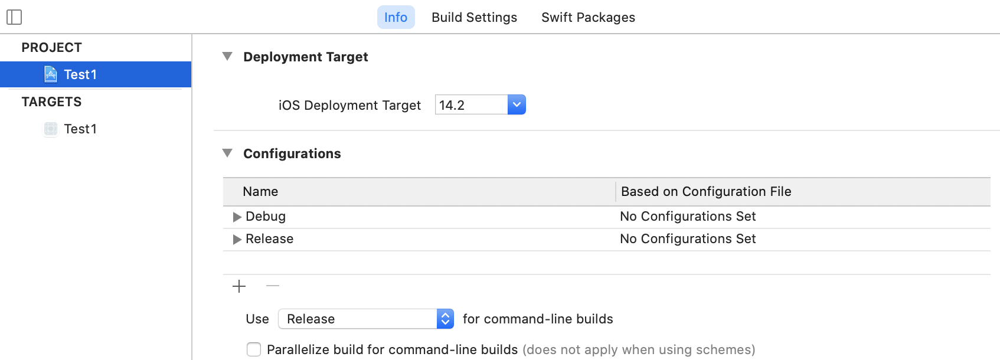

除了上述默认的两种环境，如果我们要新增环境怎么处理呢？

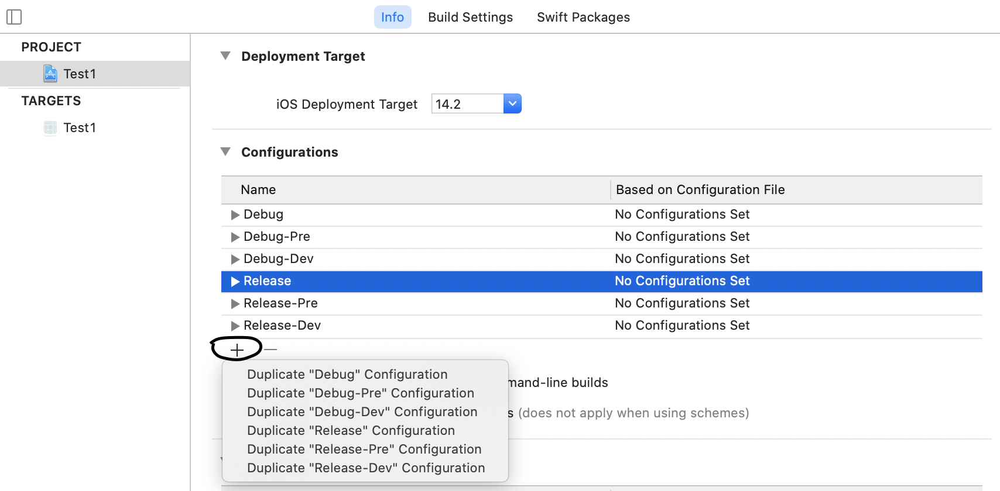

如图，到 **PROJECT** -> **Info** ->**Configurations**->**+** 新增


#### Schemes

如图，进入 **Manage Schemes** 

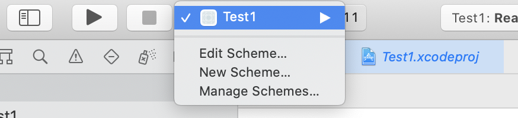


根据上述创建几个 **Schemes**

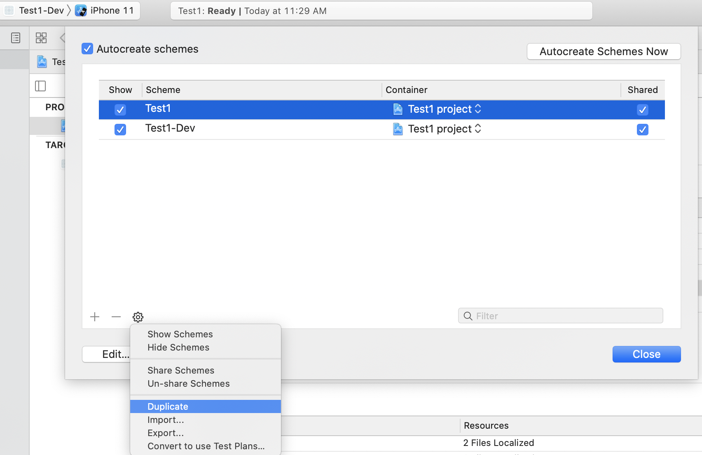


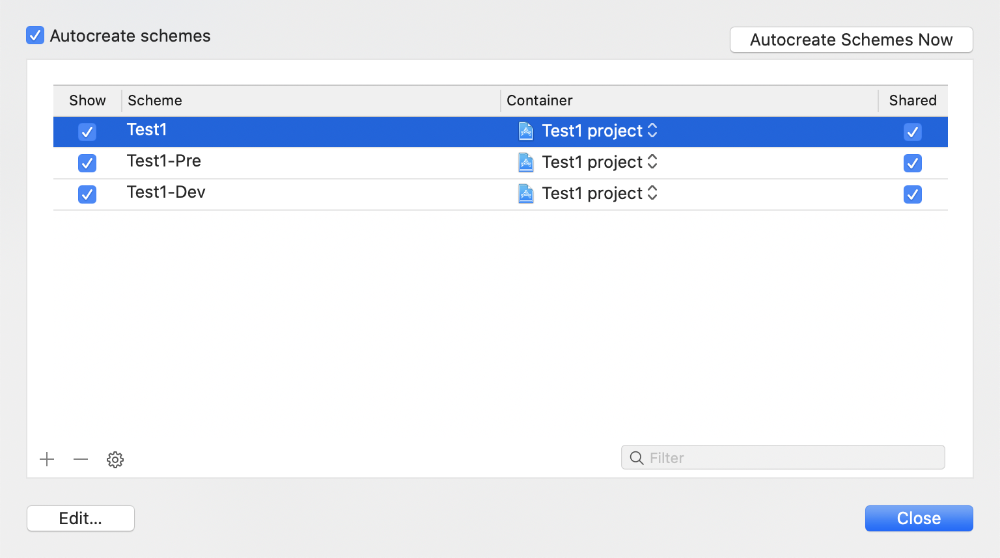


最终的效果，就是 **Schemes** 与 **configurations** 对应

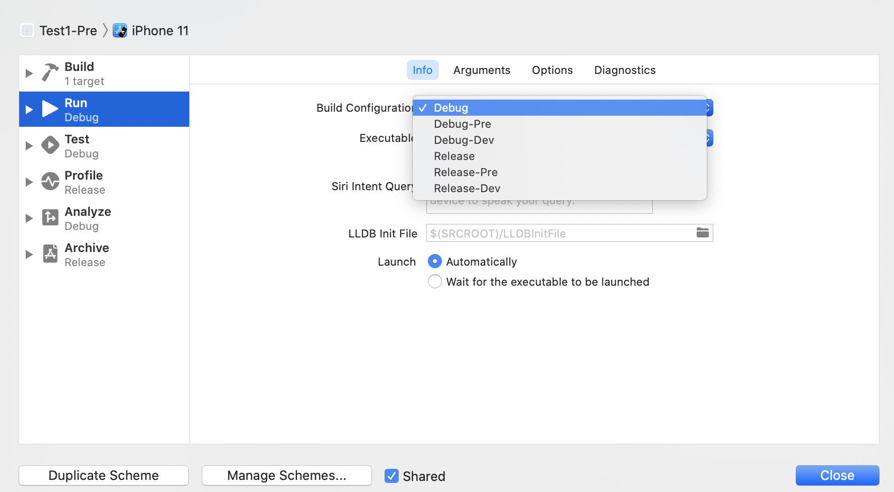


#### xcconfig files

在 XCode 中创建 **xcconfig** 文件

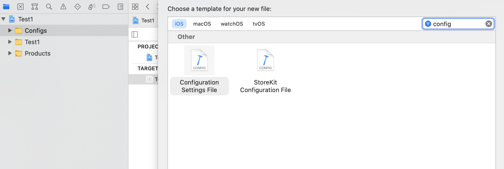


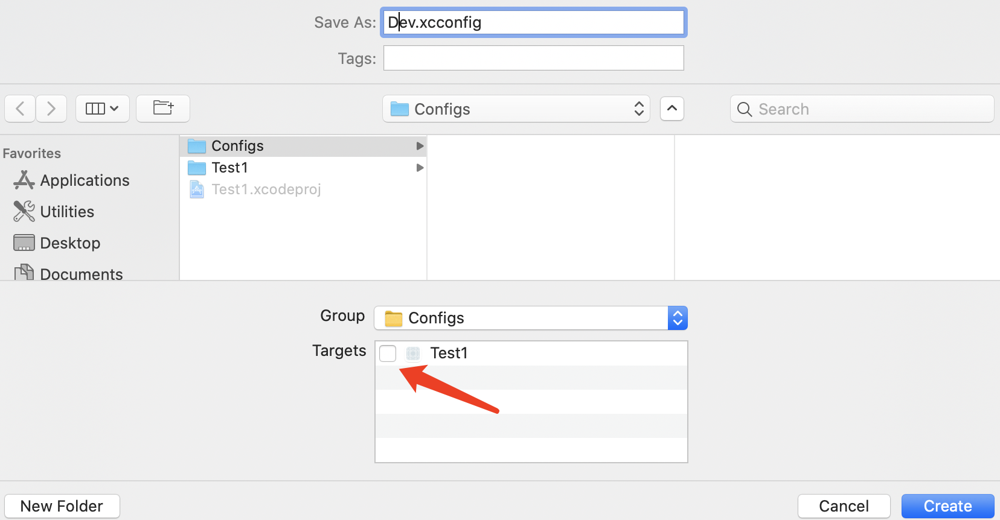


**注意**：如图箭头处，**不要**把 **xcconfig** 文件添加到 **Targets** 下

我们创建的3个 **xcconfig** 文件如下：

```objective-c
// Dev.xcconfig

// Server URL $() 用作转义字符
ROOT_URL = http:/$()/localhost:3000

// Keys
API_KEY = xxx12345xxx

// App Settings
APP_NAME = Test1-Dev
APP_BUNDLE_ID = com.karl.Test1.dev

CONFIGRATION_PLIST_FILENAME = Dev
```


```objective-c
// Pre.xcconfig

// Server URL $() 用作转义字符
ROOT_URL = http:/$()/www.pre.test.karl.com

// Keys
API_KEY = yyy12345yyy

// App Settings
APP_NAME = Test1-Pre
APP_BUNDLE_ID = com.karl.Test1.pre

CONFIGRATION_PLIST_FILENAME = Pre
```


```objective-c
// Pro.xcconfig

// Server URL $() 用作转义字符
ROOT_URL = http:/$()/www.pro.test.karl.com

// Keys
API_KEY = zzz12345zzz

// App Settings
APP_NAME = Test1-Pro
APP_BUNDLE_ID = com.karl.Test1.pro

CONFIGRATION_PLIST_FILENAME = Pro
```


新创建 **Dev.plist** 配置文件存储***Dev**对应的其他配置项：

```objective-c
<?xml version="1.0" encoding="UTF-8"?>
<!DOCTYPE plist PUBLIC "-//Apple//DTD PLIST 1.0//EN" "http://www.apple.com/DTDs/PropertyList-1.0.dtd">
<plist version="1.0">
<dict>
	<key>serverURL</key>
	<string>http://10.20.22.10</string>
	<key>ThirdSDKs</key>
    <array>
    	<key>SDK1</key>
      <dict>
    		<key>name</key>
				<string>s1</string>
        <key>appId</key>
        <string>xxx1234567</string>
        <key>appSecret</key>
        <string>yyy1234567</string>
      </dict>
    	<key>SDK2</key>
    	<dict>
    		<key>name</key>
				<string>s2</string>
        <key>appId</key>
        <string>zzz1234567</string>
        <key>appSecret</key>
        <string>aaa1234567</string>
      </dict>
    </array>
</dict>
</plist>
```


一会儿创建**xcconfig** 一会儿又是 **plist** 这些配置我们编程中如何使用呢？别着急哦~


### 工程配置应用

#### 1. 设置 xcconfig 与 configurations 一一对应

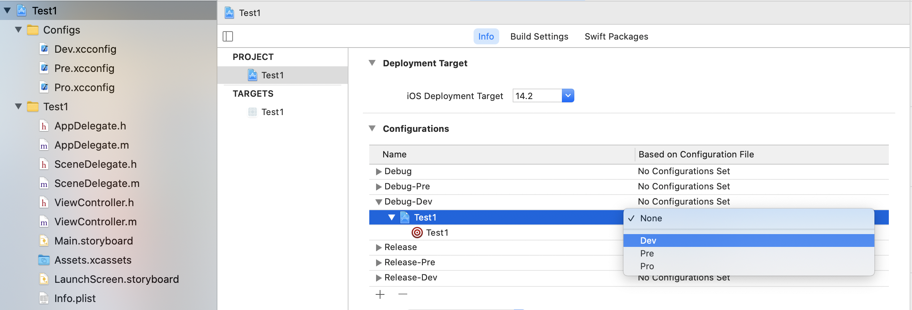

最终效果如下：

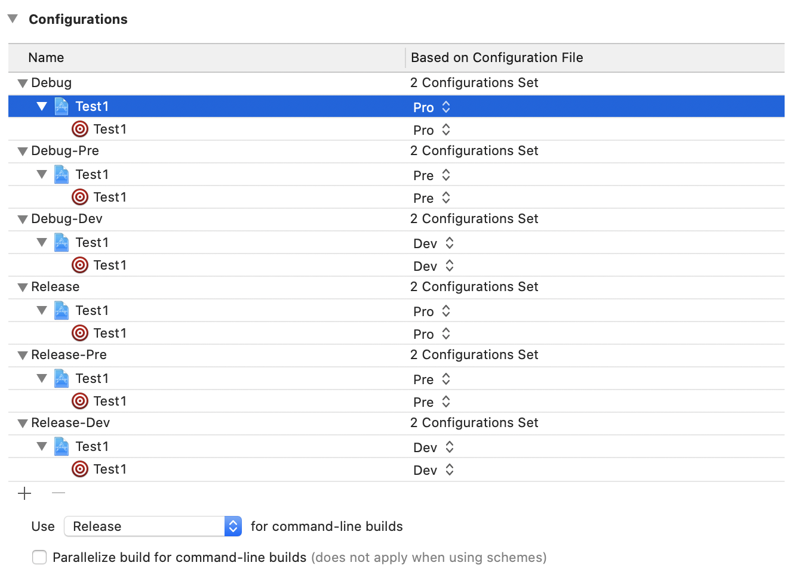


#### 2. 在 Info.plist 中使用上述配置文件

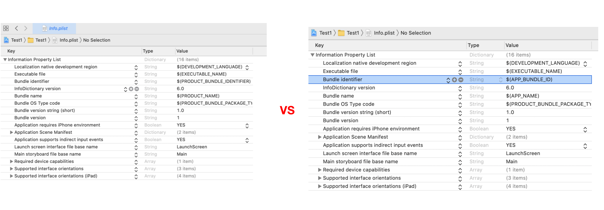

效果：

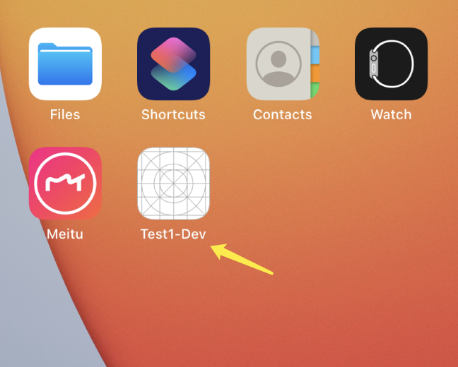

如果遇到如下图或者App Name 和配置的不应。说明 **Schemes** **Configurations** **xcconfig** 三者对应关系不对，请仔细检查！

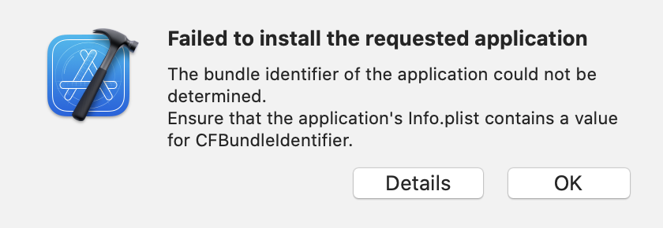


#### 3. 在代码中使用使用自己创建的 Dev.plist

为了能在程序中从 plist 配置文件中读到配置项，我们需要在 `Info.plist` 文件中加入一个 `key`, 比如命名为: `ConfigurationPlistFileName`, `value` 设置为`$(CONFIGRATION_PLIST_FILENAME)`， `CONFIGRATION_PLIST_FILENAME`由之前新建的 `xcconfig` 文件定义。这样我们就可以在 App 中加载 plist 配置文件了。

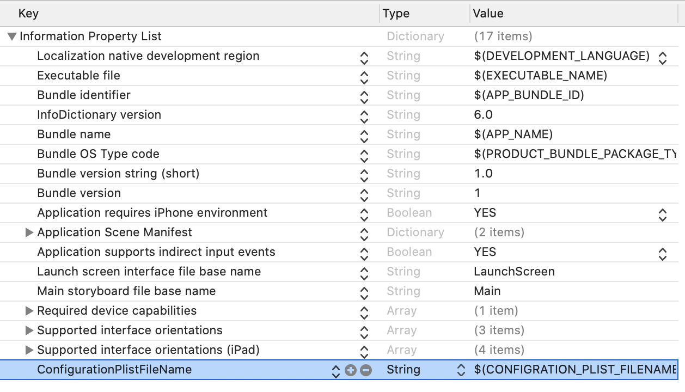

**OC** 

```objective-c
// 读取 info.plist 中的内容
[[NSBundle mainBundle] infoDictionary];

// 或者通过 bundle path 取
NSString *bundlePath = [[NSBundle mainBundle] pathForResource:@"Info" ofType:@"plist"];
NSMutableDictionary *infoDict = [NSMutableDictionary dictionaryWithContentsOfFile:bundlePath];
```

**Swift**

```swift
private static let infoDictionary: [String: Any] = {
    guard let dict = Bundle.main.infoDictionary else {
      fatalError("Plist file not found")
    }
    return dict
}()
```


### 拓展

上述我们自己创建 **xcconfig** 文件等一系列操作，如果你项目使用了 **Cocoapods ** ，你会发现 `pod` 会帮你生成对应 **Schemes** 下的 **xcconfig**。但是，上边我们自己创建了 `xcconfig` 在 `pod install --verbose` 时会报 *warning*：

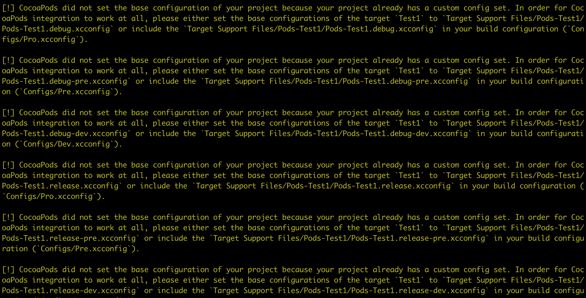

> [!] CocoaPods did not set the base configuration of your project because your project already has a custom config set. In order for CocoaPods integration to work at all, please either xxx

**Warning** 给了我们配置建议：

1. set the base configurations of the target `Test1` to `Target Support Files/Pods-Test1/Pods-Test1.debug-dev.xcconfig` 
2.  include the `Target Support Files/Pods-Test1/Pods-Test1.debug-dev.xcconfig` in your build configuration (`Configs/Dev.xcconfig`).


```objective-c
// Dev.xcconfig

// 使用 Cocoapods 根据 warning 添加该行
#include "Pods/Target Support Files/Pods-Test1/Pods-Test1.debug-dev.xcconfig"

// Server URL $() 用作转义字符
ROOT_URL = http:/$()/localhost:3000

// Keys
API_KEY = xxx12345xxx

// App Settings
APP_NAME = Test1-Dev
APP_BUNDLE_ID = com.karl.Test1.dev

CONFIGRATION_PLIST_FILENAME = Development
```


ps.如果是已经使用 Cocoapods 管理项目依赖的工程，重新梳理 xcconfig 需要删：

- 删除 `.xcworkspace` 文件
- 删除  `Podfile.lock` 文件和 `Pods/` 目录
- 执行 `pod install`


### 参考

- [Let's Set Up Your iOS Environments](https://thoughtbot.com/blog/let-s-setup-your-ios-environments)

