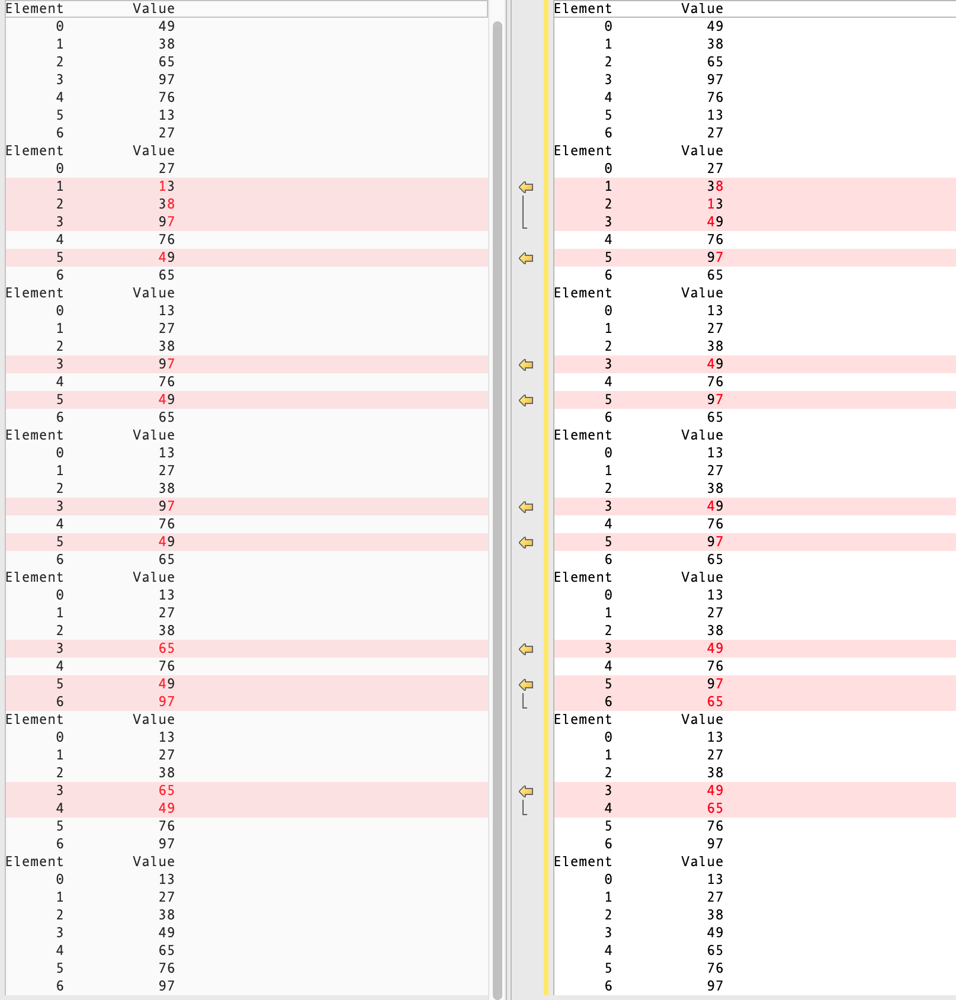

## 快速排序

> [快速排序 from wikipedia](https://zh.wikipedia.org/wiki/%E5%BF%AB%E9%80%9F%E6%8E%92%E5%BA%8F)
>
> 快速排序使用**[分治法](https://zh.wikipedia.org/wiki/分治法)（Divide and conquer）**策略来把一个**[序列](https://zh.wikipedia.org/wiki/序列)（list）**分为较小和较大的2个子序列，然后**递归**地排序两个子序列。
>
> 步骤为：
>
> 1. 挑选基准值：从数列中挑出一个元素，称为**基准**（pivot），
> 2. 分割：重新排序数列，所有比基准值小的元素摆放在基准前面，所有比基准值大的元素摆在基准后面（与基准值相等的数可以到任何一边）。**在这个分割结束之后，对基准值的排序就已经完成**
> 3. 递归排序子序列：**[递归](https://zh.wikipedia.org/wiki/递归)**地将小于基准值元素的子序列和大于基准值元素的子序列排序。
>
> 递归到最底部的判断条件是数列的大小是0 或 1，此时该数列显然已经有序。
>
> Ps. **选取基准值有数种具体方法，此选取方法对排序的时间性能有决定性影响。**

### 快速排序C++实现

```c++
/// 分割函数
int Partition(int data[], int low, int high) {
  // 1. 鲁棒性检查
  // 将当前表中第一个元素作为基准值，对标进行划分
  int pivot = data[low];
  // 循环跳出条件
  while (low < high) {
    while (low < high && data[high] >= pivot) {
      --high;
    }
    // 将比基准值小的元素移动到左边
    data[low] = data[high];
    
    while (low < high && data[low] <= pivot) {
      ++low;
    }
    // 将比基准值大的元素移动到右边
    data[high] = data[low];
  }
    
  // 基准值放到最终位置
  data[low] = pivot;
  
  // 返回存放基准值的最终位置
  return low;
}

/// 排序
void QuickSort(int data[], int low, int high) {
  cout << "Element" << setw( 13 ) << "Value" << endl;
  for ( int j = 0; j < 7; j++ ) {
     cout << setw( 7 )<< j << setw( 13 ) << data[ j ] << endl;
  }
  // 跳出递归条件
  if (low < high) {
    // 分割
    int pivotIndex = Partition(data, low, high);
    // 递归左边
    QuickSort(data, low, pivotIndex-1);
    // 递归右边
    QuickSort(data, pivotIndex+1, high);
  }
}
int main() {
    std::cout << "Quick Sort!\n";
    int test[7] = {49, 38, 65, 97, 76, 13, 27};
    QuickSort(test,0,6);
}
```

打印结果：

```c++
Quick Sort!
Element     Value | Element     Value |  Element    Value |
      0        49 |       0        27 |        0       13 |
      1        38 |       1        38 |        1       27 |
      2        65 |       2        13 |        2       38 |
      3        97 |       3        49 |        3       49 |
      4        76 |       4        76 |        4       76 |
      5        13 |       5        97 |        5       97 |
      6        27 |       6        65 |        6       65 |

Element     Value | Element     Value |  Element    Value |
      0        13 |       0        13 |        0       13 |
      1        27 |       1        27 |        1       27 |
      2        38 |       2        38 |        2       38 |
      3        49 |       3        49 |        3       49 |
      4        76 |       4        76 |        4       65 |
      5        97 |       5        97 |        5       76 |
      6        65 |       6        65 |        6       97 |
      
Element     Value |      
      0        13 |      
      1        27 |      
      2        38 |      
      3        49 |      
      4        65 |      
      5        76 |
      6        97 |          
```


### 剑指Offer 版快排

```c++
/// 随机数
int RandomInRange(int low, int high) {
  return rand() % (high - low) + low;
}

/// 交换
void Swap(int *left, int *right) {
  int temp = *left;
  *left = *right;
  *right = temp;
}

/// 分割
int Partition(int data[], int length, int low, int high) {
  // 鲁棒性
  if (data == nullptr || length <= 0 || low < 0 || high >= length) {
    return 1;
  }
  
  // 在[low, high] 区间中随机取一个值作为 pivot，并将其换到区间最末尾
  int index = RandomInRange(low, high);
  Swap(&data[index], &data[high]);
  
  // small 在 low 的前面1位
  int small = low - 1;
  
  for (index = low; index < high; ++index) {
    if (data[index] < data[high]) {
      // ++small 后表示大于基准值的第一个数的下标
      // 如果不存在大于基准值的数，则表示当前比较的数字的下标
      ++small;
      
      // 交换后的 small 表示小于基准值的最后一个数字的下标
      if (small != index) {
        Swap(&data[index], &data[small]);
      }
    }
  }
  // ++small 后表示大于基准值的第一个数的下标
  ++small;
  Swap(&data[small], &data[high]);
  
  return small;
}

/// 排序
void QuickSort(int data[], int length, int low, int high) {
  cout << "Element" << setw( 13 ) << "Value" << endl;
  for ( int j = 0; j < 7; j++ ) {
     cout << setw( 7 )<< j << setw( 13 ) << data[ j ] << endl;
  }
  if (low == high) {
    return;
  }
    
  int index = Partition(data, length, low, high);
    
  if (index > low) {
    QuickSort(data, length, low, index - 1);
  }
    
  if (index < high) {
    QuickSort(data, length, index + 1, high);
  }
}

int main() {
  int data[7] = {49, 38, 65, 97, 76, 13, 27};
  // 调用快排函数进行排序
  QuickSort(data, 7, 0, 6);
    
  return 0;
}
```


打印结果：

```c++
Element        Value | Element        Value | Element        Value |
      0           49 |       0           27 |       0           13 |
      1           38 |       1           13 |       1           27 |
      2           65 |       2           38 |       2           38 |
      3           97 |       3           97 |       3           97 |
      4           76 |       4           76 |       4           76 |
      5           13 |       5           49 |       5           49 |
      6           27 |       6           65 |       6           65 |
Element        Value | Element        Value | Element        Value |
      0           13 |       0           13 |       0           13 |
      1           27 |       1           27 |       1           27 |
      2           38 |       2           38 |       2           38 |
      3           97 |       3           65 |       3           65 |
      4           76 |       4           76 |       4           49 |
      5           49 |       5           49 |       5           76 |
      6           65 |       6           97 |       6           97 |
Element        Value |
      0           13 |
      1           27 |
      2           38 |
      3           49 |
      4           65 |
      5           76 |
      6           97 |
```


对比：




上述这两种实现的运行过程是不同的，剑指offer 版是用 small 指代小于基准元素的最右位置，在遍历过程中进行交换操作来保证 small 左边都是小于标准元素的元素，而第一种实现是用 low，high 分别表示小于和大于基准值的集合边界位置更浅显易懂。