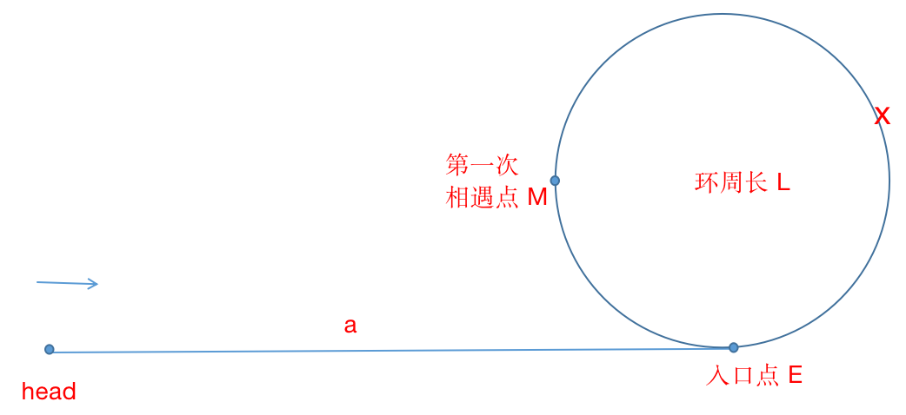

## 链表

### 概念简述

**链表**，是[线性表](https://zh.wikipedia.org/wiki/%E7%BA%BF%E6%80%A7%E8%A1%A8)的存储结构的一种实现。它是一种[线性表](https://zh.wikipedia.org/wiki/线性表)，但是并不会按线性的顺序存储数据，而是在每一个节点里存到下一个节点的[指针](https://zh.wikipedia.org/wiki/指標_(電腦科學))(Pointer)。由于不必须按顺序存储，链表在插入的时候可以达到`O(1)`的[复杂度](https://zh.wikipedia.org/wiki/複雜度)，比另一种线性表[顺序表](https://zh.wikipedia.org/wiki/顺序表)快得多，但是查找一个节点或者访问特定编号的节点则需要`O(n)`的时间，而顺序表相应的时间复杂度分别是`O(logn)`和`O(1)`。

使用链表结构可以克服数组链表需要预先知道数据大小的缺点，链表结构可以**充分利用计算机内存空间**，实现灵活的内存**动态管理**。但是**链表失去了数组随机读取的优点，同时链表由于增加了结点的指针域，空间开销比较大**。

> ps. **线性表** 的存储结构的另一种实现是 **顺序表**。即，顺序表是在计算机内存中以**数组**的形式保存的线性表。是指用一组地址连续的**存储单元**依次存储数据元素的线性结构。

#### 更多关于数组，可以查看我之前的笔记 [数组](./2019-10-20-数组.md) 

 **链表**类型：

- 单向链表

  

- 双向链表

  

- 循环链表

  

本文主要学习一下单向链表。

### 单向链表（单链表)

#### 类型定义

```c
struct ListedNode {
	int data;
	struct ListedNode *next;
};
typedef struct ListedNode LNode;
```


#### 创建单链表

##### 头插法建表

从一个空表开始，重复读入数据，生成新节点，将读入数据存放到新节点的数据域中，然后将新节点插入到当前链表的表头结点之后，直到读入结束标志为止。（插入的数据与插入的顺序相反）

```c
#include <iostream>
#include <cstdio>
#include <stdlib.h>
using namespace std;

LNode* createLinkedListHead(int a[], int n) {
  int i, x;
  LNode *L, *p;
  L = (LNode *)malloc(sizeof(LNode));
  L->next = NULL;
  // 开始插入
  for (i = 0; i<n; i++) {
    p = (LNode *)malloc(sizeof(LNode));
    p->data = a[i];
    p->next = L->next;
    L->next = p;
  }
  return L;
}

```


##### 尾插发建表

将新节点查到当前单链表的表尾上。增加一个尾指针 r，使之指向当前单链表的表尾。（插入的数据与插入的顺序相同）

```c
LNode* createLinkedListTail(int b[], int n) {
  int i, x;
  // r 尾指针 p 指向新申请的结点
  LNode *L, *p, *r;
  L = （LNode *)malloc(sizeof(LNode));
  L->next = NULL;
  // 尾指针指向当前单链表的表尾
  r = L;
  for (i = 0; i<n; i++) {
    p = (LNode *)malloc(sizeof(LNode));
    p->data = b[i];
    r->next = p;
    //  r = r->next;
    r = p // 将当前的新结点定义为表尾终端结点
  }
  r->next = NULL;
  return L;
}
```


##### 链表带头结点与不带头结点

>  链表中第一个结点的存储位置叫做**头指针**
>
> 单链表可以没有**头结点**，但是头指针是必须的！！！

> 头结点是为了方便操作的一致性，它存放在第一个元素结点之前，其数据域一般无意义（有标识作用，故常用头指针冠以链表的名字）

> 何为一致性？
>
> 不带头结点的单链表对于第一个节点的操作（插入、删除等）与其他节点不一样，需要特殊处理，这增加了程序的复杂性和出现bug 的机会。因此在单链表的开始结点之前附设一个头结点。
>
> eg. 遍历的判断条件
>
> ```c
> // 带头结点
> while(head->next != NULL) {}
> 
> // 不带头结点
> while(head != NULL) {}
> ```


##### 计算链表长度

```c
// 计算链表长度
int list_len(LNode *head) {
  int i;
  for (i = 0; head; head = head->next, i++);
  return i;
}
```


##### 逆序打印链表

> 这里用到了递归的思路

```c
void r_print(LNode *head)
{
    if (head){
        r_print(head->next); 
        printf("%s", head->data);
    }
}
```


#### 单链表相关题目

##### 1. O(1) 复杂度删除链表结点

> **题目描述：**给定链表的头指针和一个结点指针，在O(1)时间删除该结点
>
> 思路：用下一个结点数据覆盖要删除的结点，然后删除下一个节点。但如果结点是尾结点时，该方法就行不通了。

```c
void deleteRandomNode(LNode *cur) {
  assert(cur != NULL);
  assert(cur->next != NULL); // 不能是尾结点
  LNode *pNext = cur->next;
  cur->data = pNext->data;
  cur->next = pNext->next;
  delete pNext;
}
```

##### 2. 单链表的转置

**题目描述：**输入一个单向链表，输出逆序反转后的链表

**思路：**

- 非递归：用三个临时指针 pre、head、next 在链表上遍历一遍

  ```c
  LNode *reverseByTraverse(LNode *head) {
    if (head == NULL || head->next == NULL) {
      return head;
    }
    LNode *pre = NULL;
    LNode *next = NULL;
    while (head != NULL) {
      next = head->next;
      
      head->next = pre;
      pre = head;
      head = next;
    }
    return pre;
  }
  ```

- 递归

```c
LNode *reverseByRecursive(LNode *head) {
  if (head == NULL || head->next == NULL) {
    return head;
  }
  LNode *temp = reverseByRecursive(head->next);
  
  head->next->next = head;
  head->next = NULL:
  
  return temp;
}
```


##### 3. 查找单链表倒数第 k 个结点

**题目描述：**输入一个单向链表，输出该链表中倒数第k个节点，链表的倒数第0个节点为链表的尾指针。

**思路：**设置两个指针 p1、p2，首先 p1 和 p2 都指向 head，然后 p1 向前走 k 步，这样 p1 和 p2 之间就间隔 k 个节点，最后 p1 和 p2 同时向前移动，直至 p1 走到链表末尾。

```c
LNode *theKthNode(LNode *head, int k) {
  if (k < 0) return NULL;
  LNode *p1, *p2;
  p1 = p2 = head;
  int i = k;
  // p1先走k步
  for (;i>0 && p1!=NULL; i--) {
    p1 = p1->next;
  }
  // k 大于链表长度时直接返回 NULL
  if (i >0) return NULL;
  // p1 p2 同时走，结束条件是p1走到链表末尾
  while(p1 != NULL) {
    p2 = p2->next;
    p1 = p1->next;
  }
  // p2 即倒数第k个结点
  return p2;
}
```


##### 4. 单链表的中间结点

**题目描述：**求链表的中间节点，如果链表的长度为偶数，返回中间两个节点的任意一个，若为奇数，则返回中间节点。

**思路：**可以先求链表的长度，然后计算出中间节点所在链表顺序的位置。这样的话需要遍历两遍链表。可以借鉴第3题的思路，用两个指针从链表头节点开始，一个指针每次向后移动两步，一个每次移动一步，直到快指针移到到尾节点，那么慢指针即是所求。

```c
LNode *theMiddleNode(LNode *head) {
  if (head == NULL) {
    return NULL;
  }
  LNode *slow, *fast;
  slow = fast = head;
  // 如果要求在链表长度为偶数的情况下，返回中间两个节点的第一个，可以用下面的循环条件
  //while(fast && fast->next != NULL && fast->next->next != NULL) 
  while (fast != NULL && fast->next != NULL) {
    fast = fast->next->next;
    slow = slow->next;
  }
  return slow;
} 
```


##### 5. 判断单链表是否存在环

**题目描述：**输入一个单向链表，判断链表是否有环？

**思路：**通过两个指针，分别从链表的头节点出发，一个每次向后移动一步，另一个移动两步，两个指针移动速度不一样，如果存在环，那么两个指针一定会在环里相遇。

```c
bool hasCircle(LNode *head) {
  LNode *slow, *fast;
  slow = fast = head;
  while (fast != NULL && fast->next != NULL) {
		fast = fast->next->next;
    slow = slow->next;
    if (fast == slow) {
      return true;
    }
  }
	return fase;
}
```


##### 6. 找到环的入口结点

**题目描述：**输入一个单向链表，判断链表是否有环。如果链表存在环，如何找到环的入口点？

**思路：** 由5题可知，按照 fast 每次两步，slow 每次一步的方式走，发现 fast 和 slow 重合，确定了单向链表有环路了。

接下来，让fast回到链表的头部，重新走，每次步长不是走2了，而是走1，那么当 slow 和 fast 再次相遇的时候，就是环路的入口了。

**为什么？：**

假定起点到环入口点的距离为 a，环路的周长为L，当 slow 入环的时候， fast 已经领先slow的长度为 b（b = a%L）， 当 slow 和 fast 第一次相遇M点。



设 M 相对 E 的长度（沿着箭头行进方向）为 x，则有：

```c
(L-b) + x = 2x (fast 行进路程是 slow 的两倍)

=> x = L-b
```

那么，当 slow 和 fast 在 M 处相遇的时候，fast 从 head 处再重新出发，步长为 1。可以知道，fast 和 slow 会在 E 处相遇。

```c
LNode *findCircleEntry(LNode *head) {
  if(head == NULL || head->next == NULL) {
    // 不存在环
    return NULL;
  }
  LNode *slow, *fast;
  slow = fast = head;
  // 检查是否存在环
  while(fast != NULL && fast->next != NULL) {
    fast = fast->next->next;
    slow = slow->next;
    if (fast == slow) {
			break;
    }
  }
  // 不存在环
  if (fast != slow) return NULL;
  
  // fast 从头开始走，步长1
  fast = head;
  
  while(fast != slow) {
    fast = fast->next;
    slow = slow->next;
  }
  // 此时 fast 即 entry 点
  return fast;
}
```


##### 7. 判断两个单链表是否相交（链表不带环）

**思路：**两个链表的尾指针是否相等。相等，则链表相交；否则，链表不相交。

```c
bool isIntersect(LNode *h1, LNode *h2) {
  if (h1 == NULL || h2 == NULL) return false;
  while (h1->next != NULL) {
    h1 = h1->next;
  }
	while (h2->next != NULL) {
    h2 = h2->next;
  }
  if (h1 == h2) return true;
  return false;
}
```

> 链表相交，脑海里很容易出现 X 的情况，其实是不存在的。**否则交点处必有两个指针**
>
> 

##### 8. 两链表相交（有环）

**思路：**如果有环且两个链表相交，则两个链表都有共同一个环，即环上的任意一个节点都存在于两个链表上。因此，就可以判断一链表上俩指针相遇的那个节点，在不在另一条链表上。

```c
bool isIntersectWithLoop(LNode *h1,Node *h2) {
    LNode *circleNode1,*circleNode2;
  	//判断链表带不带环，并保存环内节点
    if(!hasCircle(h1,circleNode1) || !hasCircle(h2,circleNode2)) {
      	//不带环，异常退出
        return false;
    }

    LNode *temp = circleNode2->next;
    while(temp != circleNode2) {
        if(temp == circleNode1) return true;
        temp = temp->next;
    }
    return false;
}
```


##### 9. 两链表相交的第一个公共结点

**题目描述：**如果两个**无环**单链表相交，怎么求出他们相交的第一个节点呢？

**思路：**采用**对齐**的思想。计算两个链表的长度 L1 , L2，分别用两个指针h1 , h2 指向两个链表的头，然后将较长链表的 h1（假设为 h1）向后移动`L2 - L1`个节点，然后再同时向后移动h1 , h2，直到 `h1 = h2`。相遇的点就是相交的第一个节点。

```c
LNode *findIntersectNode(LNode *h1,Node *h2) {
  int len1 = list_len(h1);
  int len2 = list_len(h2);
  
  if (len1 > len2) {
    for(int i = 0; i<Len1-len2;i++) {
      h1 = h1->next;
    }
  } else {
    for(int i = 0; i<Len2-len1;i++) {
      h2 = h2->next;
    }
  }
  while (h1 != NULL) {
    if(h1 == h2) {
      return h1;
    }
    h1 = h1->next;
    h2 = h2->next;
  }
  return NULL;
}
```

> 拓展：
>
> 1. 关于对齐
>
>    当两个链表长度不一样，记长的长度为 L，短的为 S。
>
>    1. 同时开始遍历，当短的到了尾节点的时候，他们都走了 S 步，这时候把**短节点指针指向长节点头部**，再继续同时遍历
>    2. 再走（L-S）步后，长节点就走了 S+(L-S)=L 步后也到了自己尾部，然后**将其指向短节点头部**
>
>    最关键的地方在于，短链表头节点指针在重置为指向长链表头节点之后，即第2步中，也走了 L-S 步，而长链表指针在第二步中也重置为了短节点头部。相当于长链表头指针先走 L-S 步。
>
> 2. 没有相交节点的时候会一直循环吗？不会，因为上述对齐过程中，只要两链表长度不一样
>    节点指针重置一定会也只会发生两次，第一次是短链表到结尾重置，第二次是长链表到结尾重置


### 参考文献

- [链表 维基百科](https://zh.wikipedia.org/wiki/%E9%93%BE%E8%A1%A8)
- [面试精选：链表问题集锦](http://wuchong.me/blog/2014/03/25/interview-link-questions/?nsukey=uu69wgen%2Bp%2BJIRlBPNi3AHI4qI2C216PPqxwXUm6KU27zu%2ByxAiOkLVx%2FmoVnWMVqHM7tmqeYYj93uYG0Tk8btSzHV1UtlClqMqQELp19jsqLIrBruHsoauPnN%2BLZXRq4UaSLdi1ibsk742kdHRnb7L46V%2BBwwkfgGM6yaoxKDl1l6lwuB3%2Fm25TdWp%2BPB%2B4IFmoX3wGj2hwFoQzQzF7JQ%3D%3D)
- [链表的魅力：两个单向链表的第一个交点](https://zhuanlan.zhihu.com/p/71638213)

