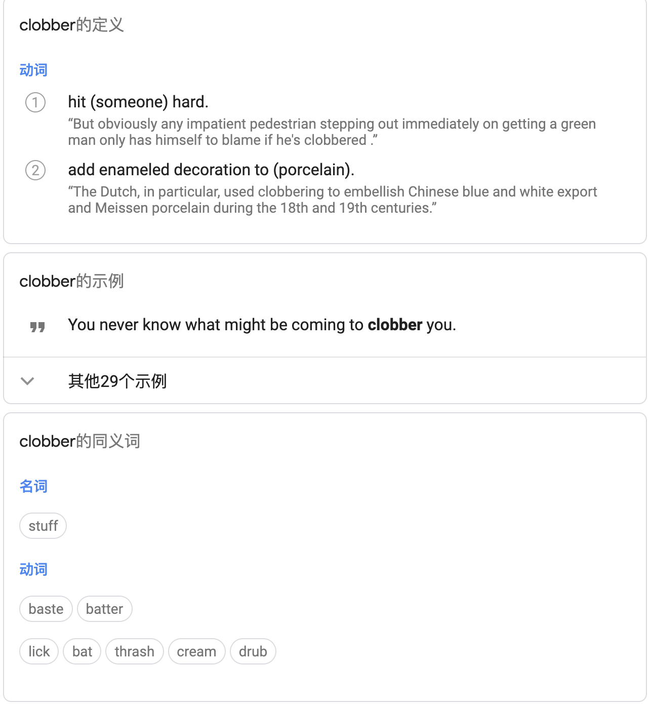
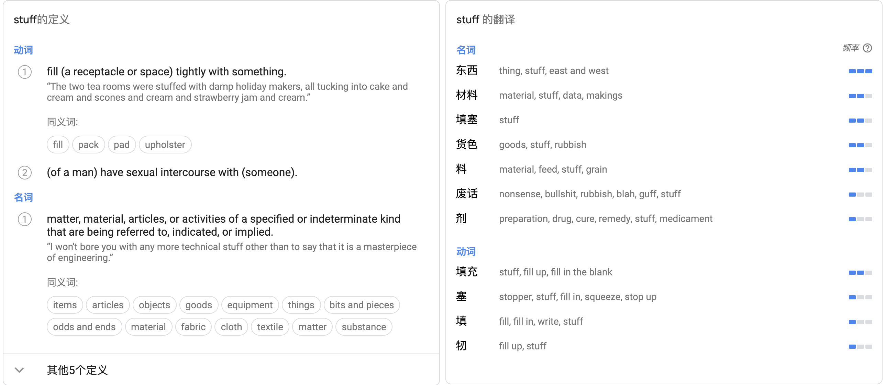

## Cordova

### cordova.js

>  Cordova.js

```javascript
// file: src/cordova.js
define("cordova", function(require, exports, module) {}

// file: src/common/argscheck.js
// 校验参数
define("cordova/argscheck", function(require, exports, module) {}

// file: src/common/base64.js
// JS->Native交互时对ArrayBuffer进行uint8ToBase64
define("cordova/base64", function(require, exports, module) {}

// file: src/common/builder.js
// 对象属性操作
define("cordova/builder", function(require, exports, module) {}

// file: src/common/channel.js
// 控制事件调用
define("cordova/channel", function(require, exports, module) {}

// file: ../cordova-ios/cordova-js-src/exec.js
// 执行 js => native 交互       
define("cordova/exec", function(require, exports, module) {}

// file: src/common/exec/proxy.js
// 用于Plugin中往已经有的模块上添加方法
define("cordova/exec/proxy", function(require, exports, module) {}

// file: src/common/init.js
// 初始化处理       
define("cordova/init", function(require, exports, module) {}

// file: src/common/modulemapper.js
// 把定义的模块clobber到一个对象，在初始化的时候会赋给window
define("cordova/modulemapper", function(require, exports, module) {}

// file: ../cordova-ios/cordova-js-src/platform.js
// 模块处理       
define("cordova/platform", function(require, exports, module) {}

// file: ../cordova-ios/cordova-js-src/plugin/ios/console.js
define("cordova/plugin/ios/console", function(require, exports, module) {}

// file: ../cordova-ios/cordova-js-src/plugin/ios/logger.js
define("cordova/plugin/ios/logger", function(require, exports, module) {}

// file: ../cordova-ios/cordova-js-src/plugin/ios/wkwebkit.js
define("cordova/plugin/ios/wkwebkit", function(require, exports, module) {}

// file: src/common/pluginloader.js
// 加载所有cordova_plugins.js中定义的模块，执行完成后会触发onPluginsReady
define("cordova/pluginloader", function(require, exports, module) {}

// file: src/common/urlutil.js
// 获取绝对URL
define("cordova/urlutil", function(require, exports, module) {}

// file: src/common/utils.js
// 工具类       
define("cordova/utils", function(require, exports, module) {}

// 加载 cordova 模块，赋值给 window.cordova
window.cordova = require('cordova');
// file: src/scripts/bootstrap.js
// 初始化处理
require('cordova/init');

})();
```

> 整个过程：
>
> 1. `index-ios.html` 通过 `<script> ` 引入`cordova-ios.js`
>
> 2. `Cordova-ios.js` 开始 `define` 各个模块
>
> ```
> define = function (id, factory) {
>   if (Object.prototype.hasOwnProperty.call(modules, id)) {
>   	throw new Error('module ' + id + ' already defined');
>   }
> 
>   modules[id] = {
>     id: id,
>     factory: factory
>   };
> };
> ```
>
> 3. 直到执行到
>
> ```
> window.cordova = require('cordova');
> ```
>
> 第一次执行 `require` 函数，传入的 `id` 为`cordova`，找到 `module[cordova] `
>
> 4. 开始 `build` 对应的 `module.factory`
> 5. `build` 删除`module.factory`直接返回 `module.exports` 
>
> ps.这里有一点 `require` 会判断 `modules[id].factory` 是否存在，如果模块存在工厂方法说明还没有进行 `build`


> **require.js**
>
> 模块化系统，异步模块化加载。`cordova-js`最开始采用的是 `CommonJS` 规范的模块系统(`nodejs` 就是 `CommonJS` 规范) 在`cordova.js`中可以直接使用：
>
> ​    `define()`和`require()`
>
> 在其他文件可以通过：
>
> ​    `cordova.define()`和`cordova.require()`来调用。
>
> `src/scripts/require.js` 中定义的就是一个精简的JavaScript模块系统。
>
> 参考：
>
> [CommonJS](https://wiki.jikexueyuan.com/project/javascript-design-patterns/commonjs.html)
>
> [CommonJS规范](https://javascript.ruanyifeng.com/nodejs/module.html)


### cordova-plugins.js

>cordova_plugins.js

```javascript
cordova.define('cordova/plugin_list', function(require, exports, module) {
    var exec = require('cordova/exec');

    module.exports = {...};
    module.exports.metadata = {
        "cordova-plugin-whitelist": "1.3.4"
    };
});
```

### 一个小插曲
在阅读 Cordova Js 中，`modulemapper` 模块有一个 `clobber` 方法。 `clobber` 这个我单词一开始我是懵逼的。两方面的原因吧:
- 一方面是单词量的问题，一个英文单词就只知道一个意思 :( 
- 另一方面，我个人阅读开源库源码量小

> 借助翻译软件查到的结果：






