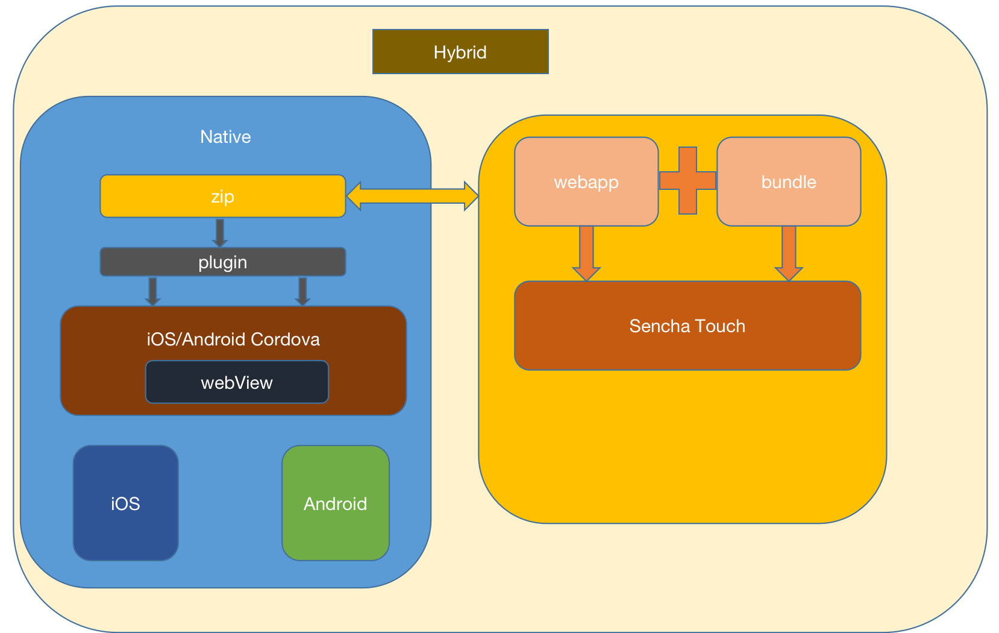
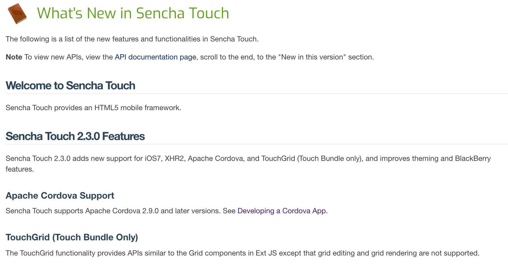
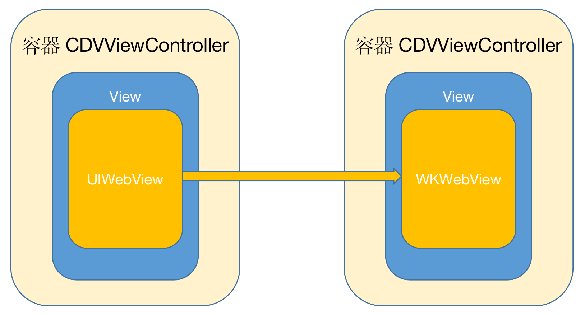
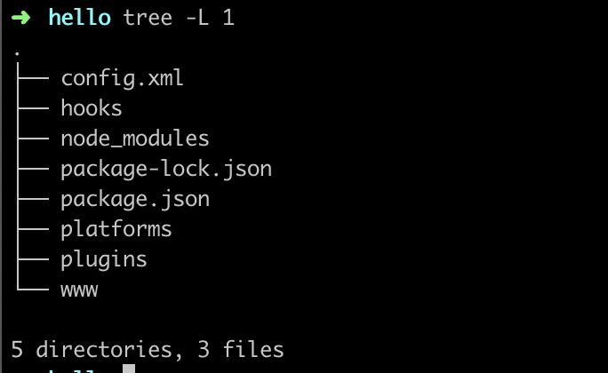
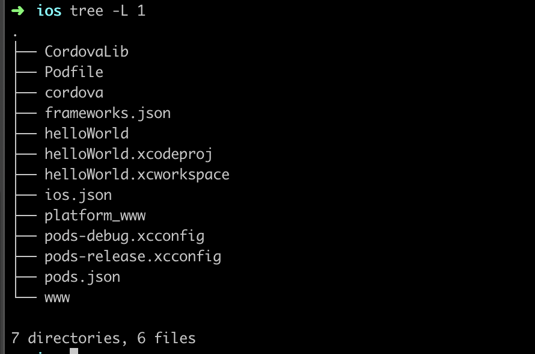
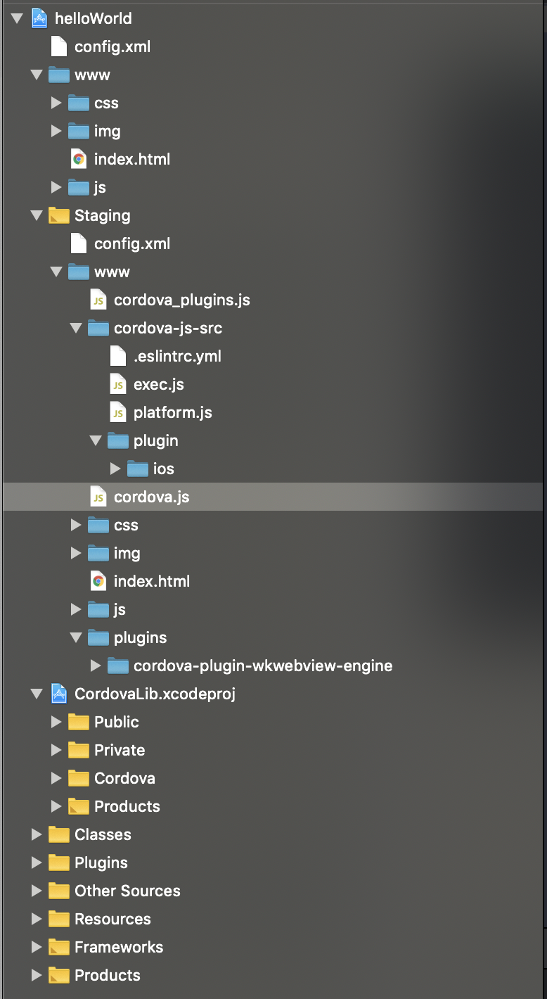
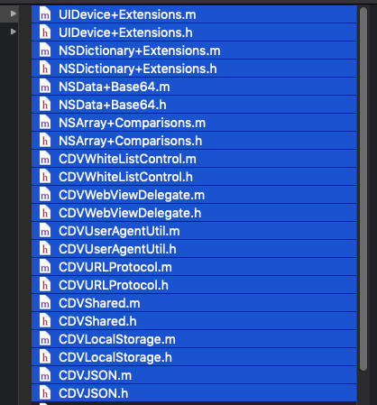
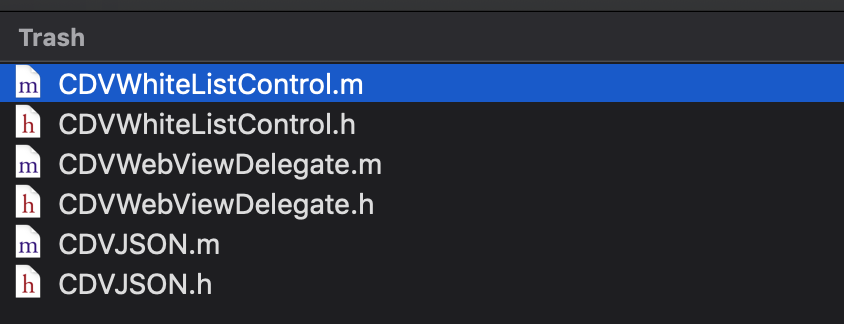
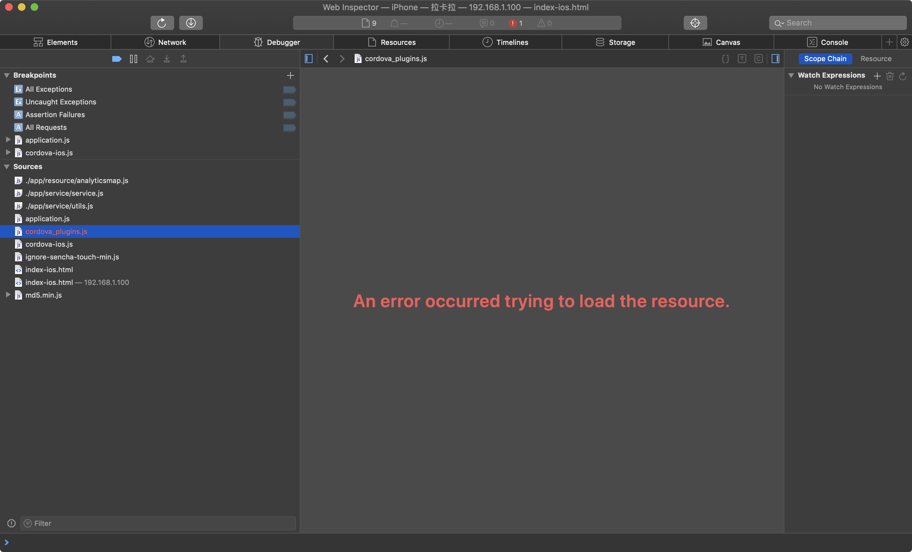

# 记录一次 Cordova 的升级之旅

## 背景：

> ## [Updating Apps that Use Web Views](https://developer.apple.com/news/?id=12232019b)
>
> December 23, 2019
>
> If your app still embeds web content using the deprecated UIWebView API, we strongly encourage you to update to WKWebView as soon as possible for improved security and reliability. WKWebView ensures that compromised web content doesn’t affect the rest of an app by limiting web processing to the app’s web view. And it’s supported in iOS and macOS, and by Mac Catalyst.The App Store will no longer accept new apps using UIWebView as of April 2020 and app updates using UIWebView as of December 2020.

## 现状

1. 源码集成的方式集成了 Cordova 3.5 版本。Cordova 4.0.0 以后，有重大更新，组织架构发生巨大变化。 目前是 5.x版本。ps. 我们对源码集成的 Cordova 3.5 做过少许改动，但是没有记录。只能通过代码对比确认。

2. Sencha Touch 2.3 官方已经不再维护。

我们工程的组织：




## 资料：

1.[Sencha Touch 2.3](https://docs.sencha.com/touch/2.3.1/#!/guide/whats_new)



2. [Removed all UIWebView code. ](https://github.com/apache/cordova-ios/pull/663)

3. 网上查阅的资料：

- [Cordova](https://cordova.apache.org/docs/en/latest/)

- [Cordova OverView](https://cordova.apache.org/docs/en/9.x/guide/overview/index.html)

- [iOS WebViews](https://cordova.apache.org/docs/en/latest/guide/platforms/ios/webview.html)

- [cordova-ios](https://github.com/apache/cordova-ios)

- [WKWebView and Apache Cordova](https://shazronatadobe.wordpress.com/2015/03/03/wkwebview-and-apache-cordova/)

- [现有Hybird项目升级改造Cordova，Cordova设计思想分享](https://www.jianshu.com/p/e659cff182e1)

- [已有iOS项目集成Cordova(PhoneGap)](https://www.jianshu.com/p/a6dd9b7c4ea7)


## 思路：

一 升级（Cordova 3.5-->5.x）

>  升级跨度比较大，尤其是 4.0.0 以后，有重大更新。Cordova 框架升级，会导致所有的插件需要相应升级处理。而且不保证 Sencha Touch 是否可以继续运行良好。


二 在Cordova 3.5 版本的源码基础上 替换 UIWebView 为 WKWebView




> `UIWebView 升级`  `WKWebView`，两者代理方法，执行 js 的方法，属性，回调 以及关键的 `native` 交互方式已经发生变化，反推Cordova 也还是要改动。毕竟不是Cordova 的核心作者，贸然出手估计也改不好。个人觉得千万别乱改人家的东西！


### 我的思路：

整体上评估这个方案，Cordova 社区不太活跃，实施的可能性还是有的，但既然是重构大家更愿意使用社区活跃稳定更新维护的技术框架作为解决方案。可能会带来的几个大问题：

- cordova 包括 Cordova Native 和 Cordova js，两端都要升级这一点毋庸置疑。
- 所有自定义插件调用方式修改
- 修改继承自Cordova `CDVViewController`类的子类（例如：`LKLWebViewxxx`）
- 工程本身的一些问题 ps. 这个和工程耦合比较大，这里不赘述


---

## 尝试：

先看一下，现在  Cordova 脚手架创建的工程。

1. 脚手架创建一个 Cordova 项目，工程组织。如下：




> iOS platform




> iOS project




## 实战

使用 Cordova 最新的库，然后替换我们工程里边的老版本。

> 我们工程中有而现有 Cordova 库没有的类



> 我删除的类



> 继承图
```

XXXMessageWebViewController
       /|\
        |  
XXXExternalWebViewController / XXXInternalWebViewController
       /|\
        |
XXXBaseWebAppViewController
  |---------------------------------------------|
  | - setEntry // 页面载入的入口(本地和远程)        |
  | - viewDidLoad                               |
  | // 设置入口                                   |
  | // 注册 request和lanucher 插件                |
  |---------------------------------------------
       /|\
        |
XXXCoreWebAppViewController
       /|\
        |
XXXCDVViewController
       /|\
        |
CDVViewController

```

### 遇到的问题

#### 插件js 不加载问题



我已开始找了很长时间，一直没找到，在哪儿加载的这个js，后来在 `cordova.js`

里边找到了

```javascript
// Tries to load all plugins' js-modules.
// This is an async process, but onDeviceReady is blocked on onPluginsReady.
// onPluginsReady is fired when there are no plugins to load, or they are all done.
exports.load = function (callback) {
  var pathPrefix = findCordovaPath();
  if (pathPrefix === null) {
  	console.log('Could not find cordova.js script tag. Plugin loading may fail.');
  	pathPrefix = '';
  }
  injectIfNecessary('cordova/plugin_list', pathPrefix + 'cordova_plugins.js', function () {
    var moduleList = require('cordova/plugin_list');
    handlePluginsObject(pathPrefix, moduleList, callback);
  }, callback);
};
```

#### !!! 别忘了设置 user agent

```objectiv-c

// 修改userAgent
- (void)addToWebViewUserAgent:(NSString *)addAgent
{
    static dispatch_once_t onceToken;
    dispatch_once(&onceToken, ^{
        WKWebView *webView = [WKWebView new];
        [webView evaluateJavaScript:@"navigator.userAgent" completionHandler:^(id _Nullable oldAgent, NSError * _Nullable error) {
            if (![oldAgent isKindOfClass:[NSString class]]) {
                // 为了避免没有获取到oldAgent，所以设置一个默认的userAgent
                // Mozilla/5.0 (iPhone; CPU iPhone OS 12_2 like Mac OS X) AppleWebKit/605.1.15 (KHTML, like Gecko) Mobile/15E148
                oldAgent = [NSString stringWithFormat:@"Mozilla/5.0 (%@; CPU iPhone OS %@ like Mac OS X) AppleWebKit/605.1.15 (KHTML, like Gecko) Mobile/15E148/xxx", [[UIDevice currentDevice] model], [[[UIDevice currentDevice] systemVersion] stringByReplacingOccurrencesOfString:@"." withString:@"_"]];
            }
            
            //自定义user-agent
            if (![oldAgent hasSuffix:addAgent]) {
                NSString *freshAgent = [oldAgent stringByAppendingFormat:@"/%@",addAgent];
                 [[NSUserDefaults standardUserDefaults] registerDefaults:@{@"UserAgent": freshAgent, @"User-Agent": freshAgent}];
                // 一定要设置customUserAgent，否则执行navigator.userAgent拿不到oldAgent
                webView.customUserAgent = freshAgent;
            }
        }];
    });
}

```


#### 加载路径问题

重写 `CDVCommandDelegateImpl` 中的方法，指定你要的路径即可

``` - (NSString*)pathForResource:(NSString*)resourcepath; ```