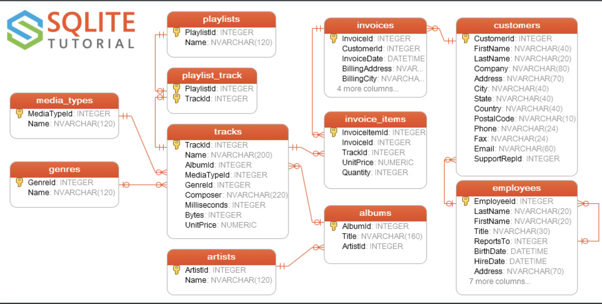
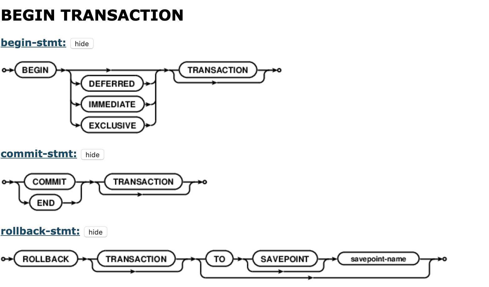
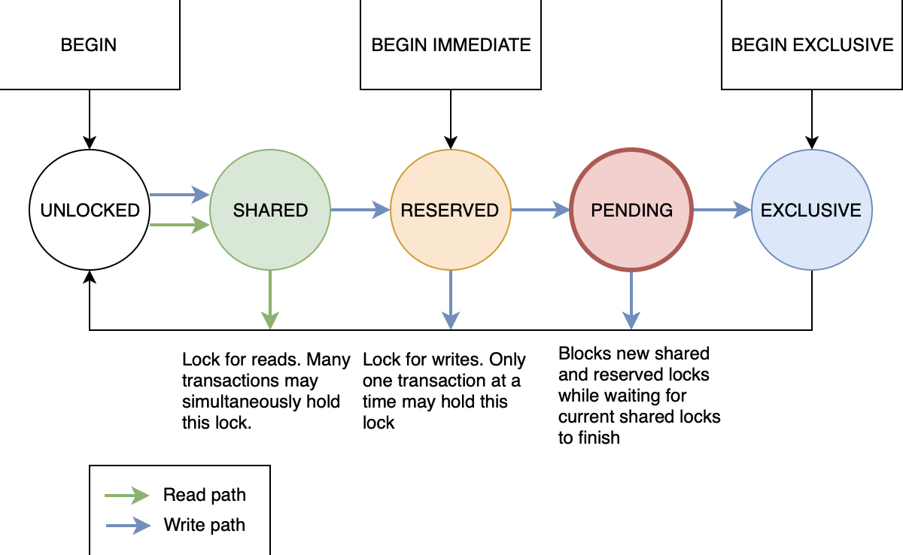
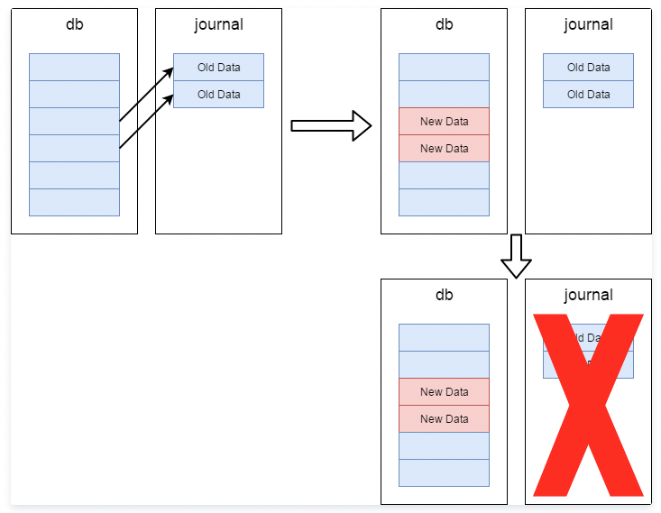

# 了解SQLite

> 昨天和一朋友游百望山，程序员之间避不开的话题就是编程啦。有个话题是他要基于 SQLite 封装一个数据库相关的工具库。我调侃了一句“FMDB、WCDB。。。 不香吗？非要自己造轮子”

回家以后，我对他要造一个数据库工具类的想法对自己进行了反思。我真的了解SQLite 吗？翻看笔记，我发现16年的时候我写过一篇 [FMDB](https://github.com/likenow/blog/blob/master/articles/2016-5-14-FMDB%E4%BD%BF%E7%94%A8.md) 相关的文章，就在也没找到关于 SQLite 相关的内容了。突然觉得自己对他的调侃只是过嘴瘾罢了。。。

## 名词简介

几个名词先解释一下：

**关系型数据库**
> 关系数据库，是创建在关系模型基础上的数据库，借助于集合代数等数学概念和方法来处理数据库中的数据。现实世界中的各种实体以及实体之间的各种联系均用关系模型来表示。关系模型是由埃德加·科德于1970年首先提出的，并配合“科德十二定律”。现如今虽然对此模型有一些批评意见，但它还是数据存储的传统标准。 [维基百科](https://zh.wikipedia.org/wiki/%E5%85%B3%E7%B3%BB%E6%95%B0%E6%8D%AE%E5%BA%93)

**非关系型数据库**
> NOSQL(Not Only SQL)是对不同于传统的关系数据库的数据库管理系统的统称。 [维基百科](https://zh.wikipedia.org/wiki/NoSQL)

**ORM**
ORM 实现了通过实例对象的语法，完成关系型数据库的操作

> 对象关系映射（英语：Object Relational Mapping，简称ORM，或O/RM，或O/R mapping），是一种程序设计技术，用于实现面向对象编程语言里不同类型系统的数据之间的转换。从效果上说，它其实是创建了一个可在编程语言里使用的“虚拟对象数据库”。如今已有很多免费和付费的ORM产品，而有些程序员更倾向于创建自己的ORM工具。[维基百科](https://zh.wikipedia.org/wiki/%E5%AF%B9%E8%B1%A1%E5%85%B3%E7%B3%BB%E6%98%A0%E5%B0%84)

**SQLite**

[大图](https://www.sqlitetutorial.net/wp-content/uploads/2018/03/sqlite-sample-database-diagram-color.pdf)

> SQLite是遵守ACID的关系数据库管理系统，它包含在一个相对小的C程序库中。与许多其它数据库管理系统不同，SQLite不是一个客户端/服务器结构的数据库引擎，而是被集成在用户程序中。 SQLite遵守ACID，实现了大多数SQL标准。它使用动态的、弱类型的SQL语法。 [维基百科](https://zh.wikipedia.org/wiki/SQLite)

## 开始了解SQLite

引言里我提到了 [FMDB](https://github.com/ccgus/fmdb) 和 [WCDB](https://github.com/Tencent/wcdb) 都是比较流行的iOS数据持久化解决方案。相较于FMDB，WCDB上到OC层的ORM，下到SQLite源码，都做了很多工作。具体怎么选择还是看场景和具体需求。这里不赘述

直接从开发的时候比较产遇到问题的点开始吧

### SQLite 线程安全

[Using SQLite In Multi-Threaded Applications](https://www.sqlite.org/threadsafe.html)

> **Overview**
> SQLite supports three different threading modes:
> - Single-thread 0. In this mode, all mutexes are disabled and SQLite is unsafe to use in more than a single thread at once.
> - Multi-thread 2. In this mode, SQLite can be safely used by multiple threads provided that no single database connection is used simultaneously in two or more threads.
> - Serialized 1. In serialized mode, SQLite can be safely used by multiple threads with no restriction.
> 
> The threading mode can be selected at compile-time (when the SQLite library is being compiled from source code) or at start-time (when the application that intends to use SQLite is initializing) or at run-time (when a new SQLite database connection is being created). Generally speaking, run-time overrides start-time and start-time overrides compile-time. Except, single-thread mode cannot be overridden once selected.
> The default mode is serialized.

我就不翻译了，相信大家一眼就能看明白。比较关心的是，我们开发时Xcode下导入的 SQLite 是上述的3种线程模式的哪一种呢？通过 `sqlite3——threadsafe()` 可以获取编译时的配置项，进而获得系统自带的 SQLite 在编译时的配置。---结论是： **2 Multi-thread**
也就是说，苹果系统自带的 SQLite 支持并发访问 API

### SQLite 事务与并发
#### 事务
在数据库系统中，一个事务是指：由一系列数据库操作组成的一个完整的逻辑过程。它具有四个属性：原子性、一致性、隔离性、持久性，即所谓 [ACID](https://zh.wikipedia.org/wiki/ACID)，关于它的概念本文不过多赘述。

##### 读事务/写事务与锁

#### 并发
而通过上述我们知道 SQLite 的线程安全问题相对来说是比较容易搞定的，可以通过配置合适的线程模型，或者在应用层通过队列等手段来规避（*ps.FMDB 就是内部维护了一个串行队列来保证线程安全*） ,但并发问题就复杂得多。

SQLite 是否支持**并发事务**?

- **SQLite 支持并发执行读事务，即可以同时开启多个进程/线程从数据库读数据**
- **SQLite 不支持并发执行写事务，即不能多个进程/线程同时往数据库写数据**

---

---

20210604

> [Internal Versus External BLOBs in SQLite](https://sqlite.org/intern-v-extern-blob.html)
>
> **If you have a database of large BLOBs, do you get better read performance when you store the complete BLOB content directly in the database or is it faster to store each BLOB in a separate file and store just the corresponding filename in the database?**
>
> 
>
> 这张图给出了答案，数字大于1.0 的绿色代表BLOBs写数据库更快，小于的粉色区域则代表直接写文件更快
>
> The Default Page Size Change of SQLite 3.12.0
>
> Since the SQLite database file format was designed (in 2003) the default [page size](https://sqlite.org/pragma.html#pragma_page_size) for new databases has been 1024 bytes. This was a reasonable choice in 2003. But on modern hardware, a 4096 byte page is a faster and better choice. So, beginning with SQLite [version 3.12.0](https://sqlite.org/releaselog/3_12_0.html) (2016-03-29)) the default page size for new database files has been increased to **4096 bytes**.

参考资料：
- [Using SQLite In Multi-Threaded Applications](https://www.sqlite.org/threadsafe.html)
- [SQL As Understood By SQLite](https://www.sqlite.org/lang_transaction.html)
- [SQLite 事务](https://www.sunzn.com/2017/11/24/SQLite-%E4%BA%8B%E5%8A%A1/)
- [从FMDB线程安全问题说起](https://crmo.github.io/2019/01/28/%E4%BB%8EFMDB%E7%BA%BF%E7%A8%8B%E5%AE%89%E5%85%A8%E9%97%AE%E9%A2%98%E8%AF%B4%E8%B5%B7/)
- [漫谈 SQLite](https://zhangbuhuai.com/post/sqlite.html)
- [Understanding SQLITE_BUSY](https://activesphere.com/blog/2018/12/24/understanding-sqlite-busy)

---

#### Roolback journal 工作模式

SQLite 实现 **原子性提交和回滚操作** 的默认方法是 rollback journal。当对 DB 进行写操作的时候，SQLite 首先将准备要修改的内容（以page为单位）拷贝到 “回滚日志”中，用于后续可能的 Roolback 操作以及 Crash、断电等意外造成写操作中断时恢复DB的原始状态，回滚日志存放于名为“DB文件名-journal”的独立文件中（以下简称“journal”）。对原始内容做备份后，才能写入修改后的内容到 DB 主文件中，当写操作完成，用户提交事务后，SQLite 清空 journal 的内容，至此完成一个完整的写事务。

- 每次拷贝原始内容或写入新内容后，都需要确保之前写入的数据真正写入到磁盘，而不是缓存在操作系统汇总，这需要发起一次 **fsync操作** ，通知并等待操作系统将缓存真正写入磁盘，这个过程十分 **耗时**。
- 写入 journal 以及 DB 主文件的时候，是需要独占整个 DB 的，否则别的线程/进程 可能读取到写到一半的内容。这样使得读写操作是互斥的，并发性差。

#### WAL 工作模式

WAL 模式写操作不直接写入 DB 主文件，而是写到 “DB文件名-wal” 文件（以下简称 wal）的末尾，并且通过 `-shm`共享内存文件来实现 wal 内容的索引。读操作时，将结合 DB 主文件以及 wal 的内容返回结果。读操作只读取 DB 主文件和 wal 前面没有在写的部分，不需要读取写操作正在写到一半的内容，WAL 模式下读写操作的并发由此实现。

**Checkpoint 为 wal 工作模式下新增的操作**

将 wal 的内容与合并到 DB 主文件。由于写操作将内容临时写到 wal 文件，wal 文件会不断增大且拖慢读操作，因此需要定期进行 checkpoint 操作将 wal 文件在保持在合理的大小。

- checkpoint 操作比较耗时且会阻塞读操作，但由于时效性要求较低，遇到堵塞可以暂时放弃DB读写操作，不至于太过影响读写性能。
- 默认阈值 1000 page，即当 wal 文件达到 1000 page 时，写操作的线程在完成写操作后同步进行 checkpoint操作

##### WAL 模式，写操作

- 写操作发生在 wal 文件
- 修改记录总是添加到 wal 文件末尾，由 `commit` 触发
- 写操作需确保串行，因为只有一个 wal 文件
- 写操作不会阻塞读操作
- 一次写事务只会触发一次 IO 写操作
- wal 文件增长会非常快，需要控制

checkpoint

- 比较耗时
- 触发的时机可以灵活配置：文件大小阈值触发、手动触发、自动触发等
- 如果 wal 文件中有对某个 page 的多次修改，同步到源数据库中的只会是最后一个
- 默认 checkpoint 操作不会裁剪文件释放存储空间，但已同步空间会在内部重复使用
- checkpoint 和 写操作互不影响

##### WAL 模式，读操作

- 每个读事务是从 wal 文件开始的，会记住最后一个合法的 record 点，作为它的 `end mark`
- 原始数据库 ➕ wal 文件 `end mark` 之前的记录，构成了整个事务的 view，过程中不受其他事务的影响
- 如果读事务要读某个 page，优先从 wal 读，wal 中没有，才从原始数据库读
- 如果某个 page 在 wal 中有多份修改，以 `end mark` 前的最后一个为准
- 读事务不会 block 写事务，可并发进行 

checkpoint

- checkpoint 效率低，导致wal文件过大，影响索引速度，降低 read 效率
- read 可能会导致 checkpoint 失败，如果 checkpoint 在同步 wal 中某个 page，而该page 在某个读事务视野之外（即 `end mark` 之前），就停止同步，否则会影响该事物

