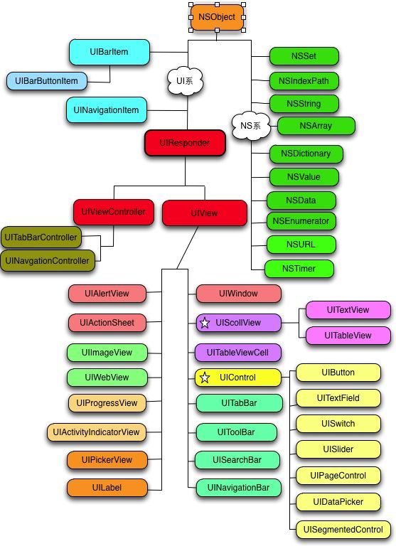
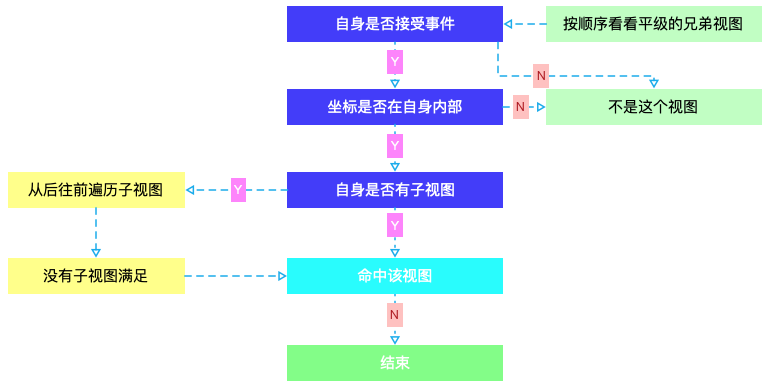
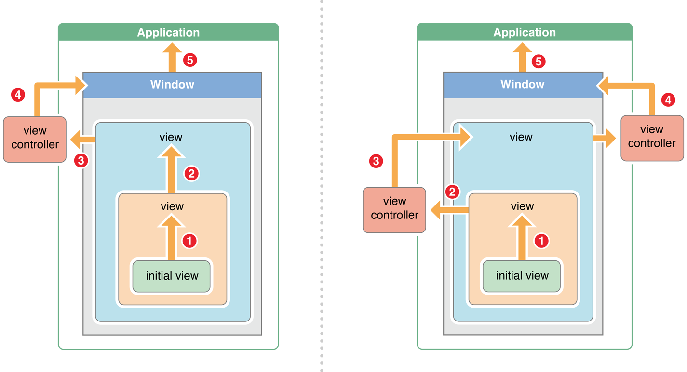
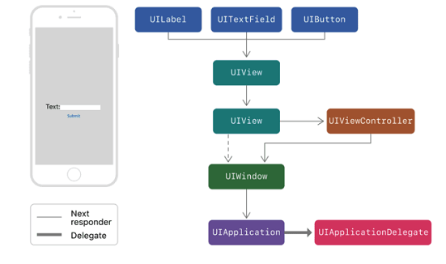

# iOS中事件的传递和响应


> 假设场景是用户点击了屏幕上某个视图

1. 谁可以响应这个事件？
2. 如何找到响应对象？
3. 对象如何响应？
4. 什么是传递链？
5. 什么是响应链？
6. 链是怎形成的？

## UIResponder

> An abstract interface for responding to and handling events.

### Managing the Responder Chain

```
nextResponder
    Returns the next responder in the responder chain, or nil if there is no next responder.

isFirstResponder
    Returns a Boolean value indicating whether this object is the first responder.

canBecomeFirstResponder
    Returns a Boolean value indicating whether this object can become the first responder.

- becomeFirstResponder
    Asks UIKit to make this object the first responder in its window.

canResignFirstResponder
    Returns a Boolean value indicating whether the receiver is willing to relinquish first-responder status.

- resignFirstResponder
    Notifies this object that it has been asked to relinquish its status as first responder in its window.

```

### Responding to Touch Events

```

- touchesBegan:withEvent:
    Tells this object that one or more new touches occurred in a view or window.

- touchesMoved:withEvent:
    Tells the responder when one or more touches associated with an event changed.

- touchesEnded:withEvent:
    Tells the responder when one or more fingers are raised from a view or window.

- touchesCancelled:withEvent:
    Tells the responder when a system event (such as a system alert) cancels a touch sequence.

- touchesEstimatedPropertiesUpdated:
    Tells the responder that updated values were received for previously estimated properties or that an update is no longer expected.

```


`UIResponder` 决定了对象具有响应处理的能力，而用户看到的视图是 `UIView` , `UIView`提供了可视载体和点击坐标关联的能力

*这里也就回答了问题1*



## 查找响应者

点击屏幕会产生一个触摸事件，系统监测到触摸事件后，会把事件包装成一个 `UIEvent`，传递到我们当前的 `UIApplication` 任务队列当中，然后 `UIApplication` 把事件传递给 `KeyWindow`， `KeyWindow` 会使用

```
// Returns the farthest descendant of the receiver in the view hierarchy (including itself) that contains a specified point.
// 返回包含指定点的视图层次结构中接收者的最远后代（包括自身）
- hitTest: withEvent:

// Returns a Boolean value indicating whether the receiver contains the specified point.
- pointInside: withEvent:

```

从方法调用我们已经可以看出，点击被包装成一个点击事件 `UIEvent` ，`UIEvent` 不断流转的过程即事件传递过程如下：

`-hitTest:withEvent:` 方法通过调用每个子视图的 `-hitTest:withEvent:` 方法来确定哪个子视图应接收触摸事件，从而遍历视图层次结构。如果 `-pointInside: withEvent:` 返回 `YES`，然后类似地遍历子视图的层次结构，直到找到包含指定点的最前面的视图。

这个过程可以总结为：查找点击坐标落点位置在其可视区域内且具备处理事件能力的对象--响应者。


> This method traverses the view hierarchy by calling the pointInside:withEvent: method of each subview to determine which subview should receive a touch event. If pointInside:withEvent: returns YES, then the subview’s hierarchy is similarly traversed until the frontmost view containing the specified point is found. If a view does not contain the point, its branch of the view hierarchy is ignored. You rarely need to call this method yourself, but you might override it to hide touch events from subviews.
> This method ignores view objects that are hidden, that have disabled user interactions, or have an alpha level less than 0.01. This method does not take the view’s content into account when determining a hit. Thus, a view can still be returned even if the specified point is in a transparent portion of that view’s content.
> Points that lie outside the receiver’s bounds are never reported as hits, even if they actually lie within one of the receiver’s subviews. This can occur if the current view’s clipsToBounds property is set to NO and the affected subview extends beyond the view’s bounds.


根据，上述描述的代码实现：

```objc

- (UIView *)hitTest:(CGPoint)point withEvent:(UIEvent *)event {
 
    if (!self.userInteractionEnabled || [self isHidden] || self.alpha <= 0.1) {
        return nil;
    }
    if ([self pointInside: point withEvent: event]) {
        __block UIView *hit = nil;
        [self.subviews enumerateObjectsWithOptions: NSEnumerationReverse usingBlock:^(__kindof UIView * _Nonnull obj, NSUInteger idx, BOOL * _Nonnull stop) {
            CGPoint currentPoint = [self convertPoint: point toView: obj];
            hit = [obj hitTest: currentPoint withEvent: event];
            if (hit) {
                *stop = YES;
            }
        }];
        
        if (hit) {
            return hit;
        } else {
            return self;
        }
    } else {
        return nil;
    }
}

```

上述回答了 *如何找到响应对象？*
> 想让谁成为最合适的view就重写谁自己的父控件的hitTest:withEvent:方法返回指定的子控件，或者重写自己的hitTest:withEvent:方法 return self。但是，建议在父控件的hitTest:withEvent:中返回子控件作为最合适的view！
>
> 


## 响应链 和 传递链

[Managing the Responder Chain](#mtrc)

> The UIResponder class does not store or set the next responder automatically, so this method returns nil by default. Subclasses must override this method and return an appropriate next responder. For example, UIView implements this method and returns the UIViewController object that manages it (if it has one) or its superview (if it doesn’t). UIViewController similarly implements the method and returns its view’s superview. UIWindow returns the application object. The shared UIApplication object normally returns nil, but it returns its app delegate if that object is a subclass of UIResponder and has not already been called to handle the event.





上图流程：

1. 当 `initial view` 调用其 `nextResponder` 会返回其 `superView`;

2. 如果当前的 `view` 为`UIViewController`的 `view` 被添加到其他 `view` 上，那么调用 `nextResponder` 会返回当前的`UIViewController`，而这个`UIViewController`的`nextResponder`为`view`的`superView`；*如右图*

3. 如果当前的`UIViewController`的`view`没有添加到任何其他`view`上，当前的`UIViewController`的`nextResponder`为`nil`；*如左图*

4. 如果当前`application`的`keyWindow`的`rootViewController`为`UINavigationController`(或`UITabViewController`)，那么通过调用`UINavigationController`(或`UITabViewController`)的`nextResponder`得到`keyWinodw`；

5. `keyWinodw`的`nextResponder`为`UIApplication`，`UIApplication`的`nextResponder`为`AppDelegate`，`AppDelegate`的`nextResponder`为`nil`。

“链”这个概念简单描述为如下的结构：

```
// a 指向 b ...
a -> b -> c -> ... -> n
```
所以，上图的**响应链**：
```

左图： initial view -> view -> view的Controller -> window  -> application

右图： initial view -> view -> view的controller -> view -> viewController  -> window  -> application 

```

**传递链** 正好是一个反方向的：


```

左图： initial view <- view <- view的Controller <- window  <- application

右图： initial view <- view <- view的controller <- view <- viewController  <- window  <- application 

```

流程描述：

1. 我们点击屏幕产生触摸事件，系统将这个事件加入到一个由`UIApplication`管理的事件队列中，`UIApplication`会从消息队列里取事件分发下去，首先传给`UIWindow`
2. 在`UIWindow`中就会调用`hitTest:withEvent:`方法去返回一个最终响应的视图
3. 在`hitTest:withEvent:`方法中就会去调用`pointInside: withEvent:`去判断当前点击的`point`是否在`UIWindow`范围内，如果是的话，就会去遍历它的子视图来查找最终响应的子视图
4. 遍历的方式是使用**倒序**的方式来遍历子视图，也就是说最后添加的子视图会最先遍历（ps.降低循环次数，提高效率），在每一个视图中都回去调用它的`hitTest:withEvent:`方法，可以理解为是一个递归调用
5. 最终会返回一个响应视图，如果返回视图有值，那么这个视图就作为最终响应视图，结束整个事件传递；如果没有值，那么就会将`UIWindow`作为响应者

我们看到，所谓的链 是 `UIResponder` 属性 nextResponder 串联起来抽象出来的概念。


## 事件处理（响应）
[Responding to Touch Events](#rtte)

响应者继承响应方法，就只做了一件事，就是将事件沿着响应链向上传递`[self.nextResponder touchesBegan:touches withEvent:event]`，所以当一个`view`或者`controller`里面没有重写`touch`事件，那么这个事件就会一直传递下去，直到`UIApplication`，如果UIApplication无法处理，就会传递给`UIApplicationDelegate`。如果`UIApplicationDelegate`不能处理，则会丢弃该事件。这也就是事件往上**冒泡**的原理。

如果`view`重写了`touch`方法，我们一般会看到的效果是，这个`view`响应了事件之后，事件就被**截断**了，它的`nextResponder`不会收到这个事件，这个时候如果想事件继续传递下去，可以调用`[super touchesBegan:touches withEvent:event]`

**不建议直接调`[self.nextResponder touchesBegan:touches withEvent:event]`。**



如果一个 view 既实现了 touchesBegan 方法，也调用了 [super touchesxxx]，就会出现，一个事件被多个view 处理。


### 总结

1. 通过 hit test 找到 第一响应者
2. 第一响应者来确定响应链
3. 事件沿着响应链传递
4. 事件被某个响应者接收从而被丢弃


## 参考资料
- [Using Responders and the Responder Chain to Handle Events](https://developer.apple.com/documentation/uikit/touches_presses_and_gestures/using_responders_and_the_responder_chain_to_handle_events?language=objc)
- [Touches, Presses, and Gestures](https://developer.apple.com/documentation/uikit/touches_presses_and_gestures?language=objc)
- [nextResponder](https://developer.apple.com/documentation/uikit/uiresponder/1621099-nextresponder?language=objc)
- [深入浅出iOS事件机制](https://zhoon.github.io/ios/2015/04/12/ios-event.html)