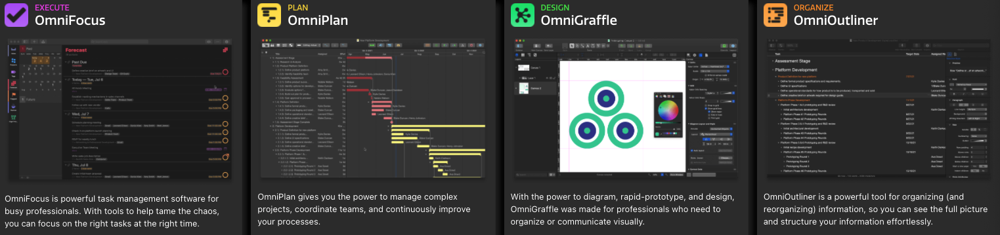

# Mac 配置开发环境

macOS 系统默认自带ruby、python2、bash等环境，并且因为 macOS 是以 Unix 为基础，所以有传统 Unix/Linux 的特性。在我印象里开发者除了一些基本的开发工具，大家的**开发习惯**、**工具链**没几个是一模一样的，几乎是各有自己的一套**打法**。

但是，当你拿到一台新电脑，如何快速的开始开发工作。换句话说，如何快速的把你习惯的一套打法迁移到新的电脑其实是一个技术活！倒不是觉得一个小时搞定和一天搞定一定要分个对错高下。只是觉得尽快的把一个陌生的“武器”，变成自己趁手的“兵器”很有**成就感**。

对于很多开发者来说，把自己现在熟悉的开发常用配置迁移到新电脑会是首选吧！

## 如何将内容移至新 Mac

苹果有提供“迁移助理”将您的所有文稿、App、用户帐户和设置从一台电脑拷贝到另一台新 Mac 上。

### 迁移助理

怎样传输信息：

- 从 Mac、时间机器备份或者启动磁盘
- 从 Windows PC
- 至另一台电脑

具体可参考 [如何将内容移至新 Mac](https://support.apple.com/zh-cn/HT204350)

这里，有一点需要注意，你从时间机器备份恢复电脑的时候，一定要注意：
> 两台电脑的硬件配置是否一致，比如：你的备份是有 touchbar 的电脑备份，如果你要恢复到一台没有 touchbar 的电脑上，很可能就会恢复失败，必须重置系统！！！别问我怎知道的。。。呜呜呜
> 使用目标磁盘模式在电脑之间移动文件，是需要专门的连接线和转接头的，别瞎整些乱七八糟的线。最好用官方的！！！


### 手动安装和配置

除了一些**极客**，一般免不了要手动搞一搞。ps.  我理解的极客是：**拿到新电脑连上网，执行以下脚本就可以搞定！**

其实自己搞个脚本搞一搞是没问题的，放出来大家用责任太大！所以，**以下工具的具体使用不展开**，安装参考**官方文档！！！**

- Homebrew，包管理

- 使用 defaults 对系统选项的一些基本修改，比如启用三只拖动

  - ```shell
    defaults write com.apple.driver.AppleBluetoothMultitouch.trackpad TrackpadThreeFingerDrag -bool true
    defaults write com.apple.AppleMultitouchTrackpad TrackpadThreeFingerDrag -bool true
    ```

    

- 基于 zsh 的 oh my zsh

  - 常用插件 `plugins=(git osx autojump zsh-autosuggestions zsh-syntax-highlighting)`

    

- 常用软件的安装（顺序无关优先级）

  - Xcode
  - [iTerm2](https://iterm2.com/documentation.html)，terminal 的替代
  - [Hammerspoon](http://www.hammerspoon.org/)，如果会 Lua 如虎添翼
  - [Karabiner-Elements](https://karabiner-elements.pqrs.org/)，键位绑定
  - OmniPlan
  - QQ
  - Wechat
  - Source Tree
  - SwitchHosts
  - typora，不错的Markdown编辑器
  - [vscode](https://code.visualstudio.com/docs/languages/javascript#_automatic-type-acquisition)，从 sublime text 转过来用vscode
  - wps
  - Charles
  - ogex
  - [Dash](https://kapeli.com/dash)
  - [Shadowsocks](https://github.com/shadowsocks)
  - Chrome
  - Alfred，业界一致追捧的神兵利器
  - Cocoapods
  - [XMind](https://www.xmind.net/)
  
  


## 总结

就我个人而言，使用了诸如：Hammerspoon、Karabiner-Elements、Dash、Alfred 就再也回不去了。。。使用其他童鞋的电脑明显感觉不舒服，效率低！

目前感觉自己对开发环境的配置远远达不到极客水平，争取写一个安全有效的执行脚本。不过话说回来，谁会天天搞环境呢？哈哈哈


### <font color=blue>软件推荐</font>

- [Kap](https://getkap.co/) , An open-source screen recorder built with web technology. 录屏

- [omni Group](https://www.omnigroup.com/) Omni 全家桶

  

- [Keyboard Maestro](https://www.keyboardmaestro.com/main/) 工作流自动化联想到 [Alfred](https://www.alfredapp.com/) 的 workflow
- [SwitchResX](https://www.madrau.com/)  vs [EasyRes](http://easyresapp.com/) screen resolution switcher for Mac OS X with live animated previews.
- [Tunnelblick](https://tunnelblick.net/downloads.html) **Tunnelblick** helps you control [OpenVPN®](https://openvpn.net/community) VPNs on macOS.  
- [蓝灯](https://getlantern.org/zh_CN/index.html) vpn 工具
- [Cyberduck](https://cyberduck.io/download/) is a libre server and cloud storage browser for Mac and Windows with support for **FTP**, **SFTP**, **WebDAV**, **Amazon S3**, **OpenStack Swift**, **Backblaze B2**, **Microsoft Azure & OneDrive**, **Google Drive** and **Dropbox**.
- [Mos](https://mos.caldis.me/) 鼠标
- [Hopper](https://www.hopperapp.com/) 反汇编器
- [Cydia Impactor](http://www.cydiaimpactor.com/) **Cydia**是一个让用户在[越狱](https://zh.wikipedia.org/wiki/IOS越獄)的[iOS](https://zh.wikipedia.org/wiki/IOS)设备上查找和安装各类[软件包](https://zh.wikipedia.org/wiki/软件包)，包括软件、系统修改、主题和铃声等的软件管理器。
- [AirServer](https://www.airserver.com/) 屏幕镜像软件（手机屏幕投到电脑屏幕上）


##### <font color=blue>在线工具</font>

- [No-Cruft Excel to HTML Table Converter](http://pressbin.com/tools/excel_to_html_table/index.html)
- [正则表达式在线验证](https://tool.lu/regex/) from [在线工具](https://tool.lu/)
- [JSON 格式校验](https://www.bejson.com/)
- [JSON Web Tokens](https://jwt.io/) <font color=red>暂未使用过</font>
- [md5 破解](https://www.cmd5.com/)
- [在线图片base64编码](http://ouapi.com/tool/imgtob)
- [正则表达式在线验证](https://regexr.com/)
- [正则表达式](https://tool.oschina.net/uploads/apidocs/jquery/regexp.html)
- [fax Zero](https://faxzero.com/) 免费发传真
- [webp](https://isparta.github.io/compare-webp/index.html#12345) 图片
- [tinypng](https://tinypng.com/) 压缩图片
- [What is My IP](https://githubusercontent.com.ipaddress.com/raw.githubusercontent.com)
- [makeIcon](http://www.makeicon.cc/) 制作 icon 图
- [A Simple Online Logo Generator](https://www.logoly.pro/#/)
- [Brackets](https://brackets.io/) 代码开源的编辑器
- [在线编辑器 HTML CSS JS](https://jsbin.com/?html,output) vs [codepen](https://codepen.io/)
- [Responsinator](http://www.responsinator.com/) 响应式网站测试，其实使用 [Chrome DevTools](https://developer.chrome.com/docs/devtools/#resource-network-timing) 就可以了
- [gliffy](https://www.gliffy.com/) 流程图
- [PDF 在线转换](http://wordtopdf.55.la/)
- [PDF2GO](https://www.pdf2go.com/zh)
- [caniuse](https://caniuse.com/) 浏览器新特新支持检查
- [Alloy Designer](http://alloyteam.github.io/AlloyDesigner/) 一款前端UI插件 vs [马克鳗](http://www.getmarkman.com/)
- [emoji](https://emojipedia.org/fire/) 表情包
- [Fir](https://www.betaqr.com/) 应用内测托管等
- [Website IPv6 accessibility validator](http://ipv6-test.com/validate.php?) ipv6 可访问查询
- [身份证生成](http://sfz.uzuzuz.com/?region=420100&year=2015&month=6&day=2&sex=2)
- [sublime 快捷键](http://sublime.emptystack.net/)
- [Diff files online](https://www.mergely.com/) 文件差异在线对比
- [jsLint](https://www.jslint.com/) js 代码检查，当然很多IDE 都有插件啦
- [饼状图](http://www.lizibuluo.com/bing/)
- [柱状图](http://charts.udpwork.com/)
- [Karabiner-Elements complex_modifications rules](https://ke-complex-modifications.pqrs.org/)
- [API 文档集](https://tool.oschina.net/apidocs/#J)

