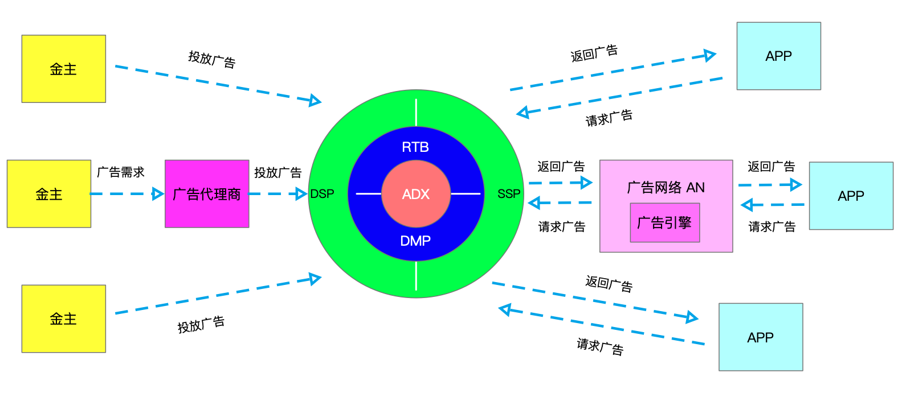

## A/B 测试

16年的时候写过一篇 [作为移动应用开发者应该了解APP测试](./2016-8-7-作为移动应用开发者应该了解APP测试.md)

今天要说的 A/B 测试，相同时间周期，相同受众人群数据比较。一目了然，对于产品决策有很大的帮助。

### 为什么要 A/B 测试？

| 维度         | 描述                                                     |
| ------------ | -------------------------------------------------------- |
| 个人思维局限 | 功能设计者或者团队思维的局限性或者说全量用户的不可调研性 |
| 投入产出考量 | 用户自己选择，通过实际数据反馈来选出利益最大化的功能方案 |
| 尝试         | 产品的 idea 上线                                         |
| 创新         | 更多的创意得到肯定                                       |

#### A/B 实验分类

| 分类       | 适合的端       | 描述                                                         |
| ---------- | -------------- | ------------------------------------------------------------ |
| 应用功能类 | 客户端         | 跟随客户端发版；App 通过获取到的 AB Code 进行实验控制，并统计上报 |
| 策略类     | 服务端         | 服务端进行实验版本的控制，数据来源以统计SDk为主，服务端上报为辅 |
| 异步类     | 推送、马甲实验 | 偏向实验触发本身与客户端没有关系的实验类型。游客户端自主决定实验的效果分发。 |

#### 早期 A/B 测试的特点

| 流量维度 | 描述                                                         |
| -------- | ------------------------------------------------------------ |
| 流量互斥 | 所有的实验在分配流量的时候都是隔离的互不干扰                 |
| 流量有限 | 所有实验公用100%的流量用户                                   |
| 流量饥渴 | 随着实验数量的上升，流量明显不够用，假设实验 A 在进行中占用 80%流量，实验B 最多只有20% |

#### 早期 A/B 测试的常用实验

1. 将用户分成两半，一半做对照组，一半做实验组

   缺点：一次只能做一个实验，假如想要同时做两个实验，将无法满足

2. 将用户分桶，例如通过用户ID取模分成n个桶，一些桶做基线，一些桶做实验

   缺点：如果桶分的太少，同一时间可以做的实验还是受到限制。如果桶分的太多，每个实验桶的流量将会变少，置信度将会降低，需要更长的实验时间。

假如我们的实验涉及到多个系统服务，这些系统服务之间是有关联的。以RTB广告为例：我们知道，当 *广告网络系统*（AN） 接受到媒体（App）发出的广告请求的时候，首先会去 *ADX系统* 的 *DMP* 里面取出候选广告返回给 AN，然后AN通过 *广告引擎* 排序，假如DMP系统和广告引擎系统同时在做AB实验，怎么消除这两个系统的相互影响？

### A/B 测试分层、分流

#### 1 A/B 测试定义

> 在分析中，A / B测试（桶测试或分流测试）是一个随机实验，通常有两个变体，A和B。利用控制变量法保持有单一变量的前提下，将A、B数据进行对比，得出实验结论。

鉴于上述早期的 AB 测试特点，通常会利用分层和分流的机制保证流量高可用。

#### 2 正交与互斥

##### 1 正交

> **正交**是[线性代数](https://zh.wikipedia.org/wiki/线性代数)的概念，是[垂直](https://zh.wikipedia.org/wiki/垂直)这一直观概念的推广。作为一个形容词，只有在一个确定的[内积空间](https://zh.wikipedia.org/wiki/内积空间)中才有意义。若内积空间中两[向量](https://zh.wikipedia.org/wiki/向量)的[内积](https://zh.wikipedia.org/wiki/內積)为0，则称它们是**正交**的。如果能够定义向量间的夹角，则正交可以直观的理解为垂直。物理中：运动的独立性，也可以用正交来解释。

我们怎么排除这些实验之间相互干扰？答案就是使用**正交**实验：甲实验A功能 30%流量；C功能 70% 流量，乙实验 B功能 50%流量；D功能 50% 流量

**正交实验：每个独立实验为一层，层与层之间流量是正交的，一份流量穿越每层实验时，都会再次随机打散，且随机效果离散。**

那么我们怎么将实验甲的用户均匀地分布到实验乙呢？答案就是在hash的时候加一个前缀。例如通过使用函数 **hash(实验ID+用户ID)%1000**，将（实验甲的ID+用户ID）取模1000后小于200的用户做A功能，大于等于200的做C功能，同时，将（实验乙的ID+用户ID）取模1000后小于500的用户做B功能，大于等于500的用户做D功能。这就是正交实验。

##### 2 互斥

举例：A B C D 四份实验样本，甲实验使用 A B、乙实验使用 CD，甲乙互斥。

**互斥实验：实验在同一层拆分流量，且不论如何拆分，不同组的流量是不重叠的。**

#### 3 分层、流规则

> 基于Goolge论文：
>
> 《Overlapping Experiment Infrastructure:More, Better, Faster Experimentation》
>
> Diane Tang, Ashish Agarwal, Deirdre O’Brien, Mike Meyer Google, Inc. Mountain View, CA [diane,agarwal,deirdre,mmm]@google.com

在正交实验的基础上，通过对流量的切割，以及分层重叠嵌套，便可设计出更为灵活的AB实验框架。

> 首先介绍3个概念
>
> 1. domain：全部流量被切割之后的一段流量
>
> 2. layer：在layer里面包含一系列可以改变的参数。例如上面的实验可以分成2个layer，layer1 对应实验甲，layer2 对应实验乙。
>
> 3. experiment：在layer里面可以添加桶，例如通过 **hash(layerId + userId)%1000** , 然后把实验放入桶中。
>
> 1个domain可以有多个重叠的layer，1个layer反过来也可以嵌套多个domain，实验最终落入到 layer里面的 bucket 里面。

> 在(a)中，只有1个domain，domain里面嵌套了3个layer。当用户请求过来的时候，会依次经过UI Layer，Search results layer和Ads result layer，在各个layer里面通过 **hash(layerId + userId)%1000** 映射到对应的桶取出相应的experiment。因此1个用户请求最多会同时进行3个实验
>
> 在(b)中，流量被切割成2个domain，1个domain只有1个layer，另一个domain有3个layer。当用户请求被分配到domain1的时候，最多将会进行1个实验，当用户请求被分配到domain2的时候，用户最多将会进行3个实验。
>
> (c)和(d) 是更加复杂的AB实验框架，如上图所示。

### 参考文献

- [正交概念](https://zhuanlan.zhihu.com/p/26160631)

- [一文搞懂AB Testing的分层分流](http://www.woshipm.com/pd/1080730.html)
- [Overlapping Experiment Infrastructure: More, Better, Faster Experimentation](https://static.googleusercontent.com/media/research.google.com/zh-CN//pubs/archive/36500.pdf)

