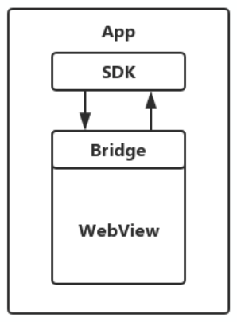

## 跨端跨框架跨...你还在关注吗？

或许与我大学时候就做过网站有关系，我一直有关注前端的技术。跨端跨框架技术是移动开发里浓墨重彩的一笔。

我们比较容易理解“懒”，其实**在不同端上复用逻辑**不失为一种懒：）

### 经历

从 2015 年开始，我先后接触了：

 **Cordova** 这样依托于 **WebView** 的 `hybrid` 技术框架；

基于 **jscore** 的 **weex** **ReactNative** ；

如火如荼的 **flutter**。

我在业务中或多或少，或轻或重的使用过以上三种技术方案。有一个大致的结论：

| 维度     | Native | Flutter          | ReactNative/Weex | Hybrid |
| -------- | ------ | ---------------- | ---------------- | ------ |
| 渲染方式 | 原生   | 基于`OpenGL`实现 | `V-DOM` + 原生   | `DOM`  |
| UI 性能  | 好     | 好               | 较好             | 一般   |
| 热更新   | 无     | 有               | 有               | 有     |
| 包体积   | —      | 增加             | 增加             | 增加   |
| 侵入性   | —      | 强               | 强               | 弱     |
| 稳定性   | —      | 一般             | 一般             | 较好   |
| 社区     | 丰富   | 少               | 较好             | 好     |

### Hybrid 还挺香

目前，`hybrid` 技术方案仍然被不少团队使用，或许得益于技术方案本身能带来不错的开发收益。

- Native 部分：
  - `URL` 拦截与解析、`ua` 注入、功能映射等
  - `Native SDK` 直接注入 `jsBridge.js`
- JS 部分：
  - 注入 js 环境
  - `jsBridge `
  - 协议拼装、发送、参数、回调等等
- H5 部分：
  - 遵循约定好的协议，进行调用
  - 获取 Native 提供的能力

交互逻辑

### Flutter 上不上？

在2019年底，我们团队使用 Flutter 开发了一个新的 App，当时报着拥抱技术、追逐技术革新的态度，感受到了一些喜悦。但是，时间到现在，Flutter 技术还是没有很好地铺开。我了解到的闲鱼团队在大力推广和使用 Flutter ，而更多团队观望或者不用在自己的核心业务上大概有如下几个原因吧：

- 第三方库和技术社区，较少
- UI 层可以实现 Android/iOS 双端一直，但是原生功能需要客户端支持。
- 开发的人力资源不减反增（一个 Android 开发+一个iOS开发+flutter开发，当然也可以一人兼备）
- 自家的核心业务非常稳定，技术支持也完全OK的情况下，没必要承担使用Flutter带来的额外风险（技术支持包括自家的脚手架、打包体系等等）

综上，如果你可以hold住上述的几点，那么别犹豫，上！

之前写的几篇笔记：

| 文章列表                                                     |
| ------------------------------------------------------------ |
| [伪WEEX实践篇](./2017-6-11-伪WEEX实践篇.md)                  |
| [解决移动端WEEX页面下输入框被键盘遮挡的问题](./2018-10-24-解决移动端WEEX页面下输入框被键盘遮挡的问题.md) |
| [React-Native-iOS视角](./2016-12-3-React-Native-iOS视角.md)  |
| [WEEX-iOS视角](./2016-12-24-WEEX-iOS视角.md)                 |
| [Cordova Js 阅读指南](./2020-4-15-CordovaJs.md)              |
| [Cordova升级之旅](./2020-5-12-Cordova升级之旅.md)            |
| [iOS中OC与js的交互篇](./2017-7-27-iOS中OC与js的交互篇.md)    |

