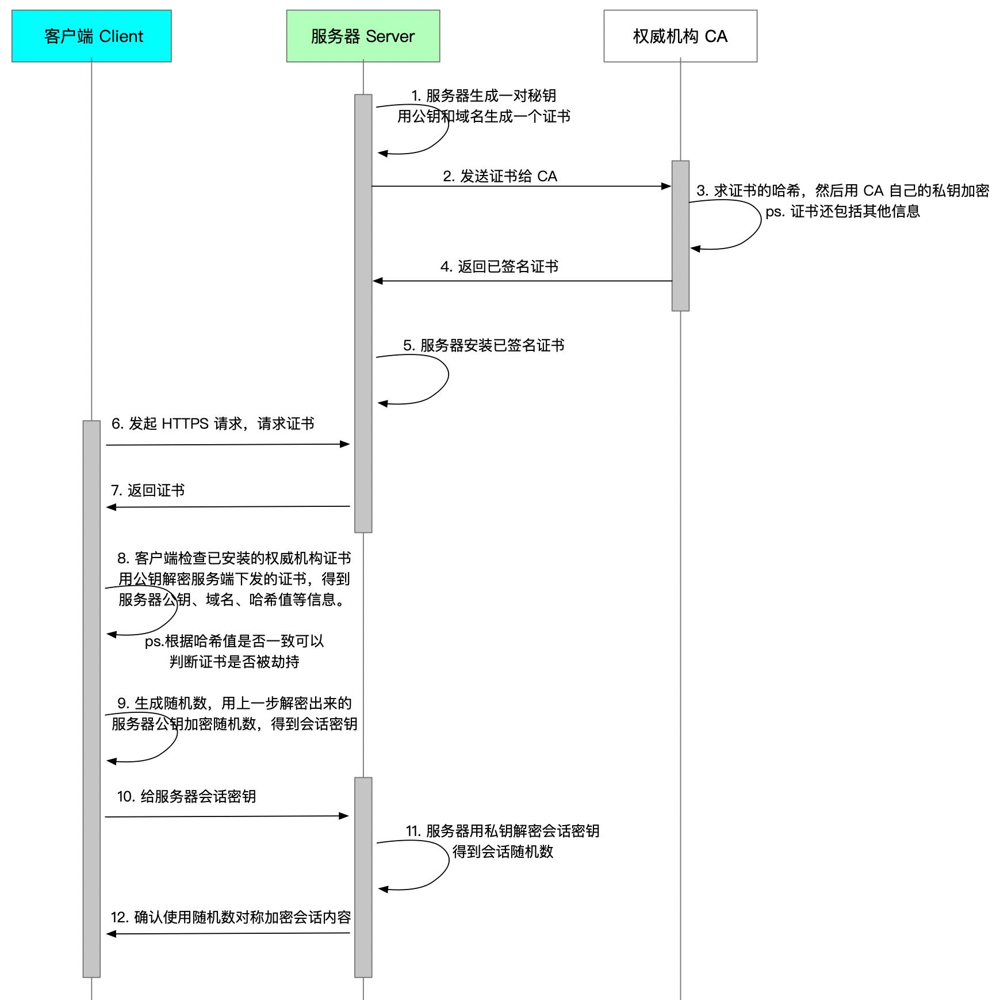
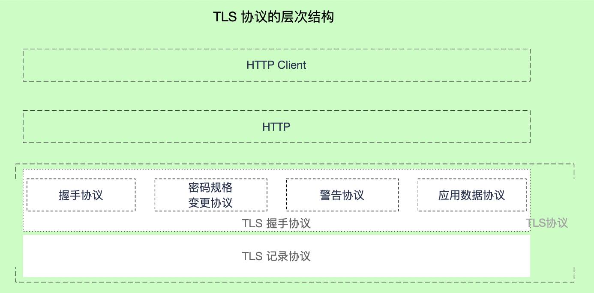
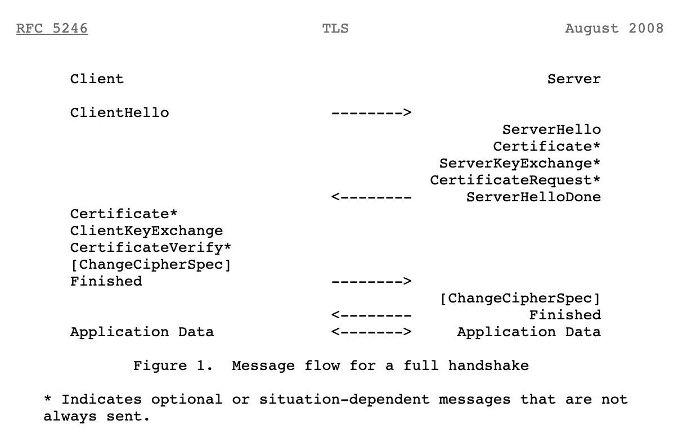
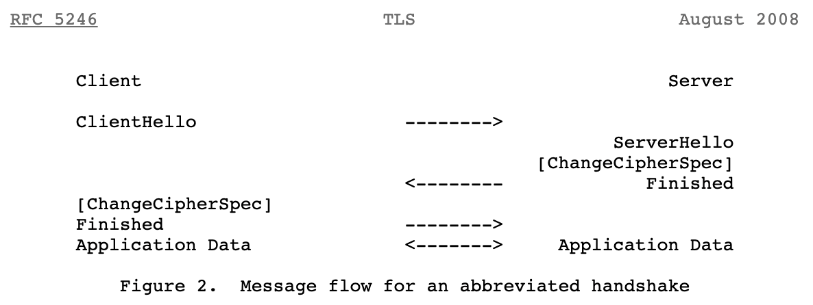
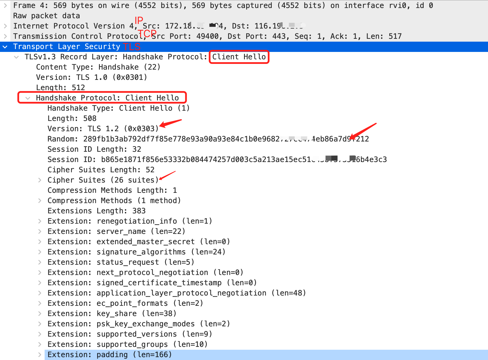
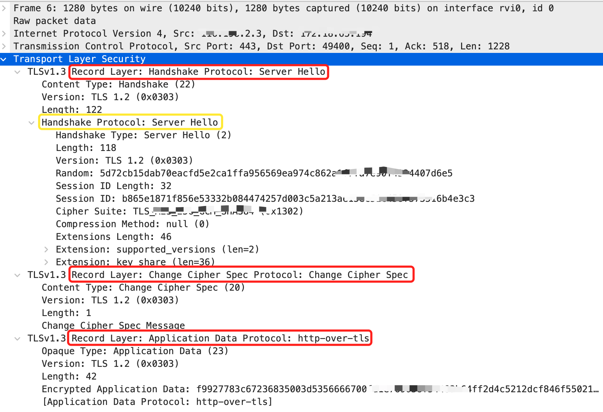
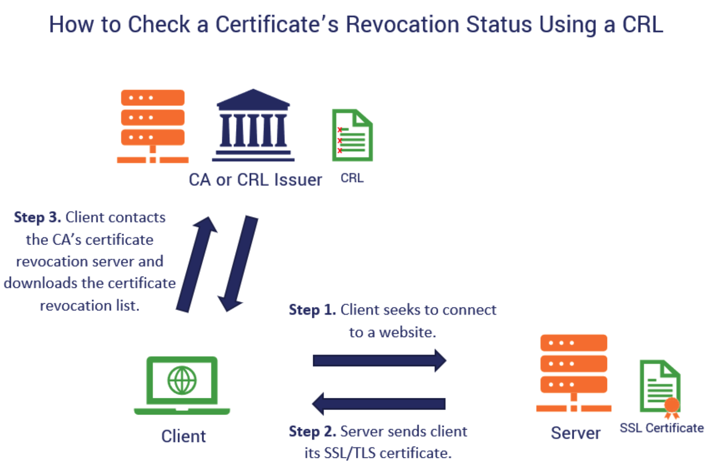
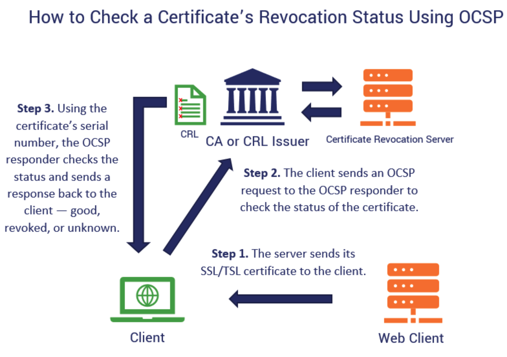

## HTTPS

> **超文本传输安全协议**（英语：*HyperText Transfer Protocol Secure*，缩写：HTTPS；常称为 HTTP over TLS、HTTP over SSL 或 HTTP Secure）是一种**通过计算机网络进行安全通信的传输协议**。
>
> HTTPS经由HTTP进行通信，但利用SSL/TLS来加密数据包。HTTPS开发的主要目的，是提供对网站服务器的**身份认证**，保护交换资料的**隐私与完整性**。这个协议由网景公司（Netscape）在1994年首次提出，随后扩展到互联网上。
>
> 历史上，HTTPS连接经常用于万维网上的交易支付和企业信息系统中敏感信息的传输。在2000年代末至2010年代初，HTTPS开始广泛使用，以确保各类型的网页真实，保护账户和保持用户通信，身份和网络浏览的私密性。
>
> 另外，还有一种安全超文本传输协议（S-HTTP）的HTTP安全传输实现，但是HTTPS的广泛应用而成为事实上的HTTP安全传输实现，S-HTTP并没有得到广泛支持。
>
> 随着传输层安全协议（Transport Layer Security，TLS）的发展，目前我们已经使用  TLS 取代了废弃的 SSL（Secure Sockets Layer，SSL）保证数据传输的**安全**。


### 概述

#### HTTS通讯过程大白话概览




#### 知识储备

HTTPS 是对 HTTP 协议的扩展，我们可以使用它在互联网上安全的传输数据，要学习 HTTPS 需要了解：

-  TCP 协议
- **TLS 协议**（本文会重点讲到）
- HTTP 协议
- 加密算法（对称加密和非对称加密）
- 证书与数字签名

阅读本文之前，希望你对上述有所了解。

| HTTP                                   | HTTPS                                                     |
| -------------------------------------- | --------------------------------------------------------- |
| 通信使用明文，内容可能会被窃听         | 机密 ==> 对称加密（AES、DES等）、非对称加密（RSA）        |
| 不验证通信方的身份，因此有可能遭遇伪装 | 完整 ==> 消息认证（单向散列函数等散列函数）               |
| 无法证明报文的完整性，可能已遭篡改     | 认证 ==> 证书（公钥+数字签名）ps. Diffie-Hellman 密钥交换 |

《图解HTTP》一书提到：HTTPS = HTTP + 加密 + 认证 + 完整性保护。 


### TLS 协议

TLS 协议是由 TLS 记录协议（TLS record protocol）和 TLS 握手协议（TLS handshake protocol）这两层协议叠加而成的。位于底层的 TLS 记录协议负责进行加密，位于上次的 TLS 握手协议负责除加密以外的其他各种操作。



#### TLS 记录协议

负责使用对称密码对消息进行加密通信的部分。

- 对称密码
- 消息认证码

具体的 **算法** 和 **共享密钥** 则是通过后面将要介绍的握手协议在服务器和客户端之间协商决定。


#### TLS 握手协议

除了上述说的客户端和服务器之间协商决定密码算法和共享密钥，基于证书的认证操作也是在这个协议中完成。

- 握手协议
- 密码规格变更协议，用于密码切换的同步。
- 警告协议，当发生错误时通知通信对象。
- 应用数据协议，传送应用数据。


#### RFC 5246




> ```c
> Note: To help avoid pipeline stalls, ChangeCipherSpec is an independent TLS protocol content type, and is not actually a TLS handshake message.
> 
> When the client and server decide to resume a previous session or duplicate an existing session (instead of negotiating new security parameters), the message flow is as follows:
> 
> The client sends a ClientHello using the Session ID of the session to be resumed.  The server then checks its session cache for a match. If a match is found, and the server is willing to re-establish the connection under the specified session state, it will send a ServerHello with the same Session ID value.  At this point, both client and server MUST send ChangeCipherSpec messages and proceed directly to Finished messages.  Once the re-establishment is complete, the client and server MAY begin to exchange application layer data.  (See flow chart below.)  If a Session ID match is not found, the server generates a new session ID, and the TLS client and server perform a full handshake.
> ```





#### Wireshark 抓包

图1



- 红字标出了，IP 层、TCP 层 以及 TLS 层

- 红框是TLS的握手协议发出的 Client Hello 消息

- 箭头指出的时几个关键字段：
  - 版本号（向下兼容）
  - 随机数
  - 可用的加密套件（客户端支持的所有的加密套件，在这里包含26个加密套件）


图2




#### 握手各环节分析

```c
1. Hello Messages
   1. Hello Request
   2. Client Hello
   3. Server Hello
   4. Hello Extensions
      1. Signature Algorithms
2. Server Certificate
3. Server Key Exchange Message
4. Certificate Request
5. Server Hello Done
6. Client Certificate
7. Client Key Exchange Message
   1. RSA-Encrypted Premaster Secret Message
   2. Client. Diffie-Hellman Public Value
8. Certificate Verify
9. Finished
```

以客户端（c）向服务端（s）发起请求为例：

1. Client Hello ，c -> s:

   - 可用版本号
   - 当前时间
   - 客户端随机数（需要不可预测）
   - 会话 ID（c 希望与 s 重新使用之前建立的会话时所使用的的信息）
   - 可用的密码套件清单
   - 可用的压缩方式清单

向服务端发送 clienthello 消息

2. Server Hello，s -> c ：
   - 使用的版本号
   - 当前时间
   - 服务器随机数（此随机数与客户端生成的随机数无关）
   - 会话 ID
   - 使用的密码套件
   - 使用的压缩方式

3.  Certificate ，s -> c 发送Certificate 消息
   - 证书清单，是一组证书序列。首先是服务器的证书，然后按顺序发送对服务器证书签名的认证机构的证书
   - 客户端会对服务器发送过来的证书进行验证。当以匿名方式通信时，不发送 Certificate 消息。
4. Server key Exchange message，s 发送 ServerKeyExchange 消息
5. Certificate Request ，s -> c 发送 Certificate Request 消息
   - 用于服务端向客户端请求证书，这是为了对客户端进行认证
     - 服务器能够理解的证书类型清单
     - 服务器能够理解的认证机构名称清单
6. Server Hello Done，s -> c  Server Hello Done 消息。表示 Hello 消息的结束
7. Client Certificate，c -> s 对应 5（成对存在）。服务器对客户端的证书进行验证
8. Client Key Exchange Message，c -> s 以下两种方式选其一
      1. RSA-Encrypted Premaster Secret Message（经过RSA 加密的**预备主密码**）
      2. Client. Diffie-Hellman Public Value（DH公开值）
9. Certificate Verify，c -> s 客户端之后在 5 发送时才会发送 Certificate Verify 消息，证明自己持有客户端证书的私钥
   - 为了自证，客户端会计算 **主密码** 和 握手协议中传送的消息的**散列值**，并加上自己的**数字签名**后发送给服务器
10. Change Cipher Spec （属于密码规格变更协议），c -> s 服务端收到消息后，会和客户端同时切换密码
    - 自此之后，TLS 记录协议就开始使用双方协定的密码通讯
11. Finished，c -> s 这条消息可以验证
    - 握手协议是否正常
    - 密码套件的切换是否正确
12. Change Cipher Spec， s -> c
13. Finished ，s -> c
14. 切换至应用数据协议（用于和通信对象之间传送应用数据）

握手协议完成了：

- 客户端获得了服务器的合法公钥，完成了服务器认证
- 服务器获得了客户端的合法公钥，完成了客户端认证
- 双方生成了**密码通信**中使用的共享密钥
- 双方生成了**消息认证**中使用的共享密钥


### 吊销检查

> 目前写进国际标准的吊销状态检查协议有两种: 
>
> 1. CRL
>
> CRL 由认证中心创建并进行数字签名的已撤销公钥证书的列表。它是一份全量的文件，记录了被此 CRL 限制的证书中所有被吊销证书的序列号。
>
> 
>
> 2. OCSP
>
> OCSP 是  TCP 服务，通过请求证书序列号，服务器告知当前序列号是否在被吊销名单中。是目前的主流！
>
> 
>
> 两者对比：
>
> OCSP 的优点是它比传统的 CRL 检查过程要快，并且还提供有关证书吊销状态的最新信息。但是在某些情况下，CRL 可能更有利（主要是在 OCSP 服务器出现故障时-甚至只是暂时的）。
>
> 缺点：
>
> CRL 列表增加，CA 发布新列表。由于基于 CRL 的验证方法要求对每个连接进行证书吊销状态检查，因此 CRL 颁发者或 CA 可能会发布新列表，而您将错过新吊销的证书。这不利于可伸缩性。
>
> 这两种方法对于客户端来说都是资源密集型的。它们占用了大量资源，并且也增加了延迟。这导致更糟糕的用户体验。毕竟，客户端每次必须在该列表上通过很多证书。
>
> 您的隐私保护渠道存在一些漏洞。使用 OCSP 时，您对网站的安全使用并不像您想象的那样安全。为什么？因为浏览器告诉 CA 服务器谁正在访问哪些网站。因此，如果您不希望任何人（包括 CA）知道您对可收藏的小雕像或猫视频的喜爱，那么用户请当心。
>
> CRL 和 OCSP 依赖于 CA 的基础结构。如果您使用的 CA 不可靠，并且服务器停机时间或可用性问题很多，那么依赖这两种做法就会更加麻烦。
>
> 但是，主要的危险信号是浏览器的 CRL 检查软故障策略。我的意思是，当客户端检查 CRL 列表，或者他们向 OCSP 响应者发送消息并获得“未知”响应时，某些浏览器可能会认为证书有效并且允许连接，而不考虑潜在的危险。
>
> ps. 
>
> 1. 有的证书内置了 CRL + OCSP，有的只是内置了 OCSP 或者 CRL，但是只内置 CRL 的证书是不被新型浏览器信任了。
>2. 吊销状态检查是同步的、不可逆的。

### 参考

- [The Transport Layer Security (TLS) Protocol Version 1.2](https://tools.ietf.org/html/rfc5246) chapter 7.3-7.4
- [超文本传输安全协议](https://zh.wikipedia.org/wiki/%E8%B6%85%E6%96%87%E6%9C%AC%E4%BC%A0%E8%BE%93%E5%AE%89%E5%85%A8%E5%8D%8F%E8%AE%AE)
- [什么是证书吊销列表？](https://www.asiaregister.com/zh/news/CRL-jie-shi-shen-me-shi-zheng-shu-diao-xiao-lie-biao-2228.htm)
- **《图解 HTTP》**  上野宣 【著】于均良【译】
- **《图解密码技术 第三版》** 结城浩【著】周自恒【译】
