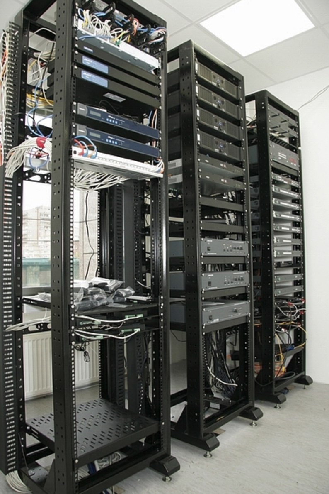
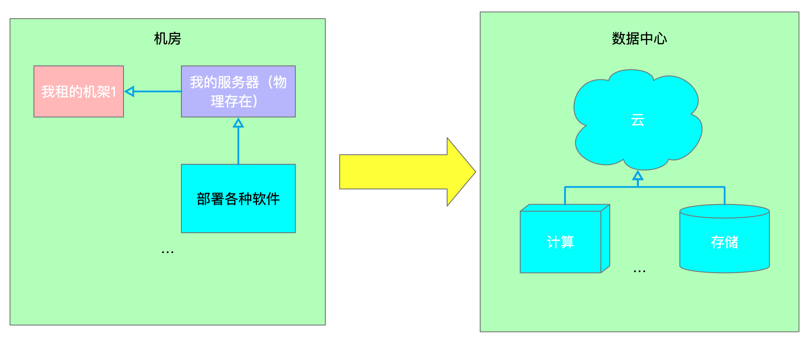
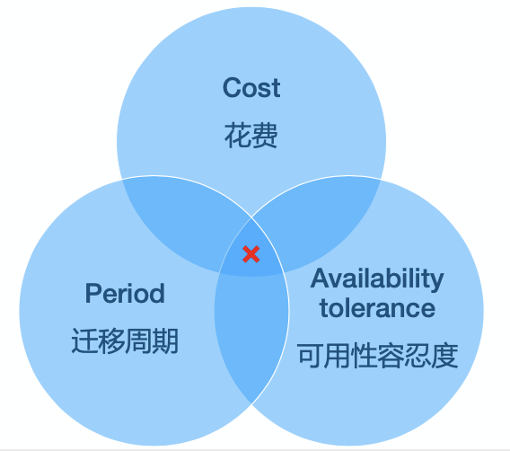

## 我听了一场 “上云“ 技术分享的整理

### 背景

就在上周，听了关于**后端架构服务的技术分享会**。作为一个移动开发的 iOS 小菜鸡，仰慕之情如滔滔江水绵绵不绝，汇成一句：好家伙！

云，这个概念其实也不是什么新鲜概念了，比较直观的可以看到各大一线互联网公司都有了自己的公有云产品：阿里云、腾讯云、华为云、百度云、美团云。。。

对于一个开发人员，怎么样理解 **云** 呢？一下是仅仅是我作为一个互联网从业者的理解，错误的地方，还请指正，轻喷。（满满的求生欲！！！）

故事的开始，我想先问一下在读的小伙伴：**你去过机房吗？** 这里的机房可不是你上课的时候的微机教室哈。。。

> 参考：
>
> [数据中心](https://zh.wikipedia.org/wiki/%E6%95%B0%E6%8D%AE%E4%B8%AD%E5%BF%83)
>
> [服务器机房](https://zh.wikipedia.org/wiki/%E6%9C%8D%E5%8A%A1%E5%99%A8%E6%9C%BA%E6%88%BF)

如图1，规模规格比较高大上，现在有了更响亮的名字： **数据中心**。

图2，是几个机架。

我去过两次，里边的第一感受是冻得慌 zzz

那时候我们公司还没有“上云”，我们只是租了联通机房的几个机架，利用联通机房提供的基础设施（电、空调、宽带等等）在机架上摆了几台我们从浪潮买的服务器，你可别小看这几台服务器，我们公司的运维工程师把他当宝贝呢！！！

现在我回想起那段记忆已经模糊了，运维工程师估计还记得很清楚，但是估计现在他也很少去机房了吧。。。

没错，“云” 来了！

随着互联网的迅猛发展，“云”因运而生！现在我们只需要将应用部署到云端就可以了，不必再关注那些令人头疼的硬件和软件问题，而公司或团队只需要为**由云服务提供商的专业团队的服务**买单！比如：购买计算能力8核 16核。。。购买存储1G 10G 100G。。。

物理上一个明显的转变：

> [云计算](https://zh.wikipedia.org/wiki/%E9%9B%B2%E7%AB%AF%E9%81%8B%E7%AE%97)
>
> 云计算依赖资源的共享以达成[规模经济](https://zh.wikipedia.org/wiki/規模經濟)，类似[基础设施](https://zh.wikipedia.org/wiki/基礎設施)（如电力网）。服务提供者集成大量的资源供多个用户使用，用户可以轻易的请求（租借）更多资源，并随时调整使用量，将不需要的资源释放回整个架构，因此用户不需要因为短暂尖峰的需求就购买大量的资源，仅需提升租借量，需求降低时便退租。服务提供者得以将目前无人租用的资源重新租给其他用户，甚至依照整体的需求量调整租金。
>
> 基本特征[[编辑](https://zh.wikipedia.org/w/index.php?title=雲端運算&action=edit&section=2)]
>
> [互联网](https://zh.wikipedia.org/wiki/互联网)上汇聚的计算资源、存储资源、数据资源和应用资源正随着互联网规模的扩大而不断增加，互联网正在从传统意义的通信平台转化为泛在、智能的计算平台。与计算机系统这样的传统计算平台比较，互联网上还没有形成类似计算机[操作系统](https://zh.wikipedia.org/wiki/操作系统)的服务环境，以支持互联网资源的有效管理和综合利用。在传统计算机中已成熟的操作系统技术，已不再能适用于互联网环境，其根本原因在于：互联网资源的自主控制、自治对等、异构多尺度等基本特性，与传统计算机系统的资源特性存在本质上的不同。为了适应互联网资源的基本特性，形成承接互联网资源和互联网应用的一体化服务环境，面向互联网计算的**虚拟计算环境**（Internet-based Virtual Computing Environment，iVCE）的研究工作，使用户能够方便、有效地共享和利用开放网络上的资源。[[6\]](https://zh.wikipedia.org/wiki/雲端運算#cite_note-6)[[7\]](https://zh.wikipedia.org/wiki/雲端運算#cite_note-7)[[8\]](https://zh.wikipedia.org/wiki/雲端運算#cite_note-8)[[9\]](https://zh.wikipedia.org/wiki/雲端運算#cite_note-9)[[10\]](https://zh.wikipedia.org/wiki/雲端運算#cite_note-10)[[11\]](https://zh.wikipedia.org/wiki/雲端運算#cite_note-11)
>
> 互联网上的云计算服务特征和自然界的[云](https://zh.wikipedia.org/wiki/云)、[水循环](https://zh.wikipedia.org/wiki/水循环)具有一定的相似性，因此，云是一个相当贴切的比喻。根据美国国家标准和技术研究院的定义，云计算服务应该具备以下几条特征：[[12\]](https://zh.wikipedia.org/wiki/雲端運算#cite_note-nist-12)
>
> - 随需应变自助服务。
> - 随时随地用任何网络设备访问。
> - 多人共享资源池。
> - 快速重新部署灵活度。
> - 可被监控与量测的服务。
>
> 一般认为还有如下特征：
>
> - 基于虚拟化技术快速部署资源或获得服务。
> - 减少用户终端的处理负担。
> - 降低了用户对于IT专业知识的依赖。

### 后端大佬口中的平滑迁移

想必是大势所趋，我司也进行过上云运动。这里解释一下**上云**：从 `IDC`-->`cloud`

听着大佬的经验分享，仿佛我也身处在那场硝烟弥漫的战斗中。。。

抛开技术细节不说，大抵经历了：

1. 云服务商招标
2. 需求准备，厂商对接
3. 探讨方案，谈报价
4. 存成方案，报价收官
5. 高层决策
6. 具体实施

上云的过程：

- 调研评估
  - 服务梳理
  - 设备、算力、资源的选择
  - 指定具体的实施规范和方案
- 迁移准备
  - 业务梳理
  - 网络专线
  - 容器平台
  - 日志、监控等
- 迁移与割接
  - 服务部署
  - 数据迁移
  - 流量切割
  - 服务观测与保障
  - 应急处理
- 资源回收
  - 服务清理
  - 数据清理
  - 合同终止
  - 设备售卖（商务）

通用的迁移方案分享：（本着先易后难的方向）

- 运行环境：测试环境-->预发布环境-->生产环境
- 服务等级：非核心服务-->核心服务
- 资源类型：先切读，后切写
- 复杂业务：拆解模块，分批次
- 过渡期方案
- 兼容性方案
- 回退方案

上云之后：

- 故障管理
- 灾备建设
- 监控完善
- 应急响应
- 持续的优化

ps. 集群、容器、负载均衡、灾备等等我根本说不清楚的内容以及名词，还是需要自行查阅资料。

作为一名 iOS 开发，我听完了整场的后端上云架构技术分享，当然不能指望通过一场技术分享就能够学到什么东西？但是，分享者传达出来的思考方式、技术热度与技术方向都很值得我去学习。如果有机会，我还会去听一些这样的技术分享，可以打开我的思路，拓宽我的技术边界，不能做井底之蛙！！！

我感觉技术分享，对于分享者的收获远大于听众！因为把一个技术难点、一项新兴的技术通俗易懂的传达给大家，自己肯定是要有足够的认知！作为听众，也别以为听了一场技术分享就什么都会了，其实你只是看到了一点皮毛！

作为一个开发工程师，不断学习，才能免于淘汰！学如逆水行舟，不进则退！

