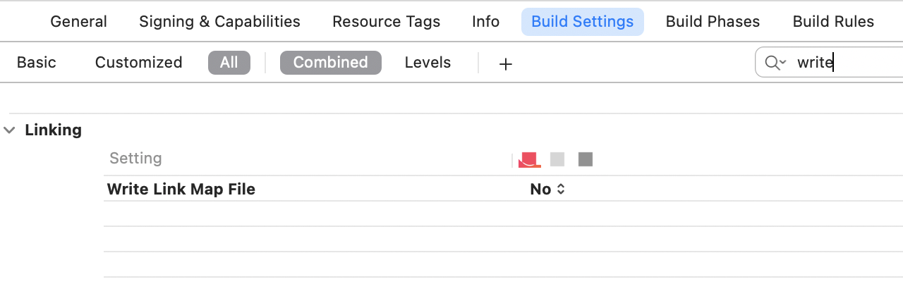
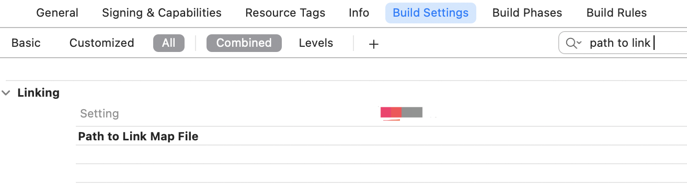

## LinkMap

> 目前给宿主提供SDK 的时候，需要出一份报告，其中包括包大小之类的信息。我使用了 [LinkMap](https://github.com/huanxsd/LinkMap) 这个工具，这个工具是专为用来分析项目的LinkMap文件，得出每个类或者库所占用的空间大小（代码段+数据段），方便开发者快速定位需要优化的类或静态库。


### Link Map File of XCode

直译为 **链接映射文件**，是 `Xcode` 生成可执行文件时一起生成的文本，用于记录链接相关信息。

- 可执行文件的路径
- `CPU`架构
- `.o`目标文路径
- 方法符号


Xcode 在生成可执行文件的时候默认情况下不生成该文件，需要开发者手动设置`Target --> Build Setting --> Write Link Map File` 为YES：



指定文件输出路径：



默认路径：

```c
$(TARGET_TEMP_DIR)/$(PRODUCT_NAME)-LinkMap-$(CURRENT_VARIANT)-$(CURRENT_ARCH).txt
```


### Link Map File

```c
# Path: /Users/user/Library/Developer/Xcode/DerivedData/MTXX-clnvtjejjyiqobhbydhnfgwpzcqa/Build/Products/Debug-iphoneos/MTXX.app/MTXX
# Arch: arm64
# Object files:
# Sections:
# Address	Size    	Segment	Section
# Symbols:
# Address	Size    	File  Name
# Dead Stripped Symbols:
#        	Size    	File  Name
```


#### 分析

##### Path 

为最终生成「可执行文件」的路径。


##### Arch

`Arch` 为「可执行文件」的架构，具体架构与设备的对照可参考下表：

|          Device           | System  |                          Arch                           |
| :-----------------------: | :-----: | :-----------------------------------------------------: |
|        iOS 模拟器         |   iOS   |                         x86_64                          |
| 搭载 A7 及以上的 iOS 真机 |   iOS   | arm64（A12 架构为「arm64e」，但 Link Map 文件尚未体现） |
|  搭载 A7 以下的 iOS 真机  |   iOS   |                          armv7                          |
|    Apple Watch 模拟器     | watchOS |                          i386                           |
|     Apple Watch 真机      | watchOS |    armv7s/arm64_32（Apple Watch S4 为「arm64_32」）     |
|            Mac            |  macOS  |                         x86_64                          |


##### Object files

在编译成目标文件后，通过链接器进行链接，最终合成可执行文件。这里展示的信息是链接时用到的文件，包括`.o`文件和`dylib`库。

参与编译的所有文件序号及路径(`.o`文件)：

第一列的序号是类的编号，通过该编号可以对应到具体的类。

在后面的`Symbols`部分，我们会用到类的编号。

eg.

```c
[  0] linker synthesized
[  1] /Users/user/Library/Developer/Xcode/DerivedData/DownLoadTest-cllvazlsjmxmxfbrtpwfusvahacn/Build/Intermediates.noindex/DownLoadTest.build/Debug-iphonesimulator/DownLoadTest.build/DownLoadTest.app-Simulated.xcent
[  2] /Users/user/Library/Developer/Xcode/DerivedData/DownLoadTest-cllvazlsjmxmxfbrtpwfusvahacn/Build/Intermediates.noindex/DownLoadTest.build/Debug-iphonesimulator/DownLoadTest.build/Objects-normal/x86_64/ShowViewController.o
[  3] /Users/user/Library/Developer/Xcode/DerivedData/DownLoadTest-cllvazlsjmxmxfbrtpwfusvahacn/Build/Intermediates.noindex/DownLoadTest.build/Debug-iphonesimulator/DownLoadTest.build/Objects-normal/x86_64/DownLoadViewController.o
[  4] /Users/user/Library/Developer/Xcode/DerivedData/DownLoadTest-cllvazlsjmxmxfbrtpwfusvahacn/Build/Intermediates.noindex/DownLoadTest.build/Debug-iphonesimulator/DownLoadTest.build/Objects-normal/x86_64/QDNetServerDownLoadTool.o
[  5] /Users/user/Library/Developer/Xcode/DerivedData/DownLoadTest-cllvazlsjmxmxfbrtpwfusvahacn/Build/Intermediates.noindex/DownLoadTest.build/Debug-iphonesimulator/DownLoadTest.build/Objects-normal/x86_64/Test.o
[  6] /Users/user/Library/Developer/Xcode/DerivedData/DownLoadTest-cllvazlsjmxmxfbrtpwfusvahacn/Build/Intermediates.noindex/DownLoadTest.build/Debug-iphonesimulator/DownLoadTest.build/Objects-normal/x86_64/MenuViewController.o
  ...
```


##### Sections

`Sections` 中主要描述了节相关的信息，分为四列：内存地址、大小、段（`Segment`）、节。

每一行的地址为上一行初始地址 + 内存大小（+ 偏移量）。

`__TEXT` 和 `__DATA` 标示了段信息，并各自对应多个节信息。

`__TEXT` 为只读代码段，存储了可执行（`r-x`）的代码信息，

`__DATA` 为数据段，存储了可读写（`rw-`）但不可执行的数据，

`__LINKEDIT` 包含了加载程序的『元数据』，比如函数的名称和地址，只读（`r–`）。


关于此处更为详细的信息，可以看看`Mach-O`相关内容。

eg.

```c
# Sections:
# Address	  Size    	  Segment	Section
0x100001960	0x0003EB6C	__TEXT	__text
0x1000404CC	0x00000282	__TEXT	__stubs
0x100040750	0x0000043E	__TEXT	__stub_helper
0x100040B90	0x000000D8	__TEXT	__const
0x100040C68	0x000007D0	__TEXT	__gcc_except_tab
0x100041438	0x00007659	__TEXT	__objc_methname
0x100048A92	0x000001DA	__TEXT	__ustring
0x100048C6C	0x0000119D	__TEXT	__cstring
0x100049E09	0x00000516	__TEXT	__objc_classname
0x10004A31F	0x000018DF	__TEXT	__objc_methtype
0x10004BBFE	0x00000170	__TEXT	__entitlements
0x10004BD70	0x00000290	__TEXT	__unwind_info
0x10004C000	0x00000008	__DATA	__nl_symbol_ptr
0x10004C008	0x00000108	__DATA	__got
0x10004C110	0x00000358	__DATA	__la_symbol_ptr
0x10004C468	0x00000BD0	__DATA	__const
0x10004D038	0x00001580	__DATA	__cfstring
0x10004E5B8	0x00000120	__DATA	__objc_classlist
0x10004E6D8	0x00000008	__DATA	__objc_nlclslist
0x10004E6E0	0x00000038	__DATA	__objc_catlist
0x10004E718	0x00000080	__DATA	__objc_protolist
0x10004E798	0x00000008	__DATA	__objc_imageinfo
0x10004E7A0	0x00009F58	__DATA	__objc_const
0x1000586F8	0x000016B8	__DATA	__objc_selrefs
0x100059DB0	0x00000010	__DATA	__objc_protorefs
0x100059DC0	0x00000288	__DATA	__objc_classrefs
0x10005A048	0x000000F0	__DATA	__objc_superrefs
0x10005A138	0x00000508	__DATA	__objc_ivar
0x10005A640	0x00000B40	__DATA	__objc_data
0x10005B180	0x00000618	__DATA	__data
0x10005B798	0x000000E0	__DATA	__bss
```


##### Symbols 

`Symbols` 中为符号相关的信息，分为四列：内存地址、大小、文件（序号对应 `Object files` 中的文件）、符号名称。通过结合 `Sections` 部分可以得知每一节的具体符号内容，并可以计算某个类或文件编译后的大小，帮助我们分析包体积。

eg.

```c
# Symbols:
# Address	  Size    	  File  Name
0x100001960	0x000001F0	[  2] -[ShowViewController viewDidLoad]
0x100001B50	0x00000240	[  2] -[ShowViewController DoIt]
0x100001D90	0x00000370	[  2] -[ShowViewController testdownLoadWithTask:FileUrl:]
0x100002100	0x00000060	[  2] ___Block_byref_object_copy_
0x100002160	0x00000030	[  2] ___Block_byref_object_dispose_
0x100002190	0x000000D0	[  2] ___51-[ShowViewController testdownLoadWithTask:FileUrl:]_block_invoke
0x100002260	0x00000130	[  2] ___51-[ShowViewController testdownLoadWithTask:FileUrl:]_block_invoke_2
0x100002390	0x00000070	[  2] ___copy_helper_block_e8_32s40r
0x100002400	0x00000050	[  2] ___destroy_helper_block_e8_32s40r
0x100002450	0x00000170	[  2] ___51-[ShowViewController testdownLoadWithTask:FileUrl:]_block_invoke.56
0x1000025C0	0x00000150	[  2] ___51-[ShowViewController testdownLoadWithTask:FileUrl:]_block_invoke.64
0x100002710	0x00000370	[  2] -[ShowViewController downLoadWithTask:FileUrl:]
0x100002A80	0x000000D0	[  2] ___47-[ShowViewController downLoadWithTask:FileUrl:]_block_invoke
0x100002B50	0x00000130	[  2] ___47-[ShowViewController downLoadWithTask:FileUrl:]_block_invoke_2
0x100002C80	0x00000160	[  2] ___47-[ShowViewController downLoadWithTask:FileUrl:]_block_invoke_3
0x100002DE0	0x00000150	[  2] ___47-[ShowViewController downLoadWithTask:FileUrl:]_block_invoke_4
0x100002F30	0x0000009F	[  2] -[ShowViewController .cxx_destruct]
  ...
```

例如:

例如序号 `2` 的 `ShowViewController.o` 文件，`-[ShowViewController viewDidLoad]` 方法在 `__TEXT` 的 `Segment` 里面 `.__text` 的 `Section` 段地址是 `0x100001960`，占用大小是`0x0003EB6C`。根据序号累加每个 `.o` 文件在每个段的占用大小，从而计算出每个 `.o` 文件在可执行文件的占用大小，进而算出每个静态库、每个功能模块代码占用大小。

```c
8.35K	ShowViewController.o
```

> 这里要注意的地方是，由于 `__DATA` 的 `Segment` 里面 `.__bbs` 的 `Section` 是代表未初始化的静态变量，`Size` 表示应用运行时占用的堆大小，并不占用可执行文件，所以计算 `.o` 占用大小时，要排除这个段的 `Size`。


##### Dead Stripped Symbols

`Dead Stripped Symbols` 与`Symbols`的结构一致，都是符号表，但`Dead`意味着表里的符号已经不再存在，因此没有记录内存地址。

eg.

```c
# Dead Stripped Symbols:
#        	Size    	File  Name
<<dead>> 	0x00000018	[  2] CIE
<<dead>> 	0x00000020	[  2] CIE
<<dead>> 	0x0000000C	[  3] literal string: viewDidLoad
<<dead>> 	0x0000000A	[  3] literal string: setTitle:
<<dead>> 	0x0000000B	[  3] literal string: lastObject
<<dead>> 	0x00000020	[  3] literal string: stringByAppendingPathComponent:
<<dead>> 	0x0000001D	[  3] literal string: fileURLWithPath:isDirectory:
<<dead>> 	0x0000000B	[  3] literal string: sharedTool
<<dead>> 	0x00000012	[  3] literal string: stringWithFormat:
<<dead>> 	0x0000003D	[  3] literal string: AFDownLoadFileWithUrl:progress:fileLocalUrl:success:failure:
<<dead>> 	0x0000000E	[  3] literal string: .cxx_destruct
<<dead>> 	0x0000000C	[  3] literal string: downLoadUrl
  ...
```


### 参考文献

- [优化 App 的启动时间](http://yulingtianxia.com/blog/2016/10/30/Optimizing-App-Startup-Time/)
- [LinkMap](https://github.com/huanxsd/LinkMap)
