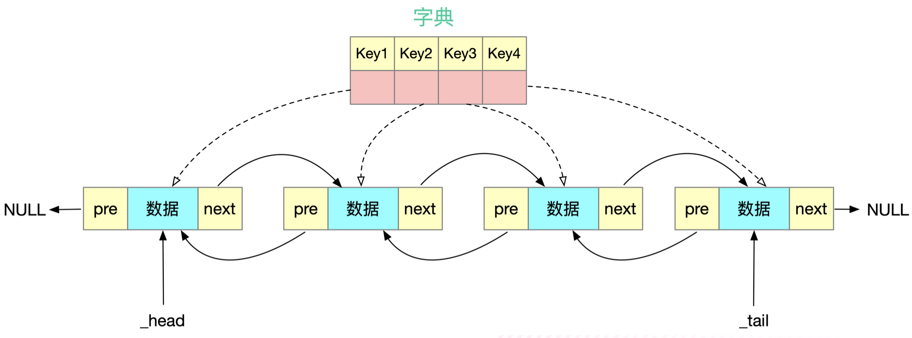
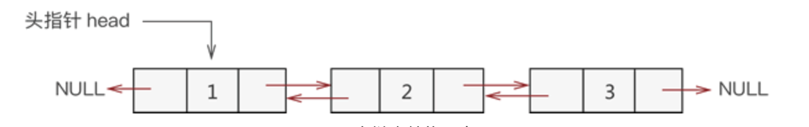
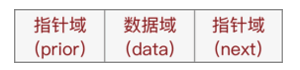
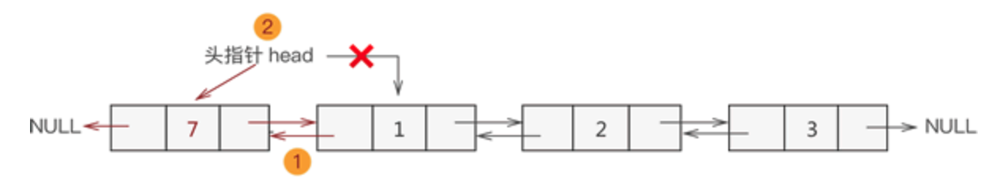
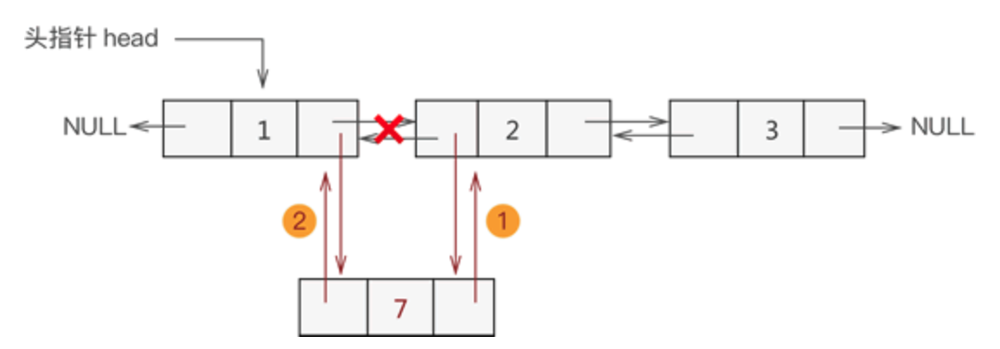
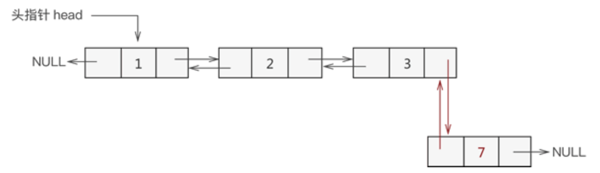
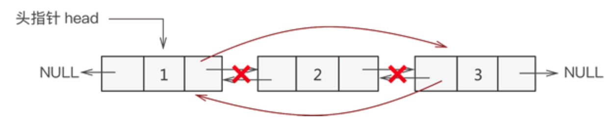

### LRU 算法

> [Least Recently Used](https://en.wikipedia.org/wiki/Cache_replacement_policies#Least_recently_used_(LRU)), a cache replacement algorithm
>
> 最久没有访问的内容作为替换对象


#### 设计实现

##### 哈希表 + 双向链表




##### 双链表





##### 双链表的增

一 头插入结点

1. `temp->next=head; head->prior=temp;`
2. 将 `head` 移至 `temp`，重新指向新的表头；



二 中间插入结点

1. 新节点先与其直接后继节点建立双层逻辑关系；
2. 新节点的直接前驱节点与之建立双层逻辑关系；



三 尾插入结点

1. 找到双链表中最后一个节点；
2. 让新节点与最后一个节点进行双层逻辑关系；



##### 双链表的删




##### 设计思路

1. 维护一个按数据未使用时长升序的双链表（创建双链表） ps. 即最近使用的数据放在表头
2. ~~使用 hash表映射至双链表中的结点~~

关于 hashmap 的使用上， [力扣](https://leetcode-cn.com/problems/lru-cache/solution/lruhuan-cun-ji-zhi-by-leetcode-solution/) 其中有一波评论，让人哭笑不得 :()


> 那咱们不偷懒，把第二条中的**使用哈希表** 改为 **维护一个哈希表** ，哈希表采用**拉链法解决哈希冲突，哈希地址采用取余法**。

2. 维护一个哈希表（创建hash表）映射至双链表中的结点

3. 实现 cache 基本的` get` 和  `put` 方法

在put 的时候，

- hash 表中已存在与该 key 相同的数据，则无论缓存容量是否满，**直接替换双链表中结点的数据值，并将其更新至双链表表头**；
- hash 表中没有与该 key 相同的数据
  - 缓存容量未满
    - 直接创建一个hash表的结点和双链表的结点，并存入 (`key/ value`) 及建立映射，再更新至双链表表头
  - 缓存容量满
    1. 第一种方案：「删除双链 表」中最久未使用的数据即最后一个结点，删除其对应 hash 表中的结点，然后创建一个hash 表的节点和双链表的节点，存入 (`key/ value`) 并且建立映射，再更新至双链表的表头；
    2. 第二种方案：『删除hash表」中最久未使用数据的结点，根据key创建一个新的结点，将其映射到双链表最后一个数据结点，改变该数据结点的  (`key/ value`) ，再对其更新至双链表的表头，相当于利用了该数据结点，避免了删除和新增这两步。


```c
#include <stdio.h>
#include <stdlib.h>
#include <string.h>

struct Node {
    int key;
    int value;
    struct Node* pre;
    struct Node* next;
};// 双向链表结点

struct Hash {
    struct Node* unused;
    struct Hash* next;
};// 哈希表结构

typedef struct {
    int size;
    int capacity;
    struct Hash* table; // 哈希表
    // 维护一个双向链表
    struct Node* head; // 后继 指向最近使用的数据
    struct Node* tail; // 前驱 指向最久未使用的数据
} LRUCache;

struct Hash* hashTable(struct Hash* table, int key, int capacity) {
    int addr = key % capacity; // 取余
    return &table[addr];
}

// 头插法创建双向链表
void headInsertion(struct Node* head, struct Node* cur) {
    // cur 不在链表中
    if (cur->pre == NULL && cur->next == NULL) {
        cur->pre = head;
        cur->next = head->next;
        head->next->pre = cur;
        head->next = cur;
    } else {
        // cur 在链表中
        struct Node* first = head->next;
        if (first != cur) {
            cur->pre->next = first->next; // 改变前驱结点指向
            cur->next->pre = first->pre; // 改变后继结点指向
            cur->next = first; // 插入到第一个结点位置
            cur->pre = head;
            head->next = cur;
            first->pre = cur;
        }
    }
}


LRUCache* lruCacheCreate(int capacity) {
    if (capacity<0) {
        return NULL;
    }
    LRUCache* p = (LRUCache *)malloc(sizeof(LRUCache));
    p->table = (struct Hash*)malloc(capacity * sizeof(struct Hash));
    memset(p->table, 0, capacity * sizeof(struct Hash));
    
    p->head = (struct Node*)malloc(sizeof(struct Node));
    p->tail = (struct Node*)malloc(sizeof(struct Node));
    
    // 创建头尾结点并初始化
    p->head->pre = NULL;
    p->head->next = p->tail;
    p->tail->pre = p->head;
    p->tail->next = NULL;
    
    // 初始化缓存 大小 和 容量
    p->size = 0;
    p->capacity = capacity;
    
    return p;
}

int lruCacheGet(LRUCache* p, int key) {
    struct Hash* addr = hashTable(p->table, key, p->capacity);
    addr = addr->next; // 跳过头结点
    if (addr == NULL) {
        return  -1;
    }
    
    while (addr->next != NULL && addr->unused->key != key) {
        addr = addr->next;
    }
    
    if (addr->unused->key == key) { // 查找成功
        headInsertion(p->head, addr->unused); // 更新至表头
        return addr->unused->value;
    }
    
    return -1;
}

void lruCachePut(LRUCache* p, int key, int value) {
    // 取的hash 表
    struct Hash* addr = hashTable(p->table, key, p->capacity);
    
    if (lruCacheGet(p, key) == -1) { // 没有找到匹配的key
        if (p->size >= p->capacity) { // 缓存已满
            struct Node* lastNode = p->tail->pre; // 双链表最后一个数据结点
            struct Hash* remove = hashTable(p->table, lastNode->key, p->capacity); // 取舍弃结点的哈希表地址
            struct Hash* ptr = remove;
            remove = remove->next; // 跳过头结点
            while (remove->unused->key != lastNode->key) { // 找到最久未使用的结点
                ptr = remove;
                remove = remove->next;
            }
            ptr->next = remove->next; // 在 table[last->key % capacity] 链表中删除结点
            remove->next = NULL;
            remove->unused = NULL; // 解除映射
            free(remove); // 释放资源
            
            struct Hash* a_node = (struct Hash*)malloc(sizeof(struct Hash));
            a_node->next = addr->next; // 连接到 table[key % capacity] 的链表中
            addr->next = a_node;
            
            a_node->unused = lastNode; // 最大化利用双链表中的结点，对其重映射(节约空间)
            lastNode->key = key;
            lastNode->value = value;
            headInsertion(p->head, lastNode); // 更新最近使用的数据
            
        } else {
            // 创建结点，建立映射
            struct Hash* a_node = (struct Hash*)malloc(sizeof(struct Hash));
            a_node->unused = (struct Node*)malloc(sizeof(struct Node));
            a_node->next = addr->next; // 连接到 table[key % capacity] 的链表中
            addr->next = a_node;
            
            a_node->unused->pre = NULL; // 标记该结点是新创建的,不在双向链表中
            a_node->unused->next = NULL;
            a_node->unused->key = key; // 插入key
            a_node->unused->value = value; // 插入value
            headInsertion(p->head, a_node->unused); // 更新最近使用的数据
            
            ++(p->size); // 更新缓存大小
        }
    } else {
        // 直接替换双链表中结点的数据值，并将其更新至双链表表头
        // lruCacheGet 函数已经更新双链表表头，故此处不用更新
        p->head->next->value = value; // 替换数据
    }
}

void lruCacheFree(LRUCache* p) {
    free(p->table);
    free(p->head);
    free(p->tail);
    free(p);
}

作者：ze-hao
链接：https://leetcode-cn.com/problems/lru-cache/solution/shou-da-cyu-yan-shi-xian-hashbiao-ying-she-yi-ge-s/
来源：力扣（LeetCode）
著作权归作者所有。商业转载请联系作者获得授权，非商业转载请注明出处。
```


##### Java 版

设计思路：

1. 双链表中实现的方法：
   - 链表初始化
   - 添加元素到双链表尾部（同时意味着该元素最近使用过）
   - 删除某个结点（非头结点）
   - 删除并返回头结点（意味着移除最久未使用过的元素）
   - 返回链表当前长度
2. LRU 缓存中的方法
   - 初始化，get，put方法
   - 设置某元素最近已使用makeRecently（原map中已有该元素）
   - 添加最近使用过的元素addRecently（原map中不存在该键值对，新元素）
   - 删除某个key对应的元素
   - 删除最久未使用过的元素 2.中的方法也可以直接在get和put方法中实现，可以减少部分冗余


```java
class LRUCache {

    HashMap<Integer, Node> map;
    DoubleList cache;
    int cap;

    public LRUCache(int capacity) {
        map = new HashMap();
        cache = new DoubleList();
        this.cap = capacity;
    }
    
    public int get(int key) {
        if(map.containsKey(key)){
            makeRecently(key); // 先将key标记为最近使用，再返回value
            return map.get(key).val;
        }else return -1;
    }
    
    public void put(int key, int value) {
        if(map.containsKey(key)){
            deleteKey(key); // 从原map中移除该key
            addRecently(key, value); // 更新最近使用
            return;
        }
        int size = cache.getSize();
        if(size == cap){ // 说明需要移除最久未使用的元素了
            removeLeastRecently();
        }
        // 走到这说明添加的是一个新元素
        addRecently(key, value);
    }

    public void makeRecently(int key){ // 将某个key标记为最近使用的元素（map中已存在的）
        Node x = map.get(key);
        cache.remove(x); // 先从双链表删除
        cache.addLast(x); // 再添加到链表末尾， 因为尾部是最近使用过的元素
    }

    public void addRecently(int key, int value){ // 添加最近使用过的元素， 原map中不存在该key
        Node x = new Node(key, value);
        cache.addLast(x);
        map.put(key, x); // 同时记得更新map
    }
    
    public void deleteKey(int key){ // 删除某一个key对应的元素
        Node x = map.get(key);
        map.remove(key);
        cache.remove(x); // 在map中和cache中同时删除
    }
    
    public void removeLeastRecently(){ // 删除最久未使用的元素
        Node oldNode = cache.removeHead(); // 最久未使用的一定在链表头部
        int oldKey = oldNode.key;
        map.remove(oldKey);
    }
}


class DoubleList{

    Node head, tail; // 伪头结点和伪尾结点
    int size; // 链表的长度

    public DoubleList(){ // 初始化
        head = new Node(0,0);
        tail = new Node(0,0);
        head.next = tail;
        tail.pre = head;
        size = 0;
    }

    public void addLast(Node x){ // 添加到链表尾部，且越靠近链表尾部，越代表最近使用过
        // 如当前链表为： head <-> 1 <-> tail，加入结点x = 2
        x.pre = tail.pre;
        x.next = tail; // 完成结点2指向两端的箭头  head <-> 1 <- 2 -> tail; 此时tail.pre = 结点1还未断开
        tail.pre.next = x;
        tail.pre = x; // 完成由结点2两端指向结点2的箭头  head <-> 1 <-> 2 <-> tail;
        size ++; // 更新链表长度
    }

    public void remove(Node x){ // 删除指定结点（该结点一定存在与链表）
        x.pre.next = x.next;
        x.next.pre = x.pre;
        size--;
    }
    
    public Node removeHead(){ // 删除并返回头结点
        if(head.next == tail) return null; // 说明是空链表
        Node first = head.next;
        remove(first); // size在remove中更新
        return first;  // 用作在哈希表中移除最久未使用的数据值
    }

    public int getSize(){ // 获取链表长度
        return size;
    }
    
}
class Node{ 
    int key, val; // 存储哈希表的key和value 
    Node pre, next; //前后指针
    
    public Node(int key, int value){
        this.key = key;
        this.val = value;
        
    }

}

```

**手写LinkedHashMap 版**

```java
public class LRUCache {
    private  MyLinkedHashMap<Integer, Integer> map;

    public LRUCache(int capacity) {
        map = new MyLinkedHashMap(capacity);
    }

    public int get(int key) {
        return map.getOrDefault(key, -1);
    }

    public void put(int key, int value) {
        map.put(key, value);
    }

    private class MyLinkedHashMap<K, V> {

        private final Entry<K, V>[] table;

        int modCount;

        int size;

        class Entry<K, V> {
            int hash;
            K key;
            V value;
            Entry<K,V> next;

            Entry<K, V> before, after;

            public Entry() {
            }


            public Entry(int hash, K key, V value, Entry<K, V> node) {
                this.hash = hash;
                this.key = key;
                this.value = value;
                this.next = node;
            }
        }

        Entry<K, V> head;

        Entry<K, V> tail;


        public MyLinkedHashMap(int initialCapacity) {
            this.table = new Entry[initialCapacity];
            modCount = initialCapacity;
            size=0;
        }

        final int hash(Object key) {
            int h;
            return (key == null) ? 0 : (h = key.hashCode()) ^ (h >>> 16);
        }

        Entry<K,V> newNode( K key, V value,Integer hash,Entry<K, V> next) {
            Entry<K,V> p= new Entry( hash,key, value,next);
            linkNodeLast(p);
            return p;
        }

        private void linkNodeLast(Entry<K,V> p){
            Entry<K,V> last=tail;
            tail=p;
            if(last==null){
                head=p;
            }else{
                p.before=last;
                last.after=p;
            }
        }
        public V get(Object key) {
            Entry<K,V> e;
            if ((e = getNode(hash(key), key)) == null)
                return null;
                afterNodeAccess(e);
            return e.value;
        }

         Entry<K,V> getNode(int hash, Object key) {
            Entry<K,V>[] tab; Entry<K,V> first, e; int n; K k;
            if ((tab = table) != null && (n = tab.length) > 0 &&
                    (first = tab[(n - 1) & hash]) != null) {
                if (first.hash == hash && // always check first node
                        ((k = first.key) == key || (key != null && key.equals(k))))
                    return first;
                if ((e = first.next) != null) {
                    do {
                        if (e.hash == hash &&
                                ((k = e.key) == key || (key != null && key.equals(k))))
                            return e;
                    } while ((e = e.next) != null);
                }
            }
            return null;
        }

        public V put(K key, V value) {
            Integer hash = hash(key);
            Entry<K, V> p;
            int n, i;
            n = modCount;
            if ((p = table[i = (n - 1) & hash]) == null) {
                table[i] = newNode(key,value,hash,null);
                size++;
            } else {
                Entry<K,V> e; K k;
                if (p.hash == hash &&
                        ((k = p.key) == key || (key != null && key.equals(k))))
                    e = p;
                else {
                    for (int binCount = 0; ; ++binCount) {
                        if ((e = p.next) == null) {
                            p.next = newNode(key, value, hash,null);
                            size++;
                            break;
                        }
                        if (e.hash == hash &&
                                ((k = e.key) == key || (key != null && key.equals(k))))
                            break;
                        p = e;
                    }
                }
                if (e != null) { // existing mapping for key
                    V oldValue = e.value;
                    e.value = value;
                    afterNodeAccess(e);
                    return oldValue;
                }
            }
            afterNodeInsertion();
            return null;
        }

        private void afterNodeInsertion() {
            Entry<K,V> first;
            if ( (first = head) != null && removeEldestEntry()) {
                K key = first.key;
                removeNode(hash(key), key,null, false, true);
            }
        }

      Entry<K,V> removeNode(int hash, Object key, Object value,
                                   boolean matchValue, boolean movable) {
          Entry<K,V>[] tab; Entry<K,V> p; int n, index;
          if ((tab = table) != null && (n = tab.length) > 0 &&
                  (p = tab[index = (n - 1) & hash]) != null) {
              Entry<K,V> node = null, e; K k; V v;
              if (p.hash == hash &&
                      ((k = p.key) == key || (key != null && key.equals(k))))
                  node = p;
              else if ((e = p.next) != null) {
                      do {
                          if (e.hash == hash &&
                                  ((k = e.key) == key ||
                                          (key != null && key.equals(k)))) {
                              node = e;
                              break;
                          }
                          p = e;
                      } while ((e = e.next) != null);
              }
              if (node != null && (!matchValue || (v = node.value) == value ||
                      (value != null && value.equals(v)))) {
                   if (node == p)
                      tab[index] = node.next;
                  else
                      p.next = node.next;
                  --size;
                  afterNodeRemoval(node);
                  return node;
              }
          }
          return null;
      }

        //从链表将该元素删除
        private void afterNodeRemoval(Entry<K,V> e) {
            Entry<K,V> p =e, b = p.before, a = p.after;
            p.before = p.after = null;
            if (b == null)
                head = a;
            else
                b.after = a;
            if (a == null)
                tail = b;
            else
                a.before = b;
        }
        private boolean removeEldestEntry() {
            return size>modCount;
        }

        private void afterNodeAccess(Entry<K,V> e) {
            Entry<K,V> last;
            if ((last = tail) != e) {
                Entry<K,V> p =e, b = p.before, a = p.after;
                p.after = null;
                if (b == null)
                    head = a;
                else
                    b.after = a;
                if (a != null)
                    a.before = b;
                else
                    last = b;
                if (last == null)
                    head = p;
                else {
                    p.before = last;
                    last.after = p;
                }
                tail = p;
            }
        }


        public V getOrDefault(Object key, V defaultValue) {
            V value;
            if ((value = get(key)) == null) {
                return defaultValue;
            }
            return value;
        }

    }
    public static void main(String[] args) {
        LRUCache cache = new LRUCache(2);
        cache.put(1, 1);
        cache.put(2, 2);

        int res1 = cache.get(1);
        System.out.println(res1);

        cache.put(3, 3);

        int res2 = cache.get(2);
        System.out.println(res2);

        int res3 = cache.get(3);
        System.out.println(res3);

        cache.put(4, 4);
        int res4 = cache.get(1);
        System.out.println(res4);

        int res5 = cache.get(3);
        System.out.println(res5);

        int res6 = cache.get(4);
        System.out.println(res6);
    }
}

/*
作者：qing-shui-ya-ran-jun
链接：https://leetcode-cn.com/problems/lru-cache/solution/shui-dian-de-shou-xie-linkedhashmap-by-qing-shui-y/
来源：力扣（LeetCode）
著作权归作者所有。商业转载请联系作者获得授权，非商业转载请注明出处。
*/
```

