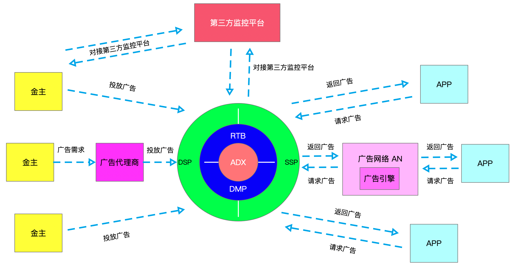

## 带你了解广告

> **广告**（英语：advertising或advertizing），从狭义上讲是一种市场营销行为，用于劝说阅听人，通常以引发[产品](https://wuu.wikipedia.org/w/index.php?title=产品&action=edit&redlink=1)购买，即商业广告。另一方面从广义上认识广告，是一切为了沟通信息、促进认识的广告传播活动，无论是否具有作用拉动商业领域，是否将营利作为运作目标，只要具备广告个基本特征，都是广告活动。
>
> **网络广告** 又被称为**在线广告** 或者 **互联网广告** ，顾名思义，网络广告就是在网络上做的广告。利用网站上的广告横幅、文本链接、[多媒体](https://zh.wikipedia.org/wiki/多媒体)的方法，在互联网刊登或发布广告，通过网络传递到互联网用户的一种高科技广告运作方式。与传统的四大传播媒体（报纸、杂志、电视、广播）广告及近来备受垂青的户外广告相比，网络广告具有得天独厚的优势，是实施现代营销媒体战略的重要一部分。Internet是一个全新的广告媒体，速度最快效果很理想，是中小企业扩展装大的很好途径，对于广泛开展国际业务的公司更是如此。
>
> 广告的本质是给某人在某个地方、某个时间下，看某个素材以宣传某个东西达到某种效果，其中五大要素是：目标人群、场景、创意、产品/品牌、认知。
>
> 
>
> 随着科技发展3G、4G 乃至 5G 带来的巨大的移动互联网流量，广告呈现出向移动互联网靠拢的趋势。

[toc]

**我们每个人，每天要看到很多广告。。。**绝大部分人对广告可以说是一无所知！在一开始的混沌时期，大多数互联网公司的看法是，**如果你是免费用户，那么他们就可以把你当做产品的一部分来使用你**。逐渐大家意识到隐私与个人信息安全，慢慢也出现了相应的政策和法律。。。不再赘述，咱们直奔主题。

### 1 基本知识

#### 广告分类

##### 1.1 根据广告的目的可以分为：

##### 1.1.1 品牌广告

为了品牌行销、宣传品牌的广告

##### 1.1.2 效果广告

为了直接提升用户量、交易额等效果的广告。

现在互联网对用户操作行为以及页面展示统计，平台通过数据分析可评估效果的优劣。

##### 1.2 根据 APP 所属行业进行划分

##### 1.2.1 搜索广告

##### 1.2.2 电商广告

##### 1.2.3 门户广告

##### 1.2.4 新闻广告

##### 1.2.5 竖屏广告

##### 1.2.6 视频广告

##### 1.3 根据广告位分类

##### 1.3.1 开屏广告

##### 1.3.2 插屏广告

##### 1.3.3 横幅广告

##### 1.3.4 贴片广告

##### 1.3.5 信息流广告

##### 1.3.6 搜索广告

##### 1.3.7 激励广告

当然，还有很多种分类方式，而且每个公司都会有不同的组织形式，这里不再赘述

### 2 行业角色

#### 2.1 广告主（金主）

为自己的品牌或者产品做广告的人，例如宝马、Intel、蒙牛、迪奥、雅诗兰黛……

#### 2.2 代理（中间商）

帮广告主找媒体广告位，帮媒体找广告主。广告主和代理的关系就是：广告主出钱出战略，代理出人出创意去执行。

#### 2.3 媒体（端）

各大门户App、门户网站等等

#### 2.4 广告平台

广告平台就是撮合媒体和广告主/代理的，在网盟里他们聚集起大批尾部媒体，把这些媒体卖给广告主以谋取利润，在程序化广告中，又分别出现了代表媒体利益的ssp、代表广告主利益的dsp、广告交易平台adx。

#### 2.5 第三方统计平台

通过第三方统计平台查看各项指标数据印证广告的投放和曝光

### 3 定价方式

常用的定价方式，包括：

- 展示类，常用于品牌广告
- 转化类，常用于效果广告

展示类广告在**转化漏斗**的前列，而转化类的广告在**转化漏斗**的后边。因此，展示类的广告主风险较大，转化类的媒体主风险较大。用哪一种丁阿基方案，本身就是上下游间博弈的过程。

- **CPT**：`Cost Per Time`，按时长计费，即按照占据此广告的时长计费，在高价值的广告位上常见，例如：开屏广告、跳一跳的广告等。
- **CPM**：`Cost Per Mille`，按展示量计费，即按照此广告的展示次数计费，以品牌展示类为主。
- **CPC**：`Cost Per Click`，按点击量计费，即按照此广告的点击次数计费，关键词竞价常用，例如：头条的信息流广告。
- **CPA**：`Cost Per Action`，按行动量计费，即按照某些用户行为次数计费，CPA包括以下CPD、CPI、CPS等。
  - **CPD**：`Cost Per Download`，按下载量计费，即按用户完成APP下载计费，APP、游戏等常用。
  - **CPI**：`Cost Per Install`，按安装量计费，即按用户激活APP计费，这种比较少，一般是广告主内部衡量效果的指标。
  - **CPS**：`Cost Per Sales`，按销售量计费，即按完成订单的用户数量结算，以电商类为主。
- **CPD** ： `cost per date`	按天计费
- **ECPM** ：`Effective cost per mile`	每一千次展示可以获得的广告收入
- **CPV** ：`Cost Per View`	按10S有效播放的数量计费，即某个用户看了10S的广告视频即作为1个CPV
- **CPL** ：`Cost Per Leads` 以搜集潜在客户名单多少来收费； 即每次通过特定链接，注册成功后付费的一个常见广告模式。这是我们通常称谓的引导注册	每一千次展示可以获得的广告收入
- **CTR** ：`Click Through Rate`	点击通过率	实际点击次数（严格的来说，可以是到达目标页面的数量）除以广告的展现量（`Show content`）计算公式：CTR=实际点击次数/展示量，即 `Click / Show content`
- **RTB** ：`Real Time Bidding`  实时竞价 在用户刚打开流量的载体（App或是Wap站点）的时候，该广告位要显示的东西还尚未确定，只有当竞价结束的时候，才会最终确定实际被展示的内容（Creative）竞价时间非常短，一般100ms之内就要完成 完全以 CPM 计价

### 4 广告模式

- 合约广告
  - 优点是：强曝光，可同页面独家，长期购买会有橱窗效应 ；
  - 缺点是：无法进行效果优化，就跟报纸上卖个广告位一样，很难进行优化。

媒体约定在某一段时间内，在某广告位上持续推送某广告主的广告，通常根据CPT结算，合同上会约定曝光量。
媒体会有自己的销售团队，通过直销/代理等方式把自己的广告卖出去。

- 广告网络

把多个媒体的流量聚合起来，按照人群/页面关键词等竞价（竞价较封闭）卖给广告主，常用CPC结算。

媒体只要接入广告网络的SDK等，就无需关心广告投放中的具体过程，也不用关心每次展示的投放结果，这方面极大方便了媒体，媒体就有了长尾流量变现的可能，也不需要满足广告主独家的要求。

又因为广告网络中媒体的参差不齐，广告网络按照人群售卖，淡化媒体和广告位的概念，就很难拿到品牌溢价高的广告位（开屏等），很不适合品牌类广告的投放。

- 程序化广告

TB、PA、PDB、PD等多种形式，主要讲一下RTB实时竞价。

RTB实时竞价，就是广告主根据人群向每一次曝光竞价——也就是在广告准备展示的几百毫秒内，广告主们先判断这个用户是不是目标用户，是的话就出价，选择出价最高的广告主的广告展示出来。

因为程序化广告是针对每一次曝光的，粒度非常精细，广告主就可以对预算进行很好的控制。同时，程序化广告由于DSP、DMP等平台存在，拥有大量的数据，可以根据数据定制化标签，让受众定向技术有很大飞跃。

> 如图实现了广告网络之间资源的打通和互换。
>
> ADX  (`Ad Exchange`) 通过一套数据协议，将不同广告主和广告网络（以及媒体）连接起来。
>
> DSP（`Demand-Side Platform`）平台 ---- 需求方平台
>
>  - 广告主对广告进行投放
>  - 流量采买
>  - 广告数据跟进
>  - 广告出价和策略调整
>
> SSP（`Supply-Side Platform`）平台 ---- 供应方平台
>
>  - 媒体或者 `publisher` 对接广告主
>  - 管理媒体的广告位
>  - 查看广告收益
>
> RTB（`Real Time Bidding`，实时竞价）
>
> DMP（`Data-Management Platform`）数据管理平台
>
> - 对广告主的需求进行分析，并最终返回匹配的广告受众
> - 对媒体所对应的用户的行为数据和标签进行分析，并最终返回匹配的广告受众

- 原生广告
  - 表现原生就是样式和内容差不多；
  - 意图原生就是这个广告符合媒体提供的用户需求。

原生广告（内容广告） 例如：头条的信息流广告、Facebook的社交广告、百度的搜索广告，朋友圈广告等其实都是原生广告

### 5 典型投放和业务处理流程

#### 5.1 RTB

##### 没有 Exchange

1. 用户打开集成了`SSP`的`SDK`的`App`，广告即将被展示。

2. `SSP`收到自己`SDK`上报的信息，然后向和`SSP`已经接好的所有`DSP`发送`Bid Request`，让他们为这次展示机会出价。

3. `DSP`收到`Bid Request`后向`SSP`发送`Bid Response`，这里所有`DSP`之间互相是不知道彼此出价的，`Bid Response`中含有一段`js`代码，这段`js`会返回实际的广告的`Creative`，`DSP`在此时还可能向`DMP`发出查询请求。

4. `SSP`选取出价最高的作为胜出的`DSP`，然后胜出的`DSP`只需要支付第二高的出价的价格。

5. `SSP`将胜出的`DSP`给出的`JS`代码下发给`SDK`，在嵌入了`SSP`的`SDK`的`APP`内展示广告。

6. `SSP`向胜出的`DSP`发送`Win Notice`，通知`DSP`该次`Impression`已经竞价成功。

##### 有 Exchange

`SSP`也将`Exchange`视为一个`DSP`，`DSP`将`Exchange`也视为一个`SSP`。对于`Exchange`本身，`Exchange`把从`SSP`收到的`Bid Request`发给`DSP`，然后从`DSP`收到`Response`，从中选出胜者的价格再向`SSP去`竞价

#### 5.2 PDB 保价保量 Programmatic Direct Buying

#### 5.3 PD 保价不保量 Preferred Deal

#### 5.4 PA 私有竞价 Private Auction

### 6 常用术语

#### 6.1 RTA

`Realtime API`的简称，RTA 是一种接口技术，更是一种策略导向的投放能力；RTA 是一种实时的广告程序接口

#### 6.2 指标

- IR/CR： `Install Rate / Conversion Rate` 转化数/Click数

- DAU：`daily active user`，日活跃用户数量

- MAU：月活跃用户量

- PV：（`page view`）即页面浏览量或点击量
  	- PV值就是所有访问者在24小时（0点到24点）内看了某个网站多少个页面或某个网页多少次；
  	- PV是指页面刷新的次数，每一次页面刷新，就算做一次PV流量

- UV：（`unique visitor`）即独立访客数
  
  - 在同一天内，UV只记录第一次进入网站的具有独立IP的访问者，在同一天内再次访问该网站则不计数。
  
  - UV提供了一定时间内不同观众数量的统计指标
  
- QPS（`queries per second`）：即针对查询，每秒的响应请求数
  
- TPS（`Transactions Per Second`）：每秒能够处理的事务数
  
- RPS（`requests per second`）：每秒的请求数（RPS=并发数/平均响应时间）
  
- RT（`round time`）：响应时间，指系统对请求作出响应的时间
  
- `Throughput`：吞吐量，指系统在单位时间内处理请求的数量
  

#### 6.3 广告投入产出比 ROI

`ROI = （收入-成本）/ 投入  * 100%`

> 是为一系列用户与环境的组合找到最合适的广告投放策略，以优化整体广告活动的利润。（from 《计算广告》）

### 7 IOS14 以及Android Q对广告行业的影响

#### 7.11 iOS 14 将改变 IDFA 的获取方式，App 需要通过征得用户许可才能跟踪用户或访问用户设备的广告标识符。

针对 IDFA 最大变化就是：将 IDFA 从 OS 层面移至 App 层面。

#### 7.2 Android Q 系统禁止了非系统级应用对于设备识别码的访问与获取，同时还默认配置 WiFi Mac 地址随机化。

> IMEI：`International Mobile Equipment Identity`，国际移动设备身份码的缩写。是由15位数字组成的“电子串号”，它与每台手机一一对应，理论上每个`IMEI`在世界上都是唯一的。

在当前绝大多数手机应用上， IDFA 和 IMEI 通常都是手机的用户识别ID（有些应用还会有自己的一套用户识别ID比如：guid 等作为辅助），用于日常的用户行为上报以及广告商业化。Apple 和 Google 这两个改变，将会对广告行业产生很大影响。

#### 7.3 互联网广告可以对不同受众呈现不同的广告以及广告创意。这里本质上是**用户的定向**。

用户定向的基础是用户的识别。如果用户手机升级操作系统以后，应用不能识别这个用户，那么将出现一批”新用户“。

#### 7.4 互联广告可以对每一个广告进行清晰的**结果归因**。

如果广告的媒体无法获取到全局唯一的ID，将导致归因逻辑的第一步无ID可以匹配的情况。

### 参考文献

- [知乎 ---- PMCoder之路](https://zhuanlan.zhihu.com/PMCoder)

- https://zhuanlan.zhihu.com/p/28488066

- http://www.woshipm.com/marketing/2253238.html

- [互联网广告背后是什么（2）：核心问题](http://www.woshipm.com/operate/987844.html)

