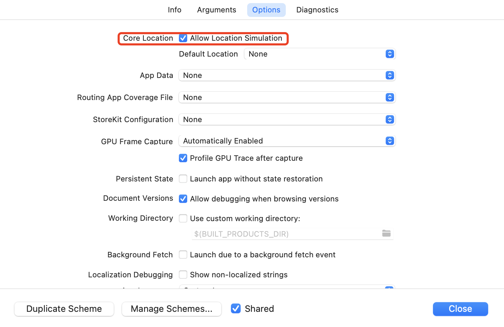
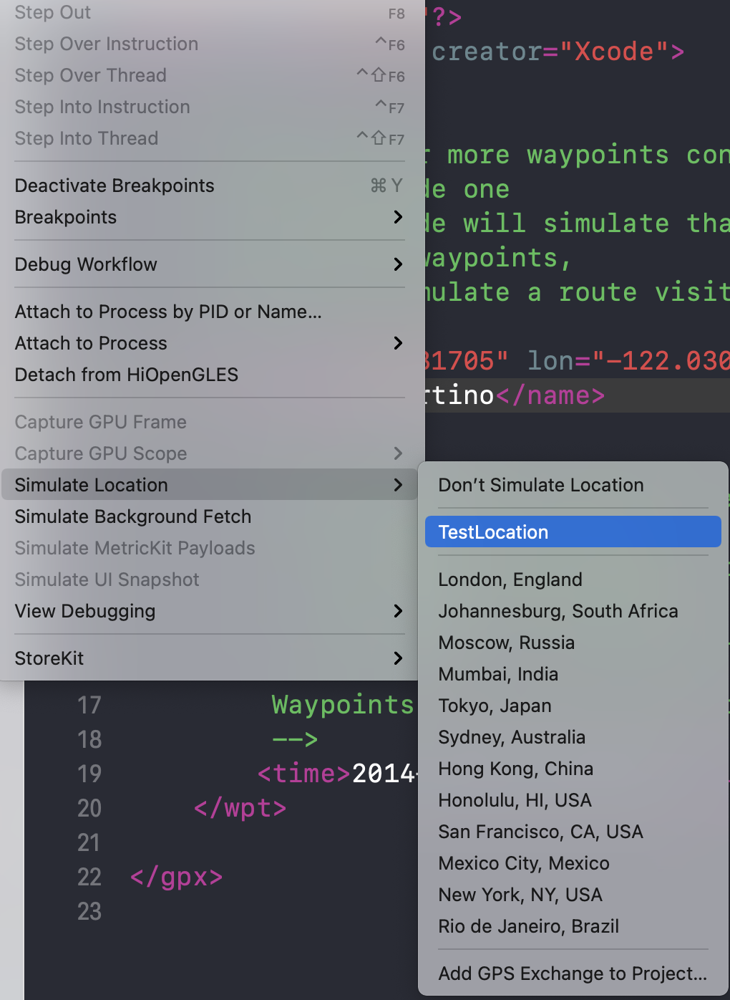
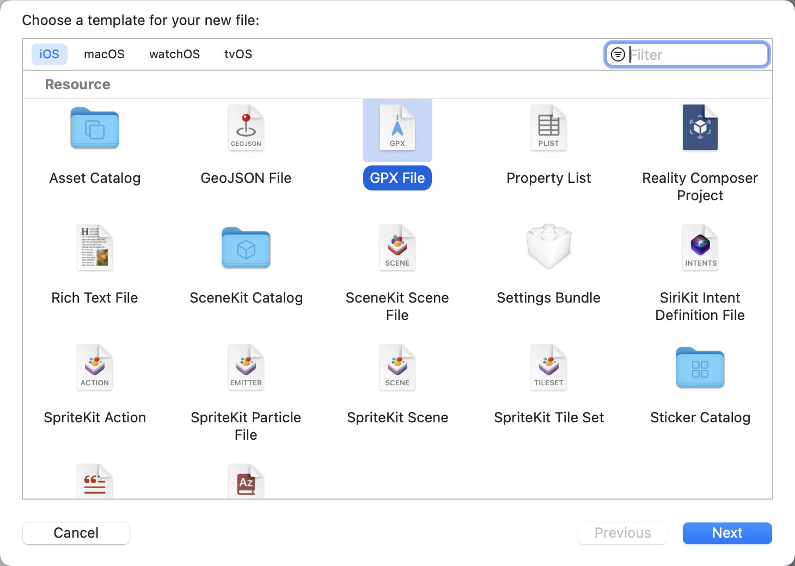
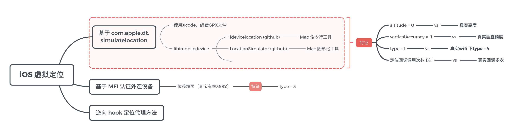
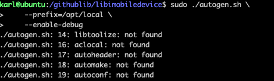

## idevicelocation


### 安装问题

#### 1. openssl

```c
/*
configure: error: Package requirements (libimobiledevice-1.0 >= 1.2.0) were not met:

Package 'openssl', required by 'libimobiledevice-1.0', not found

Consider adjusting the PKG_CONFIG_PATH environment variable if you
installed software in a non-standard prefix.

Alternatively, you may set the environment variables libimobiledevice_CFLAGS
and libimobiledevice_LIBS to avoid the need to call pkg-config.
See the pkg-config man page for more details.
make: *** No targets specified and no makefile found.  Stop.
Password:
Sorry, try again.
Password:
make: *** No rule to make target `install'.  Stop.
*/
```

解决：

```c
/*
If the compiler cant find the openssl libs try this:

	export PATH=/usr/local/opt/openssl/bin:$PATH
	export LD_LIBRARY_PATH=/usr/local/opt/openssl/lib:$LD_LIBRARY_PATH
	export CPATH=/usr/local/opt/openssl/include:$CPATH
	export LIBRARY_PATH=/usr/local/opt/openssl/lib:$LIBRARY_PATH
	export PKG_CONFIG_PATH=/usr/local/opt/openssl/lib/pkgconfig
*/
```


####  2 libplist

```c
/*
configure: error: Package requirements (libplist >= 0.15) were not met:

No package 'libplist' found

Consider adjusting the PKG_CONFIG_PATH environment variable if you
installed software in a non-standard prefix.

Alternatively, you may set the environment variables libplist_CFLAGS
and libplist_LIBS to avoid the need to call pkg-config.
See the pkg-config man page for more details.
*/
```

解决：

```c
/*
export libplist_LIBS="-L/usr/local/Cellar/libplist/2.2.0/lib"
export libplist_CFLAGS="-I/usr/local/Cellar/libplist/2.2.0/include"
*/
```


### 使用

> 手机：iPhoneXR 12.0.1 (16A405) A2108 64G
>
> 电脑：MacBook Pro (13-inch, M1, 2020) macOS Big Sur 11.5.2


> ➜  idevicelocation git:(master) idevicelocation --help
> Set Geo Location in iOS devices connected over USB and WiFi.
>
> Usage: idevicelocation [OPTIONS] LATITUDE LONGITUDE
>
>  The following OPTIONS are accepted:
>   -u, --udid UDID	Target specific device by its device UDID.
>   -s, --stop		stops device simulation
>   -h, --help		prints usage information
>   -d, --debug		enable communication debugging
>
> Homepage: <https://github.com/JonGabilondoAngulo>
>
> ➜   idevice_id -l
>
> xxx-xxx

```sh
idevicelocation -u xxx-xxx 48.856614 2.3522219000000177
idevicelocation -s
```


**ps.**

**1. stop 后不会立即恢复当前的定位，大约5~10分钟会恢复真实定位；重启也可以恢复真实定位**

**2. -d 参数的作用是什么呢？！**

```c
/*
idevice_set_debug_level()
void idevice_set_debug_level(int level)
Set the level of debugging.
Parameters
level	-- Set to 0 for no debug output or 1 to enable debug output.
*/
```

**3. 我又试了一下iPhone 12 iOS 15.0.2 (19A404) A2404 128G 。stop 后很快就恢复了当前定位。所以，设置虚拟位置与关闭虚拟位置的生效好恢复在不同机型上有差异，是个黑盒。**

**4. 有尝试把 libimobiledevice 编译出一个iOS依赖包，然后进行iOS App 的开发。在 M1中libimobiledevice编译失败了**


### com.apple.dt.simulatelocation

苹果提供了一个为设备模拟GPS位置的调试功能，其原理是通过 USB 获取设备句柄后开启设备内的服务(`com.apple.dt.simulatelocation`)再通过固定坐标或 GPX 文件进行位置模拟。








#### 小结：



---

---


### 关于坐标系的问题

> 我们常说的坐标系有哪些？
>
> WGS84：为一种大地坐标系，也是目前广泛使用的GPS全球卫星定位系统使用的坐标系。
>
> GCJ02：又称火星坐标系，是由中国国家测绘局制定的地理坐标系统，是由WGS84加密后得到的坐标系。
>
> BD09：为百度坐标系，在GCJ02坐标系基础上再次加密。其中bd09ll表示百度经纬度坐标，bd09mc表示百度墨卡托米制坐标。
>
> #### 百度
>
> 百度地图使用什么坐标体系？
>
> 使用百度地图的服务，需使用BD09坐标。
>
> 若使用非BD09坐标、未经过坐标转换（非BD09转成BD09）直接叠加在地图上，地图展示位置会偏移，因此通过其他坐标（WGS84、GCJ02）调用服务时，需先将其他坐标转换为BD09。
>
> #### 高德
>
> 高德开放平台服务使用什么坐标体系？
>
> 高德开放平台服务用的是国测局规定的GCJ-02坐标系。为国内的标准坐标体系。区别于GPS坐标（WGS-84坐标系），是在其基础上进行了加密。


### 定位方式

> - 基站定位
>   由于每个基站都有一个唯一标识符，所以苹果服务器通过这个唯一的标识符来定位当前设备的位置，精度不是很高，但是效率较快。
>
> - wifi定位
>   与基站识别的方式类似，通过WiFi连接后，获取到mac地址，然后在苹果服务器中确定一个位置，这个精度稍微比基站的获取到的精度更高。
>
> - GPS定位
>   这个就是通过GPS卫星和设备中的GPS终端进行通讯，然后精确的定位。这种定位的精度是最高的，但是耗电量等也是最大的，然后也不能被其他的覆盖遮挡。


#### Build

Enter the commands provided below.

```shell-session
$ ./autogen.sh \
    --prefix=/opt/local \
    --enable-debug
$ make
```



#### Install

Enter the commands provided below.

```shell-session
$ sudo make install
```


### 相关资料

- [高德QA](https://lbs.amap.com/faq/advisory/others/39838)

- [百度地图QA](https://lbsyun.baidu.com/index.php?title=coordinate)
- [libimobiledevice](https://github.com/libimobiledevice/libimobiledevice)
- [idevicelocation](https://github.com/JonGabilondoAngulo/idevicelocation)
- [OTGLocation](https://github.com/cczhr/OTGLocation)
- [LocationSimulator](https://github.com/Schlaubischlump/LocationSimulator)

