## 树莓派

### SD 卡安装 Ubuntu Server 20.04.3 LTS 系统

#### 1. 格式化 TF 卡

SD Card Formatter Version 5.0.1格式化TF卡。这种方式刷卡，慢的要死。。。

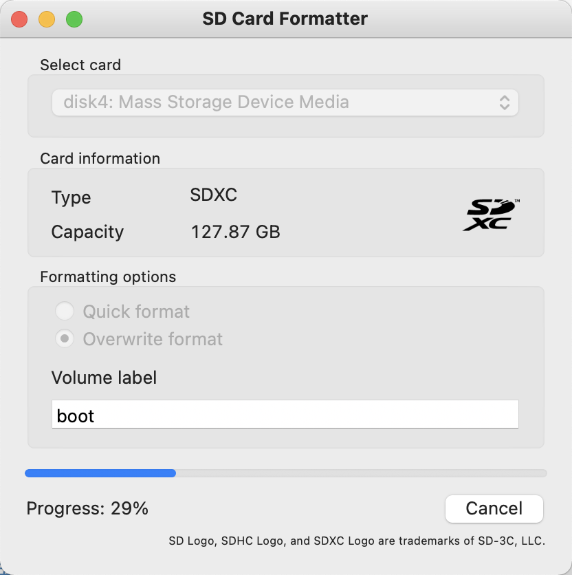

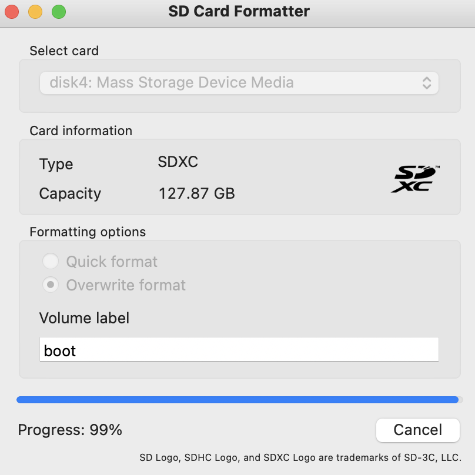


#### 2. 烧录系统 Ubuntu Server 20.04 TS

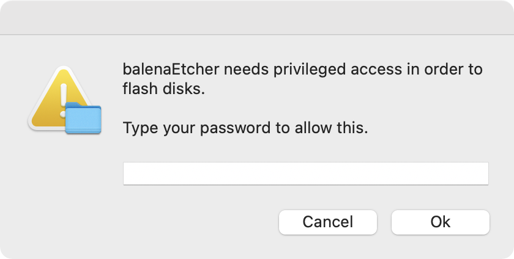

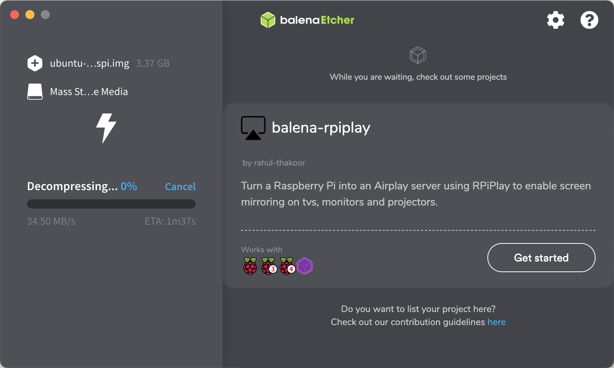


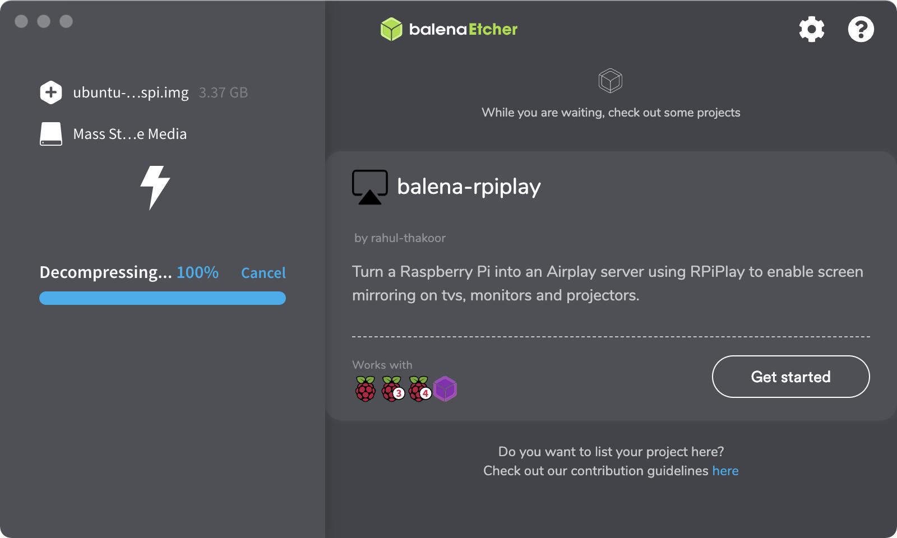

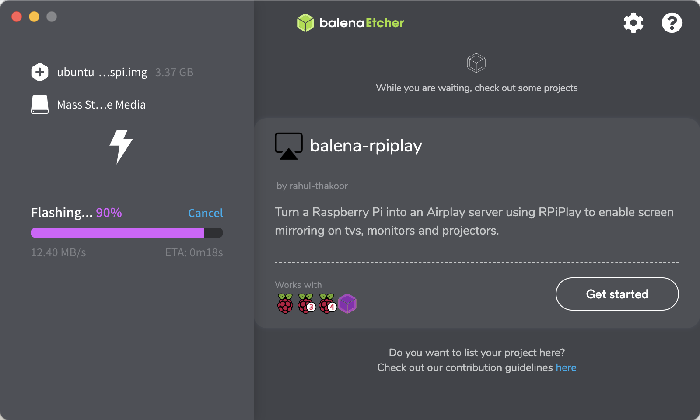

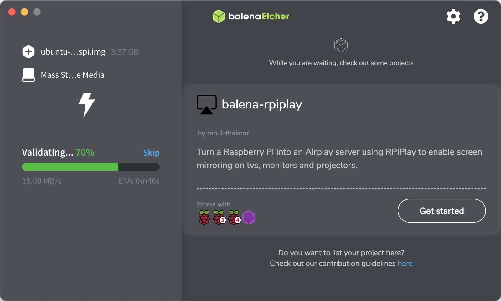


#### 3 插电启动

##### 3.1 网线连接路由器

通过 `192.168.1.1` 登录路由器，查看连接的设备，获取到树莓派的 ip 地址，然后 ssh 连接

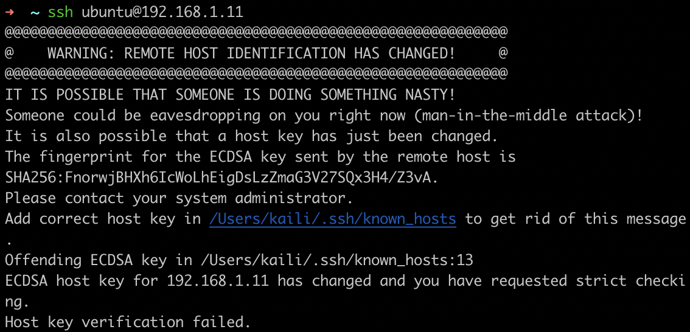

上图情况，需要删除 .ssh/know_host 下的那条记录。


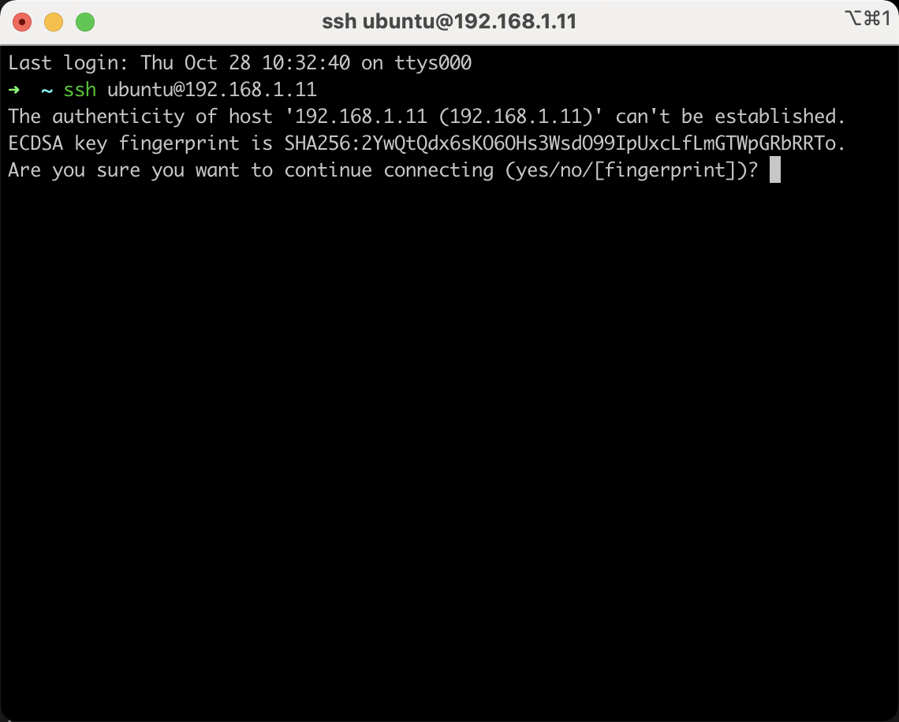


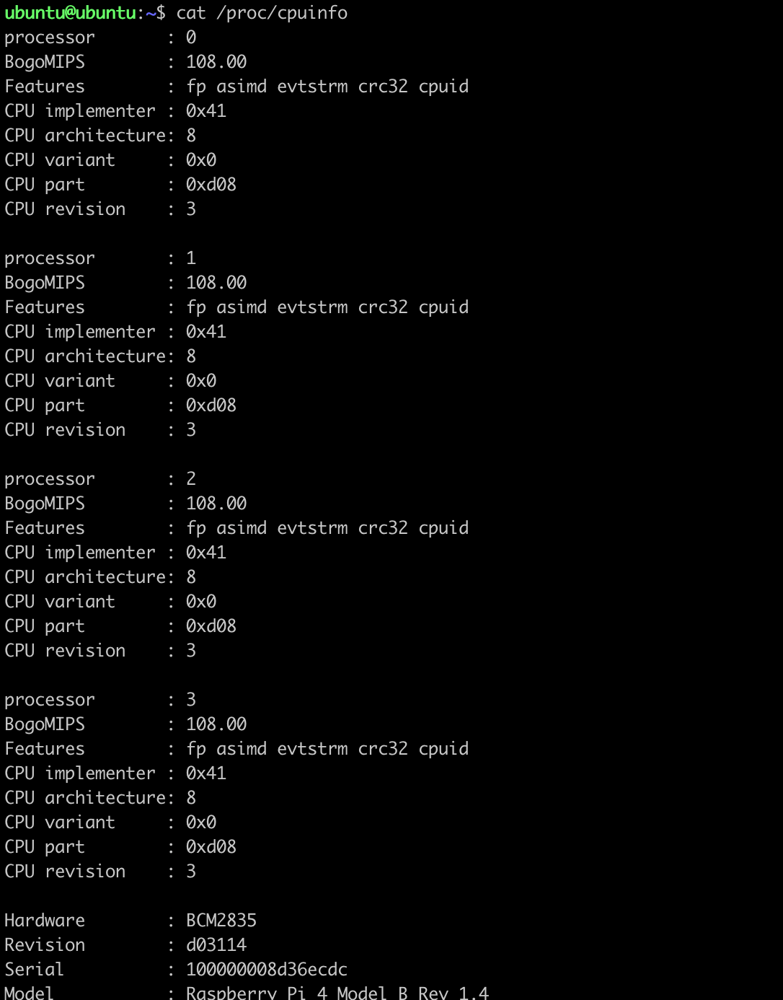

##### 3.2 配置wifi 上网

先进入网络配置所在的文件夹

```
cd /etc/netplan/
```

在这个文件夹中，你能发现一个叫`50-cloud-init.yaml`的文件，将你要配置的内容，在这个文件中编辑完成就可以了，以下是我的配置：

```bash
network:
    ethernets:
        eth0:
            dhcp4: false
            addresses: [10.200.12.222/24]
            gateway4: 10.200.12.254
            nameservers:
                    addresses: [10.200.10.1,10.200.10.2]
            option: true
    wifis:
            wlan0:
                    dhcp4: true
                    dhcp6: true
                    option: true
                    access-points:
                            "cmcc-32a":
                                    password: "password"
    version: 2
```

这里面设置了有一个固定的有线网络IP和设置了一个自动获取IP的 wifi，值得注意的是，在冒号后面，记得要有个空格或者换行。好了把文件保存以下，然后启用。

```
sudo netplan --debug apply
```

如果配置没有出错的话，稍后就能使用你的 wifi 模块上网通讯了


### 4 安装 docker

[Docker install ubuntu](https://docs.docker.com/engine/install/ubuntu/)

如果你过去安装过 docker，先删掉:

```bash
sudo apt-get remove docker docker-engine docker.io
```

首先安装依赖:

```bash
sudo apt-get install apt-transport-https ca-certificates curl gnupg2 software-properties-common
```

根据你的发行版，下面的内容有所不同。你使用的发行版： Debian Ubuntu

信任 Docker 的 GPG 公钥:

```bash
curl -fsSL https://download.docker.com/linux/debian/gpg | sudo apt-key add -
```

对于 amd64 架构的计算机，添加软件仓库:

```bash
sudo add-apt-repository \
   "deb [arch=amd64] https://mirrors.tuna.tsinghua.edu.cn/docker-ce/linux/debian \
   $(lsb_release -cs) \
   stable"
```

如果你是树莓派或其它 ARM 架构计算机，请运行:

```bash
echo "deb [arch=armhf] https://mirrors.tuna.tsinghua.edu.cn/docker-ce/linux/debian \
     $(lsb_release -cs) stable" | \
    sudo tee /etc/apt/sources.list.d/docker.list
```

最后安装

```bash
sudo apt-get update
sudo apt-get install docker-ce
```

```bash
# systemctl 方式
# 启动        
sudo systemctl start docker
# 守护进程重启   
sudo systemctl daemon-reload
# 重启docker服务   
sudo systemctl restart  docker


# service
# 重启docker服务  
sudo service docker restart
# 关闭
docker service docker stop
```


#### 4.1 安装 homeassistant

```bash
docker run -d \
  --name homeassistant \
  --privileged \
  --restart=unless-stopped \
  -e TZ=MY_TIME_ZONE \
  -v /PATH_TO_YOUR_CONFIG:/config \
  --network=host \
  ghcr.io/home-assistant/home-assistant:stable
```

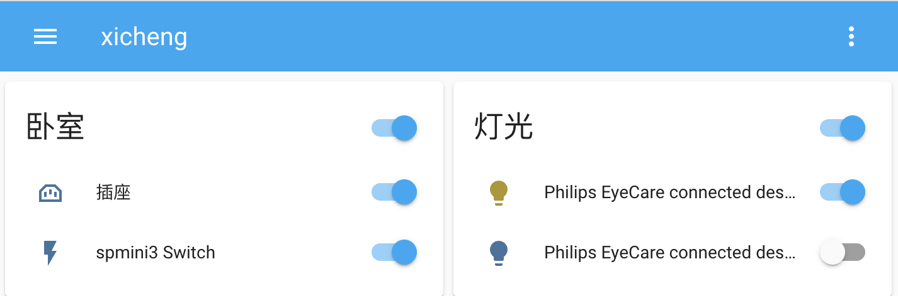

Ps.

期间忘了密码，首先找到

 `sudo docker inspect 容器id`

`sudo docker exec -it 容器id /bin/bash  `

然后进行命令行操作 删除 `.storage` 文件即可


#### 4.2 安装smb

创建一个文件夹

```bash
sudo mkdir /opt/smb
sudo chmod -R 777 /opt/smb
```

安装smb服务

```bash
sudo apt update
sudo apt install samba -y
```

创建smb密码文件

```bash
sudo touch /etc/samba/smbpasswd
```

添加用户并设置密码

```bash
sudo smbpasswd -a ubuntu
```

在`/etc/samba/smb.conf` 中添加如下配置

```bash
[ubuntu]
   comment = ubuntu
   path = /opt/smb
   writable = yes
   valid user = ubuntu
   available = yes
   create mask = 0777
   directory mask = 0777
   public = yes
```

重启smb服务

```bash
sudo /etc/init.d/smbd restart
```

挂载外接u盘

在`/opt/smb/` 下新建文件夹 `upan1`， 作为挂载点

```bash
sudo mkdir  /opt/smb/upan1
sudo chmod 777 -R  /opt/smb/upan1
```

接入硬盘，查看硬盘是否接入成功

```bash
sudo fdisk -l
```

可以看到设备挂载的位置为 `/dev/sdc`

- 挂载硬盘

```
sudo mount /dev/sdc /opt/smb/upan1
sudo chmod 777 -R  /opt/smb/upan1
```


##### 在Mac上挂载使用smb

- 连接服务器

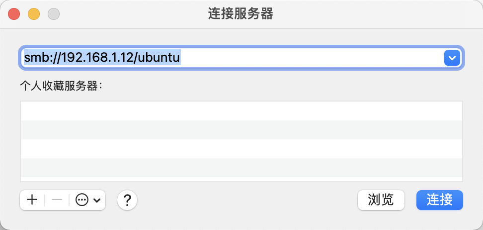


#### 5 蓝牙 ❌

```bash
# status is not ”running“ need to start service
systemctl status bluetooth.service
systemctl enable bluetooth
systemctl start bluetooth

bluetoothctl
[bluetooth]# power on
[bluetooth]# scan on
[bluetooth]# scan off
[bluetooth]# devices
[bluetooth]# pair xx
[bluetooth]# connect <dev>
# Set Device to Pair Automatically
[bluetooth]# trust xx
[bluetooth]# remove xx
```


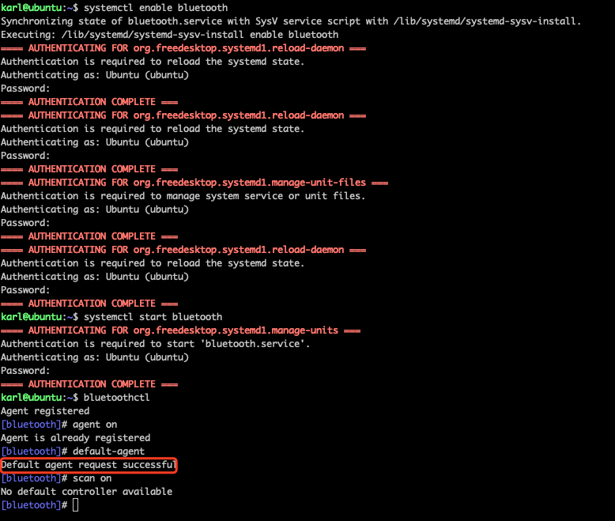 


蓝牙 bluetoothctl 报错 `No default controller available` ~~


1. 我重新刷了一个pi os full版。然后 启动了树莓派。

2. **把我蓝牙设备在电脑的蓝牙连接删除掉（这一步很重要）**
3. 重新执行上述步骤，可以了 ✅

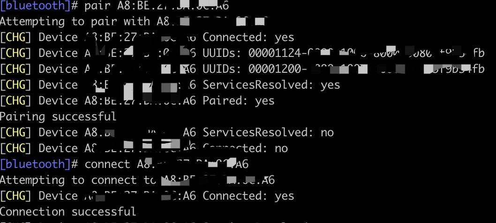


### 参考资料

- [树莓派乌金甲外壳安装教程](https://www.bilibili.com/video/BV1yE411y79q?from=search&seid=14416903231749814923&spm_id_from=333.337.0.0)
- [Ubuntu安装 Docker ](https://docs.docker.com/engine/install/ubuntu/)

