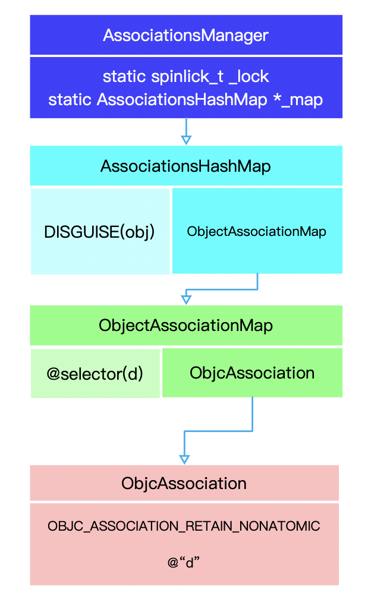

## OC 中 Category 与关联对象

[toc]


在之前的一片文章 [OC中给类扩充方法](./articles/2015/2015-5-2-OC中给类扩充方法.md)


### 1 属性

#### @property

`@property (nonatomic, copy) NSString *str` 编译器会：

- 生成实例变量 `_str`
- 生成 getter 方法
- 生成 setter 方法

但是，在分类中，Xcode 会警告我们实现 getter/ setter 或者用 `@dynamic` 在运行时实现这些方法。`@property` 在分类中并没有生成实例变量自己存取方法，所以一般使用关联对象为已经存在的类添加属性。

详细见  [set 和 get 方法](./articles/2015/2015-4-28-set和get方法.md) 这篇文章


举例：

```objective-c
#import <Foundation/Foundation.h>

NS_ASSUME_NONNULL_BEGIN

@interface Rainbow : NSObject
@property(nonatomic, copy) NSString *a;

@property(nonatomic, assign) NSInteger b;

@property(nonatomic, copy) NSString *c;


- (void)printName;
@end

NS_ASSUME_NONNULL_END
```

```objective-c
#import "Rainbow.h"

@implementation Rainbow

- (void)printName
{
    NSLog(@"%@",@"MyClass");
}


@end
```


C++ 代码

```c++
#pragma clang assume_nonnull begin


#ifndef _REWRITER_typedef_Rainbow
#define _REWRITER_typedef_Rainbow
typedef struct objc_object Rainbow;
typedef struct {} _objc_exc_Rainbow;
#endif

extern "C" unsigned long OBJC_IVAR_$_Rainbow$_a;
extern "C" unsigned long OBJC_IVAR_$_Rainbow$_b;
extern "C" unsigned long OBJC_IVAR_$_Rainbow$_c;
struct Rainbow_IMPL {
	struct NSObject_IMPL NSObject_IVARS;
	NSString * _Nonnull _a;
	NSInteger _b;
	NSString * _Nonnull _c;
};

// @property(nonatomic, copy) NSString *a;

// @property(nonatomic, assign) NSInteger b;

// @property(nonatomic, copy) NSString *c;


// - (void)printName;
/* @end */

#pragma clang assume_nonnull end

// @implementation Rainbow


static void _I_Rainbow_printName(Rainbow * self, SEL _cmd) {
    NSLog((NSString *)&__NSConstantStringImpl__var_folders_6r_0fcpq81n72j1vr9ldg8z4hnw0000gn_T_Rainbow_c8b9cc_mi_0,(NSString *)&__NSConstantStringImpl__var_folders_6r_0fcpq81n72j1vr9ldg8z4hnw0000gn_T_Rainbow_c8b9cc_mi_1);
}


static NSString * _Nonnull _I_Rainbow_a(Rainbow * self, SEL _cmd) { return (*(NSString * _Nonnull *)((char *)self + OBJC_IVAR_$_Rainbow$_a)); }
extern "C" __declspec(dllimport) void objc_setProperty (id, SEL, long, id, bool, bool);

static void _I_Rainbow_setA_(Rainbow * self, SEL _cmd, NSString * _Nonnull a) { objc_setProperty (self, _cmd, __OFFSETOFIVAR__(struct Rainbow, _a), (id)a, 0, 1); }

static NSInteger _I_Rainbow_b(Rainbow * self, SEL _cmd) { return (*(NSInteger *)((char *)self + OBJC_IVAR_$_Rainbow$_b)); }
static void _I_Rainbow_setB_(Rainbow * self, SEL _cmd, NSInteger b) { (*(NSInteger *)((char *)self + OBJC_IVAR_$_Rainbow$_b)) = b; }

static NSString * _Nonnull _I_Rainbow_c(Rainbow * self, SEL _cmd) { return (*(NSString * _Nonnull *)((char *)self + OBJC_IVAR_$_Rainbow$_c)); }
static void _I_Rainbow_setC_(Rainbow * self, SEL _cmd, NSString * _Nonnull c) { objc_setProperty (self, _cmd, __OFFSETOFIVAR__(struct Rainbow, _c), (id)c, 0, 1); }
// @end
```

1 关于，`objc_class` 在 [runtime如何通过selector找到对应的IMP地址？](./articles/2020/2020-11-2-selector.md)这篇文章中展示了该结构体。

2 当使用关键字 `copy` 修饰的属性时：

```c++
static NSString * _I_Rainbow_c(Rainbow * self, SEL _cmd) { return (*(NSString **)((char *)self + OBJC_IVAR_$_Rainbow$_c)); }
extern "C" __declspec(dllimport) void objc_setProperty (id, SEL, long, id, bool, bool);

static void _I_Rainbow_setC_(Rainbow * self, SEL _cmd, NSString *c) { objc_setProperty (self, _cmd, __OFFSETOFIVAR__(struct Rainbow, _c), (id)c, 0, 1); }
```

`objc_setProperty` 来设置实例变量`_c`

3 结构体 [ObjcStructs.h](https://opensource.apple.com/source/clang/clang-703.0.29/src/tools/api-analyzer/APIAnalysis/ObjCStructs.h)

```c++
struct _ivar_t {
	unsigned long int *offset;  // pointer to ivar offset location
	const char *name;
	const char *type;
	unsigned int alignment;
	unsigned int  size;
};
/*
struct _ivar_t结构体表示每一个实例变量，记录了偏移值、名称、类型、对齐方式和大小，用于描述每一个实例变量。

struct _ivar_list_t结构体表示类的实例变量列表，记录了实例变量的大小、个数、以及每一个实例变量描述。
我们每在类中加入一个属性，编译器都会在_ivar_list_t变量中加入一个_ivar_t的实例变量描述。
*/
static struct /*_ivar_list_t*/ {
	unsigned int entsize;  // sizeof(struct _prop_t)
	unsigned int count;
	struct _ivar_t ivar_list[3];
} _OBJC_$_INSTANCE_VARIABLES_Rainbow __attribute__ ((used, section ("__DATA,__objc_const"))) = {
	sizeof(_ivar_t),
	3,
	{{(unsigned long int *)&OBJC_IVAR_$_Rainbow$_a, "_a", "@\"NSString\"", 3, 8},
	 {(unsigned long int *)&OBJC_IVAR_$_Rainbow$_b, "_b", "q", 3, 8},
	 {(unsigned long int *)&OBJC_IVAR_$_Rainbow$_c, "_c", "@\"NSString\"", 3, 8}}
};
```


```c++
struct _objc_method {
	struct objc_selector * _cmd;
	const char *method_type;
	void  *_imp;
};

/*
struct _objc_method结构体描述了每一个实例方法，包括一个SEL类型的指针、方法类型和方法实现。


struct _method_list_t结构体表示类的实例方法列表，记录了每一个实例方法的大小、实例方法个数以及具体的实例方法描述，每加入一个属性则会在_method_list_t中增加setter与getter方法的描述。
*/

static struct /*_method_list_t*/ {
	unsigned int entsize;  // sizeof(struct _objc_method)
	unsigned int method_count;
	struct _objc_method method_list[13];
} _OBJC_$_INSTANCE_METHODS_Rainbow __attribute__ ((used, section ("__DATA,__objc_const"))) = {
	sizeof(_objc_method),
	13,
	{{(struct objc_selector *)"printName", "v16@0:8", (void *)_I_Rainbow_printName},
	{(struct objc_selector *)"a", "@16@0:8", (void *)_I_Rainbow_a},
	{(struct objc_selector *)"setA:", "v24@0:8@16", (void *)_I_Rainbow_setA_},
	{(struct objc_selector *)"b", "q16@0:8", (void *)_I_Rainbow_b},
	{(struct objc_selector *)"setB:", "v24@0:8q16", (void *)_I_Rainbow_setB_},
	{(struct objc_selector *)"c", "@16@0:8", (void *)_I_Rainbow_c},
	{(struct objc_selector *)"setC:", "v24@0:8@16", (void *)_I_Rainbow_setC_},
	{(struct objc_selector *)"a", "@16@0:8", (void *)_I_Rainbow_a},
	{(struct objc_selector *)"setA:", "v24@0:8@16", (void *)_I_Rainbow_setA_},
	{(struct objc_selector *)"b", "q16@0:8", (void *)_I_Rainbow_b},
	{(struct objc_selector *)"setB:", "v24@0:8q16", (void *)_I_Rainbow_setB_},
	{(struct objc_selector *)"c", "@16@0:8", (void *)_I_Rainbow_c},
	{(struct objc_selector *)"setC:", "v24@0:8@16", (void *)_I_Rainbow_setC_}}
};
```


```c++
struct _prop_t {
	const char *name;
	const char *attributes;
};
/*
struct _prop_t结构体描述了每一个属性，包括名称和属性值。

struct _prop_list_t结构体表示属性列表，记录了每一个属性的大小、属性个数以及具体的属性描述，每加入一个属性则会在_prop_list_t中增加_prop_t属性描述。
*/
static struct /*_prop_list_t*/ {
	unsigned int entsize;  // sizeof(struct _prop_t)
	unsigned int count_of_properties;
	struct _prop_t prop_list[3];
} _OBJC_$_PROP_LIST_Rainbow __attribute__ ((used, section ("__DATA,__objc_const"))) = {
	sizeof(_prop_t),
	3,
	{{"a","T@\"NSString\",C,N,V_a"},
	{"b","Tq,N,V_b"},
	{"c","T@\"NSString\",C,N,V_c"}}
};
```


### 2 使用关联对象给分类添加属性

一下分析基于 *objc4-818.2*

```c++
typedef DenseMap<const void *, ObjcAssociation> ObjectAssociationMap;
typedef DenseMap<DisguisedPtr<objc_object>, ObjectAssociationMap> AssociationsHashMap;

// class AssociationsManager manages a lock / hash table singleton pair.
// Allocating an instance acquires the lock

class AssociationsManager {
    using Storage = ExplicitInitDenseMap<DisguisedPtr<objc_object>, ObjectAssociationMap>;
    static Storage _mapStorage;

public:
    AssociationsManager()   { AssociationsManagerLock.lock(); }
    ~AssociationsManager()  { AssociationsManagerLock.unlock(); }

    AssociationsHashMap &get() {
        return _mapStorage.get();
    }

    static void init() {
        _mapStorage.init();
    }
};

AssociationsManager::Storage AssociationsManager::_mapStorage;

} // namespace objc
```


```c++


id
_object_get_associative_reference(id object, const void *key)
{
    ObjcAssociation association{};

    {
        AssociationsManager manager;
        AssociationsHashMap &associations(manager.get());
        AssociationsHashMap::iterator i = associations.find((objc_object *)object);
        if (i != associations.end()) {
            ObjectAssociationMap &refs = i->second;
            ObjectAssociationMap::iterator j = refs.find(key);
            if (j != refs.end()) {
                association = j->second;
                association.retainReturnedValue();
            }
        }
    }

    return association.autoreleaseReturnedValue();
}

void
_object_set_associative_reference(id object, const void *key, id value, uintptr_t policy)
{
    // This code used to work when nil was passed for object and key. Some code
    // probably relies on that to not crash. Check and handle it explicitly.
    // rdar://problem/44094390
    if (!object && !value) return;

    if (object->getIsa()->forbidsAssociatedObjects())
        _objc_fatal("objc_setAssociatedObject called on instance (%p) of class %s which does not allow associated objects", object, object_getClassName(object));

    DisguisedPtr<objc_object> disguised{(objc_object *)object};
    ObjcAssociation association{policy, value};

    // retain the new value (if any) outside the lock.
    association.acquireValue();

    bool isFirstAssociation = false;
    {
        AssociationsManager manager;
        // 使用 DISGUISE(object) 作为 key 寻找对应的 ObjectAssociationMap
        AssociationsHashMap &associations(manager.get());

        if (value) {
            // 找对应的 ObjectAssociationMap
            auto refs_result = associations.try_emplace(disguised, ObjectAssociationMap{});
            if (refs_result.second) {
                /* it's the first association we make */
                isFirstAssociation = true;
            }
						// 找到 ObjectAssociationMap，就要看 key 是否存在了
            // 由此来决定是更新原有的关联对象，还是增加一个
            /* establish or replace the association */
            auto &refs = refs_result.first->second;
            auto result = refs.try_emplace(key, std::move(association));
            if (!result.second) {
                association.swap(result.first->second);
            }
        } else {
            auto refs_it = associations.find(disguised);
            if (refs_it != associations.end()) {
                auto &refs = refs_it->second;
                auto it = refs.find(key);
                if (it != refs.end()) {
                    association.swap(it->second);
                    refs.erase(it);
                    if (refs.size() == 0) {
                        associations.erase(refs_it);

                    }
                }
            }
        }
    }

    // Call setHasAssociatedObjects outside the lock, since this
    // will call the object's _noteAssociatedObjects method if it
    // has one, and this may trigger +initialize which might do
    // arbitrary stuff, including setting more associated objects.
    if (isFirstAssociation)
        object->setHasAssociatedObjects();

    // release the old value (outside of the lock).
    association.releaseHeldValue();
}

// Unlike setting/getting an associated reference,
// this function is performance sensitive because of
// raw isa objects (such as OS Objects) that can't track
// whether they have associated objects.
void
_object_remove_assocations(id object, bool deallocating)
{
    ObjectAssociationMap refs{};

    {
        AssociationsManager manager;
        AssociationsHashMap &associations(manager.get());
        AssociationsHashMap::iterator i = associations.find((objc_object *)object);
        if (i != associations.end()) {
            refs.swap(i->second);

            // If we are not deallocating, then SYSTEM_OBJECT associations are preserved.
            bool didReInsert = false;
            if (!deallocating) {
                for (auto &ref: refs) {
                    if (ref.second.policy() & OBJC_ASSOCIATION_SYSTEM_OBJECT) {
                        i->second.insert(ref);
                        didReInsert = true;
                    }
                }
            }
            if (!didReInsert)
                associations.erase(i);
        }
    }

    // Associations to be released after the normal ones.
    SmallVector<ObjcAssociation *, 4> laterRefs;

    // release everything (outside of the lock).
    for (auto &i: refs) {
        if (i.second.policy() & OBJC_ASSOCIATION_SYSTEM_OBJECT) {
            // If we are not deallocating, then RELEASE_LATER associations don't get released.
            if (deallocating)
                laterRefs.append(&i.second);
        } else {
            i.second.releaseHeldValue();
        }
    }
    for (auto *later: laterRefs) {
        later->releaseHeldValue();
    }
}

```


```c++
/// 它会将 isa 结构体中的标记位 has_assoc 标记为 true，也就是表示当前对象有关联对象，
inline void
objc_object::setHasAssociatedObjects()
{
    if (isTaggedPointer()) return;

    if (slowpath(!hasNonpointerIsa() && ISA()->hasCustomRR()) && !ISA()->isFuture() && !ISA()->isMetaClass()) {
        void(*setAssoc)(id, SEL) = (void(*)(id, SEL)) object_getMethodImplementation((id)this, @selector(_noteAssociatedObjects));
        if ((IMP)setAssoc != _objc_msgForward) {
            (*setAssoc)((id)this, @selector(_noteAssociatedObjects));
        }
    }

    isa_t newisa, oldisa = LoadExclusive(&isa.bits);
    do {
        newisa = oldisa;
        if (!newisa.nonpointer  ||  newisa.has_assoc) {
            ClearExclusive(&isa.bits);
            return;
        }
        newisa.has_assoc = true;
    } while (slowpath(!StoreExclusive(&isa.bits, &oldisa.bits, newisa.bits)));
}

union isa_t {
    isa_t() { }
    isa_t(uintptr_t value) : bits(value) { }

    uintptr_t bits;

private:
    // Accessing the class requires custom ptrauth operations, so
    // force clients to go through setClass/getClass by making this
    // private.
    Class cls;

public:
#if defined(ISA_BITFIELD)
    struct {
        ISA_BITFIELD;  // defined in isa.h
    };

    bool isDeallocating() {
        return extra_rc == 0 && has_sidetable_rc == 0;
    }
    void setDeallocating() {
        extra_rc = 0;
        has_sidetable_rc = 0;
    }
#endif

    void setClass(Class cls, objc_object *obj);
    Class getClass(bool authenticated);
    Class getDecodedClass(bool authenticated);
};
```


#### 先上结论：

- 如果你把属性理解为**通过方法访问的实例变量**，我相信这个问题的答案是不能，**因为分类不能为类增加额外的实例变量**。
- 不过如果属性只是一个**存取方法以及存储值的容器的集合**，那么分类是可以实现属性的。

> **分类中对属性的实现其实只是实现了一个看起来像属性的接口而已**。

关联对象的实现与管理：

- 关联对象 --> `ObjcAssociation` 对象
- 关联对象由 `AssociationsManager` 管理并在 `AssociationsHashMap` 存储
- 对象的指针以及其对应 `ObjectAssociationMap` 以键值对的形式存储在 `AssociationsHashMap` 中
- `ObjectAssociationMap` 则是用于存储关联对象的数据结构
- 每一个对象都有一个标记位 `has_assoc` 指示对象是否含有关联对象



### [Declared Properties](https://developer.apple.com/library/archive/documentation/Cocoa/Conceptual/ObjCRuntimeGuide/Articles/ocrtPropertyIntrospection.html)


| Code          | Meaning                                                      |
| :------------ | :----------------------------------------------------------- |
| `R`           | The property is read-only (`readonly`).                      |
| `C`           | The property is a copy of the value last assigned (`copy`).  |
| `&`           | The property is a reference to the value last assigned (`retain`). |
| `N`           | The property is non-atomic (`nonatomic`).                    |
| `G<name>`     | The property defines a custom getter selector name. The name follows the `G` (for example, `GcustomGetter,`). |
| `S<name>`     | The property defines a custom setter selector name. The name follows the `S` (for example, `ScustomSetter:,`). |
| `D`           | The property is dynamic (`@dynamic`).                        |
| `W`           | The property is a weak reference (`__weak`).                 |
| `P`           | The property is eligible for garbage collection.             |
| `t<encoding>` | Specifies the type using old-style encoding.                 |


| Property declaration                                         | Property description                                  |
| :----------------------------------------------------------- | :---------------------------------------------------- |
| `@property char charDefault;`                                | `Tc,VcharDefault`                                     |
| `@property double doubleDefault;`                            | `Td,VdoubleDefault`                                   |
| `@property enum FooManChu enumDefault;`                      | `Ti,VenumDefault`                                     |
| `@property float floatDefault;`                              | `Tf,VfloatDefault`                                    |
| `@property int intDefault;`                                  | `Ti,VintDefault`                                      |
| `@property long longDefault;`                                | `Tl,VlongDefault`                                     |
| `@property short shortDefault;`                              | `Ts,VshortDefault`                                    |
| `@property signed signedDefault;`                            | `Ti,VsignedDefault`                                   |
| `@property struct YorkshireTeaStruct structDefault;`         | `T{YorkshireTeaStruct="pot"i"lady"c},VstructDefault`  |
| `@property YorkshireTeaStructType typedefDefault;`           | `T{YorkshireTeaStruct="pot"i"lady"c},VtypedefDefault` |
| `@property union MoneyUnion unionDefault;`                   | `T(MoneyUnion="alone"f"down"d),VunionDefault`         |
| `@property unsigned unsignedDefault;`                        | `TI,VunsignedDefault`                                 |
| `@property int (*functionPointerDefault)(char *);`           | `T^?,VfunctionPointerDefault`                         |
| `@property id idDefault;`Note: the compiler warns: `"no 'assign', 'retain', or 'copy' attribute is specified - 'assign' is assumed"` | `T@,VidDefault`                                       |
| `@property int *intPointer;`                                 | `T^i,VintPointer`                                     |
| `@property void *voidPointerDefault;`                        | `T^v,VvoidPointerDefault`                             |
| `@property int intSynthEquals;`In the implementation block:`@synthesize intSynthEquals=_intSynthEquals;` | `Ti,V_intSynthEquals`                                 |
| `@property(getter=intGetFoo, setter=intSetFoo:) int intSetterGetter;` | `Ti,GintGetFoo,SintSetFoo:,VintSetterGetter`          |
| `@property(readonly) int intReadonly;`                       | `Ti,R,VintReadonly`                                   |
| `@property(getter=isIntReadOnlyGetter, readonly) int intReadonlyGetter;` | `Ti,R,GisIntReadOnlyGetter`                           |
| `@property(readwrite) int intReadwrite;`                     | `Ti,VintReadwrite`                                    |
| `@property(assign) int intAssign;`                           | `Ti,VintAssign`                                       |
| `@property(retain) id idRetain;`                             | `T@,&,VidRetain`                                      |
| `@property(copy) id idCopy;`                                 | `T@,C,VidCopy`                                        |
| `@property(nonatomic) int intNonatomic;`                     | `Ti,VintNonatomic`                                    |
| `@property(nonatomic, readonly, copy) id idReadonlyCopyNonatomic;` | `T@,R,C,VidReadonlyCopyNonatomic`                     |
| `@property(nonatomic, readonly, retain) id idReadonlyRetainNonatomic;` | `T@,R,&,VidReadonlyRetainNonatomic`                   |