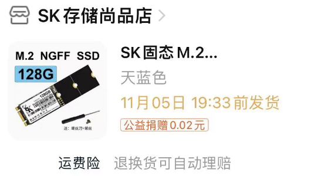
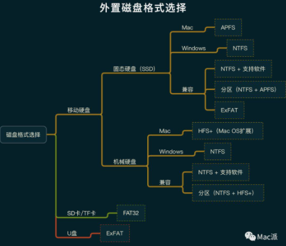
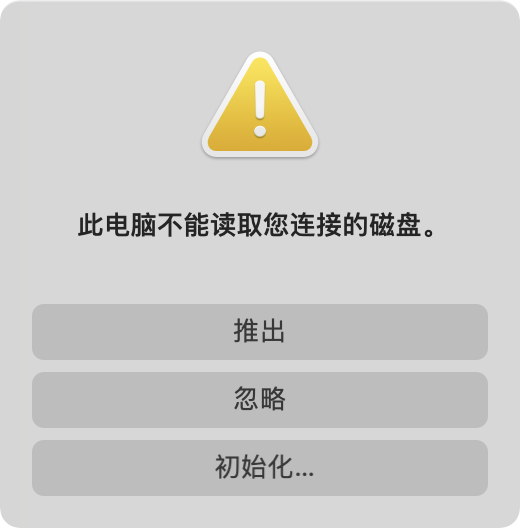
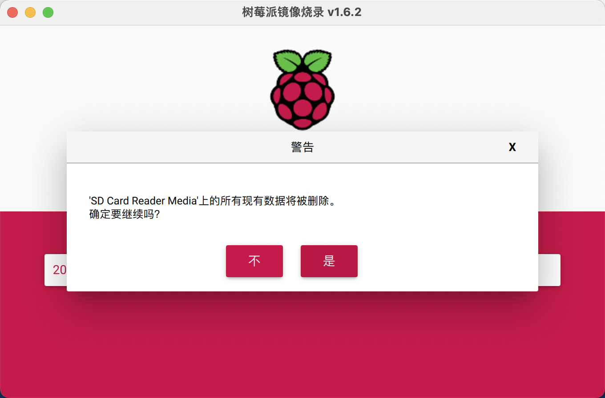
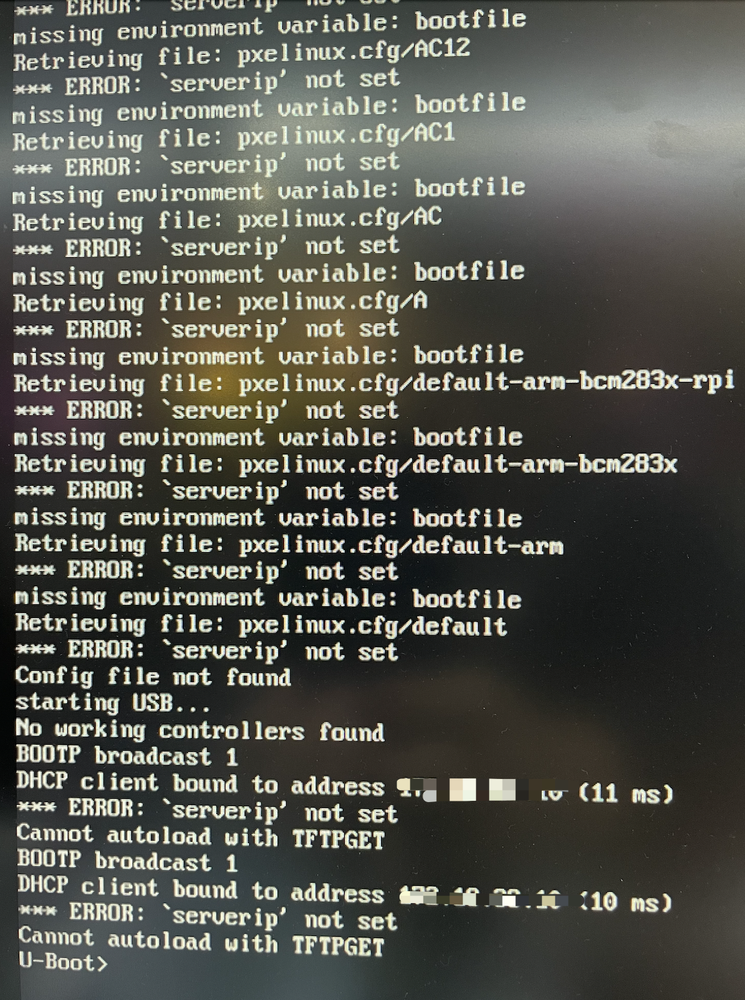
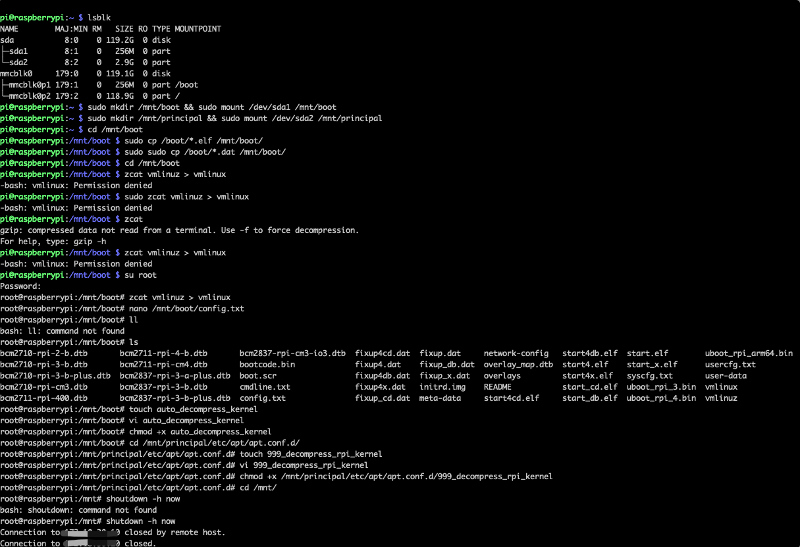
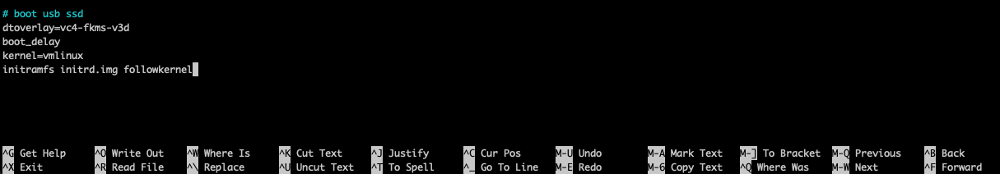
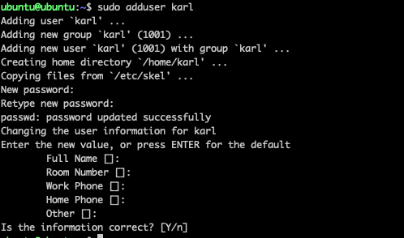
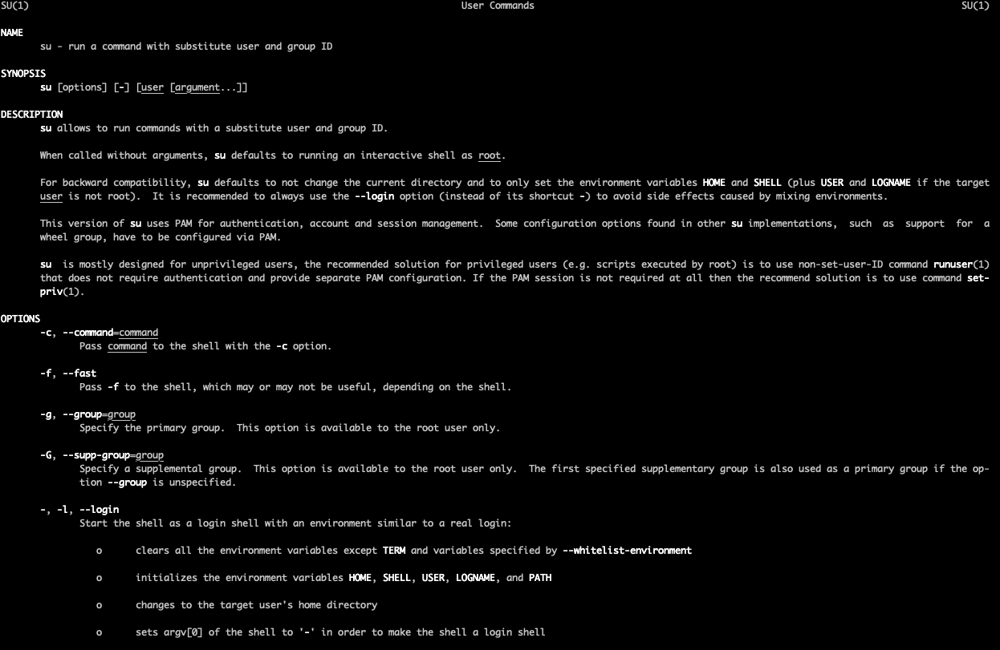

## SSD USB启动树莓派4B ubuntu server 20.04.3 LTS

在上一篇文章中 [树莓派](./articles/2021/2021-10-31-pi.md) 我已经在 SD卡中刷了一个 Ubuntu server 20.04.3 LTS 双十一期间，又在某宝上买了一张 128G 的SSD 如下：




### 赶紧折腾起来！🐯

写在前边，我的pi 4b 是十一月买的

- 没有更新 EEPROM！
- 没有设置 USB 启动，我看了下，默认是sd可用就从sd卡启动，否则从 usb 启动

对于磁盘格式纠结的小伙伴看这里：

[如何给硬盘或 U 盘选择合适的格式呢？](https://www.yinxiang.com/everhub/note/0312ed71-61f5-4c75-9c77-3db0ffdeb613)




这次用了树莓派官方的烧录工具，把 SSD 撞到壳子里以后插上电脑：



遇到这个不用推出。

然后开始烧录系统：



点继续，傻瓜式烧录系统。烧好了SSD 放在一边，现在用不到。


然后打开SD卡上刷好的树莓派系统，插电启动，ssh 连接然后一顿操作失败案例：




一行一行敲键盘：







```bash
# zcat vmlinuz > vmlinux 执行报错：
-bash: vmlinux: Permission denied
# 解决：切换到 root 用户，解决。
```


### Ubuntu20.04 软件源更换

[Ubuntu20.04软件源更换](https://zhuanlan.zhihu.com/p/142014944) from [舟公](https://www.zhihu.com/people/zhou-gong-87-23)

> Ubuntu系统中，软件源文件地址为：/etc/apt/sources.list
>
> 1.备份原来的源，将以前的源备份一下，以防以后可以用的。
>
> sudo cp /etc/apt/sources.list /etc/apt/sources.list.bak
>
> 2.打开/etc/apt/sources.list文件，在前面添加如下条目，并保存。
>
> sudo vim /etc/apt/sources.list（可将vim更换为自己熟悉的编辑器）
>
> ```bash
> #添加阿里源
> deb http://mirrors.aliyun.com/ubuntu/ focal main restricted universe multiverse
> deb-src http://mirrors.aliyun.com/ubuntu/ focal main restricted universe multiverse
> deb http://mirrors.aliyun.com/ubuntu/ focal-security main restricted universe multiverse
> deb-src http://mirrors.aliyun.com/ubuntu/ focal-security main restricted universe multiverse
> deb http://mirrors.aliyun.com/ubuntu/ focal-updates main restricted universe multiverse
> deb-src http://mirrors.aliyun.com/ubuntu/ focal-updates main restricted universe multiverse
> deb http://mirrors.aliyun.com/ubuntu/ focal-proposed main restricted universe multiverse
> deb-src http://mirrors.aliyun.com/ubuntu/ focal-proposed main restricted universe multiverse
> deb http://mirrors.aliyun.com/ubuntu/ focal-backports main restricted universe multiverse
> deb-src http://mirrors.aliyun.com/ubuntu/ focal-backports main restricted universe multiverse
> #添加清华源
> deb https://mirrors.tuna.tsinghua.edu.cn/ubuntu/ focal main restricted universe multiverse
> # deb-src https://mirrors.tuna.tsinghua.edu.cn/ubuntu/ focal main restricted universe multiverse
> deb https://mirrors.tuna.tsinghua.edu.cn/ubuntu/ focal-updates main restricted universe multiverse
> # deb-src https://mirrors.tuna.tsinghua.edu.cn/ubuntu/ focal-updates main restricted universe multiverse
> deb https://mirrors.tuna.tsinghua.edu.cn/ubuntu/ focal-backports main restricted universe multiverse
> # deb-src https://mirrors.tuna.tsinghua.edu.cn/ubuntu/ focal-backports main restricted universe multiverse
> deb https://mirrors.tuna.tsinghua.edu.cn/ubuntu/ focal-security main restricted universe multiverse
> # deb-src https://mirrors.tuna.tsinghua.edu.cn/ubuntu/ focal-security main restricted universe multiverse multiverse
> ```
>
> 3.更新
>
> 更新源
>
> ```bash
> sudo apt-get update
> ```
>
> ```bash
> Reading package lists... Done
> E: Failed to fetch http://mirrors.aliyun.com/ubuntu/dists/focal/main/binary-arm64/Packages  404  Not Found [IP: 222.35.67.238 80]
> E: Failed to fetch http://mirrors.aliyun.com/ubuntu/dists/focal-security/main/binary-arm64/Packages  404  Not Found [IP: 222.35.67.238 80]
> E: Failed to fetch http://mirrors.aliyun.com/ubuntu/dists/focal-updates/main/binary-arm64/Packages  404  Not Found [IP: 222.35.67.238 80]
> E: Failed to fetch http://mirrors.aliyun.com/ubuntu/dists/focal-proposed/main/binary-arm64/Packages  404  Not Found [IP: 222.35.67.238 80]
> E: Failed to fetch http://mirrors.aliyun.com/ubuntu/dists/focal-backports/main/binary-arm64/Packages  404  Not Found [IP: 222.35.67.238 80]
> E: Failed to fetch https://mirrors.tuna.tsinghua.edu.cn/ubuntu/dists/focal/main/binary-arm64/Packages  404  Not Found [IP: 101.6.15.130 443]
> E: Failed to fetch https://mirrors.tuna.tsinghua.edu.cn/ubuntu/dists/focal-updates/main/binary-arm64/Packages  404  Not Found [IP: 101.6.15.130 443]
> E: Failed to fetch https://mirrors.tuna.tsinghua.edu.cn/ubuntu/dists/focal-backports/main/binary-arm64/Packages  404  Not Found [IP: 101.6.15.130 443]
> E: Failed to fetch https://mirrors.tuna.tsinghua.edu.cn/ubuntu/dists/focal-security/main/binary-arm64/Packages  404  Not Found [IP: 101.6.15.130 443]
> E: Some index files failed to download. They have been ignored, or old ones used instead.
> ```
>
> 

[清华大学 Ubuntu 镜像使用帮助](https://mirrors.tuna.tsinghua.edu.cn/help/ubuntu/)

```bash
# 默认注释了源码镜像以提高 apt update 速度，如有需要可自行取消注释
deb https://mirrors.tuna.tsinghua.edu.cn/ubuntu/ focal main restricted universe multiverse
# deb-src https://mirrors.tuna.tsinghua.edu.cn/ubuntu/ focal main restricted universe multiverse
deb https://mirrors.tuna.tsinghua.edu.cn/ubuntu/ focal-updates main restricted universe multiverse
# deb-src https://mirrors.tuna.tsinghua.edu.cn/ubuntu/ focal-updates main restricted universe multiverse
deb https://mirrors.tuna.tsinghua.edu.cn/ubuntu/ focal-backports main restricted universe multiverse
# deb-src https://mirrors.tuna.tsinghua.edu.cn/ubuntu/ focal-backports main restricted universe multiverse
deb https://mirrors.tuna.tsinghua.edu.cn/ubuntu/ focal-security main restricted universe multiverse
# deb-src https://mirrors.tuna.tsinghua.edu.cn/ubuntu/ focal-security main restricted universe multiverse

# 预发布软件源，不建议启用
# deb https://mirrors.tuna.tsinghua.edu.cn/ubuntu/ focal-proposed main restricted universe multiverse
# deb-src https://mirrors.tuna.tsinghua.edu.cn/ubuntu/ focal-proposed main restricted universe multiverse
```

执行 ` sudo apt-get update` 后：

```bash
Reading package lists... Done
E: Failed to fetch https://mirrors.tuna.tsinghua.edu.cn/ubuntu/dists/focal/main/binary-arm64/Packages  404  Not Found [IP: 101.6.15.130 443]
E: Failed to fetch https://mirrors.tuna.tsinghua.edu.cn/ubuntu/dists/focal-updates/main/binary-arm64/Packages  404  Not Found [IP: 101.6.15.130 443]
E: Failed to fetch https://mirrors.tuna.tsinghua.edu.cn/ubuntu/dists/focal-backports/main/binary-arm64/Packages  404  Not Found [IP: 101.6.15.130 443]
E: Failed to fetch https://mirrors.tuna.tsinghua.edu.cn/ubuntu/dists/focal-security/main/binary-arm64/Packages  404  Not Found [IP: 101.6.15.130 443]
E: Some index files failed to download. They have been ignored, or old ones used instead.
```


### Ubuntu 用户

#### 创建用户



该命令将创建新用户的主目录，并将文件从`/etc/skel`复制到该主目录。 在主目录中，用户可以编写，编辑和删除文件和目录。

如果您希望新用户能够执行管理任务，则需要 [将该用户添加到sudo组](https://www.myfreax.com/how-to-add-user-to-group-in-linux/)：

```bash
sudo usermod -aG sudo username
```

#### 删除用户

在Ubuntu中，您可以使用两个命令删除用户帐户：`userdel`及其交互式前端`deluser`。

要删除用户，请调用`deluser`命令并传递用户名作为参数：

```bash
sudo deluser username
```

以上命令不会删除用户文件。

如果要删除用户及其主目录和邮件，请使用`--remove-home`标志：

```bash
sudo deluser --remove-home username
```


#### 切换用户




### 参考

- [Make Ubuntu server 20.04 boot from an SSD on Raspberry Pi 4](https://medium.com/@zsmahi/make-ubuntu-server-20-04-boot-from-an-ssd-on-raspberry-pi-4-33f15c66acd4)
- [raspberrypi documentation](https://www.raspberrypi.com/documentation/computers/raspberry-pi.html)
- [raspi-config](https://www.raspberrypi.com/documentation/computers/configuration.html#raspi-config)
- [nano](http://write.flossmanuals.net/command-line/nano/)

