## Seafile

### Ubuntu Server 安装 seafile

按照官方文档即可 [Installation of Seafile Server Community Edition with MySQL/MariaDB](https://manual.seafile.com/deploy/using_mysql/)

- 把 MySQL 安装好，我使用 8.+ 版本不习惯，选择了5.7.+ 版本

  - 对 MySQL 不熟悉的，会发现 8.+ 版本语法的改动导致你从网上找到的一些SQL语句变得不合法：

    ```mysql
    # update user set authentication_string=password("你的密码") where user="root";  会报语法错误
    ALTER user 'root'@'localhost' IDENTIFIED BY 'newpassward'; # newpassward 新密码
    ```

- 选对安装包 ps.官方提拱了 [seafile-server-installer 脚本](https://github.com/haiwen/seafile-server-installer)可以参考一下

  

#### 开始敲命令：


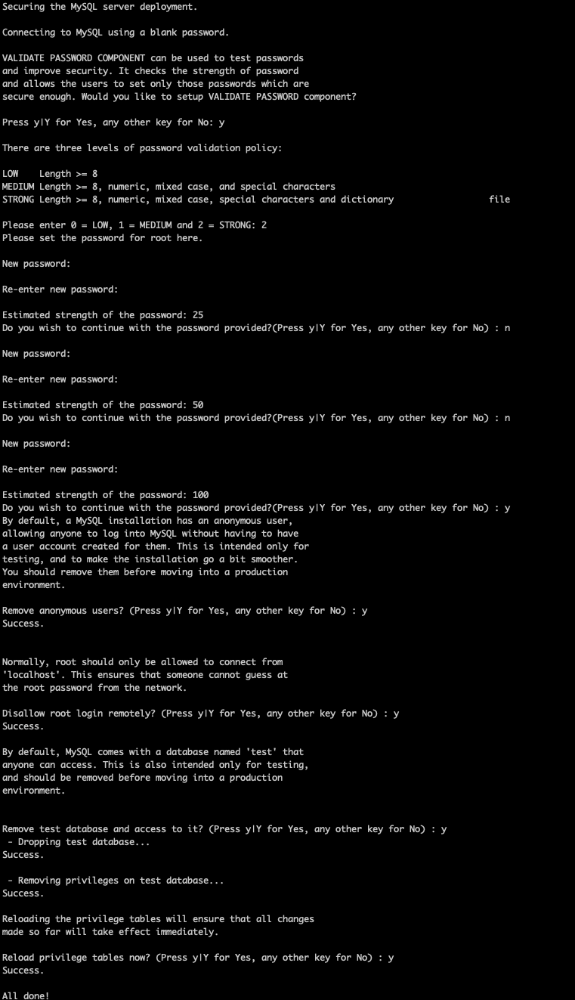

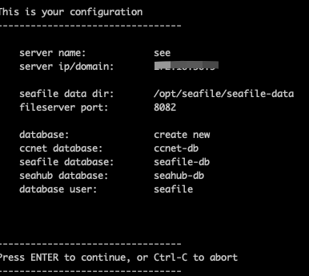

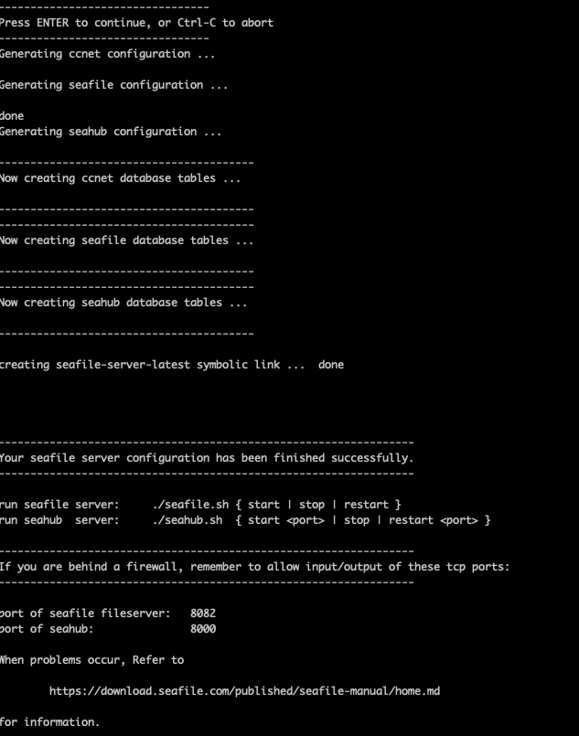

#### 因为没有选对安装包

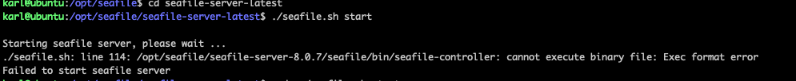

#### 树莓派需要 armv8版的二进制文件，或者在树莓派从源码编译安装

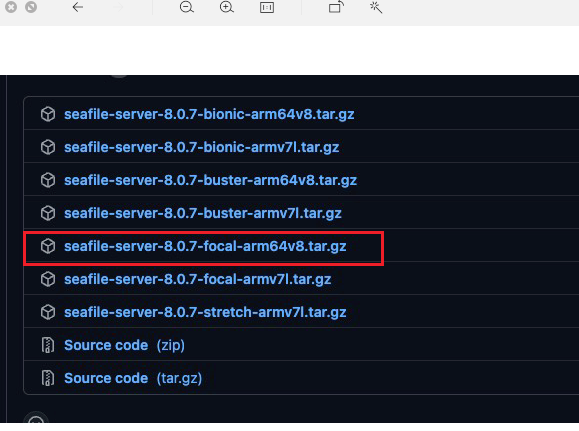

#### 小插曲，中间电脑掉网了

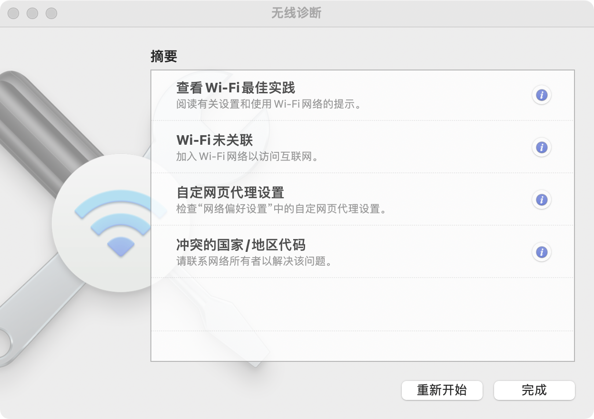

#### 无法启动 seahub

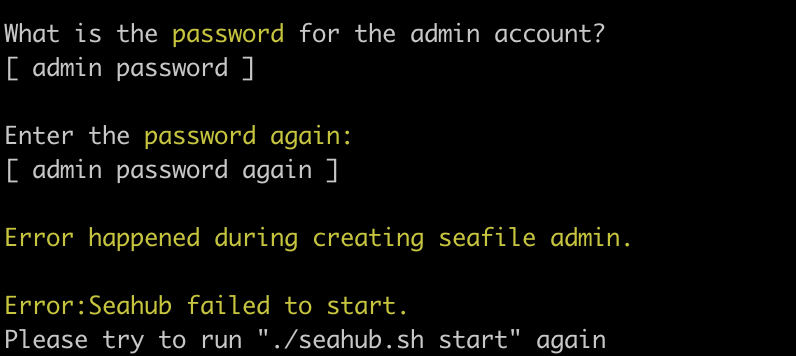

#### 创建管理员失败

```mysql
ALTER USER 'seafile'@'localhost' IDENTIFIED BY 'your_password' PASSWORD EXPIRE NEVER;
ALTER USER 'seafile'@'localhost' IDENTIFIED WITH mysql_native_password BY 'your_password';
FLUSH PRIVILEGES;
ALTER USER 'seafile'@'localhost' IDENTIFIED BY 'your_password';
quit;
```


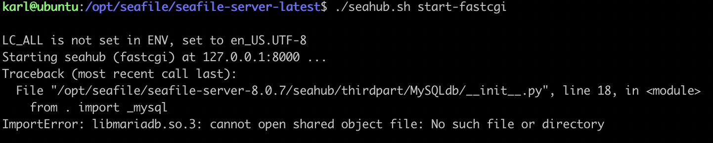

```bash
# 找到文件
find  /  -name  lib**.so   (缺失的动态链接库)  

# 建立软链接
ln -s  /path/to/lib**.so   /usr/lib

sudo ldconfig
```


#### Mysql 8.+

> ERROR 1045 (28000): Access denied for user 'root'@'localhost' 
>
> ERROR 1698 (28000): Access denied for user 'root'@'localhost'
>
> 参考：https://www.cnblogs.com/cpl9412290130/p/9583868.html

##### 卸载 

````bash
sudo apt-get autoremove --purge mysql-server 
sudo apt-get remove mysql-common
sudo rm -rf /etc/mysql/ /var/lib/mysql
````

##### 清理残留数据

```bash
dpkg -l | grep ^rc| awk '{print $2}' | sudo xargs dpkg -P
sudo apt autoremove
sudo apt autoclean
```


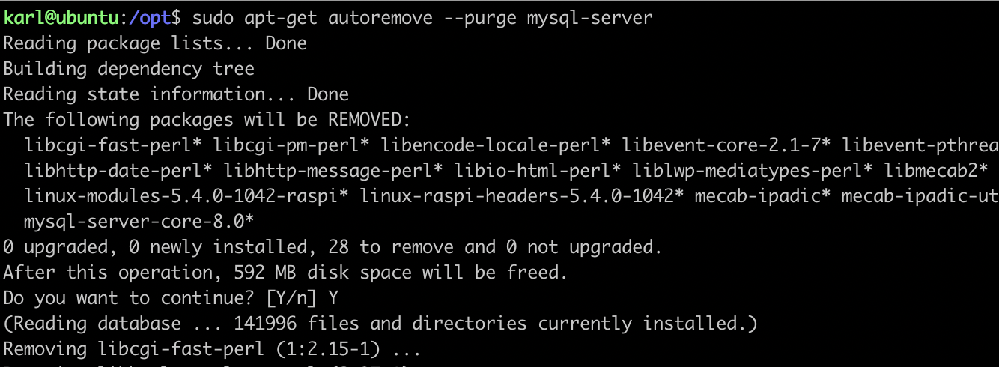

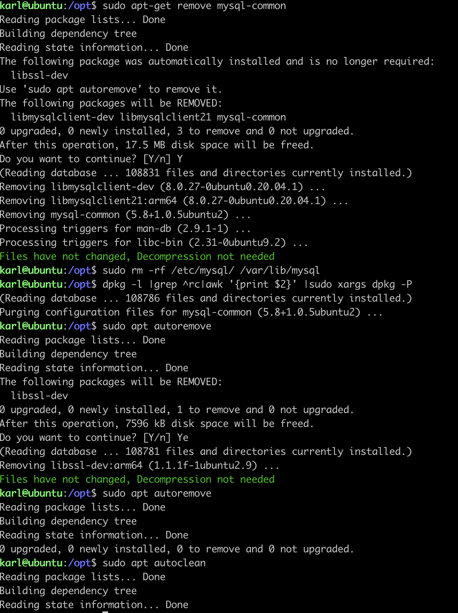

#### Mysql 5.7.32

- arm64 指令集的文件

```bash
karl@ubuntu:/opt/mysqldeb$ tree
.
├── libevent-core-2.1-6_2.1.8-stable-4build1_arm64.deb
├── mysql-client-5.7_5.7.32-0ubuntu0.18.04.1_arm64.deb
├── mysql-client-core-5.7_5.7.32-0ubuntu0.18.04.1_arm64.deb
├── mysql-server-5.7_5.7.32-0ubuntu0.18.04.1_arm64.deb
└── mysql-server-core-5.7_5.7.32-0ubuntu0.18.04.1_arm64.deb

0 directories, 5 files
```

 [launchpad.net](https://launchpad.net) 找到的

```bash
wget http://launchpadlibrarian.net/503346131/mysql-server-core-5.7_5.7.32-0ubuntu0.18.04.1_arm64.deb
wget http://launchpadlibrarian.net/503346130/mysql-server-5.7_5.7.32-0ubuntu0.18.04.1_arm64.deb
wget http://launchpadlibrarian.net/355861262/libevent-core-2.1-6_2.1.8-stable-4build1_arm64.deb
wget http://launchpadlibrarian.net/503346128/mysql-client-5.7_5.7.32-0ubuntu0.18.04.1_arm64.deb
wget http://launchpadlibrarian.net/503346129/mysql-client-core-5.7_5.7.32-0ubuntu0.18.04.1_arm64.deb
```


- 安装mysql

```bash
# dpkg 安装
dpkg -i *.deb
# 报依赖关系的错误，我们可以使用以下的命令修复安装:sudo  apt-get  install  -f

# 如果要卸载安装的应用我们通过“sudo  dpkg  -l”查看已经安装的软件，并找到自己的安装的软件名。

```

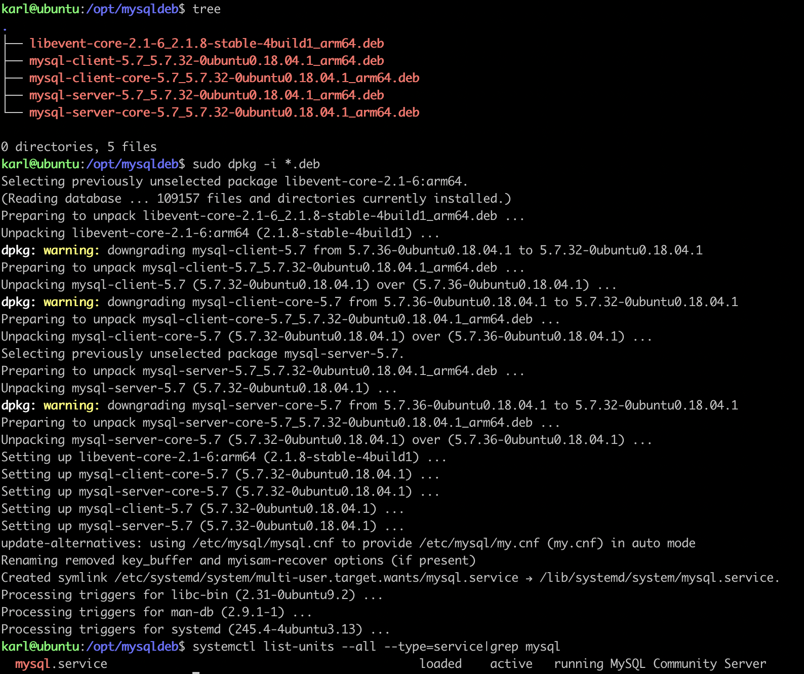

- 访问mysql

  ```bash
  karl@ubuntu:/opt$ mysql -uroot -p
  Enter password:
  Welcome to the MySQL monitor.  Commands end with ; or \g.
  Your MySQL connection id is 5
  Server version: 5.7.32-0ubuntu0.18.04.1 (Ubuntu)
  
  Copyright (c) 2000, 2020, Oracle and/or its affiliates. All rights reserved.
  
  Oracle is a registered trademark of Oracle Corporation and/or its
  affiliates. Other names may be trademarks of their respective
  owners.
  
  Type 'help;' or '\h' for help. Type '\c' to clear the current input statement.
  
  mysql> show databases;
  +--------------------+
  | Database           |
  +--------------------+
  | information_schema |
  | mysql              |
  | performance_schema |
  | sys                |
  +--------------------+
  4 rows in set (0.00 sec)
  ```

  

  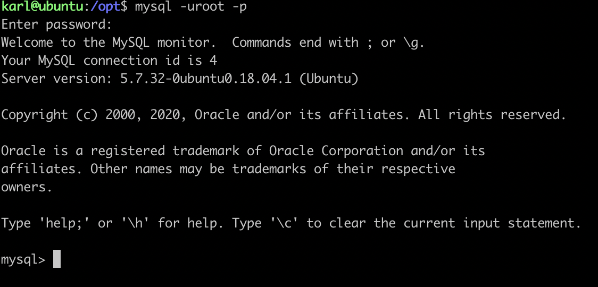

- 用到的几个指令

```bash
# 检查状态 sudo netstat -tap | grep mysql
# 修改root的plugin和密码 select user,plugin,authentication_string from user;
# update user set plugin = 'mysql_native_password' where user='root';
# update user set authentication_string=PASSWORD('admin') where user='root';
# 退出mysql命令行，"exit"
# 重启数据库服务：sudo /etc/init.d/mysql restart
# 正常登录mysql mysql -uroot -p
# 查看mysql状态  sudo service mysql status
# 启动mysql服务  sudo service mysql start
# 停止mysql服务 sudo service mysql stop
# 重启mysql服务 sudo service msyql restart
```


#### 重新安装 seafile

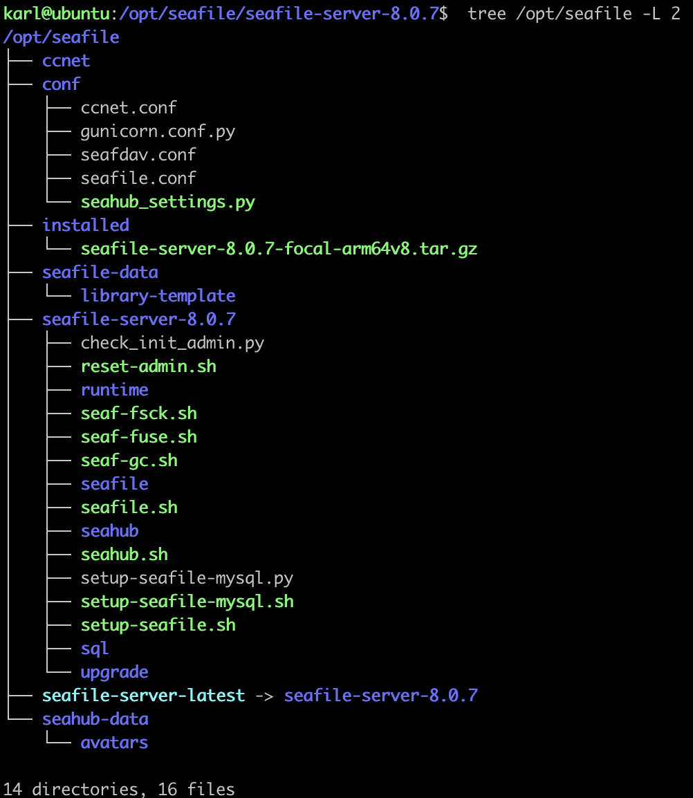


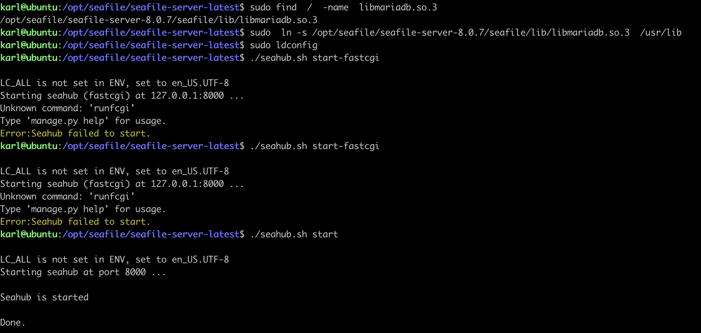


没有使用 Nginx的反向代理，直接按照官网的方法修改

```bash
# conf/ccnet.conf (if you use 8.0.x or 7.1.x): Add port 8000 to the SERVICE_URL (i.e., 
SERVICE_URL = http://192.168.1.3:8000/

# conf/gunicorn.conf:
# default localhost:8000
bind = "0.0.0.0:8001"

```

Ps. 开了防火墙的注意也开一下对应的端口

```bash
sudo ufw status
sudo ufw allow 8000
sudo ufw allow 8001
sudo ufw reload
```


#### 小结

- `./seahub.sh` 执行失败，报软连接的那 error 我网上查了半天资料

- 数据可根据选择来吧，我装的的 v5.7.32 主要是MYSQL8语句老报语法错误，我才卸载了8+ 装回了5.7+
- 中间遇到了一些小问题，比如网络：网关、防火墙。。。反正就是掉网了