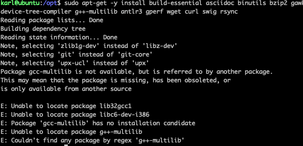
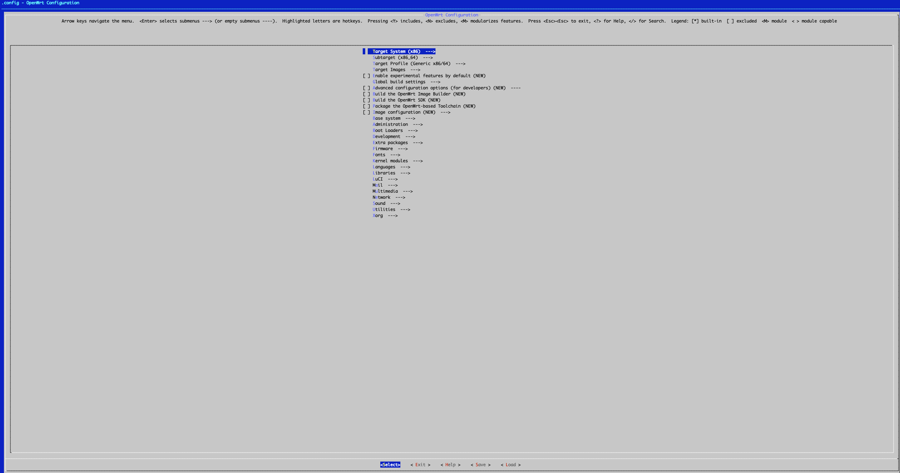
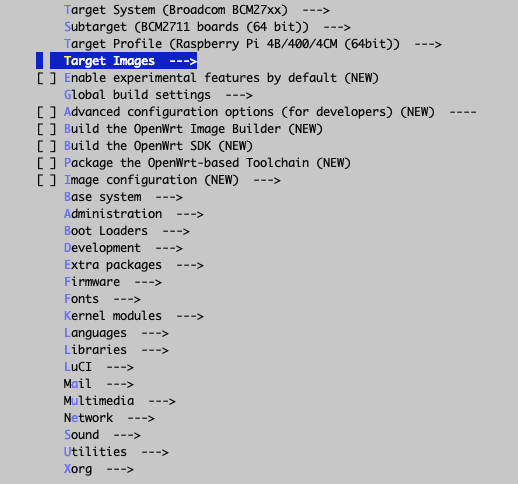
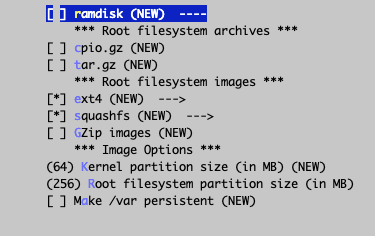
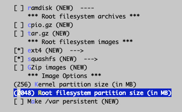
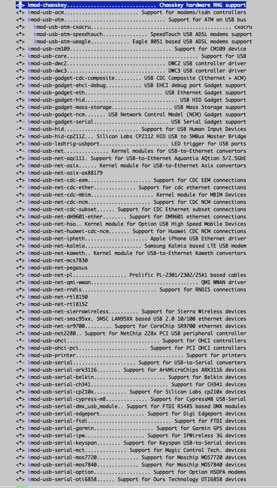
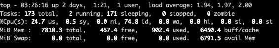
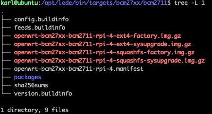

## 树莓派 4B 8G Ubuntu Server 20.04.3 LTS 编译 openwrt

### [coolsnowwolf/lede](https://github.com/coolsnowwolf/lede)

### 如何编译自己需要的 OpenWrt 固件

### 注意：

1. **不**要用 **root** 用户进行编译！！！
2. 国内用户编译前最好准备好梯子
3. 默认登陆IP 192.168.1.1 密码 password

### 编译命令如下:

1. 首先装好 Ubuntu 64bit，推荐 Ubuntu 20.04 LTS x64

2. 命令行输入 `sudo apt-get update` ，然后输入 `sudo apt-get -y install build-essential asciidoc binutils bzip2 gawk gettext git libncurses5-dev libz-dev patch python3 python2.7 unzip zlib1g-dev lib32gcc1 libc6-dev-i386 subversion flex uglifyjs git-core gcc-multilib p7zip p7zip-full msmtp libssl-dev texinfo libglib2.0-dev xmlto qemu-utils upx libelf-dev autoconf automake libtool autopoint device-tree-compiler g++-multilib antlr3 gperf wget curl swig rsync`

3. 使用 `git clone https://github.com/coolsnowwolf/lede` 命令下载好源代码，然后 `cd lede` 进入目录

4. ```
   ./scripts/feeds update -a
   ./scripts/feeds install -a
   make menuconfig
   ```

5. `make -j8 download V=s` 下载dl库（国内请尽量全局科学上网）

6. 输入 `make -j1 V=s` （-j1 后面是线程数。第一次编译推荐用单线程）即可开始编译你要的固件了。

本套代码保证肯定可以编译成功。里面包括了 R21 所有源代码，包括 IPK 的。

# 你可以自由使用，但源码编译二次发布请注明我的 GitHub 仓库链接。谢谢合作！

搜到的网上比较有用的资料：

> ### [使用arm架构编译openwrt，很多问题](https://www.right.com.cn/forum/thread-4057579-1-1.html)
>
> 不知道论坛里的大佬们有没有研究过，用arm架构的设备编译openwrt，比如n1，比如手机。不是不能用action云编译，电脑配置也足够编译，只不过想玩玩，尝试达到N1自己编译自己然后自己升级的目的，可惜半途而废了。
> 目前根据别人的研究，arm版的ubuntu的所有编译依赖都安装上了，如下：
>
> ```bash
> apt update&&apt upgrade -y&&apt install -y gcc-multilib-arm-linux-gnueabihf g++-multilib-arm-linux-gnueabihf build-essential asciidoc binutils bzip2 gawk gettext git libncurses5-dev libz-dev patch python3 python2.7 unzip zlib1g-dev subversion flex uglifyjs git-core p7zip p7zip-full msmtp libssl-dev texinfo libglib2.0-dev xmlto qemu-utils upx libelf-dev autoconf automake libtool autopoint device-tree-compiler antlr3 gperf wget curl swig rsync
> ```
>
> 
>
> 但是在编译过程中遇到了非常多问题，我解决了一两个，由于水平实在有限，还是不能编译出包。
>
> - 编译ucl的时候，提示无法获取到系统架构，这个问题百度了一下解决了，需要在./configure 后加 --build=arm-linux，我的方法是修改tools/ucl/Makefile 中./configure一行。
> - 编译到qemu时，提示 Unsupported CPU = aarch64 。我查了很多，qemu最新的源码可以在arm下编译成功，故替换feeds/packages/utils/qemu 到tools/qemu
> - 换编译新三固件，编译到golang ，提示Makefile:380: *** go-bootstrap cannot be installed on linux/arm64. Stop.解决方法为apt install golang-go,然后配置文件修改languages-go-configation-external bootstrap go root directroy ，添加/usr/local/go，或者安装后直接编辑config，找到并修改CONFIG_GOLANG_EXTERNAL_BOOTSTRAP_ROOT="/usr/bin/go"
> - 编译node时，提示 cc1:error:unrecognized command line option "-m64"，makefile 的109行--dest-cpu=$(NODEJS_CPU) \ 换成--dest-cpu=arm64 \
> - naiveproxy报错，删除lean/feeds/helloworld/naiveproxy/src/init_[env.sh](http://env.sh/) 的22行： [ "$(uname)" != "Linux" -o "$(uname -m)" != "x86_64" ] && { echo -e "Support Linux AMD64 only."; exit 1; }；最新版naiveproxy-92.0.4515.107-1删除这项已经没有用了，仍旧报错：
>
> ( cd "/home/123/lede/build_dir/target-x86_64_musl/naiveproxy-92.0.4515.107-1/src" ; . ../init_env.sh "x86_64" "" "" "/home/123/lede/staging_dir/toolchain-x86_64_gcc-8.4.0_musl" ; export naive_flags+=" ${naive_ccache_flags}" ; mkdir -p "out" ; ./gn/out/gn gen "out/Release" --args="${naive_flags}" --script-executable="python" ; )
> bash: ./gn/out/gn: cannot execute binary file: Exec format error
>
> 
> 以上问题的部分解决方案感谢@[mike22437120](https://www.right.com.cn/forum/space-uid-192402.html) ，最基础的编译已经能通过，另外选的luci等部分问题不好解决，直接取消编译，大部分常用插件编译通过
> 各位大佬群策群力，如能有大佬根据各种解决方案向lean提交commit以支持arm编译就更好了
>
> 
> 重新clone后全新编译，在刚开始就出错，编译libressl时，编译到libcrypto提示
> aes/aes-elf-armv4.S: Assembler messages:
> aes/aes-elf-armv4.S:3: Error: unknown pseudo-op: `.code'
>
> aes/aes-elf-armv4.S:72: Error: junk at end of line, first unrecognized character is `@'
> 一大堆这样的错误。前一段时间编译并没有问题，不知道为啥突然出问题了
> 0320更新：换回18.04，然后重新打包libressl-3.3.1为3.0.2，替换掉，编译成功。应该是18.04的gcc可用


### 开始编译 openwrt



```bash
sudo apt install  -y gcc-multilib-arm-linux-gnueabihf g++-multilib-arm-linux-gnueabihf build-essential asciidoc binutils bzip2 gawk gettext git libncurses5-dev libz-dev patch python3 python2.7 unzip zlib1g-dev subversion flex uglifyjs git-core p7zip p7zip-full msmtp libssl-dev texinfo libglib2.0-dev xmlto qemu-utils upx libelf-dev autoconf automake libtool autopoint device-tree-compiler antlr3 gperf wget curl swig rsync
```


```bash
karl@ubuntu:/opt/lede$ sudo ./scripts/feeds update -a
Updating feed 'packages' from 'https://github.com/coolsnowwolf/packages' ...
Cloning into './feeds/packages'...
remote: Enumerating objects: 6197, done.
remote: Counting objects: 100% (6197/6197), done.
remote: Compressing objects: 100% (5167/5167), done.
remote: Total 6197 (delta 222), reused 3550 (delta 140), pack-reused 0
Receiving objects: 100% (6197/6197), 4.21 MiB | 1.35 MiB/s, done.
Resolving deltas: 100% (222/222), done.
Updating feed 'luci' from 'https://github.com/coolsnowwolf/luci' ...
Cloning into './feeds/luci'...
remote: Enumerating objects: 3791, done.
remote: Counting objects: 100% (3791/3791), done.
remote: Compressing objects: 100% (1734/1734), done.
remote: Total 3791 (delta 827), reused 3575 (delta 769), pack-reused 0
Receiving objects: 100% (3791/3791), 3.63 MiB | 768.00 KiB/s, done.
Resolving deltas: 100% (827/827), done.
Updating feed 'routing' from 'https://git.openwrt.org/feed/routing.git' ...
Cloning into './feeds/routing'...
remote: Enumerating objects: 384, done.
remote: Counting objects: 100% (384/384), done.
remote: Compressing objects: 100% (313/313), done.
remote: Total 384 (delta 26), reused 287 (delta 17)
Receiving objects: 100% (384/384), 256.16 KiB | 472.00 KiB/s, done.
Resolving deltas: 100% (26/26), done.
Updating feed 'telephony' from 'https://git.openwrt.org/feed/telephony.git' ...
Cloning into './feeds/telephony'...
remote: Enumerating objects: 279, done.
remote: Counting objects: 100% (279/279), done.
remote: Compressing objects: 100% (266/266), done.
remote: Total 279 (delta 10), reused 75 (delta 1)
Receiving objects: 100% (279/279), 180.92 KiB | 363.00 KiB/s, done.
Resolving deltas: 100% (10/10), done.
Create index file './feeds/packages.index'
Checking 'working-make'... ok.
Checking 'case-sensitive-fs'... ok.
Checking 'proper-umask'... ok.
Checking 'gcc'... ok.
Checking 'working-gcc'... ok.
Checking 'g++'... ok.
Checking 'working-g++'... ok.
Checking 'ncurses'... ok.
Checking 'perl-data-dumper'... ok.
Checking 'perl-findbin'... ok.
Checking 'perl-file-copy'... ok.
Checking 'perl-file-compare'... ok.
Checking 'perl-thread-queue'... ok.
Checking 'tar'... ok.
Checking 'find'... ok.
Checking 'bash'... ok.
Checking 'xargs'... ok.
Checking 'patch'... ok.
Checking 'diff'... ok.
Checking 'cp'... ok.
Checking 'seq'... ok.
Checking 'awk'... ok.
Checking 'grep'... ok.
Checking 'egrep'... ok.
Checking 'getopt'... ok.
Checking 'stat'... ok.
Checking 'unzip'... ok.
Checking 'bzip2'... ok.
Checking 'wget'... ok.
Checking 'install'... ok.
Checking 'perl'... ok.
Checking 'python2-cleanup'... ok.
Checking 'python'... ok.
Checking 'python3'... ok.
Checking 'git'... ok.
Checking 'file'... ok.
Checking 'rsync'... ok.
Checking 'which'... ok.
Checking 'ldconfig-stub'... ok.
Collecting package info: done
Collecting target info: done
Create index file './feeds/luci.index'
Collecting package info: done
Collecting target info: done
Create index file './feeds/routing.index'
Collecting package info: done
Collecting target info: done
Create index file './feeds/telephony.index'
Collecting package info: done
Collecting target info: done
```


```bash
karl@ubuntu:/opt/lede$ sudo ./scripts/feeds install -a
Collecting package info: done
Collecting target info: done
WARNING: Makefile 'package/lean/amule/Makefile' has a dependency on 'libpng', which does not exist
WARNING: Makefile 'package/lean/amule/Makefile' has a dependency on 'libupnp', which does not exist
WARNING: Makefile 'package/lean/amule/Makefile' has a build dependency on 'libgd', which does not exist
WARNING: Makefile 'package/lean/antileech/Makefile' has a build dependency on 'libgd', which does not exist
WARNING: Makefile 'package/lean/autocore/Makefile' has a dependency on 'bc', which does not exist
WARNING: Makefile 'package/lean/autocore/Makefile' has a dependency on 'lm-sensors', which does not exist
WARNING: Makefile 'package/lean/automount/Makefile' has a dependency on 'antfs-mount', which does not exist
WARNING: Makefile 'package/lean/autosamba/Makefile' has a dependency on 'luci-app-samba', which does not exist
WARNING: Makefile 'package/lean/autosamba/Makefile' has a dependency on 'wsdd2', which does not exist
WARNING: Makefile 'package/lean/baidupcs-web/Makefile' has a build dependency on 'golang/host', which does not exist
WARNING: Makefile 'package/utils/busybox/Makefile' has a dependency on 'libpam', which does not exist
WARNING: Makefile 'package/utils/busybox/Makefile' has a dependency on 'libpam', which does not exist
```





> ### [树莓派4B 亲手打造一款Openwrt软路由(带编译固件-超详细) - RaspberryPi硬核系列(三)](https://www.bilibili.com/read/cv9714518)
>
> #### 开始配置系统，勾选树莓派 三个重要参数 ↓ (上下键选择 回车进入 空格选择目标)
>
> Target System ---> Broadcom BCM27xx  
>
> Subtarget ---> BCM2711 boards (64 bit)
>
> Target Profile ---> Raspberry Pi 4B (64bit)
>
> 树莓派型号选择
> 文件系统大小修改(根据SD卡大小设置就行，kernel大小一般256足够了)
>
> 镜像 文件系统大小修改
>
> 
>
> #### 添加USB设备驱动支持（例如USB网卡，USB集线器，USB无线网络等）
>
> (USB支持目录选项建议全选，方便，不会导致编译失败)
>
> USB Support
> 
>
> #### LUCI插件 (插件app页面 原版已经继承了很多实用的app)
> 常用的插件 👇
>
> luci-app-adbyby-plus 广告过滤插件 (暂不支持Arm x64)
>
> luci-app-docker 容器
>
> luci-app-frpc 内网穿透客户端
>
> luci-app-nps 内网穿透插件
>
> luci-app-kodexplorer 可道云
>
> luci-app-n2n_v2  点对点内网穿透
>
> luci-app-ddns 动态域名解析
>
> luci-app-mwan3helper  分流助手(多运营商网络)
>
> luci-app-netdata 网络监控插件
>
> luci-app-samba SMB网络共享
>
> luci-app-syncdial 多拨插件
>
> luci-app-unblockmusic
>
> luci-app-ttyd 网页终端插件
>
> luci-app-usb-printer 打印机插件
>
> luci-app-vlmcsd KMS激活微软全家通
>
> luci-app-wol 网络唤醒
>
> luci-app-ssr-plus 科学上网插件
>
> #### 附开启科学上网插件神秘代码
>
> #在lede目录下执行 也可打开feeds.conf.default文件将helloworld前面的#删除即可
> echo 'src-git helloworld https://github.com/fw876/helloworld'>>./feeds.conf.default
>
> #执行包更新
> ./scripts/feeds update -a && ./scripts/feeds install -a
>
> #再次打开配置菜单LUCI-> Application中勾选即可
> make menuconfig
>
> #### 其他插件可以下载到 lede/package 文件夹下再打开make menuconfig配置菜单即可找到
>
> #以下插件在 lede/package 目录下执行即可
> #科学上网插件
> git clone --depth=1 https://github.com/xiaorouji/openwrt-passwall
> git clone --depth=1 -b master https://github.com/vernesong/OpenClash
>
> #大学生校园网mentohust
> git clone --depth=1 https://github.com/BoringCat/luci-app-mentohust
> git clone --depth=1 https://github.com/KyleRicardo/MentoHUST-OpenWrt-ipk
>
> #广告过滤插件
> git clone https://github.com/rufengsuixing/luci-app-adguardhome
>
> #应用过滤
> git clone https://github.com/destan19/OpenAppFilter
>
> #Lienol整理的一堆实用的插件
> git clone https://github.com/Lienol/openwrt-package
>
> #### web主题 （建议全选 还有很多漂亮的主题自行查阅下载）
>
> openwrt主题
>          其他设置就不做举例了，到这一步也就可以配置出一个功能基本齐全的路由系统了，如果觉得这样很麻烦可使用我写的一个简单脚本 一键环境下载安装，源码拉取，常用app集成,自动编译(单线程、多线程编译)，后期使用一键更新openwrt源码和插件app（只需配置好系统），很省心，脚本已经放在github 需要的自取 地址: https://github.com/bigbugcc/Openwrt         后期还会做一期非常详细的openwrt使用教程，以及已经在开发的openwrt云编译系统{ 在网页端配置选项，一键编译，邮箱发送固件 } 后期会考虑开源。 











#### 问题

1. `sudo make -j1 V=s`

```bash
configure: error: you should not run configure as root (set FORCE_UNSAFE_CONFIGURE=1 in environment to bypass this check)
See `config.log' for more details
make[3]: *** [Makefile:32: /opt/lede/build_dir/host/tar-1.32/.configured] Error 1
make[3]: Leaving directory '/opt/lede/tools/tar'
time: tools/tar/compile#34.16#39.02#74.41
    ERROR: tools/tar failed to build.
make[2]: *** [tools/Makefile:159: tools/tar/compile] Error 1
make[2]: Leaving directory '/opt/lede'
make[1]: *** [tools/Makefile:155: /opt/lede/staging_dir/host/stamp/.tools_compile_yyynyynnyyyynyyyyyynyynnyyynyyyyyyyyyyyyyyyyynynnyyyyyyyyyy] Error 2
make[1]: Leaving directory '/opt/lede'
make: *** [/opt/lede/include/toplevel.mk:230: world] Error 2
```

**不要用 root 用户 git 和编译！！！** 哎，手贱了，本来文档上写的也是  `make -j1 V=s`

```bash
# 为整个文件夹添加你的权限
sudo chown -R $USER xxx
# or
sudo export FORCE_UNSAFE_CONFIGURE=1

```


```bash
karl@ubuntu:/opt/lede$ make -j1 V=s
mv: replace '/opt/lede/tmp/info/.files-packageinfo.mk', overriding mode 0644 (rw-r--r--)?
...
[ 73%] Building CXX object Source/CMakeFiles/CMakeLib.dir/cmQtAutoGenInitializer.cxx.o
[ 73%] Building CXX object Source/CMakeFiles/CMakeLib.dir/cmQtAutoMocUic.cxx.o
[ 73%] Building CXX object Source/CMakeFiles/CMakeLib.dir/cmQtAutoRcc.cxx.o
[ 73%] Building CXX object Source/CMakeFiles/CMakeLib.dir/cmRST.cxx.o
[ 73%] Building CXX object Source/CMakeFiles/CMakeLib.dir/cmRuntimeDependencyArchive.cxx.o
[ 73%] Building CXX object Source/CMakeFiles/CMakeLib.dir/cmScriptGenerator.cxx.o
[ 73%] Building CXX object Source/CMakeFiles/CMakeLib.dir/cmSourceFile.cxx.o
[ 74%] Building CXX object Source/CMakeFiles/CMakeLib.dir/cmSourceFileLocation.cxx.o
[ 74%] Building CXX object Source/CMakeFiles/CMakeLib.dir/cmSourceGroup.cxx.o
[ 74%] Building CXX object Source/CMakeFiles/CMakeLib.dir/cmStandardLevelResolver.cxx.o
[ 74%] Building CXX object Source/CMakeFiles/CMakeLib.dir/cmState.cxx.o
[ 74%] Building CXX object Source/CMakeFiles/CMakeLib.dir/cmStateDirectory.cxx.o
[ 74%] Building CXX object Source/CMakeFiles/CMakeLib.dir/cmStateSnapshot.cxx.o
[ 74%] Building CXX object Source/CMakeFiles/CMakeLib.dir/cmStringAlgorithms.cxx.o
[ 74%] Building CXX object Source/CMakeFiles/CMakeLib.dir/cmSystemTools.cxx.o
...
aging_dir/host/include    -I./.. -pthread  -Wall -Wpointer-arith -Wno-unused -Wunused-value -Wunused-variable -Wunused-function -Wno-switch -Wno-char-subscripts -Wempty-body -Wunused-but-set-parameter -Wunused-but-set-variable -Wno-sign-compare -Wno-error=maybe-uninitialized -Wsuggest-override -Wimplicit-fallthrough=3 -Wduplicated-cond -Wshadow=local -Wdeprecated-copy -Wdeprecated-copy-dtor -Wredundant-move -Wmissing-declarations -Wstrict-null-sentinel -Wformat -Wformat-nonliteral  -c -o regcache.o -MT regcache.o -MMD -MP -MF ./.deps/regcache.Tpo regcache.c
g++ -x c++  -g -O2   -I. -I. -I./config -DLOCALEDIR="\"/opt/lede/staging_dir/toolchain-aarch64_cortex-a72_gcc-8.4.0_musl/share/locale\"" -DHAVE_CONFIG_H -I./../include/opcode -I./../readline/readline/.. -I./../zlib -I../bfd -I./../bfd -I./../include -I../libdecnumber -I./../libdecnumber  -I./../gnulib/import -I../gnulib/import -I./.. -I..  -DTUI=1 -I/opt/lede/staging_dir/host/include    -I./.. -pthread  -Wall -Wpointer-arith -Wno-unused -Wunused-value -Wunused-variable -Wunused-function -Wno-switch -Wno-char-subscripts -Wempty-body -Wunused-but-set-parameter -Wunused-but-set-variable -Wno-sign-compare -Wno-error=maybe-uninitialized -Wsuggest-override -Wimplicit-fallthrough=3 -Wduplicated-cond -Wshadow=local -Wdeprecated-copy -Wdeprecated-copy-dtor -Wredundant-move -Wmissing-declarations -Wstrict-null-sentinel -Wformat -Wformat-nonliteral  -c -o reggroups.o -MT reggroups.o -MMD -MP -MF ./.deps/reggroups.Tpo reggroups.c
g++ -x c++  -g -O2   -I. -I. -I./config -DLOCALEDIR="\"/opt/lede/staging_dir/toolchain-aarch64_cortex-a72_gcc-8.4.0_musl/share/locale\"" -DHAVE_CONFIG_H -I./../include/opcode -I./../readline/readline/.. -I./../zlib -I../bfd -I./../bfd -I./../include -I../libdecnumber -I./../libdecnumber  -I./../gnulib/import -I../gnulib/import -I./.. -I..  -DTUI=1 -I/opt/lede/staging_dir/host/include    -I./.. -pthread  -Wall -Wpointer-arith -Wno-unused -Wunused-value -Wunused-variable -Wunused-function -Wno-switch -Wno-char-subscripts -Wempty-body -Wunused-but-set-parameter -Wunused-but-set-variable -Wno-sign-compare -Wno-error=maybe-uninitialized -Wsuggest-override -Wimplicit-fallthrough=3 -Wduplicated-cond -Wshadow=local -Wdeprecated-copy -Wdeprecated-copy-dtor -Wredundant-move -Wmissing-declarations -Wstrict-null-sentinel -Wformat -Wformat-nonliteral  -c -o registry.o -MT registry.o -MMD -MP -MF ./.deps/registry.Tpo registry.c
g++ -x c++  -g -O2   -I. -I. -I./config -DLOCALEDIR="\"/opt/lede/staging_dir/toolchain-aarch64_cortex-a72_gcc-8.4.0_musl/share/locale\"" -DHAVE_CONFIG_H -I./../include/opcode -I./../readline/readline/.. -I./../zlib -I../bfd -I./../bfd -I./../include -I../libdecnumber -I./../libdecnumber  -I./../gnulib/import -I../gnulib/import -I./.. -I..  -DTUI=1 -I/opt/lede/staging_dir/host/include    -I./.. -pthread  -Wall -Wpointer-arith -Wno-unused -Wunused-value -Wunused-variable -Wunused-function -Wno-switch -Wno-char-subscripts -Wempty-body -Wunused-but-set-parameter -Wunused-but-set-variable -Wno-sign-compare -Wno-error=maybe-uninitialized -Wsuggest-override -Wimplicit-fallthrough=3 -Wduplicated-cond -Wshadow=local -Wdeprecated-copy -Wdeprecated-copy-dtor -Wredundant-move -Wmissing-declarations -Wstrict-null-sentinel -Wformat -Wformat-nonliteral  -c -o remote-fileio.o -MT remote-fileio.o -MMD -MP -MF ./.deps/remote-fileio.Tpo remote-fileio.c
g++ -x c++  -g -O2   -I. -I. -I./config -DLOCALEDIR="\"/opt/lede/staging_dir/toolchain-aarch64_cortex-a72_gcc-8.4.0_musl/share/locale\"" -DHAVE_CONFIG_H -I./../include/opcode -I./../readline/readline/.. -I./../zlib -I../bfd -I./../bfd -I./../include -I../libdecnumber -I./../libdecnumber  -I./../gnulib/import -I../gnulib/import -I./.. -I..  -DTUI=1 -I/opt/lede/staging_dir/host/include    -I./.. -pthread  -Wall -Wpointer-arith -Wno-unused -Wunused-value -Wunused-variable -Wunused-function -Wno-switch -Wno-char-subscripts -Wempty-body -Wunused-but-set-parameter -Wunused-but-set-variable -Wno-sign-compare -Wno-error=maybe-uninitialized -Wsuggest-override -Wimplicit-fallthrough=3 -Wduplicated-cond -Wshadow=local -Wdeprecated-copy -Wdeprecated-copy-dtor -Wredundant-move -Wmissing-declarations -Wstrict-null-sentinel -Wformat -Wformat-nonliteral  -c -o remote-notif.o -MT remote-notif.o -MMD -MP -MF ./.deps/remote-notif.Tpo remote-notif.c
g++ -x c++  -g -O2   -I. -I. -I./config -DLOCALEDIR="\"/opt/lede/staging_dir/toolchain-aarch64_cortex-a72_gcc-8.4.0_musl/share/locale\"" -DHAVE_CONFIG_H -I./../include/opcode -I./../readline/readline/.. -I./../zlib -I../bfd -I./../bfd -I./../include -I../libdecnumber -I./../libdecnumber  -I./../gnulib/import -I../gnulib/import -I./.. -I..  -DTUI=1 -I/opt/lede/staging_dir/host/include    -I./.. -pthread  -Wall -Wpointer-arith -Wno-unused -Wunused-value -Wunused-variable -Wunused-function -Wno-switch -Wno-char-subscripts -Wempty-body -Wunused-but-set-parameter -Wunused-but-set-variable -Wno-sign-compare -Wno-error=maybe-uninitialized -Wsuggest-override -Wimplicit-fallthrough=3 -Wduplicated-cond -Wshadow=local -Wdeprecated-copy -Wdeprecated-copy-dtor -Wredundant-move -Wmissing-declarations -Wstrict-null-sentinel -Wformat -Wformat-nonliteral  -c -o remote.o -MT remote.o -MMD -MP -MF ./.deps/remote.Tpo remote.c
...

g++   -g -O2 -DIN_GCC  -DCROSS_DIRECTORY_STRUCTURE   -fno-exceptions -fno-rtti -fasynchronous-unwind-tables -W -Wall -Wno-narrowing -Wwrite-strings -Wcast-qual -Wmissing-format-attribute -Woverloaded-virtual -pedantic -Wno-long-long -Wno-variadic-macros -Wno-overlength-strings   -DHAVE_CONFIG_H -DGENERATOR_FILE -fno-PIE -static-libstdc++ -static-libgcc  -no-pie -o build/genemit \
    build/genemit.o build/rtl.o build/read-rtl.o build/ggc-none.o build/vec.o build/min-insn-modes.o build/gensupport.o build/print-rtl.o build/hash-table.o build/read-md.o build/errors.o ../build-aarch64-unknown-linux-gnu/libiberty/libiberty.a
build/genemit /opt/lede/build_dir/toolchain-aarch64_cortex-a72_gcc-8.4.0_musl/gcc-8.4.0/gcc/common.md /opt/lede/build_dir/toolchain-aarch64_cortex-a72_gcc-8.4.0_musl/gcc-8.4.0/gcc/config/aarch64/aarch64.md \
  insn-conditions.md > tmp-emit.c
/bin/bash /opt/lede/build_dir/toolchain-aarch64_cortex-a72_gcc-8.4.0_musl/gcc-8.4.0/gcc/../move-if-change tmp-emit.c insn-emit.c
echo timestamp > s-emit
g++ -fno-PIE -c   -g -O2 -DIN_GCC  -DCROSS_DIRECTORY_STRUCTURE   -fno-exceptions -fno-rtti -fasynchronous-unwind-tables -W -Wall -Wno-narrowing -Wwrite-strings -Wcast-qual -Wmissing-format-attribute -Woverloaded-virtual -pedantic -Wno-long-long -Wno-variadic-macros -Wno-overlength-strings   -DHAVE_CONFIG_H -I. -I. -I/opt/lede/build_dir/toolchain-aarch64_cortex-a72_gcc-8.4.0_musl/gcc-8.4.0/gcc -I/opt/lede/build_dir/toolchain-aarch64_cortex-a72_gcc-8.4.0_musl/gcc-8.4.0/gcc/. -I/opt/lede/build_dir/toolchain-aarch64_cortex-a72_gcc-8.4.0_musl/gcc-8.4.0/gcc/../include -I/opt/lede/build_dir/toolchain-aarch64_cortex-a72_gcc-8.4.0_musl/gcc-8.4.0/gcc/../libcpp/include -I/opt/lede/staging_dir/host/include -I/opt/lede/staging_dir/host/include -I/opt/lede/staging_dir/host/include  -I/opt/lede/build_dir/toolchain-aarch64_cortex-a72_gcc-8.4.0_musl/gcc-8.4.0/gcc/../libdecnumber -I/opt/lede/build_dir/toolchain-aarch64_cortex-a72_gcc-8.4.0_musl/gcc-8.4.0/gcc/../libdecnumber/dpd -I../libdecnumber -I/opt/lede/build_dir/toolchain-aarch64_cortex-a72_gcc-8.4.0_musl/gcc-8.4.0/gcc/../libbacktrace   -o insn-emit.o -MT insn-emit.o -MMD -MP -MF ./.deps/insn-emit.TPo insn-emit.c
...

```


2 `Makefile:380: *** go-bootstrap cannot be installed on linux/arm64. Stop.`

```bash
install -d -m0755 /opt/lede/build_dir/target-aarch64_cortex-a72_musl/cgroupfs-mount-2020-06-26-05494281/ipkg-aarch64_cortex-a72/cgroupfs-mount/etc/init.d
install -m0755 ./files/cgroupfs-mount.init /opt/lede/build_dir/target-aarch64_cortex-a72_musl/cgroupfs-mount-2020-06-26-05494281/ipkg-aarch64_cortex-a72/cgroupfs-mount/etc/init.d/cgroupfs-mount
find /opt/lede/build_dir/target-aarch64_cortex-a72_musl/cgroupfs-mount-2020-06-26-05494281/ipkg-aarch64_cortex-a72/cgroupfs-mount -name 'CVS' -o -name '.svn' -o -name '.#*' -o -name '*~'| xargs -r rm -rf
export CROSS="aarch64-openwrt-linux-musl-"  NO_RENAME=1 ; NM="aarch64-openwrt-linux-musl-nm" STRIP="/opt/lede/staging_dir/host/bin/sstrip -z" STRIP_KMOD="/opt/lede/scripts/strip-kmod.sh" PATCHELF="/opt/lede/staging_dir/host/bin/patchelf" /opt/lede/scripts/rstrip.sh /opt/lede/build_dir/target-aarch64_cortex-a72_musl/cgroupfs-mount-2020-06-26-05494281/ipkg-aarch64_cortex-a72/cgroupfs-mount
(cd /opt/lede/build_dir/target-aarch64_cortex-a72_musl/cgroupfs-mount-2020-06-26-05494281/ipkg-aarch64_cortex-a72/cgroupfs-mount/CONTROL; ( echo "$CONTROL"; printf "Description: "; echo "$DESCRIPTION" | sed -e 's,^[[:space:]]*, ,g'; ) > control; chmod 644 control; ( echo "#!/bin/sh"; echo "[ \"\${IPKG_NO_SCRIPT}\" = \"1\" ] && exit 0"; echo "[ -s "\${IPKG_INSTROOT}/lib/functions.sh" ] || exit 0"; echo ". \${IPKG_INSTROOT}/lib/functions.sh"; echo "default_postinst \$0 \$@"; ) > postinst; ( echo "#!/bin/sh"; echo "[ -s "\${IPKG_INSTROOT}/lib/functions.sh" ] || exit 0"; echo ". \${IPKG_INSTROOT}/lib/functions.sh"; echo "default_prerm \$0 \$@"; ) > prerm; chmod 0755 postinst prerm;  )
install -d -m0755 /opt/lede/bin/packages/aarch64_cortex-a72/packages
/opt/lede/staging_dir/host/bin/fakeroot /opt/lede/scripts/ipkg-build -m "" /opt/lede/build_dir/target-aarch64_cortex-a72_musl/cgroupfs-mount-2020-06-26-05494281/ipkg-aarch64_cortex-a72/cgroupfs-mount /opt/lede/bin/packages/aarch64_cortex-a72/packages
Packaged contents of /opt/lede/build_dir/target-aarch64_cortex-a72_musl/cgroupfs-mount-2020-06-26-05494281/ipkg-aarch64_cortex-a72/cgroupfs-mount into /opt/lede/bin/packages/aarch64_cortex-a72/packages/cgroupfs-mount_2020-06-26-05494281-2_aarch64_cortex-a72.ipk
echo "cgroupfs-mount" >> /opt/lede/staging_dir/target-aarch64_cortex-a72_musl/pkginfo/cgroupfs-mount.default.install
make[3]: Leaving directory '/opt/lede/feeds/packages/utils/cgroupfs-mount'
time: package/feeds/packages/cgroupfs-mount/compile#0.50#1.35#1.65
make[3]: Entering directory '/opt/lede/feeds/packages/lang/golang/golang'
Makefile:365: *** go-bootstrap cannot be installed on linux/arm64.  Stop.
make[3]: Leaving directory '/opt/lede/feeds/packages/lang/golang/golang'
time: package/feeds/packages/golang/host-compile#0.15#0.18#0.31
    ERROR: package/feeds/packages/golang [host] failed to build.
make[2]: *** [package/Makefile:114: package/feeds/packages/golang/host/compile] Error 1
make[2]: Leaving directory '/opt/lede'
make[1]: *** [package/Makefile:110: /opt/lede/staging_dir/target-aarch64_cortex-a72_musl/stamp/.package_compile] Error 2
make[1]: Leaving directory '/opt/lede'
make: *** [/opt/lede/include/toplevel.mk:230: world] Error 2
```

> 解决方法为`apt install golang-go`，安装后直接编辑`config`，找到并修改`CONFIG_GOLANG_EXTERNAL_BOOTSTRAP_ROOT="/usr/bin/go"`
>
> 1. 进入vi中，先按下"ESC"跳转成命令输入模式
> 2. 输入斜杠“/”，这时屏幕会跳转到底部，输入栏出现"/"
> 3. 输入你需要查找的关键字，回车
> 4. 如果要继续查找关键字，输入n
> 5. 向前查找，输入N（大写）


3 编译了接近7个小时。。。SSH 断开了，任务执行失败。

> #### screen 
>
> [如何在ssh断开后继续让程序在后台运行](https://blog.csdn.net/fang_chuan/article/details/88960146)
>
> ```bash
> # 建立一个处于断开模式下的会话，并指定其会话名称 openwrt_run
> screen -dmS openwrt_run 
> 
> # 列出所有会话
> screen -ls 
> 
> <<'COMMENT'
> 多行注释
> There is a screen on:
> 	1186994.openwrt_run	(11/24/21 02:18:48)	(Detached)
> 1 Socket in /run/screen/S-karl.
> COMMENT
> 
> # 重新连接指定会话
> screen -r openwrt_run 
> 
> # 在窗口中键入Ctrl+a 键，再按下 d 键，就可以退出 SSH 登录，但不会影响 screen 程序的执行。
> ```


> [使用 screen 执行](https://www.raksmart.com/56.html)
>
> ```bash
> # 0 正常 SSH 登录服务器
> # 1 创建窗口
> screen -S openwrt_run 
> 
> # 2 列出 screen 进程列表
> screen -ls 
> 
> # 3 创建的窗口执行命令： 
> openwrt_run sudo make -j1 V=s
> 
> # 4 退出保存：在窗口中键入Ctrl+a 键，再按下 d 键，就可以退出 SSH 登录，但不会影响 screen 程序的执行。（需要临时中断退出时，按 Ctrl +d 保存退出）
> 
> # 5 需要继续工作时，再次 SSH 登录服务器，然后直接执行如下，恢复会话即可
> screen -r -d
> ```


继续编译，过程中，top 了一下，如下：cpu < 25%




编译过程中断了两次，一次是因为 golang 没有安装，领一次是 ssh 断开了。最后一次，从早上10点到14：30 终于编译成功了😄：



```bash
karl@ubuntu:/opt/lede/bin/targets/bcm27xx/bcm2711$ ll
total 397656
drwxr-xr-x 3 karl karl      4096 Nov 24 14:20 ./
drwxr-xr-x 3 karl karl      4096 Nov 22 21:08 ../
-rw-r--r-- 1 karl karl      9404 Nov 24 10:22 config.buildinfo
-rw-r--r-- 1 karl karl       258 Nov 24 10:22 feeds.buildinfo
-rw-r--r-- 1 karl karl 117082355 Nov 24 14:15 openwrt-bcm27xx-bcm2711-rpi-4-ext4-factory.img.gz
-rw-r--r-- 1 karl karl 117083200 Nov 24 14:20 openwrt-bcm27xx-bcm2711-rpi-4-ext4-sysupgrade.img.gz
-rw-r--r-- 1 karl karl  86474144 Nov 24 14:10 openwrt-bcm27xx-bcm2711-rpi-4-squashfs-factory.img.gz
-rw-r--r-- 1 karl karl  86474990 Nov 24 14:15 openwrt-bcm27xx-bcm2711-rpi-4-squashfs-sysupgrade.img.gz
-rw-r--r-- 1 karl karl     12627 Nov 24 14:20 openwrt-bcm27xx-bcm2711-rpi-4.manifest
drwxr-xr-x 2 karl karl     24576 Nov 24 14:20 packages/
-rw-r--r-- 1 karl karl       832 Nov 24 14:20 sha256sums
-rw-r--r-- 1 karl karl        16 Nov 24 10:22 version.buildinfo
```

两天时间，粗略估计一次编译，树莓派4B 要 11+ 小时。。。

> ps. 这么长时间估计是因为我一开始选了太多的插件。。。所以，首次编译时先不要选任何插件，只选择重要的参数，然后直接编译，第二次在选择其他的组件、插件然后多线程编译 速度会快不少也不会因为多线程编译报错。

### 开始烧录 OpenWrt 系统

烧录很简单


选 **factory** 刷入sd 卡即可


接下来就是具体的使用了，等我具体使用了再接着记录。
