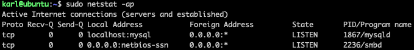
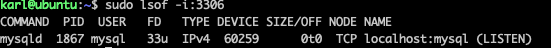
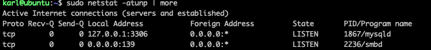

## Ubuntu

#### 用户

1. [How do I add a user to the "sudo" group?](https://askubuntu.com/questions/2214/how-do-i-add-a-user-to-the-sudo-group)

> ```bash
> sudo usermod -aG sudo <username>
> ```
>
> The `a` is very important. Without it they'll be removed from all other groups. You will need to either restart your shell/terminal or log out and back in for this to take effect.
>
> See also:
>
> - [How can I add a new user as sudoer using the command line?](https://askubuntu.com/questions/7477/how-can-i-add-a-new-user-as-sudoer-using-the-command-line)

2. 修改密码

```bash
# 修改root密码（默认root无密码，第一次执行时创建密码）：
sudo passwd root

# 修改开机登录密码（用户名为username）：
sudo passwd username
```

3. 新建用户

```bash
sudo adduser bob
# 您将需要回答几个问题，首先会从帐户密码开始。输入一个强密码，或者如果您愿意，可以填入任何附加信息。 这不是必需操作，对于您希望跳过的任何字段，直接点击 ENTER 即可。

# 1 中所述 作为 root 用户运行以下命令，以将新用户添加至 sudo 群组
sudo usermod -aG sudo bob
```

4. 切换用户

```bash
su bob

# --> root
sudo su
# 如果想在切换用户之后使用新用户的工作环境，可以在su和username之间加-
su - root
```

5 查看所有用户

```bash
# cut -d 自定义：为分隔符（define） -f 1 选择裁剪后的第一个域（field）
$ cat /etc/passwd |cut -f 1 -d :
```

6 删除用户

```bash
sudo deluser username

# /home & mail
sudo deluser --remove-home username
```


#### 防火墙

```bash
karl@ubuntu:~$ sudo ufw status
[sudo] password for karl:
Status: active
```

```bash
karl@ubuntu:~$ sudo ufw app list
Available applications:
  OpenSSH
  Samba
```

```bash
# 开放 OpenSSH
sudo ufw allow OpenSSH
```

```bash
# 重新加载
sudo ufw reload
```

```bash
# 关闭 22 端口
sudo ufw delete allow 22
```


```bash
# 开放指定ip所有操作
sudo ufw allow from 192.168.1.12

# 关闭指定ip所有操作
sudo ufw delete allow from 192.168.1.11

# 开放指定ip对应端口操作
sudo ufw allow from 192.168.1.12 to any port 3306

# 关闭
sudo ufw delete allow from 192.168.1.12 to any port 3306
```


```bash
# 关闭防火墙
sudo ufw disable
# 开启防火墙
sudo ufw enable
```


#### 查看端口占用



查看所有的服务端口，显示pid号：
　  `netstat -ap`

查看某一（**）端口，则可以结合grep命令：

  ` netstat -ap | grep **`

如查看3306端口，也可以在终端中输入：

` lsof -i:3306`



若要停止使用这个端口的程序，使用`kill +对应的pid`

`kill pid`

还有一个比较好用的命令，查看22端口：

```bash
sudo netstat -lnp | grep 22
```

查看端口号和运行程序：`sudo netstat -atunp | more`



查看进程所用端口：

```bash
karl@ubuntu:~$ sudo netstat -tlnp|grep mysql
tcp        0      0 127.0.0.1:3306          0.0.0.0:*               LISTEN      1867/mysqld
```


#### 挂载硬盘

```bash
# 磁盘容量及分区状况（不能查看未挂载分区）
karl@ubuntu:~$ df -Th
Filesystem     Type      Size  Used Avail Use% Mounted on
udev           devtmpfs  3.7G     0  3.7G   0% /dev
tmpfs          tmpfs     782M  5.8M  776M   1% /run
/dev/sda2      ext4      118G   32G   81G  29% /
```


```bash
# 磁盘容量及分区状况（可以查看未挂载分区）
sudo fdisk -l
sudo lsblk -f

# /lib 目录大小
du -sh /lib
 
# /lib 子目录大小
du -sh /lib/*
```


```bash
karl@ubuntu:~$ sudo fdisk -l
...

Disk /dev/sdb: 29.9 GiB, 31237079040 bytes, 61009920 sectors
Disk model: CoolFlash USB3.0
Units: sectors of 1 * 512 = 512 bytes
Sector size (logical/physical): 512 bytes / 512 bytes
I/O size (minimum/optimal): 512 bytes / 512 bytes
Disklabel type: dos
Disk identifier: 0x00000000

Device     Boot Start      End  Sectors  Size Id Type
/dev/sdb1        2048 61009919 61007872 29.1G  7 HPFS/NTFS/exFAT
```

 

```bash
karl@ubuntu:~$ sudo fdisk /dev/sdb

Welcome to fdisk (util-linux 2.34).
Changes will remain in memory only, until you decide to write them.
Be careful before using the write command.

# d 删除u盘的分区
Command (m for help): d
Selected partition 1
Partition 1 has been deleted.

Command (m for help): w
The partition table has been altered.
Calling ioctl() to re-read partition table.
Syncing disks.
```


```bash
# 将u盘格式化为 ext4
karl@ubuntu:~$ sudo mkfs.ext4 /dev/sdb
mke2fs 1.45.5 (07-Jan-2020)
Found a dos partition table in /dev/sdb
Proceed anyway? (y,N) y
Creating filesystem with 7626240 4k blocks and 1908736 inodes
Filesystem UUID: 55673bd6-5cab-4e0c-a3f9-996b843d355d
Superblock backups stored on blocks:
	32768, 98304, 163840, 229376, 294912, 819200, 884736, 1605632, 2654208,
	4096000

Allocating group tables: done
Writing inode tables: done
Creating journal (32768 blocks): done
Writing superblocks and filesystem accounting information: done
```


```bash
# 挂载u盘
karl@ubuntu:/opt$ sudo mkdir /mnt/data
karl@ubuntu:/opt$ sudo mount /dev/sdb /mnt/data
karl@ubuntu:/opt$ df -Th
Filesystem     Type      Size  Used Avail Use% Mounted on
udev           devtmpfs  3.7G     0  3.7G   0% /dev
...
/dev/sdb       ext4       29G   45M   27G   1% /mnt/data
```


---

---

试过以下，但是没有没有效果 ❌  (╥╯^╰╥) ❌ 


```bash
"/etc/udev/rules.d/10-usbstorage.rules" 13L, 816C                                                                                                                  13,41         All
KERNEL!="sd*", GOTO="media\_by\_label\_auto\_mount_end"
SUBSYSTEM!="block",GOTO="media\_by\_label\_auto\_mount_end"
IMPORT{program}="/sbin/blkid -o udev -p %N"
ENV{ID\_FS\_TYPE}=="", GOTO="media\_by\_label\_auto\_mount_end"
ENV{ID\_FS\_LABEL}!="", ENV{dir_name}="%E{ID\_FS\_LABEL}"
ENV{ID\_FS\_LABEL}=="", ENV{dir_name}="Untitled-%k"
ACTION=="add", ENV{mount_options}="relatime,sync"
ACTION=="add", ENV{ID\_FS\_TYPE}=="vfat", ENV{mount_options}="iocharset=utf8,umask=000"
ACTION=="add", ENV{ID\_FS\_TYPE}=="ntfs", ENV{mount_options}="iocharset=utf8,umask=000"
ACTION=="add", RUN+="/bin/mkdir -p /mnt/data", RUN+="/bin/mount -o $env{mount_options} /dev/%k /mnt/data"

ACTION=="remove", ENV{dir_name}!="", RUN+="/bin/umount -l /mnt/data", RUN+="/bin/rmdir /mnt/data"
LABEL="media\_by\_label\_auto\_mount_end"
```

udev规则定义完成后, 需要重新导入udev规则

```bash
sudo udevadm control --reload-rules
```

---


> ```bash
> U盘及SD卡自动挂载
> 
> 创建文件/etc/udev/rules.d/11-add-usb.rules
> 
> SD卡自动挂载
> 
> ACTION=="add",GOTO="farsight", KERNEL=="mmcblk[0-9]p[0-9]", RUN+="/etc/mount-sd.sh %k", LABEL="farsight"
> 
> U盘自动挂载
> 
> ACTION=="add",GOTO="farsight",KERNEL=="sd[a-z][0-9]",RUN+="/etc/mount-usb.sh %k",LABEL="farsight"
> #U盘测试之后挂载方式
> ACTION=="add",KERNEL=="sd[a-z][0-9]",RUN+="/etc/mount-usb.sh %k",LABEL="farsight"
> 
> /etc/udev/rules.d/11-add-remove.rules
> 
> 卸载SD卡
> 
> ACTION=="remove",GOTO="farsight", SUBSYSTEM=="block",GOTO="farsight", KERNEL=="mmcblk[0-9]p[0-9]",RUN+="/etc/umount-sd.sh", LABEL="farsight"
> 
> 卸载U盘
> 
> ACTION=="remove",GOTO="farsight",SUBSYSTEM=="block",GOTO="farsight",KERNEL=="sd[a-z][0-9]",RUN+="/etc/umount-usb.sh",LABEL="farsight"
> #U盘测试之后卸载U盘方式
> ACTION=="remove",SUBSYSTEM=="block",KERNEL=="sd[a-z][0-9]",RUN+="/etc/umount-usb.sh",LABEL="farsight"
> 
> 创建挂载的目录
> mkdir /mnt/sd -p
> mkdir /mnt/usb -p
> 
> 添加脚本
> SD卡自动挂载脚本
> 创建脚本/etc/mount-sd.sh
> 
> #!/bin/sh
> /bin/mount -t vfat /dev/$1 /mnt/sd
> sync
> 
> 添加可执行权限
> 
> chmod +x /etc/mount-sd.sh
> 
> 创建/etc/umount-sd.sh
> 
> #!/bin/sh
> sync
> umount /mnt/sd
> 
> 添加可执行权限
> 
> chmod +x /etc/umount-sd.sh
> 
> U盘自动挂载脚本
> 创建/etc/mount-usb.sh
> 
> #!/bin/sh
> mkdir /mnt/usb
> mount  -t vfat /dev/$1 /mnt/usb
> sync
> 
> chmod +x /etc/mount-usb.sh //执行权限
> 
> 创建/etc/umount-usb.sh
> 
> #!/bin/sh
> sync
> umount /mnt/usb
> rm -rf /mnt/usb
> 
> chmod +x /etc/umount-usb.sh //执行权限
> ————————————————
> 版权声明：本文为CSDN博主「艾笑O0」的原创文章，遵循CC 4.0 BY-SA版权协议，转载请附上原文出处链接及本声明。
> 原文链接：https://blog.csdn.net/Rebiy12/article/details/105050613
> ```
>
> 

---


[开发板linux自动挂载U盘和SD卡/Automount usb disk and sdcard on the linux](https://wiki.phytec.com/pages/viewpage.action?pageId=91984762)

> #### u盘自动挂载规则
>
> **/etc/udev/rules.d/11-usb-mount.rules**
>
> ```
> KERNEL!=``"sd[a-z][0-9]"``,GOTO=``"automount_exit"``ACTION==``"add"``, SUBSYSTEMS==``"usb"``, SUBSYSTEM==``"block"``,RUN+=``"/bin/mkdir /mnt/usb"``,RUN+=``"/usr/bin/systemd-mount --no-block --automount=yes $devnode /mnt/usb"``ACTION==``"remove"``, RUN+=``"/usr/bin/systemd-umount /mnt/usb"``,RUN+=``"/bin/rmdir /mnt/usb"``LABEL=``"automount_exit"
> ```
>
> #### 


#### `#!/bin/bash`

> **SOME she-bang EXAMPLES**
>
> ***#!/bin/sh :Executes the script using the Bourne shell or a compatible shell, with path /bin/sh\***
>
> ***#!/bin/bash :Executes the script using the Bash shell.\***
>
> ***#!/bin/csh -f :Executes the script using C shell or a compatible shell.\***
>
> ***#!/usr/bin/perl -T :Executes the script using perl with the option of taint checks\***
>
> ***#!/usr/bin/env python :Executes the script using python by looking up the path to the python interpreter automatically from the environment variables\***

**#! ** 是特殊的表示符，其后面跟的是此解释此脚本的shell的路径。

[#!/bin/bash ) What exactly is this ?](https://medium.com/@codingmaths/bin-bash-what-exactly-is-this-95fc8db817bf)