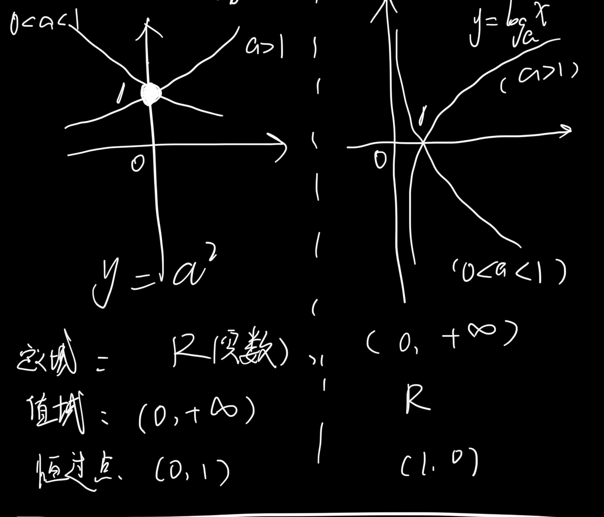
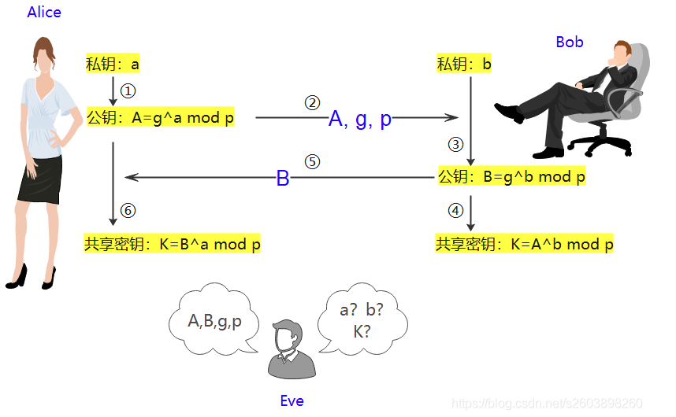
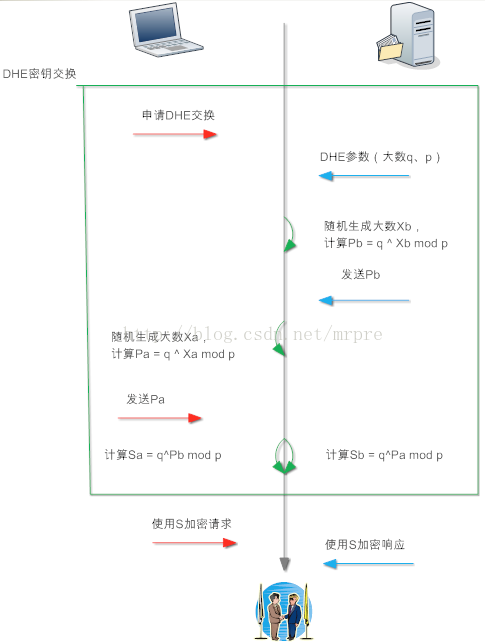

## ECDHE 算法

在学习 [HTTPS](../../articles/2021/2021-3-18-HTTPS.md) 协议的时候，我们有了提到过 DH （Diffie-Hellman）算法。

### DH 算法

DH算法是非对称加密算法，根据私钥生成的方式，DH 算法氛围两种实现：

- static DH 算法，这个已经废弃

- DHE 算法，常用


##### 铺垫：



```
// 指数运算
y = 2^x

// x 是以 2为底 y 的对数，y 叫 真数
x = log y
       2
```

对数的取值是可以连续的，而离散对数的取值是不能连续的，因此也以 *离散* 得名。**DH 核心是离散对数** 离散对数是在对数运算的基础上加了模运算（mod）

```
/**
 对于一个整数 b 和质数 p 的一个原根 a，可以找到一个唯一的指数 i，使得以下公式成立。
 那么 指数 i 成为 b 的以 a 为底的模 p 的离散对数。
*/
a^i (mod p) = b

```


>  引用自[DH算法图解+数学证明](https://blog.csdn.net/s2603898260/article/details/112341844)
>
> 


<table border="2">
    <tr>
        <th rowspan="2"></th>
        <th colspan="2">Alice</th>
        <th colspan="2">Bob</th>
    </tr>
    <tr>
        <td>私密</td>
        <td>公开</td>
        <td>公开</td>
        <td>私密</td>
    </tr>
    <tr>
        <td>A和B首先约定公开的质数p、g</td>
        <td></td>
        <td>p,g</td>
      	<td>p,g</td>
        <td></td>
    </tr>
    <tr>
        <td>A和B各自随机产生两个数a,b，作为自己的私钥</td>
        <td>a</td>
        <td></td>
      	<td></td>
        <td>b</td>
    </tr>
		<tr>
        <td>各自算出自己的公钥A,B</td>
        <td></td>
        <td>A = g^a mod p</td>
      	<td>B = g^b mod p</td>
        <td></td>
    </tr>
		<tr>
        <td>交换公钥A,B</td>
        <td></td>
        <td>B = g^b mod p</td>
      	<td>A = g^a mod p</td>
        <td></td>
    </tr>
		<tr>
        <td>计算出加密用的秘钥 K(a) 和 K(b)</td>
        <td>K(a)= B^a mod p=(g^b mod p)^a mod p=g^ab mod p</td>
        <td></td>
      	<td></td>
        <td>K(b)= A^b mod p=(g^a mod p)^b mod p=g^ab mod p</td>
    </tr>

</table>


> 参数有两个，分别是p 和g, p 是一个很大的质数，建议长度在1024 比特以上，这个长度也决定了DH 算法的安全程度， g 表示为一个生成器，这个值很小，可以是5 或者7。根据离散对数的原理，如果p 是一个大数，在现有的计算机的计算能力是很难破解出 私钥 a、b 的，破解不出私钥，也就无法计算出会话密钥，如果算力发生质变，那么密钥协商算法就要做大的升级了。
>
> 如果需要破解密钥， 就必须面临离散对数和因式分解问题。和其他公开密钥算法一样，只要确保一定的密钥长度，DH 算法具有很高的安全性。RSA 和DH 密钥对一样能够受到暴力攻击，提高密钥对的长度能够有效避免攻击。同事，秘钥长度增长对算力的消耗也会上升。秘钥需要多长，还是需要平衡一下。


推荐密钥长度：

| 密码学算法密       | 推荐的密钥长度（单位：bit） |
| ------------------ | --------------------------- |
| AES 对称加密算法   | 128                         |
| RSA 加密和签名算法 | 2048                        |
| DSA 数字签名算法   | 2048                        |
| ECC 椭圆曲线       | 256                         |


RSA/ DH/ ECDH 安全性对比：

| 对称加密算法密钥长度（单位：比特 bit） | 公开密钥算法密钥长度（DH/RSA/DSA）（单位：bit） | ECC 椭圆曲线密钥（单位：bit） |
| -------------------------------------- | ----------------------------------------------- | ----------------------------- |
| 80                                     | 1024                                            | 160                           |
| 112                                    | 2048                                            | 224                           |
| 128                                    | 3248                                            | 256                           |
| 192                                    | 7680                                            | 384                           |
| 256                                    | 15360                                           | 512                           |


#### DHE 

> 引用自[https原理--ECDHE密钥协商算法 ](https://www.cnblogs.com/zipxzf/articles/14346467.html)
>
> 静态DH 算法， p 和g 两个参数永远是固定的，而且服务器的公钥C Ys ）也是固定的。和RSA 密钥协商算法一样，一旦服务器对应的DH 私钥泄露，就不能提供前向安全性。静态DH 算法的好处就是避免在初始化连接时服务器频繁生成参数p 和g ，因为该过程是非常消耗CPU 运算的。
>
> 于是，DH 交换密钥时就只有客户端的公钥是变化，而服务端公钥是不变的，那么随着时间延长，黑客就会截获海量的密钥协商过程的数据，因为密钥协商的过程有些数据是公开的，黑客就可以依据这些数据暴力破解出服务器的私钥，然后就可以计算出会话密钥了，于是之前截获的加密数据会被破解，所以 **static DH 算法不具备前向安全性**。
>
> 既然固定一方的私钥有被破解的风险，那么干脆就让双方的私钥在每次密钥交换通信时，都是随机生成的、临时的，这个方式也就是 DHE 算法，E 全称是 `ephemeral`（临时性的）。下图形象得说明了DHE算法密钥交换过程
>
> 
>
> 所以，即使有个牛逼的黑客破解了某一次通信过程的私钥，其他通信过程的私钥仍然是安全的，因为**每个通信过程的私钥都是没有任何关系的，都是独立的，这样就保证了「前向安全」**。

##### 前向安全 [Forward Secrecy](https://en.wikipedia.org/wiki/Forward_secrecy)

FS，指的是长期使用的主[密钥](https://zh.wikipedia.org/wiki/密钥)泄漏不会导致过去的[会话密钥](https://zh.wikipedia.org/wiki/會話密鑰)泄漏。前向保密能够保护过去进行的通讯不受[密码](https://zh.wikipedia.org/wiki/密码)或[密钥](https://zh.wikipedia.org/wiki/密钥)在未来暴露的威胁。如果系统具有前向保密性，就可以保证在私钥泄露时历史通讯的安全，即使系统遭到主动攻击也是如此。

对于能够对抗【回溯破解】的秘钥交换算法也被称为 Forward Secrecy

### ECDHE 密钥协商算法

DHE 算法由于计算性能不佳，因为需要做大量的乘法，为了提升 DHE 算法的性能，所以就出现了现在广泛用于密钥交换算法 —— **ECDHE 算法**。

ECDHE 是使用椭圆曲线（Elliptic Curve Cryptography , ECC）的 DH（Diffie-Hellman）算法，ECDHE 算法是在 DHE 算法的基础上利用了 ECC 椭圆曲线特性，可以用更少的计算量计算出公钥，以及最终的会话密钥。

客服端和服务器使用 ECDHE 密钥交换算法的过程：

- 双方事先确定好使用哪种椭圆曲线，和曲线上的基点 G，这两个参数都是公开的；
- 双方各自随机生成一个随机数作为**私钥d**，并与基点 G相乘得到**公钥Q**（Q = dG），此时客户端的公私钥为 Q1 和 d1，服务器的公私钥为 Q2 和 d2；
- 双方交换各自的公钥，最后客户端计算点（x1，y1） = d1Q2，服务器计算点（x2，y2） = d2Q1，由于椭圆曲线上是可以满足乘法交换和结合律，所以 `d1Q2 = d1d2G <==> d2Q1= d2d1G` ，因此**双方的 x 坐标是一样的，x 还不是最终的会话密钥，它是一个预主密钥。**

这个过程中，双方的私钥都是随机、临时生成的，都是不公开的，即使根据公开的信息（椭圆曲线、公钥、基点 G）也是很难计算出椭圆曲线上的离散对数（私钥）。


#### 🤝握手过程

##### 参见之前的文章：[HTTPS](../../articles/2021/2021-3-18-HTTPS.md) 握手环节分析


##### 1 TLS 第一次握手

客户端 **「Client Hello」**

消息里面会携带，客户端使用的 TLS 版本号、支持的密码套件列表、支持的压缩算法，以及生成的随机数 **Client Random**


##### 2 TLS 第二次握手

服务端 **「Server Hello」**

返回携带服务器确认的 TLS 版本号，也给了一个随机数 **Server Random**，然后从C端的密码套件列表选择一个合适的密码套件和压缩算法（目前不建议进行 TLS 压缩，以免被攻击，比如：CRIME攻击）

`TLS_ECDHE_RSA_WITH_AES_256_GCM_SHA384`

- 密钥协商算法使用 ECDHE；
- 签名算法使用 RSA；
- 握手后的通信使用 AES 对称算法，密钥长度 256 位，分组模式是 GCM；
- 摘要算法使用 SHA384；

服务端发送 **「Certificate」**消息，会把证书也发送给客户端，之后发送 **「Server Key Exchange」** 消息

- 确认使用的椭圆曲线（G也定好了，会发给客户端）
- 生成随机数作为服务端椭圆曲线的密钥，保留到本地
- 根据 基点 G 和 私钥算出服务端的椭圆曲线公钥，公钥会发给客户端（公钥会被RSA签名）

**「Server Hello Done」**


##### 3 TLS 第三次握手

客户端校验证书的合法性，客户端生成随机数作为客户端椭圆曲线的私钥，然后再根据服务端前面给的信息，生成客户端椭圆曲线公钥。

客户端发送 **「Client Key Exchange」** 消息

至此，双方都有对方的椭圆曲线公钥、自己的椭圆曲线私钥、椭圆曲线基点 G。

双方计算出点 (x,y) ，其中 x 坐标值双方都是一样的，**x 是一个预主密钥**

**最终的会话密钥：客户端随机数 + 服务端随机数 + x（预主密钥） 三个参数生成。**

客户端发送 **「Change Cipher Spec」** 消息，后面使用对称算法加密通信。

接着客户端发送 **「Encrypted Handshake Message」** 把之前发送的数据做一个摘要，再用对称密钥加密一下，让服务端做个验证，验证下本次生成的对称密钥是否可以正常使用。


##### 4 TLS 第四次握手

Server 服务端也会有类似的操作，发送 **「Change Cipher Spec」** 和 **「Encrypted Handshake Message」** 消息，如果双方都验证加密和解密没有问题，那么握手就完成了。切换至应用数据协议，双方就可以正常收发加密的 HTTP 数据了。


### 参考

- [https原理--ECDHE密钥协商算法](https://www.cnblogs.com/zipxzf/articles/14346467.html)