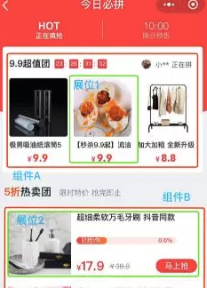

## 数据统计之唯一路径

> > 闲聊点儿题外话：
> >
> > 最近很火的概念【元宇宙】，在某乎上 [最近很火的概念「元宇宙」到底是什么？如何实现？](https://www.zhihu.com/question/493364990/answer/2231362407) 有相关的讨论
> >
> > **NFT (Non Fungible Token)技术 ** 去同质化凭证，是一项基于区块链的**数字资产确权** 技术产品。基于区块链使它具有去中心化、不可篡改的特性，即无需任何政府、机构或者个人的认可，即可完全证明对某个数字资产的所有权。
>
> 现在的互联网，如果你是免费用户，那么大多数互联网公司的做法就是把你当作产品的一部分，来**使用你**。当下精细化运营及算法推荐等应用场景下，需要非常精确掌握行为发生的位置场所。不管是在PC还是在手机上使用 App 你在 App上的一举一动全部都会被对应的 **平台** 记录。记录的这些数据会被拿来做数据分析，最直接的盈利**广告** 就推送到了你的眼前。就发生在我自己身上：我这边刚搜了一块滑雪板，某信，某宝，某东。。。都会给你推送对应的滑雪相关的产品。

[之前写得关于用户行为统计的文章](../../articles/2017/2017-6-1-用户行为统计探索.md)

### 1 数据过程

**链路：数据产生-->采集-->处理-->分析-->反馈-->优化/迭代**

随着互联网的规范化，用户隐私越来越受到重视，数据采集必须遵循「用户隐私协议」或者 「数据保护条例」的章程。但是，头部互联网公司已经持有了相对比较全面的「用户画像」所谓的对 `IMEI  ` `android_id`、`idfa`、`idfv` 等信息的获取的约束，对他们而言其实微乎其微。

### 2 数据统计

#### 2.1 采集方式

##### 2.1.1 无痕埋点（或全埋点）

利用浏览器或APP自带的监听方式，对用户的浏览页面、点击等行为进行收集，可以收集到的信息主要有：

- 页面的url、APP的包名等
- 点击元素的xpath路径、title或约定的dom元素

无痕埋点的优势有：

- 前端接入成本低，不需要额外开发
- 用户动作收集完整，不会漏失

但同时也会存在以下问题：

- 有用、没用的数据都会收集
- 无法采集到特殊的行为动作、业务参数
- 采集到的信息需要进行二次标注，才可以被用户识别
- 当按钮的位置不固定、名称存在重复或页面重构时，无法做到准确的标识

##### 2.1.2 代码埋点

代码埋点是指依赖前端同学，自定义监听和收集处理。代码埋点的优势有：

- 事件标识明确
- 业务参数丰富
- 事件的触发方式可以灵活自定义
- 分析更方便、精确

随之而来的是以下问题：

- 前端代码的开发、管理成本
- 只能收集到事件上线之后的数据

在业务需求复杂，无痕埋点收集到的信息无法支持分析时，就需要进行代码埋点。

##### 2.1.3 可视化圈选埋点

优点：通过可视化圈选的方式筛选出感兴趣的行为统计数据，所见即所得的验证方式，为产品运营提供决策支持。

缺点：需要对页面和页面中的可交互元素分别进行定义；可视化平台的开发成本较高；

上述3 中埋点方式，并不是替代关系，而是互为补充。

#### 2.2 唯一标识

统计用户行为的关键在于唯一确定一个访问的位置。基于位置分解出来的维度组合，可以很方便的分析出各个粒度的访问、曝光、点击等数据。

##### 2.2.1 看到的「有赞」实现方式：

> 将位置分成了四个粒度：
>
> - 业务
> - 页面域（包括页面类型和页面id）
> - 组件域（如图中红色部分，包括组件类型和组件序号）
> - 展位域（如图中绿色部分，包括展位标识和展位序号）
>
> 
>
> 业务 + 页面域 + 组件域 + 展位域 + 页面随机码，可以唯一确定一个访问的位置。基于位置分解出来的维度组合，可以很方便的分析出各个粒度的访问、曝光、点击数据。

##### 2.2.2 viewPath

###### 2.2.2.1 对节点的深度的计算方式：

采用当前 view 位于其父 view 中的所有 **与当前 view 同类型** 子view 中的索引值。调整后的深度的计算方式是依赖于各节点的类型的，因此，此时必须要将各节点的名称放到`viewPath`中，而不再是仅仅为了增加可读性。

###### 2.2.2.2 同类型的 View 的唯一定位：

我们点击的元素是 UITableViewCell，那么它虽然可以定位到类似于这个标识`xxApp.x'xViewController.xxTableView.xxCell`，同类型的 Cell 有多个，所以单凭借这个字符串是没有办法定位具体的那个 Cell 被点击了。

找出当前元素在父层同类型元素中的索引。根据当前的元素遍历当前元素的父级元素的子元素，如果出现相同的元素，则需要判断当前元素是所在层级的第几个元素。对当前的控件元素的父视图的全部子视图进行遍历，如果存在和当前的控件元素同类型的控件，那么需要判断当前控件元素在同类型控件元素中的所处的位置，那么则可以唯一定位。`xxCell-3.xxTableView.xxViewController.xxApp`

###### 2.2.2.3 同类型的 View ，根据展示的内容不一样，点击的意义也不一样。比如：新增、删除，我们需要标识出来。

上述方法通过 **“viewPath 配合同类型的 view 去加索引值“** 的方式还是没有办法唯一标识出来。通过给 NSObject 添加一个分类，在分类里面添加一个协议。让需要复用但需要唯一标识的 view 去实现协议方法，因为是给 NSObject 分类添加的协议，所以 view 不需要去指定遵循。

###### 2.2.2.4 在包含子 VC时，viewPath 的计算

上述，只表示到距离 view 最近的一个 VC，VC 的深度的计算也是此 VC 的 view 所在的父 view 的所有子 view 中的深度。在实际开发中，会遇到 `addChildViewController:` 添加子VC来实现复杂的场景。这时候，VC 的深度该怎么计算？

假设一个 `containerVC` 中包含4个子VC：`VC1、VC2、VC3、VC4`。在每个子VC首次被展示时，子VC会先被add进来，而子 VC 的 view 也会被 add 到一个scrollView 上。这时候这几个子VC首次的查看顺序的不同将会导致它们的深度的变化：如果查看顺序是：`VC1、VC2、VC3、VC4`，那么它们的深度依次为：`VC1（0）、VC2（1）、VC3（2）、VC4（3）`；如果查看顺序是：`VC3、VC1、VC4、VC2`，深度则变成了：`VC1（1）、VC2（3）、VC3（0）、VC4（2）`。这种情况导致 viewPath 不可靠且无法保证唯一性。

整了 VC 的深度的计算：不再采用其 view 的深度，而是直接使用固定的0。因为 VC 已经是`viewPath`的根级别了，它的深度信息已经不重要了。不过这种方案会引起另一个小问题，如果上述子 VC 的 VC1 和 VC2 是同一个类的不同实例，那么他们内部的视图结构是完全一样的，这时候如果使用固定的 VC 深度（0），通过`viewPath`就无法区分具体是哪个子 VC 的 view 了。针对这种同一类的不同实例，如果想进一步区分它们，SDK 采用了另一个方案：*页面别名*。

##### 2.2.3 target-action

获取target+action的方式非常简单高效，可以直接获取一个UIButton的target和action，UIView可以通过`UIRecognizeGesture`获取target和action、`UITableview的delegate`和`didSelectedRowAtIndexPath`等等。

Eg.

> 按钮的点击事件，`UIControl` 会调用 `sendAction:to:forEvent:` 来将行为消息转发到 `UIApplication`，再由 `UIApplication` 调用其 `sendAction:to:fromSender:forEvent:` 方法来将消息分发到指定的 `target` 上。

### 3 总结

本文只讲到了数据采集匹配唯一的一些技术想法。埋点 SDK对数据的采集，其实有很多细节值得深思：

- 匹配唯一（不重不漏）
- 字段规范（多端一致）
- 。。。

采集之后的存储与上报也是重要的：

- 采集数据的本地持久化
- 非/实时上报，上报协议的约定
- 。。。

### 参考

- [iOS无埋点数据SDK实践之路](https://www.jianshu.com/p/69ce01e15042)
- [有赞埋点实践](https://mp.weixin.qq.com/s/g5NRLfIqZZBUvIVECkg-Tg)
- [iOS可视化埋点设计方案](https://tech.ipalfish.com/blog/2020/09/06/ut_circle/)
- [埋点治理：如何把App埋点做到极致？](https://mp.weixin.qq.com/s/O_02RsP9U2N4cXQH5rc0zQ)