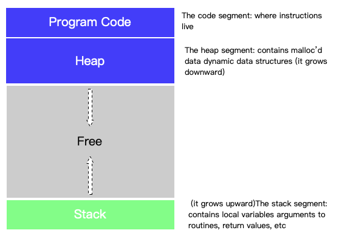
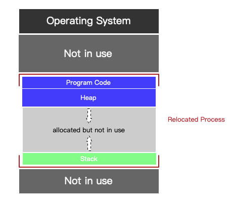
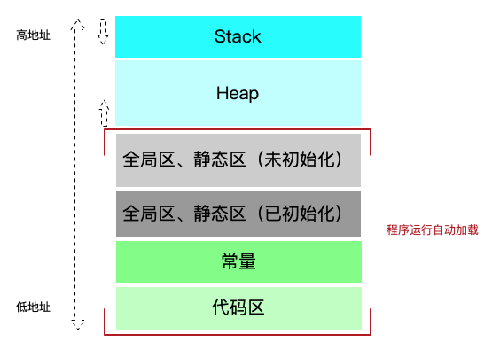
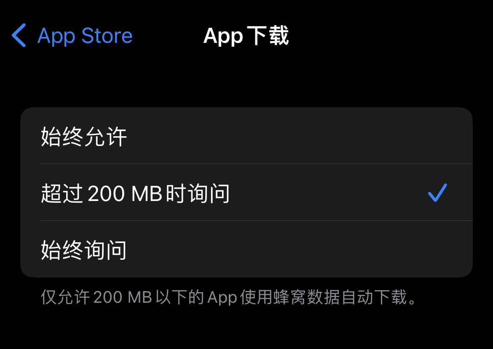
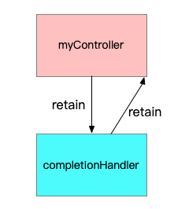

## iOS 内存相关整理

[toc]

### 0 内存分布

#### 从进程的角度（虚拟化技术）看，内存可能是这样的：



#### 物理内存可能是这样：



你可能需要进一步学习操作系统的相关知识：

- **分段（Segmentation）**
- **分页（Paging）**
- **MMU**
- ...

####  iOS App 地址空间



其中代码区、常量区、静态区这三个区域都是自动加载，并且在进程结束之后被系统释放，开发者并不需要进行关注。

栈区一般存放局部变量、临时变量，由编译器自动分配和释放，每个线程运行时都对应一个栈。

堆区用于动态内存的申请，由程序员分配和释放。

一般来说，栈区由于被系统自动管理，速度更快，但是使用起来并不如堆区灵活。

#### 今年Apple 新出的iPhone 13 系列（2021.9）

> 数据来源 [「List of iPhones」](https://www.theiphonewiki.com/wiki/List_of_iPhones)

|                 | iPhone 13 mini                                               | iPhone 13                                                    | iPhone 13 Pro                                                | iPhone 13 Pro Max                                            |
| --------------- | ------------------------------------------------------------ | ------------------------------------------------------------ | ------------------------------------------------------------ | ------------------------------------------------------------ |
| Storage Choices | 128GB 256GB 512GB                                            | 128GB 256GB 512GB                                            | 128GB 256GB 512GB                                            | 128GB 256GB 512GB 1T                                         |
| CPU Specs       | CPU: [T8110](https://www.theiphonewiki.com/wiki/T8110) "A15 Bionic"<br>Clock rate: 3.23 GHz <br>Core Design: [Apple Avalanche](https://www.theiphonewiki.com/w/index.php?title=Apple_Avalanche&action=edit&redlink=1) x 2 and [Apple Blizzard](https://www.theiphonewiki.com/w/index.php?title=Apple_Blizzard&action=edit&redlink=1) x 4 <br>Instruction Set: ? <br>RAM: 4GB | CPU: [T8110](https://www.theiphonewiki.com/wiki/T8110) "A15 Bionic"<br/>Clock rate: 3.23 GHz <br/>Core Design: [Apple Avalanche](https://www.theiphonewiki.com/w/index.php?title=Apple_Avalanche&action=edit&redlink=1) x 2 and [Apple Blizzard](https://www.theiphonewiki.com/w/index.php?title=Apple_Blizzard&action=edit&redlink=1) x 4 <br/>Instruction Set: ? <br/>RAM: 4GB | CPU: [T8110](https://www.theiphonewiki.com/wiki/T8110) "A15 Bionic"<br/>Clock rate: 3.23 GHz <br/>Core Design: [Apple Avalanche](https://www.theiphonewiki.com/w/index.php?title=Apple_Avalanche&action=edit&redlink=1) x 2 and [Apple Blizzard](https://www.theiphonewiki.com/w/index.php?title=Apple_Blizzard&action=edit&redlink=1) x 4 <br/>Instruction Set: ? <br/>RAM: 6GB | CPU: [T8110](https://www.theiphonewiki.com/wiki/T8110) "A15 Bionic"<br/>Clock rate: 3.23 GHz <br/>Core Design: [Apple Avalanche](https://www.theiphonewiki.com/w/index.php?title=Apple_Avalanche&action=edit&redlink=1) x 2 and [Apple Blizzard](https://www.theiphonewiki.com/w/index.php?title=Apple_Blizzard&action=edit&redlink=1) x 4 <br/>Instruction Set: ? <br/>RAM: 6GB |

**VS**

#### iPhone 6 系列（2014.9）

|                 | iPhone 6                                                     | iPhone 6 Plus                                                |
| --------------- | ------------------------------------------------------------ | ------------------------------------------------------------ |
| Storage Choices | 16/64/128 GB                                                 | 16/64/128 GB                                                 |
| CPU Specs       | CPU: [T7000](https://www.theiphonewiki.com/wiki/T7000) "A8"<br>Clock rate: 1.38 GHz <br>Core Design: [Apple Typhoon](https://www.theiphonewiki.com/w/index.php?title=Apple_Typhoon&action=edit&redlink=1) x 2 <br>Instruction Set: ARMv8 <br>RAM: 1GB | CPU: [T7000](https://www.theiphonewiki.com/wiki/T7000) "A8"<br/>Clock rate: 1.38 GHz <br/>Core Design: [Apple Typhoon](https://www.theiphonewiki.com/w/index.php?title=Apple_Typhoon&action=edit&redlink=1) x 2 <br/>Instruction Set: ARMv8 <br/>RAM: 1GB |

经过7年的发展：

- RAM 从 1G -> 6GB
- Storage 128GB -> 1T


#### App 的体积也是水涨船高：

##### 下载大小的限制

从2013年 iOS 7 50M --> 2019年的 200M



##### 可执行文件大小限制

- iOS 7 之前，二进制文件中所有的 `__TEXT` 段总和不得超过 80 MB

- iOS 7.X 至 iOS 8.X ，二进制文件中，每个特定架构中的 `__TEXT` 段不得超过 60 MB

- iOS 9.0 之后，二进制文件中所有的 `__TEXT` 段总和不得超过 500 MB


### 1 内存管理 -- ARC

#### 内存管理，主要管理的就是上述**堆区** 。iOS 采用的是 **引用计数** 的方式。

> 苹果在 2011 年的时候，在 WWDC 大会上提出了自动的引用计数（ARC）。2014 年的 WWDC 大会上，苹果推出了 Swift 语言，而该语言仍然使用 ARC 技术，作为其[内存管理方式](https://developer.apple.com/library/ios/documentation/Swift/Conceptual/Swift_Programming_Language/AutomaticReferenceCounting.html)。「from 唐巧老师的一篇文章[理解iOS 的内存管理](https://blog.devtang.com/2016/07/30/ios-memory-management/)。」

> Automatic Reference Counting (ARC) is a compiler-level feature that simplifies the process of managing object lifetimes (memory management) in Cocoa applications.

[ARC](https://clang.llvm.org/docs/AutomaticReferenceCounting.html) 是编译器（时）特性，而不是运行时特性，更不是垃圾回收器(GC)。

#### 摘录文章「from 昵称： [不忘初“辛”](https://home.cnblogs.com/u/flyFreeZn/) 的博文 [iOS开发ARC内存管理技术要点](https://www.cnblogs.com/flyFreeZn/p/4264220.html)」

> #### ARC的修饰符
>
> ------
>
> ARC主要提供了4种修饰符，他们分别是:`__strong,__weak,__autoreleasing,__unsafe_unretained`。
>
> ##### `__strong`
>
> 表示引用为强引用。对应在定义property时的 `strong`。所有对象只有当没有任何一个强引用指向时，才会被释放。
>
> 注意：如果在声明引用时不加修饰符，那么引用将默认是强引用。当需要释放强引用指向的对象时，需要将强引用置nil。
>
> ##### `__weak`
>
> 表示引用为弱引用。对应在定义`property`时用的 `weak`。弱引用不会影响对象的释放。对象在被释放的同时，指向它的弱引用会自动被置`nil`，这个技术叫`zeroing weak pointer`。这样有效得防止无效指针、野指针的产生。`__weak`一般用在`delegate`关系中防止循环引用或者用来修饰指向由`Interface Builder`编辑与生成的UI控件。
>
> ##### `__autoreleasing`
>
> 表示在`autorelease pool`中自动释放对象的引用，和MRC时代`autorelease`的用法相同。定义`property`时不能使用这个修饰符，任何一个对象的`property`都不应该是`autorelease`型的。
>
> 一个常见的误解是，在ARC中没有`autorelease`，因为这样一个“自动释放”看起来好像有点多余。这个误解可能源自于将ARC的“自动”和`autorelease`“自动”的混淆。其实你只要看一下每个iOS App的`main.m`
>
> ```objc
> int main(int argc, char * argv[]) {
>     @autoreleasepool {
>         return UIApplicationMain(argc, argv, nil, NSStringFromClass([AppDelegate class]));
>     }
> }
> ```
>
> 以下两行代码的意义是相同的。
>
> ```objc
> NSString *str = [[[NSString alloc] initWithFormat:@"hehe"] autorelease]; // MRC
> NSString *__autoreleasing str = [[NSString alloc] initWithFormat:@"hehe"]; // ARC
> ```
>
>  这里关于 `autoreleasepool` 就不做展开了，详细地信息可以参考官方文档或者其他文章。
>
> `__autoreleasing` 在ARC中主要用在参数传递返回值（`out-parameters`）和引用传递参数（`pass-by-reference`）的情况下。
>
> > `__autoreleasing` is used to denote arguments that are passed by reference (`id *`) and are autoreleased on return.
>
> 比如常用的 `NSError`的使用：
>
> ```objc
> NSError *__autoreleasing error; 
> if (![data writeToFile:filename options:NSDataWritingAtomic error:&error]) 
> { 
> 　　NSLog(@"Error: %@", error); 
> }
> ```
>
> （在上面的 `writeToFile `方法中 `error` 参数的类型为( `NSError *__autoreleasing *`)）
>
> 注意，如果你的 `error`定义为了 `strong` 型，那么，编译器会帮你隐式地做如下事情，保证最终传入函数的参数依然是个 `__autoreleasing` 类型的引用。
>
> ```objc
> NSError *error; 
> NSError *__autoreleasing tempError = error; // 编译器添加 
> if (![data writeToFile:filename options:NSDataWritingAtomic error:&tempError]) 
> { 
> 　　error = tempError; // 编译器添加 
> 　　NSLog(@"Error: %@", error); 
> }
> ```
>
> 所以为了提高效率，避免这种情况，我们一般在定义error的时候将其声明为`__autoreleasing`类型的：
>
> ```objc
> NSError *__autoreleasing error;
> ```
>
> 在这里，加上`__autoreleasing`之后，相当于在MRC中对返回值error做了如下事情：
>
> ```objc
> *error = [[[NSError alloc] init] autorelease];
> ```
>
> *error指向的对象在创建出来后，被放入到了`autoreleasing pool`中，等待使用结束后的自动释放，函数外error的使用者并不需要关心*error指向对象的释放。
>
> 另外一点，在ARC中，所有这种指针的指针 （`NSError **`）的函数参数如果不加修饰符，编译器会默认将他们认定为`__autoreleasing`类型。
>
> 比如下面的两段代码是等同的：
>
> ```objc
> - (NSString *)doSomething:(NSNumber **)value
> {
>         // do something  
> }
> - (NSString *)doSomething:(NSNumber * __autoreleasing *)value
> {
>         // do something  
> }
> ```
>
> 除非你显式得给value声明了`__strong`，否则value默认就是`__autoreleasing`的。
>
> 最后一点，某些类的方法会隐式地使用自己的`autorelease pool`，在这种时候使用`__autoreleasing`类型要特别小心。
>
> 比如`NSDictionary`的`[enumerateKeysAndObjectsUsingBlock]`方法：
>
> ```objc
> - (void)loopThroughDictionary:(NSDictionary *)dict error:(NSError **)error
> {
>     [dict enumerateKeysAndObjectsUsingBlock:^(id key, id obj, BOOL *stop){
>           // do stuff  
>           if (there is some error && error != nil)
>           {
>                 *error = [NSError errorWithDomain:@"MyError" code:1 userInfo:nil];
>           }
>     }];
> }
> ```
>
> 会隐式地创建一个`autorelease pool`，上面代码实际类似于：
>
> ```objc
> - (void)loopThroughDictionary:(NSDictionary *)dict error:(NSError **)error
> {
>     [dict enumerateKeysAndObjectsUsingBlock:^(id key, id obj, BOOL *stop){
> 
>           @autoreleasepool  // 被隐式创建
> 　　　　　　{
>               if (there is some error && error != nil)
>               {
>                     *error = [NSError errorWithDomain:@"MyError" code:1 userInfo:nil];
>               }
>           }
>     }];
> 
>     // *error 在这里已经被dict的做枚举遍历时创建的autorelease pool释放掉了 ：(  
> }    
> ```
>
> 为了能够正常的使用`*error`，我们需要一个`strong`型的临时引用，在dict的枚举Block中是用这个临时引用，保证引用指向的对象不会在出了dict的枚举Block后被释放，正确的方式如下：
>
> ```objc
> - (void)loopThroughDictionary:(NSDictionary *)dict error:(NSError **)error
> {
> 　　__block NSError* tempError; // 加__block保证可以在Block内被修改  
> 　　[dict enumerateKeysAndObjectsUsingBlock:^(id key, id obj, BOOL *stop)
> 　　{ 
> 　　　　if (there is some error) 
> 　　　　{ 
> 　　　　　　*tempError = [NSError errorWithDomain:@"MyError" code:1 userInfo:nil]; 
> 　　　　}  
> 　　}] 
> 　　if (error != nil) 
> 　　{ 
> 　　　　*error = tempError; 
> 　　} 
> } 
> ```
>
> ##### `__unsafe_unretained`
>
> 这个修饰符主要是为了在ARC刚发布时兼容iOS 4以及版本更低的设备，因为这些版本的设备没有 `weak pointer system`，简单的理解这个系统就是我们上面讲`weak`时提到的，能够在`weak`引用指向对象被释放后，把引用值自动设为`nil`的系统。
>
> 这个修饰符在定义`property`时对应的是"`unsafe_unretained`"，实际可以将它理解为MRC时代的`assign`：纯粹只是将引用指向对象，没有任何额外的操作，在指向对象被释放时依然原原本本地指向原来被释放的对象（所在的内存区域）。所以非常不安全。
>
> #### 使用修饰符
>
> 这可能是很多人都不知道的一个问题，包括之前的我，但却是一个特别要注意的问题。
>
> 苹果的文档中明确地写道：
>
> > You should decorate variables correctly. When using qualifiers in an object variable declaration,
> >
> > the correct format is:
> >
> > ```objc
> > ClassName * qualifier variableName;
> > ```
>
> 按照这个说明，要定义一个weak型的NSString引用，它的写法应该是：
>
> ```objc
> NSString * __weak str = @"hehe"; // 正确！
> ```
>
> 而不应该是：
>
> ```objc
> __weak NSString *str = @"hehe";  // 错误！
> ```
>
> 我相信很多人都和我一样，从开始用ARC就一直用上面那种错误的写法。
>
> 那这里就有疑问了，既然文档说是错误的，为啥编译器不报错呢？文档又解释道：
>
> > Other variants are technically incorrect but are “forgiven” by the compiler. To understand the issue, seehttp://cdecl.org/.
>
> 考虑到很多人会用错，所以在编译器这边贴心地帮我们忽略并处理掉了这个错误：）虽然不报错，但是我们还是应该按照正确的方式去使用这些修饰符
>
> #### 栈中指针默认值为nil
>
> 无论是被`strong`，`weak`还是`autoreleasing`修饰，声明在栈中的指针默认值都会是`nil`。所有这类型的指针不用再初始化的时候置`nil`了。虽然好习惯是最重要的，但是这个特性更加降低了“野指针”出现的可能性。
>
> 在ARC中，以下代码会输出null而不是crash:)
>
> ```objc
> - (void)myMethod 
> {
>     NSString *name;
>     NSLog(@"name: %@", name);
> }
> ```
>
> #### ARC 与 Block
>
> ------
>
> ##### 在MRC时代
>
> Block会隐式地对进入其作用域内的对象（或者说被Block捕获的指针指向的对象）加`retain`，来确保Block使用到该对象时，能够正确的访问。
>
> 这件事情在下面代码展示的情况中要更加额外小心。
>
> ```objc
> MyViewController *myController = [[MyViewController alloc] init…];
> 
> // 隐式地调用[myController retain];造成循环引用
> myController.completionHandler =  ^(NSInteger result) {
>    [myController dismissViewControllerAnimated:YES completion:nil];
> };
> 
> [self presentViewController:myController animated:YES completion:^{
>    [myController release]; // 注意，这里调用[myController release];是在MRC中的一个常规写法，并不能解决上面循环引用的问题
> }];
> ```
>
> 在这段代码中，`myController`的`completionHandler`调用了`myController`的方法`[dismissViewController...]`，这时`completionHandler`会对`myController`做`retain`操作。而我们知道，`myController`对`completionHandler`也至少有一个`retain`（一般准确讲是 `copy`），这时就出现了在内存管理中最糟糕的情况：**循环引用！**
>
> 
>
> 对这种情况，我们一般用如下方法解决：给要进入Block的指针加一个`__block`修饰符。
>
> 这个`__block`在MRC时代有两个作用：
>
> - 说明变量可改
> - 说明指针指向的对象不做这个隐式的retain操作
>
> 一个变量如果不加`__block`，是不能在Block里面修改的，不过这里有一个例外：static的变量和全局变量不需要加`__block`就可以在Block中修改。
>
> 使用这种方法，我们对代码做出修改，解决了循环引用的问题：
>
> ```objc
> MyViewController * __block myController = [[MyViewController alloc] init…];
> // ...
> myController.completionHandler =  ^(NSInteger result) {
>     [myController dismissViewControllerAnimated:YES completion:nil];
> };
> //之后正常的release或者retain
> ```
>
> 
>
> ##### 在ARC引入后
>
> 没有了`retain` 和 `release` 等操作，情况也发生了改变：在任何情况下，`__block`修饰符的作用只有上面的第一条：说明变量可改。即使加上了`__block`修饰符，一个被block捕获的强引用也依然是一个强引用。这样在ARC下，如果我们还按照MRC下的写法，`completionHandler`对`myController`有一个强引用，而`myControlle`r对`completionHandler`有一个强引用，这依然是循环引用，没有解决问题：（
>
> 于是我们还需要对原代码做修改。简单的情况我们可以这样写：
>
> ```objc
> __block MyViewController * myController = [[MyViewController alloc] init…];
> // ...
> myController.completionHandler =  ^(NSInteger result) {
>     [myController dismissViewControllerAnimated:YES completion:nil];
>     myController = nil;  // 注意这里，保证了block结束myController强引用的解除
> };
> ```
>
> 在`completionHandler`之后将`myController`指针置`nil`，保证了`completionHandler`对`myController`强引用的解除，不过也同时解除了`myController对myController`对象的强引用。这种方法过于简单粗暴了，在大多数情况下，我们有更好的方法。
>
> 这个更好的方法就是使用`weak`。（或者为了考虑iOS4的兼容性用`unsafe_unretained`，具体用法和`weak`相同，这里就不讲这个方法了）
>
> 为了保证`completionHandler`这个Block对`myController`没有强引用，我们可以定义一个临时的弱引用`weakMyViewController`来指向原`myController`的对象，并把这个弱引用传入到Block内，这样就保证了Block对`myController`持有的是一个弱引用，而不是一个强引用。如此，我们继续修改代码：
>
> ```objc
> MyViewController *myController = [[MyViewController alloc] init…];
> // ...
> MyViewController * __weak weakMyViewController = myController;
> myController.completionHandler =  ^(NSInteger result) {
>     [weakMyViewController dismissViewControllerAnimated:YES completion:nil];
> };
> ```
>
> 这样循环引用的问题就解决了，但是却不幸地引入了一个新的问题：由于传入`completionHandler`的是一个弱引用，那么当myController指向的对象在`completionHandler`被调用前释放，那么`completionHandler`就不能正常的运作了。在一般的单线程环境中，这种问题出现的可能性不大，但是到了多线程环境，就很不好说了，所以我们需要继续完善这个方法。
>
> 为了保证在Block内能够访问到正确的`myController`，我们在block内新定义一个强引用`strongMyController`来指向`weakMyController`指向的对象，这样多了一个强引用，就能保证这个`myController`对象不会在`completionHandler`被调用前释放掉了。于是，我们对代码再次做出修改：
>
> ```objc
> MyViewController *myController = [[MyViewController alloc] init…];
> // ...
> MyViewController * __weak weakMyController = myController;
> myController.completionHandler =  ^(NSInteger result) {
>     MyViewController *strongMyController = weakMyController;
> 
> 　　if (strongMyController) {
>         // ...
>         [strongMyController dismissViewControllerAnimated:YES completion:nil];
>         // ...
>     }
>     else {
>         // Probably nothing...
>     }
> };
> ```
>
> 到此，一个完善的解决方案就完成了：）
>
> 官方文档对这个问题的说明到这里就结束了，但是可能很多朋友会有疑问，不是说不希望Block对原`myController`对象增加强引用么，这里为啥堂而皇之地在Block内新定义了一个强引用，这个强引用不会造成循环引用么？理解这个问题的关键在于理解被Block捕获的引用和在Block内定义的引用的区别。为了搞得明白这个问题，这里需要了解一些Block的实现原理，但由于篇幅的缘故，本文在这里就不展开了，详细的内容可以参考其他的文章，这里推荐[谈Objective-C block的实现](https://blog.devtang.com/2013/07/28/a-look-inside-blocks/)和另外2位作者的博文：[【block第四篇】实现](http://blog.csdn.net/hherima/article/details/38586101)和[正确使用Block避免Cycle Retain和Crash](http://tanqisen.github.io/blog/2013/04/19/gcd-block-cycle-retain/)，讲的都比较清楚。
>
> 这里假设大家已经对Block的实现原理有所了解了。我们就直入主题了！注意前方高能（=。=）
>
> 为了更清楚地说明问题，这里用一个简单的程序举例。比如我们有如下程序：
>
> ```objc
> #include <stdio.h>
> 
> int main()
> {
>     int b = 10;
>     int *a = &b;
>     void (^blockFunc)() = ^(){
>         int *c = a;
>     };
>     blockFunc();
>     return 1;
> }
> ```
>
> 程序中，同为`int`型的指针，`a`是被Block捕获的变量，而`c`是在Block内定义的变量。我们用`clang -rewrite-objc`处理后，可以看到如下代码：
>
> 原main函数：
>
> ```c++
> int main()
> {
>     int b = 10;
>     int *a = &b;
>     void (*blockFunc)() = (void (*)())&__main_block_impl_0((void *)__main_block_func_0, &__main_block_desc_0_DATA, a);
> 
>     ((void (*)(__block_impl *))((__block_impl *)blockFunc)->FuncPtr)((__block_impl *)blockFunc);
> 
>     return 1;
> }
> ```
>
> Block的结构：
>
> ```c++
> struct __main_block_impl_0 {
>   struct __block_impl impl;
>   struct __main_block_desc_0* Desc;
>   
>   int *a; // 被捕获的引用 a 出现在了block的结构体里面
>   
>   __main_block_impl_0(void *fp, struct __main_block_desc_0 *desc, int *_a, int flags=0) : a(_a) {
>     impl.isa = &_NSConcreteStackBlock;
>     impl.Flags = flags;
>     impl.FuncPtr = fp;
>     Desc = desc;
>   }
> };
> ```
>
> 实际执行的函数：
>
> ```c++
> static void __main_block_func_0(struct __main_block_impl_0 *__cself) {
>   int *a = __cself->a; // bound by copy
>   
>   int *c = a; // 在block中声明的引用 c 在函数中声明，存在于函数栈上
> }
> ```
>
> 我们可以清楚得看到，`a`和`c`存在的位置完全不同，如果Block存在于堆上（在ARC下Block默认在堆上），那么`a`作为Block结构体的一个成员，也自然会存在于堆上，而c无论如何，永远位于Block内实际执行代码的函数栈内。这也导致了两个变量生命周期的完全不同：`c`在Block的函数运行完毕，即会被释放，而`a`呢，只有在Block被从堆上释放的时候才会释放。
>
> 回到我们的`MyViewController`的例子中，同上理，如果我们直接让Block捕获我们的`myController`引用，那么这个引用会被复制后（引用类型也会被复制）作为Block的成员变量存在于其所在的堆空间中，也就是为Block增加了一个指向`myController`对象的强引用，这就是造成循环引用的本质原因。对于`MyViewController`的例子，Block的结构体可以理解是这个样子：（准确的结构体肯定和以下这个有区别，但也肯定是如下这种形式：）
>
> ```c++
> struct __main_block_impl_0 {
>   struct __block_impl impl;
>   struct __main_block_desc_0* Desc;
>   
>   MyViewController * __strong myController;  // 被捕获的强引用myController
>   
>   __main_block_impl_0(void *fp, struct __main_block_desc_0 *desc, int *_a, int flags=0) : a(_a) {
>     impl.isa = &_NSConcreteStackBlock;
>     impl.Flags = flags;
>     impl.FuncPtr = fp;
>     Desc = desc;
>   }
> };
> ```
>
> 而反观我们给Block传入一个弱引用`weakMyController`，这时我们Block的结构：
>
> ```c++
> struct __main_block_impl_0 {
>   struct __block_impl impl;
>   struct __main_block_desc_0* Desc;
>   
>   MyViewController * __weak weakMyController;  // 被捕获的弱引用weakMyController
>   
>   __main_block_impl_0(void *fp, struct __main_block_desc_0 *desc, int *_a, int flags=0) : a(_a) {
>     impl.isa = &_NSConcreteStackBlock;
>     impl.Flags = flags;
>     impl.FuncPtr = fp;
>     Desc = desc;
>   }
> };
> ```
>
> 再看在Block内声明的强引用 `strongMyController`，它虽然是强引用，但存在于函数栈中，在函数执行期间，它一直存在，所以 `myController` 对象也一直存在，但是当函数执行完毕，`strongMyController` 即被销毁，于是它对 `myController`对象的强引用也被解除，这时Block对`myController`对象就不存在强引用关系了！加入了`strongMyController`的函数大体会是这个样子：
>
> ```c++
> static void __main_block_func_0(struct __main_block_impl_0 *__cself) {
>   MyViewController * __strong strongMyController = __cself->weakMyController; 
>   // ....
> }
> ```
>
> 综上所述，在ARC下（在MRC下会略有不同），Block捕获的引用和Block内声明的引用无论是存在空间与生命周期都是截然不同的，也正是这种不同，造成了我们对他们使用方式的区别。
>
> 以上就解释了之前提到的所有问题，希望大家能看明白：）
>
> 好的，最后再提一点，在ARC中，对Block捕获对象的内存管理已经简化了很多，由于没有了`retain` 和 `release`等操作，实际只需要考虑循环引用的问题就行了。比如下面这种，是没有内存泄露的问题的：
>
> ```objc
> TestObject *aObject = [[TestObject alloc] init];
> aObject.name = @"hehe";
> self.aBlock = ^(){
>     NSLog(@"aObject's name = %@",aObject.name);
> };
> ```
>
> 我们上面提到的解决方案，只是针对Block产生循环引用的问题，而不是说所有的Block捕获引用都要这么处理，一定要注意！
>
> 
>
> #### ARC与Toll-Free Bridging
>
> ------
>
> > There are a number of data types in the Core Foundation framework and the Foundation framework that can be used interchangeably. This capability, called *toll-free bridging*, means that you can use the same data type as the parameter to a Core Foundation function call or as the receiver of an Objective-C message. 
>
> Toll-Free Briding保证了在程序中，可以方便和谐的使用Core Foundation类型的对象和Objective-C类型的对象。详细的内容可参考[官方文档](https://developer.apple.com/library/ios/documentation/General/Conceptual/CocoaEncyclopedia/Toll-FreeBridgin/Toll-FreeBridgin.html)。以下是官方文档中给出的一些例子：
>
> ```objc
> NSLocale *gbNSLocale = [[NSLocale alloc] initWithLocaleIdentifier:@"en_GB"];
> CFLocaleRef gbCFLocale = (CFLocaleRef) gbNSLocale;
> CFStringRef cfIdentifier = CFLocaleGetIdentifier (gbCFLocale);
> NSLog(@"cfIdentifier: %@", (NSString *)cfIdentifier);
> // logs: "cfIdentifier: en_GB"
> CFRelease((CFLocaleRef) gbNSLocale);
>  
> CFLocaleRef myCFLocale = CFLocaleCopyCurrent();
> NSLocale * myNSLocale = (NSLocale *) myCFLocale;
> [myNSLocale autorelease];
> NSString *nsIdentifier = [myNSLocale localeIdentifier];
> CFShow((CFStringRef) [@"nsIdentifier: " stringByAppendingString:nsIdentifier]);
> // logs identifier for current locale
> ```
>
> 在MRC时代，由于Objective-C类型的对象和Core Foundation类型的对象都是相同的 `release`和 `retain` 操作规则，所以Toll-Free Bridging的使用比较简单，但是自从ARC加入后，Objective-C类型的对象内存管理规则改变了，而Core Foundation依然是之前的机制，换句话说，Core Foundation不支持ARC。
>
> 这个时候就必须要要考虑一个问题了，在做Core Foundation与Objective-C类型转换的时候，用哪一种规则来管理对象的内存。显然，对于同一个对象，我们不能够同时用两种规则来管理，所以这里就必须要确定一件事情：哪些对象用Objective-C（也就是ARC）的规则，哪些对象用Core Foundation的规则（也就是MRC）的规则。或者说要确定对象类型转换了之后，内存管理的ownership的改变。
>
> > If you cast between Objective-C and Core Foundation-style objects, you need to tell the compiler about the ownership semantics of the object using either a cast (defined in `objc/runtime.h`) or a Core Foundation-style macro (defined in`NSObject.h`)
>
> 于是苹果在引入ARC之后对Toll-Free Bridging的操作也加入了对应的方法与修饰符，用来指明用哪种规则管理内存，或者说是内存管理权的归属。
>
> 
>
> 这些方法和修饰符分别是：
>
> ##### `__bridge`（修饰符）
>
> 只是声明类型转变，但是不做内存管理规则的转变。
>
> 比如：
>
> ```objc
> CFStringRef s1 = (__bridge CFStringRef) [[NSString alloc] initWithFormat:@"Hello, %@!", name];
> ```
>
> 只是做了`NSString`到`CFStringRef`的转化，但管理规则未变，依然要用Objective-C类型的ARC来管理`s1`，你不能用`CFRelease()`去释放`s1`。
>
> ##### `__bridge_retained（修饰符）` or `CFBridgingRetain（函数）`
>
> 表示将指针类型转变的同时，将内存管理的责任由原来的Objective-C交给Core Foundation来处理，也就是，将ARC转变为MRC。
>
> 比如，还是上面那个例子
>
> ```objc
> NSString *s1 = [[NSString alloc] initWithFormat:@"Hello, %@!", name];
> CFStringRef s2 = (__bridge_retained CFStringRef)s1;
> // do something with s2
> //...
> CFRelease(s2); // 注意要在使用结束后加这个
> ```
>
> 我们在第二行做了转化，这时内存管理规则由ARC变为了MRC，我们需要手动的来管理 `s2` 的内存，而对于 `s1`，我们即使将其置为`nil`，也不能释放内存。
>
> 等同的，我们的程序也可以写成：
>
> ```objc
> NSString *s1 = [[NSString alloc] initWithFormat:@"Hello, %@!", name];
> CFStringRef s2 = (CFStringRef)CFBridgingRetain(s1);
> // do something with s2
> //...
> CFRelease(s2); // 注意要在使用结束后加这个
> ```
>
> ##### `__bridge_transfer（修饰符）` or `CFBridgingRelease（函数）`
>
> 这个修饰符和函数的功能和上面那个`__bridge_retained`相反，它表示将管理的责任由Core Foundation转交给Objective-C，即将管理方式由MRC转变为ARC。
>
> 比如：
>
> ```objc
> CFStringRef result = CFURLCreateStringByAddingPercentEscapes(. . .);
> NSString *s = (__bridge_transfer NSString *)result;
> //or NSString *s = (NSString *)CFBridgingRelease(result);
> return s;
> ```
>
> 这里我们将`result`的管理责任交给了ARC来处理，我们就不需要再显式地将 `CFRelease()` 了。
>
> 对了，这里你可能会注意到一个细节，和ARC中那个4个主要的修饰符（`__strong,__weak,...`）不同，这里修饰符的位置是放在类型前面的，虽然官方文档中没有说明，但看官方的头文件可以知道。小伙伴们，记得别把位置写错哦：）
>
> ```c++
> NS_INLINE CF_RETURNS_RETAINED CFTypeRef CFBridgingRetain(id X) {
>   return (__bridge_retained CFTypeRef)X;
> }
> 
> NS_INLINE id CFBridgingRelease(CFTypeRef CF_CONSUMED X) {
>   return (__bridge_transfer id)X;
> }
> ```


### 2 内存泄漏

todo

### 3 内存监控

todo
