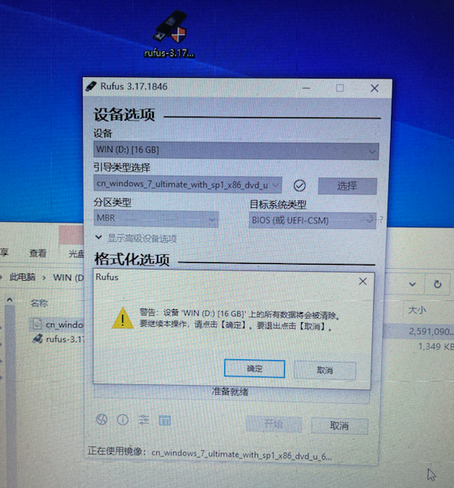
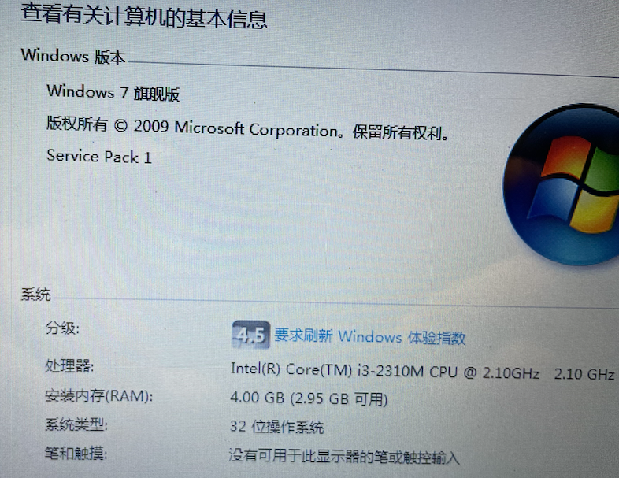

## 老电脑的挣扎~~联想G470

10年前的老电脑，实打实用了4年，又吃了6年的灰。不谈情怀，就是想换个SSD，加个内存条，折腾一下，简单记录下过程。

[toc]

### 1 制作启动盘

#### 1.0 我在 [MSDN](https://msdn.itellyou.cn/) 下载了windows 7旗舰版32位光盘（含sp1补丁）

> Windows 7 Ultimate with Service Pack 1 (x86) - DVD (Chinese-Simplified)
>
> 文件名
>
> cn_windows_7_ultimate_with_sp1_x86_dvd_u_677486.iso
>
> SHA1
>
> B92119F5B732ECE1C0850EDA30134536E18CCCE7
>
> 
>
> 文件大小
>
> 2.47GB
>
> 发布时间
>
> 2011-05-12

#### 1.1 用 balenaEtcher 刷 ❌

#### 1.2 通过 Mac 自带磁盘工具，抹掉 U 盘，然后恢复ISO镜像 ❌

#### 1.3 *还是乖乖找了一台 window 系统的电脑，安装 [Rufus](https://rufus.ie/zh/) 来制作了一个 U 盘启动盘。*✅

#### 1.4 安装系统

F12 进入从 USB 启动，可以刷系统

磁盘检查也检查了挺久。。。

#### 1.5 win7 32 位 系统激活

 

 

### 2.0 以下需要拆电脑了：

注意：

- 红色圈的螺丝是有锁扣的，不需要完全拧下来
- 装内存条，黄色圈的不用拆就可以
- 白色圈的位置是固定光驱的螺丝

注意：红圈俩螺丝拧下来就可以抽出硬盘了

装到硬盘托架上的效果：

注意：红圈螺丝拧下来就可以抽出光驱了

### 2.1 内存

直接插上就可以了，会有咔啪一声的

### 2.2 SSD

1. 如果您准备购买mSATA口的SSD，建议咨询售后或者查看拆机图，确认该机型是否有mSATA口和预留的硬盘位。如果有，就可以考虑安装。
2. 如果您准备购买SATA口的硬盘，建议您检查电脑有无内置光驱，您可以选择替换下光驱，购买光驱位硬盘托架装上，光驱位安装HDD，原硬盘位安装SSD。
3. 上面两种情况都没有，只能撤下机械硬盘，换上SSD。

主要配件：

### 2.3 CPU

我的联想 G470 是可以换 CPU 的，但是我暂时不打算换了。。。

### 3 遇到的问题

1. 我装完系统以后，没有网卡驱动。（没法上网）

2. 我改了一个配置（开启硬盘AHCI模式），开机按 F2键设置BIOS，最后FN+F10保存

   

   1. 重启的时候提示（推荐修复系统）
   2. 我选择修复以后，就如上图所示了

等了差不多一个小时，没有进度。我就直接强制关机了。然后再启动，就进不到win7 系统了。

#### 3.1回顾复盘：

- 修复需要上网下载配置、软件等我没联网所以一直修复。。。
- 另外我中断了操作，系统文件被破坏了，导致进不了系统

如果当时修改了硬盘 AHCI 模式以后，直接刷机就好了，但是我只做的64位 win7 启动U盘 启动不了。。。吐槽。。。。

猜测分区类型选了 GPT 而不是MBR导致的，所以需要重新制作一个 刷系统u盘了

### 4 SSD 上刷64位系统 from [爱纯净](http://www.aichunjing.com/win7/)

> 文件: Win7x64-2021.12.GHO（GHO格式版本MD5,需要解压出来检测里面的GHO后缀）
>
> 大小: 6641743195 字节
>
> MD5: DDDDE6F91966111022F531E90B64EC76
>
> SHA1: 2AE1821F3826622588A0608B8D4468F6265C12CF
>
> CRC32: 41A65298

开机20s👌

#### 拆下来的硬盘可能让我搞坏了。。。😭

