## 拷贝文章 “进程间通信IPC (InterProcess Communication)”

文章地址：https://www.jianshu.com/p/c1015f5ffa74

文章作者：https://www.jianshu.com/u/66510cbf21ad

[toc]

### 一、进程间通信的概念

每个进程各自有不同的用户地址空间，任何一个进程的全局变量在另一个进程中都看不到，所以进程之间要交换数据必须通过内核，在内核中开辟一块缓冲区，进程1把数据从用户空间拷到内核缓冲区，进程2再从内核缓冲区把数据读走，内核提供的这种机制称为**进程间通信（IPC，InterProcess Communication）**

进程间通信模型：

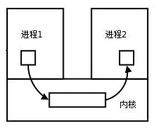


### 二、进程间通信的7种方式

> - A.传统的进程间通信方式
>
> 无名管道(pipe)、有名管道(fifo)和信号(signal)
>
> - B.System v IPC对象
>
> 共享内存(share memory)、消息队列(message queue)和信号灯(semaphore)
>
> - C.BSD
>
> 套接字(socket)

#### A. 传统的进程间通信方式
##### 1. 管道/匿名管道(pipe)

- 管道是半双工的，数据只能向一个方向流动；需要双方通信时，要建立起两个管道。

- 只能用于父子进程或者兄弟进程之间(具有亲缘关系的进程);

- 单独构成一种独立的文件系统：管道对于管道两端的进程而言，就是一个文件，但它不是普通的文件，它不属于某种文件系统，而是自立门户，单独构成一种文件系统，并且只存在与内存中。

- 数据的读出和写入：一个进程向管道中写的内容被管道另一端的进程读出。写入的内容每次都添加在管道缓冲区的末尾，并且每次都是从缓冲区的头部读出数据。

- 进程间管道通信模型：

  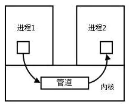

**管道的实质：**
管道的实质是一个内核缓冲区，进程以先进先出的方式从缓冲区存取数据，管道一端的进程顺序的将数据写入缓冲区，另一端的进程则顺序的读出数据。
该缓冲区可以看做是一个循环队列，读和写的位置都是自动增长的，不能随意改变，一个数据只能被读一次，读出来以后在缓冲区就不复存在了。
当缓冲区读空或者写满时，有一定的规则控制相应的读进程或者写进程进入等待队列，当空的缓冲区有新数据写入或者满的缓冲区有数据读出来时，就唤醒等待队列中的进程继续读写。

**管道的局限：**
管道的主要局限性正体现在它的特点上：

- 只支持单向数据流；
- 只能用于具有亲缘关系的进程之间；
- 没有名字；
- 管道的缓冲区是有限的（管道制存在于内存中，在管道创建时，为缓冲区分配一个页面大小）；
- 管道所传送的是无格式字节流，这就要求管道的读出方和写入方必须事先约定好数据的格式，比如多少字节算作一个消息（或命令、或记录）等等；

##### 2. 有名管道(FIFO)
匿名管道，由于没有名字，只能用于亲缘关系的进程间通信。为了克服这个缺点，提出了有名管道(FIFO)。
有名管道不同于匿名管道之处在于它提供了一个路径名与之关联，**以有名管道的文件形式存在于文件系统中**，这样，**即使与有名管道的创建进程不存在亲缘关系的进程，只要可以访问该路径，就能够彼此通过有名管道相互通信**，因此，通过有名管道不相关的进程也能交换数据。值的注意的是，有名管道严格遵循**先进先出(first in first out)**,对匿名管道及有名管道的读总是从开始处返回数据，对它们的写则把数据添加到末尾。它们不支持诸如lseek()等文件定位操作。**有名管道的名字存在于文件系统中，内容存放在内存中。**

> **匿名管道和有名管道总结：**
> （1）管道是特殊类型的文件，在满足先入先出的原则条件下可以进行读写，但不能进行定位读写。
> （2）匿名管道是单向的，只能在有亲缘关系的进程间通信；有名管道以磁盘文件的方式存在，可以实现本机任意两个进程通信。
> （3）**无名管道阻塞问题：**无名管道无需显示打开，创建时直接返回文件描述符，在读写时需要确定对方的存在，否则将退出。如果当前进程向无名管道的一端写数据，必须确定另一端有某一进程。如果写入无名管道的数据超过其最大值，写操作将阻塞，如果管道中没有数据，读操作将阻塞，如果管道发现另一端断开，将自动退出。
> （4）**有名管道阻塞问题：**有名管道在打开时需要确实对方的存在，否则将阻塞。即以读方式打开某管道，在此之前必须一个进程以写方式打开管道，否则阻塞。此外，可以以读写（O_RDWR）模式打开有名管道，即当前进程读，当前进程写，不会阻塞。

[延伸阅读：该博客有匿名管道和有名管道的C语言实践](http://blog.chinaunix.net/uid-26833883-id-3227144.html)

> 一、管道是半双工通信的原因
> 由于Linux一个命令只能完成一个功能，所以一个复杂点的任务需要好几个进程协同完成，第一个进程处理结果需交给第二个进程，然后一次交给第三个，等等，像流水线完成某个商品的生产一样，这个过程只需要数据单向往下传输，所以设计的时候做成了半双工。当然也可以使用管道实现双工通信，需要两个管道。
>
> 二、三种通信方式的区别
> 单工通信：传输方向只有一个方向，单工通信只有一根数据线，它也只在一个方向上进行，如打印机、电视机等。
>
> 半双工通信：可以双向通信，但只能轮流传输，也只有一根数据线，不同于单工通信的是这根数据线即可作为发送又可作为接收，虽数据可在两个方向上传送，但通信双方不能同时收发数据。
>
> 全双工通信：可以同时双向传输数据，数据的发送和接收用两根不同的数据线，通信双方在同一时刻都能进行发送和接收，发送和接收同时进行，没有延迟。
>
> 三、有名管道和无名管道的区别
> 有名在任意两个进程间可以通信
>
> 无名只能在父子进程间通信
>
> 1、无名管道
>
>         管道是半双工的，数据只能向一个方向流动，双方通信时，需要建立起两个管道。只能用于父子进程或者兄弟进程之间（具有亲缘关系的进程）。 单独构成一种独立的文件系统，管道对于管道两端的进程而言，就是一个文件，但它不是普通的文件，它不属于某种文件系统，而是自立门户，单独构成一种文件系统，并且只存在与内存中。
>     
>         数据的读出和写入：一个进程向管道中写的内容被管道另一端的进程读出。写入的内容每次都添加在管道缓冲区的末尾，并且每次都是从缓冲区的头部读出数据。
>     
>         向管道中写入数据时,linux将不保证写入的原子性，管道缓冲区一有空闲区域，写进程就会试图向管道写入数据。如果读进程不读走管道缓冲区中的数据，那么写操作将一直阻塞。
>     
>          注：只有在管道的读端存在时，向管道中写入数据才有意义。否则，向管道中写入数据的进程将收到内核传来的SIFPIPE信号，应用程序可以处理该信号，也可以忽略（默认动作则是应用程序终止）。
>
> 2、有名管道
>
>         不同于管道之处在于它提供一个路径名与之关联，以FIFO的文件形式存在于文件系统中。这样，即使与FIFO的创建进程不存在亲缘关系的进程，只要可以访问该路径，就能够彼此通过FIFO相互通信（能够访问该路径的进程以及FIFO的创建进程之间），因此，通过FIFO不相关的进程也能交换数据。值得注意的是，FIFO严格遵循先进先出（first in first out），对管道及FIFO的读总是从开始处返回数据，对它们的写则把数据添加到末尾。它们不支持诸如lseek()等文件定位操作。
> 

##### 3. 信号(Signal)

- 信号是Linux系统中用于进程间互相通信或者操作的一种机制，信号可以在任何时候发给某一进程，而无需知道该进程的状态。
- 如果该进程当前并未处于执行状态，则该信号就有内核保存起来，直到该进程恢复执行并传递给它为止。
- 如果一个信号被进程设置为阻塞，则该信号的传递被延迟，直到其阻塞被取消时才被传递给进程。

> **Linux系统中常用信号：**
> （1）**SIGHUP：**用户从终端注销，所有已启动进程都将收到该信号。系统缺省状态下对该信号的处理是终止进程。
> （2）**SIGINT：**程序终止信号。程序运行过程中，按`Ctrl+C`键将产生该信号。
> （3）**SIGQUIT：**程序退出信号。程序运行过程中，按`Ctrl+\\`键将产生该信号。
> （4）**SIGBUS和SIGSEGV：**进程访问非法地址。
> （5）**SIGFPE：**运算中出现致命错误，如除零操作、数据溢出等。
> （6）**SIGKILL：**用户终止进程执行信号。shell下执行`kill -9`发送该信号。
> （7）**SIGTERM：**结束进程信号。shell下执行`kill 进程pid`发送该信号。
> （8）**SIGALRM：**定时器信号。
> （9）**SIGCLD：**子进程退出信号。如果其父进程没有忽略该信号也没有处理该信号，则子进程退出后将形成僵尸进程。

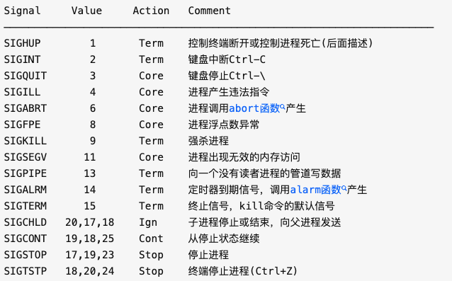

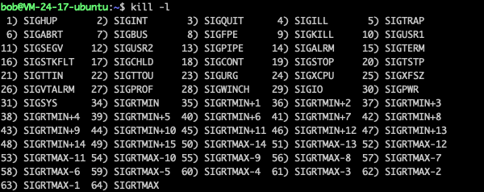

> > 文章来源：https://blog.csdn.net/baobao8505/article/details/1115820
> >
> > 我们运行如下命令，可看到[Linux](https://so.csdn.net/so/search?from=pc_blog_highlight&q=Linux)支持的信号列表：
> >
> > ```
> > $ kill -l
> > 1) SIGHUP       2) SIGINT       3) SIGQUIT      4) SIGILL
> >  5) SIGTRAP      6) SIGABRT      7) SIGBUS       8) SIGFPE
> >  9) SIGKILL     10) SIGUSR1     11) SIGSEGV     12) SIGUSR2
> > 13) SIGPIPE     14) SIGALRM     15) SIGTERM     17) SIGCHLD
> > 18) SIGCONT     19) SIGSTOP     20) SIGTSTP     21) SIGTTIN
> > 22) SIGTTOU     23) SIGURG      24) SIGXCPU     25) SIGXFSZ
> > 26) SIGVTALRM   27) SIGPROF     28) SIGWINCH    29) SIGIO
> > 30) SIGPWR      31) SIGSYS      34) SIGRTMIN    35) SIGRTMIN+1
> > 36) SIGRTMIN+2  37) SIGRTMIN+3  38) SIGRTMIN+4  39) SIGRTMIN+5
> > 40) SIGRTMIN+6  41) SIGRTMIN+7  42) SIGRTMIN+8  43) SIGRTMIN+9
> > 44) SIGRTMIN+10 45) SIGRTMIN+11 46) SIGRTMIN+12 47) SIGRTMIN+13
> > 48) SIGRTMIN+14 49) SIGRTMIN+15 50) SIGRTMAX-14 51) SIGRTMAX-13
> > 52) SIGRTMAX-12 53) SIGRTMAX-11 54) SIGRTMAX-10 55) SIGRTMAX-9
> > 56) SIGRTMAX-8  57) SIGRTMAX-7  58) SIGRTMAX-6  59) SIGRTMAX-5
> > 60) SIGRTMAX-4  61) SIGRTMAX-3  62) SIGRTMAX-2  63) SIGRTMAX-1
> > 64) SIGRTMAX
> > ```
> >
> > 列表中，编号为1 ~ 31的信号为传统UNIX支持的信号，是不可靠信号(非实时的)，编号为32 ~ 63的信号是后来扩充的，称做可靠信号(实时信号)。不可靠信号和可靠信号的区别在于前者不支持排队，可能会造成信号丢失，而后者不会。
> >
> > 下面我们对编号小于SIGRTMIN的信号进行讨论。
> >
> > \1) SIGHUP
> > 本信号在用户终端连接(正常或非正常)结束时发出, 通常是在终端的控制进程结束时, 通知同一session内的各个作业, 这时它们与控制终端不再关联。
> >
> > 登录Linux时，系统会分配给登录用户一个终端(Session)。在这个终端运行的所有程序，包括前台进程组和后台进程组，一般都属于这个Session。当用户退出Linux登录时，前台进程组和后台有对终端输出的进程将会收到SIGHUP信号。这个信号的默认操作为终止进程，因此前台进程组和后台有终端输出的进程就会中止。不过可以捕获这个信号，比如wget能捕获SIGHUP信号，并忽略它，这样就算退出了Linux登录，wget也能继续下载。
> >
> > 此外，对于与终端脱离关系的守护进程，这个信号用于通知它重新读取配置文件。
> >
> > \2) SIGINT
> > 程序终止(interrupt)信号, 在用户键入INTR字符(通常是Ctrl-C)时发出，用于通知前台进程组终止进程。
> >
> > \3) SIGQUIT
> > 和SIGINT类似, 但由QUIT字符(通常是Ctrl-/)来控制. 进程在因收到SIGQUIT退出时会产生core文件, 在这个意义上类似于一个程序错误信号。
> >
> > \4) SIGILL
> > 执行了非法指令. 通常是因为可执行文件本身出现错误, 或者试图执行数据段. 堆栈溢出时也有可能产生这个信号。
> >
> > \5) SIGTRAP
> > 由断点指令或其它trap指令产生. 由debugger使用。
> >
> > \6) SIGABRT
> > 调用abort函数生成的信号。
> >
> > \7) SIGBUS
> > 非法地址, 包括内存地址对齐(alignment)出错。比如访问一个四个字长的整数, 但其地址不是4的倍数。它与SIGSEGV的区别在于后者是由于对合法存储地址的非法访问触发的(如访问不属于自己存储空间或只读存储空间)。
> >
> > \8) SIGFPE
> > 在发生致命的算术运算错误时发出. 不仅包括浮点运算错误, 还包括溢出及除数为0等其它所有的算术的错误。
> >
> > \9) SIGKILL
> > 用来立即结束程序的运行. 本信号不能被阻塞、处理和忽略。如果管理员发现某个进程终止不了，可尝试发送这个信号。
> >
> > \10) SIGUSR1
> > 留给用户使用
> >
> > \11) SIGSEGV
> > 试图访问未分配给自己的内存, 或试图往没有写权限的内存地址写数据.
> >
> > \12) SIGUSR2
> > 留给用户使用
> >
> > \13) SIGPIPE
> > 管道破裂。这个信号通常在进程间通信产生，比如采用FIFO(管道)通信的两个进程，读管道没打开或者意外终止就往管道写，写进程会收到SIGPIPE信号。此外用Socket通信的两个进程，写进程在写Socket的时候，读进程已经终止。
> >
> > \14) SIGALRM
> > 时钟定时信号, 计算的是实际的时间或时钟时间. alarm函数使用该信号.
> >
> > \15) SIGTERM
> > 程序结束(terminate)信号, 与SIGKILL不同的是该信号可以被阻塞和处理。通常用来要求程序自己正常退出，shell命令kill缺省产生这个信号。如果进程终止不了，我们才会尝试SIGKILL。
> >
> > \17) SIGCHLD
> > 子进程结束时, 父进程会收到这个信号。
> >
> > 如果父进程没有处理这个信号，也没有等待(wait)子进程，子进程虽然终止，但是还会在内核进程表中占有表项，这时的子进程称为僵尸进程。这种情况我们应该避免(父进程或者忽略SIGCHILD信号，或者捕捉它，或者wait它派生的子进程，或者父进程先终止，这时子进程的终止自动由init进程来接管)。
> >
> > \18) SIGCONT
> > 让一个停止(stopped)的进程继续执行. 本信号不能被阻塞. 可以用一个handler来让程序在由stopped状态变为继续执行时完成特定的工作. 例如, 重新显示提示符
> >
> > \19) SIGSTOP
> > 停止(stopped)进程的执行. 注意它和terminate以及interrupt的区别:该进程还未结束, 只是暂停执行. 本信号不能被阻塞, 处理或忽略.
> >
> > \20) SIGTSTP
> > 停止进程的运行, 但该信号可以被处理和忽略. 用户键入SUSP字符时(通常是Ctrl-Z)发出这个信号
> >
> > \21) SIGTTIN
> > 当后台作业要从用户终端读数据时, 该作业中的所有进程会收到SIGTTIN信号. 缺省时这些进程会停止执行.
> >
> > \22) SIGTTOU
> > 类似于SIGTTIN, 但在写终端(或修改终端模式)时收到.
> >
> > \23) SIGURG
> > 有"紧急"数据或out-of-band数据到达socket时产生.
> >
> > \24) SIGXCPU
> > 超过CPU时间资源限制. 这个限制可以由getrlimit/setrlimit来读取/改变。
> >
> > \25) SIGXFSZ
> > 当进程企图扩大文件以至于超过文件大小资源限制。
> >
> > \26) SIGVTALRM
> > 虚拟时钟信号. 类似于SIGALRM, 但是计算的是该进程占用的CPU时间.
> >
> > \27) SIGPROF
> > 类似于SIGALRM/SIGVTALRM, 但包括该进程用的CPU时间以及系统调用的时间.
> >
> > \28) SIGWINCH
> > 窗口大小改变时发出.
> >
> > \29) SIGIO
> > 文件描述符准备就绪, 可以开始进行输入/输出操作.
> >
> > \30) SIGPWR
> > Power failure
> >
> > \31) SIGSYS
> > 非法的系统调用。
> >
> > 在以上列出的信号中，程序不可捕获、阻塞或忽略的信号有：SIGKILL,SIGSTOP
> > 不能恢复至默认动作的信号有：SIGILL,SIGTRAP
> > 默认会导致进程流产的信号有：SIGABRT,SIGBUS,SIGFPE,SIGILL,SIGIOT,SIGQUIT,SIGSEGV,SIGTRAP,SIGXCPU,SIGXFSZ
> > 默认会导致进程退出的信号有：SIGALRM,SIGHUP,SIGINT,SIGKILL,SIGPIPE,SIGPOLL,SIGPROF,SIGSYS,SIGTERM,SIGUSR1,SIGUSR2,SIGVTALRM
> > 默认会导致进程停止的信号有：SIGSTOP,SIGTSTP,SIGTTIN,SIGTTOU
> > 默认进程忽略的信号有：SIGCHLD,SIGPWR,SIGURG,SIGWINCH
> >
> > 此外，SIGIO在SVR4是退出，在4.3BSD中是忽略；SIGCONT在进程挂起时是继续，否则是忽略，不能被阻塞。 


**信号来源**
信号是软件层次上对中断机制的一种模拟，是一种异步通信方式，，信号可以在用户空间进程和内核之间直接交互，内核可以利用信号来通知用户空间的进程发生了哪些系统事件，信号事件主要有两个来源：

- 硬件来源：用户按键输入`Ctrl+C`退出、硬件异常如无效的存储访问等。
- 软件终止：终止进程信号、其他进程调用kill函数、软件异常产生信号。

**信号生命周期和处理流程**
（1）信号被某个进程产生，并设置此信号传递的对象（一般为对应进程的pid），然后传递给操作系统；
（2）操作系统根据接收进程的设置（是否阻塞）而选择性的发送给接收者，如果接收者阻塞该信号（且该信号是可以阻塞的），操作系统将暂时保留该信号，而不传递，直到该进程解除了对此信号的阻塞（如果对应进程已经退出，则丢弃此信号），如果对应进程没有阻塞，操作系统将传递此信号。
（3）目的进程接收到此信号后，将根据当前进程对此信号设置的预处理方式，暂时终止当前代码的执行，保护上下文（主要包括临时寄存器数据，当前程序位置以及当前CPU的状态）、转而执行中断服务程序，执行完成后在回复到中断的位置。当然，对于抢占式内核，在中断返回时还将引发新的调度。

信号的生命周期：

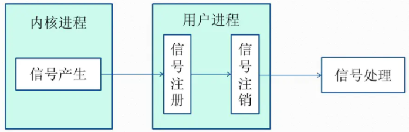


#### B. System v 、IPC对象 方式

##### 4. 消息(Message)队列

- 消息队列是存放在内核中的消息链表，每个消息队列由消息队列标识符表示。
- 与管道（无名管道：只存在于内存中的文件；命名管道：存在于实际的磁盘介质或者文件系统）不同的是消息队列存放在内核中，只有在内核重启(即，操作系统重启)或者显示地删除一个消息队列时，该消息队列才会被真正的删除。
- 另外与管道不同的是，消息队列在某个进程往一个队列写入消息之前，并不需要另外某个进程在该队列上等待消息的到达。[延伸阅读：消息队列C语言的实践](http://blog.csdn.net/yang_yulei/article/details/19772649)

> **消息队列特点总结：**
> （1）消息队列是消息的链表,具有特定的格式,存放在内存中并由消息队列标识符标识.
> （2）消息队列允许一个或多个进程向它写入与读取消息.
> （3）管道和消息队列的通信数据都是先进先出的原则。
> （4）消息队列可以实现消息的随机查询,消息不一定要以先进先出的次序读取,也可以按消息的类型读取.比FIFO更有优势。
> （5）消息队列克服了信号承载信息量少，管道只能承载无格式字 节流以及缓冲区大小受限等缺点。
> （6）目前主要有两种类型的消息队列：POSIX消息队列以及System V消息队列，系统V消息队列目前被大量使用。系统V消息队列是随内核持续的，只有在内核重起或者人工删除时，该消息队列才会被删除。


##### 5. 共享内存(share memory)

- 使得多个进程可以可以直接读写同一块内存空间，是最快的可用IPC形式。是针对其他通信机制运行效率较低而设计的。

- 为了在多个进程间交换信息，内核专门留出了一块内存区，可以由需要访问的进程将其映射到自己的私有地址空间。进程就可以直接读写这一块内存而不需要进行数据的拷贝，从而大大提高效率。

- 由于多个进程共享一段内存，因此需要依靠某种同步机制（如信号量）来达到进程间的同步及互斥。

  [延伸阅读：Linux支持的主要三种共享内存方式：mmap()系统调用、Posix共享内存，以及System V共享内存实践](http://www.cnblogs.com/linuxbug/p/4882776.html)

  共享内存原理图：

  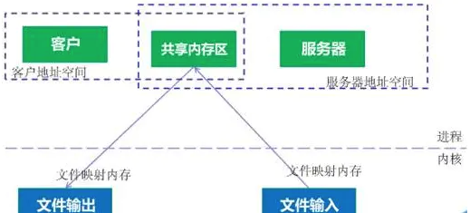
  
  

##### 6. 信号量(semaphore)

信号量是一个计数器，用于多进程对共享数据的访问，**信号量的意图在于进程间同步。**
为了获得共享资源，进程需要执行下列操作：
（1）**创建一个信号量**：这要求调用者指定初始值，对于二值信号量来说，它通常是1，也可是0。
（2）**等待一个信号量**：该操作会测试这个信号量的值，如果小于0，就阻塞。也称为P操作。
（3）**挂出一个信号量**：该操作将信号量的值加1，也称为V操作。

为了正确地实现信号量，信号量值的测试及减1操作应当是原子操作。为此，信号量通常是在内核中实现的。Linux环境中，有三种类型：

- **Posix（[可移植性操作系统接口](http://baike.baidu.com/link?url=hYEo6ngm9MlqsQHT3h28baIDxEooeSPX6wr_FdGF-F8mf7wDp2xJWIDtQWGEDxthtPNiJtlsw460g1_N0txJYa)）有名信号量（使用Posix IPC名字标识）**

- **Posix基于内存的信号量（存放在共享内存区中）**

- **System V信号量（在内核中维护）**。

这三种信号量都可用于进程间或线程间的同步。

两个进程使用一个二值信号量：

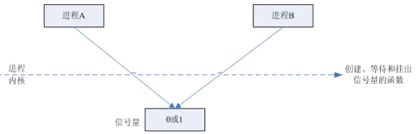


两个进程所以用一个Posix有名二值信号量：


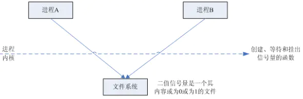

一个进程两个线程共享基于内存的信号量：

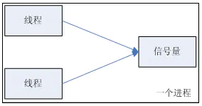


> **信号量与普通整型变量的区别：**
> （1）信号量是非负整型变量，除了初始化之外，它只能通过两个标准原子操作：wait(semap) , signal(semap) ; 来进行访问；
> （2）操作也被成为PV原语（P来源于荷兰语proberen"测试"，V来源于荷兰语verhogen"增加"，P表示通过的意思，V表示释放的意思），而普通整型变量则可以在任何语句块中被访问；

> **信号量与互斥量之间的区别：**
> （1）互斥量用于线程的互斥，信号量用于线程的同步。这是互斥量和信号量的根本区别，也就是互斥和同步之间的区别。
> **互斥：**是指某一资源同时只允许一个访问者对其进行访问，具有唯一性和排它性。但互斥无法限制访问者对资源的访问顺序，即访问是无序的。
> **同步：**是指在互斥的基础上（大多数情况），通过其它机制实现访问者对资源的有序访问。
> 在大多数情况下，同步已经实现了互斥，特别是所有写入资源的情况必定是互斥的。少数情况是指可以允许多个访问者同时访问资源
> （2）互斥量值只能为0/1，信号量值可以为非负整数。
> 也就是说，一个互斥量只能用于一个资源的互斥访问，它不能实现多个资源的多线程互斥问题。信号量可以实现多个同类资源的多线程互斥和同步。当信号量为单值信号量是，也可以完成一个资源的互斥访问。
> （3）互斥量的加锁和解锁必须由同一线程分别对应使用，信号量可以由一个线程释放，另一个线程得到。


#### C. BSD 方式

##### 7. 套接字(socket)

套接字是一种通信机制，凭借这种机制，客户/服务器（即要进行通信的进程）系统的开发工作既可以在本地单机上进行，也可以跨网络进行。也就是说它可以让不在同一台计算机但通过网络连接计算机上的进程进行通信。

Socket是应用层和传输层之间的桥梁：

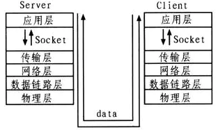

套接字是支持TCP/IP的网络通信的基本操作单元，可以看做是不同主机之间的进程进行双向通信的端点，简单的说就是通信的两方的一种约定，用套接字中的相关函数来完成通信过程。

**套接字特性**
套接字的特性由3个属性确定，它们分别是：域、端口号、协议类型。
**（1）套接字的域**
它指定套接字通信中使用的网络介质，最常见的套接字域有两种：
**一是AF_INET，它指的是Internet网络。**当客户使用套接字进行跨网络的连接时，它就需要用到服务器计算机的IP地址和端口来指定一台联网机器上的某个特定服务，所以在使用socket作为通信的终点，服务器应用程序必须在开始通信之前绑定一个端口，服务器在指定的端口等待客户的连接。
**另一个域AF_UNIX，表示UNIX文件系统，**它就是文件输入/输出，而它的地址就是文件名。
**（2）套接字的端口号**
每一个基于TCP/IP网络通讯的程序(进程)都被赋予了唯一的端口和端口号，端口是一个信息缓冲区，用于保留Socket中的输入/输出信息，端口号是一个16位无符号整数，范围是0-65535，以区别主机上的每一个程序（端口号就像房屋中的房间号），低于256的端口号保留给标准应用程序，比如pop3的端口号就是110，每一个套接字都组合进了IP地址、端口，这样形成的整体就可以区别每一个套接字。
**（3）套接字协议类型**
因特网提供三种通信机制，
**一是流套接字，**流套接字在域中通过TCP/IP连接实现，同时也是AF_UNIX中常用的套接字类型。流套接字提供的是一个有序、可靠、双向字节流的连接，因此发送的数据可以确保不会丢失、重复或乱序到达，而且它还有一定的出错后重新发送的机制。
**二个是数据报套接字，**它不需要建立连接和维持一个连接，它们在域中通常是通过UDP/IP协议实现的。它对可以发送的数据的长度有限制，数据报作为一个单独的网络消息被传输,它可能会丢失、复制或错乱到达，UDP不是一个可靠的协议，但是它的速度比较高，因为它并一需要总是要建立和维持一个连接。
**三是原始套接字，**原始套接字允许对较低层次的协议直接访问，比如IP、 ICMP协议，它常用于检验新的协议实现，或者访问现有服务中配置的新设备，因为RAW SOCKET可以自如地控制Windows下的多种协议，能够对网络底层的传输机制进行控制，所以可以应用原始套接字来操纵网络层和传输层应用。比如，我们可以通过RAW SOCKET来接收发向本机的ICMP、IGMP协议包，或者接收TCP/IP栈不能够处理的IP包，也可以用来发送一些自定包头或自定协议的IP包。网络监听技术很大程度上依赖于SOCKET_RAW。

> **原始套接字与标准套接字的区别在于：**
> 原始套接字可以读写内核没有处理的IP数据包，而流套接字只能读取TCP协议的数据，数据报套接字只能读取UDP协议的数据。因此，如果要访问其他协议发送数据必须使用原始套接字。

**套接字通信的建立**

Socket通信基本流程：

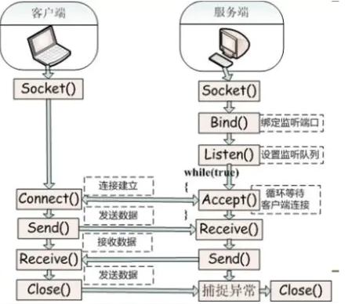


**服务器端**
（1）首先服务器应用程序用系统调用socket来创建一个套接字，它是系统分配给该服务器进程的类似文件描述符的资源，它不能与其他的进程共享。
（2）然后，服务器进程会给套接字起个名字，我们使用系统调用bind来给套接字命名。然后服务器进程就开始等待客户连接到这个套接字。
（3）接下来，系统调用listen来创建一个队列并将其用于存放来自客户的进入连接。
（4）最后，服务器通过系统调用accept来接受客户的连接。它会创建一个与原有的命名套接不同的新套接字，这个套接字只用于与这个特定客户端进行通信，而命名套接字（即原先的套接字）则被保留下来继续处理来自其他客户的连接（建立客户端和服务端的用于通信的流，进行通信）。

**客户端**
（1）客户应用程序首先调用socket来创建一个未命名的套接字，然后将服务器的命名套接字作为一个地址来调用connect与服务器建立连接。
（2）一旦连接建立，我们就可以像使用底层的文件描述符那样用套接字来实现双向数据的通信（通过流进行数据传输）。
[延伸阅读 ：Java socket编程](http://developer.51cto.com/art/201509/490775.htm)


### 三、参考引用

[1. 进程间通信--管道](http://blog.chinaunix.net/uid-26833883-id-3227144.html)
[2. Linux进程间通信——使用共享内存](http://blog.csdn.net/ljianhui/article/details/10253345)
[3. 进程间通信---共享内存](http://blog.chinaunix.net/uid-26833883-id-3230564.html)
[4. 信号量与互斥锁](http://www.cnblogs.com/diyingyun/archive/2011/12/04/2275229.html)
[5. 信号量](http://blog.chinaunix.net/uid-23193900-id-3194924.html)


### 四、iOS 进程间通信

1、URL scheme

      这个是iOS APP通信最常用到的通信方式，APP1通过openURL的方法跳转到APP2，并且在URL中带上想要的参数，有点类似HTTP的get请求那样进行参数传递。这种方式是使用最多的最常见的，使用方法也很简单只需要源APP1在info.plist中配置LSApplicationQueriesSchemes,指定目标App2的scheme；然后再目标App2的info.plist 中配置好URLtypes，表示该App接受何种URL scheme的唤起。

2、Keychain

- 安全
- 独立于沙盒

      iOS 系统的keychain是一个安全的存储容器，它本质上就是一个sqlite数据库，它的位置存储在/private/var/Keychains/keychain-2.db,不过它所保存的所有数据都是经过加密的，可以用来为不同的APP保存敏感信息，比如用户名，密码等。iOS系统自己也用keychain来保存VPN凭证和WiFi密码。它是独立于每个APP的沙盒之外的，所以即使APP被删除之后，keychain里面的信息依然存在。
      iOS系统提供的类KeychainItemWrapper，并通过keychain access groups就可以在应用之间共享keychain中的数据的数据了。

3、UIPasteBoard 剪贴板

      uipasteboard是剪切板功能，因为iOS 的原生空间UItextView，UItextfield，UIwebView ，我们在使用时如果长按，就会出现复制、剪切、选中、全选、粘贴等功能，这个就是利用系统剪切板功能来实现的。而每一个App都可以去访问系统剪切板，所以就能够通过系统剪贴板进行App间的数据传输了。
      iOS 14 开始就已经对 UIPasteboard 的访问给用户已提示，比如 xxx应用 访问了剪贴板。

4、UIDocumentInteractionController

      UIDocumentInteractionController 主要是用来实现同设备上APP之间的贡享文档，以及文档预览、打印、发邮件和复制等功能。
      首先通过调用它唯一的类方法 interactionControllerWithURL:，并传入一个URL(NSURL)，为你想要共享的文件来初始化一个实例对象。然后UIDocumentInteractionControllerDelegate，然后显示菜单和预览窗口。

5、Local socket

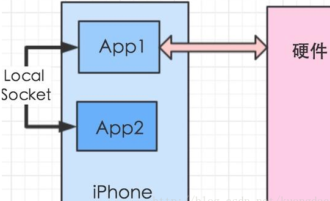

     原理：一个APP1在本地的端口port1234 进行TCP的bind 和 listen，另外一个APP2在同一个端口port1234发起TCP的connect连接，这样就可以简历正常的TCP连接，进行TCP通信了，然后想传什么数据就可以传什么数据了
     这种方式最大的特点就是灵活，只要连接保持着，随时都可以传任何相传的数据，而且带宽足够大。它的缺点就是因为iOS系统在任意时刻只有一个app在前台运行，那么就要通信的另外一方具备在后台运行的权限，像导航或者音乐类app。
     常用使用场景就是某个App1具有特殊的能力，比如能够跟硬件进行通信，在硬件上处理相关数据。而App2则没有这个能力，但是它能给App1提供相关的数据，这样APP2跟App1建立本地socket连接，传输数据到App1，然后App1在把数据传给硬件进行处理。

6、AirDrop

      通过 Airdrop实现不同设备的APP之间文档和数据的分享

7、UIActivityViewController

      iOS SDK 中封装好的类在APP之间发送数据、分享数据和操作数据

8、APP Groups

      APP group用于同一个开发团队开发的APP之间，包括APP和extension之间共享同一份读写空间，进行数据共享。同一个团队开发的多个应用之间如果能直接数据共享，大大提高用户体验