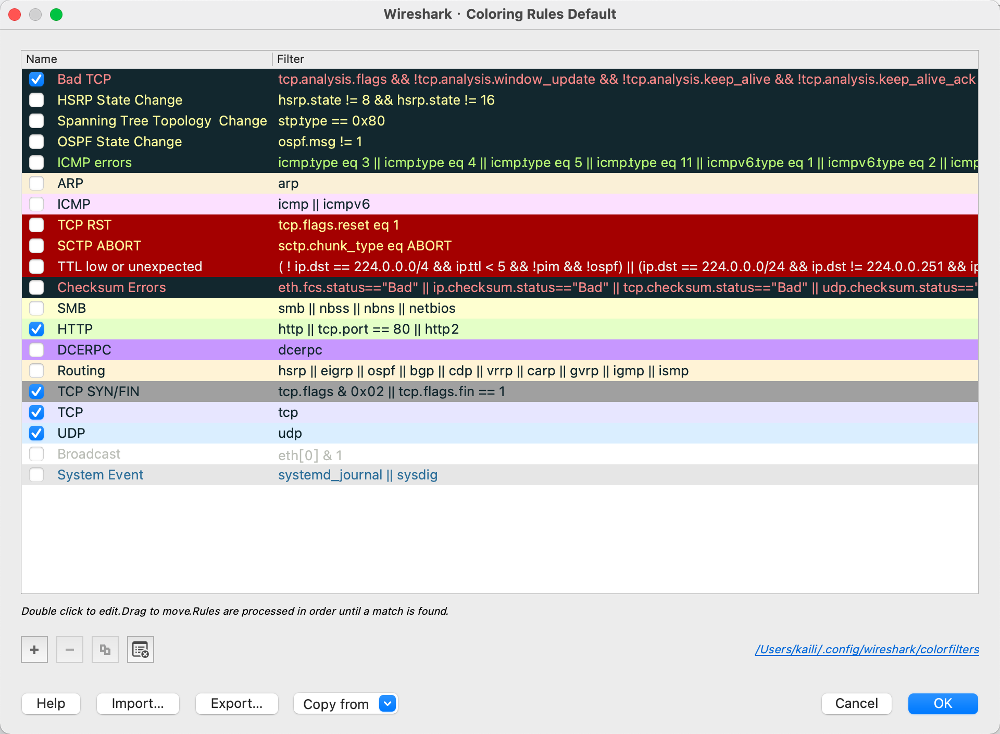

## Wireshark 简单使用

[toc]

### 认识 wireshark

当我们把 iPhone 通过数据线连接电脑时，Wireshark并不能直接监听通过 iPhone 的网络流量，需要通过一个系统程序在我们的Mac系统上，建立一个映射到iPhone的虚拟网卡，在terminal中输入如下命令即可：

```bash
rvictl -s 设备号
```

结果，我运行命令的时候，报错了如图：


命令找不到，然后，我在`.bash_profile` 文件中增加了 `rvictl` 的路径

```bash
export PATH="/usr/local/bin:/usr/bin:/bin:/usr/sbin:/sbin:/Library/Apple/usr/bin/"
```

然后 `source .bash_profile` 即可，如图


现在，建立映射关系，如图：


现在，打开  Wireshark 欢迎界面如下图，Wireshark在第一个界面就把当前系统所包含的网卡列出来了，直接点击任何一项就可以开始监听通过该网卡的所有网络流量。ps. 高亮处是我电脑连接的 iPhone 手机的网卡


双击进入后如图：


此时，启动iPhone上的任意App，只要有网络流量产生，对应的网络包都会在Wireshark上述的列表中展示出来。

- 标号为 1 是工具栏，通过工具栏我们可以控制监控的行为，比如开始抓包，停止抓包，重新开始抓包，以及在包之间跳转等等。

- 工具栏的底部有个输入框，可以让我们手动输入包的过滤条件，这部分对于熟练使用Wireshark抓包非常重要。

- 标号为 2 是历史流量包列表展示界面，这里展示的是从抓包开始，所有通过我们iPhone设备的流量。列表界面不同的包有不同的颜色，Wireshark通过颜色来区分包的类型，对于特定场景快速识别目标流量非常有用。

  

- 标号为 3 是单个包的详细信息展示面板，我们在第二部分选中的网络包在这一部分会将其结构以可阅读的文本形式展示出来，要正确阅读这一部分的信息需要对 TCP/IP 协议有一定的掌握。

  

- 标号为 4 是单个包的二进制流信息展示面板，这一部分展示的信息是包的原始数据，也是一个网络包所包含内容的真实展现，我们在第3部分选中的协议头，都会在这一部分以同步高亮的形式标记出来。这一部分的展示是为了让我们对包的真实内容做直观的判断，能具体到单个 byte。

  


### 进阶

#### 使用过滤

使用 Wireshark 一开始感觉会没有头绪，阅读困难，所以此时我们需要使用 Filter 来做包的过滤，Filter 规则定的越细，剔除掉的干扰信息就越多，分析起来就越快。Wireshark 的 Filter 分为两种，如下：

- **Capture Filter**
- **Display Filter**


##### capture filter

```lua
//只捕获HTTP流量
port 80 or port 443

//只捕获DNS流量
port 53

//只捕获和特定主机的流量
host 171.10.191.10
```


##### display filter

**Table 6.5. Display Filter comparison operators**

| English     | C-like | Description                                                  | Example                                   |
| :---------- | :----- | :----------------------------------------------------------- | :---------------------------------------- |
| eq          | ==     | Equal                                                        | `ip.src==10.0.0.5`                        |
| ne          | !=     | Not equal                                                    | `ip.src!=10.0.0.5`                        |
| gt          | >      | Greater than                                                 | `frame.len > 10`                          |
| lt          | <      | Less than                                                    | `frame.len < 128`                         |
| ge          | >=     | Greater than or equal to                                     | `frame.len ge 0x100`                      |
| le          | <=     | Less than or equal to                                        | `frame.len <= 0x20`                       |
| contains    |        | Protocol, field or slice contains a value                    | `sip.To contains "a1762"`                 |
| matches     | ~      | Protocol or text field matches a Perl-compatible regular expression | `http.host matches "acme\.(org|com|net)"` |
| bitwise_and | &      | Bitwise AND is non-zero                                      | `tcp.flags & 0x02`                        |


```c
// 只看某个主机的流量
ip.addr==171.10.191.10
  
// 只看http或者https的流量  
tcp.port == 80 || tcp.port == 443
```


#### 流量跟踪

Wireshark默认情况下将不同网络连接的流量都混在一起展示，即使给不同协议的包上色之后，要**单独查看某个特定连接的流量**依然不怎么方便，我们可以通过Wireshark提供的两种方式来实现这个目标。

##### Follow Stream


在 display filter 会看到 `tcp.stream eq 0` （筛选出第一个TCP流）

> ps. 0只是wireshark给tcp流的一个编号。TCP 流是可以用一对(`ip,port`)来限定的。

Wireshark 支持我们常见的4种Stream：

- TCP
- UDP
- SSL
- HTTP


弹出的窗口，将iPhone和Server之间某次的连接流量完整的呈现出来，包括iPhone发送了12个包，Server回了10个包，以及iPhone上行和下行的流量 20KB，还提供流量编解码选择，文本搜索功能等。具体参见官方文档 [Follow TCP Stream](https://www.wireshark.org/docs/wsug_html_chunked/ChAdvFollowStreamSection.html)


##### Flow Graphic

一图胜千言：


如果没有过滤，如下图：


> #### Follow Stream 对比 Flow Graph
>
> Follow Stream更适合分析针对某一个服务器地址的流量，而Flow Graph更适合分析某个App的整体网络行为，包含从DNS解析开始到和多个服务器交互等。


#### HTTPS

移步这篇文章 [HTTPS](./2021-3-18-HTTPS.md)


### 参考文献

- [Wireshark抓包iOS入门教程](https://www.jianshu.com/p/c67baf5fce6d)
- [wireshark 官方文档](https://www.wireshark.org/docs/)
  - [Filter](https://www.wireshark.org/docs/wsug_html_chunked/ChWorkBuildDisplayFilterSection.html)
  - [Follow TCP Stream](https://www.wireshark.org/docs/wsug_html_chunked/ChAdvFollowStreamSection.html)

