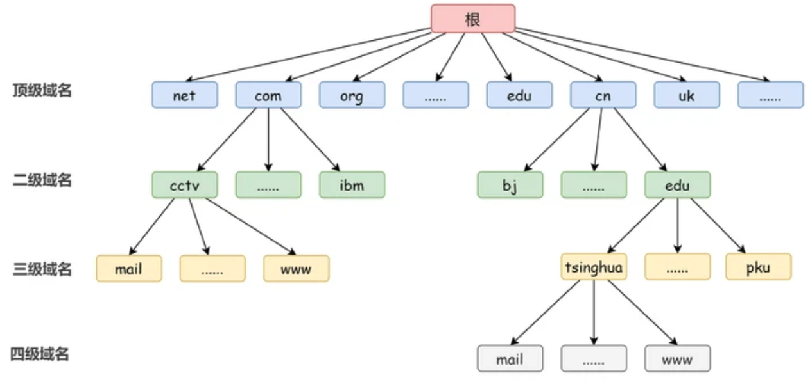
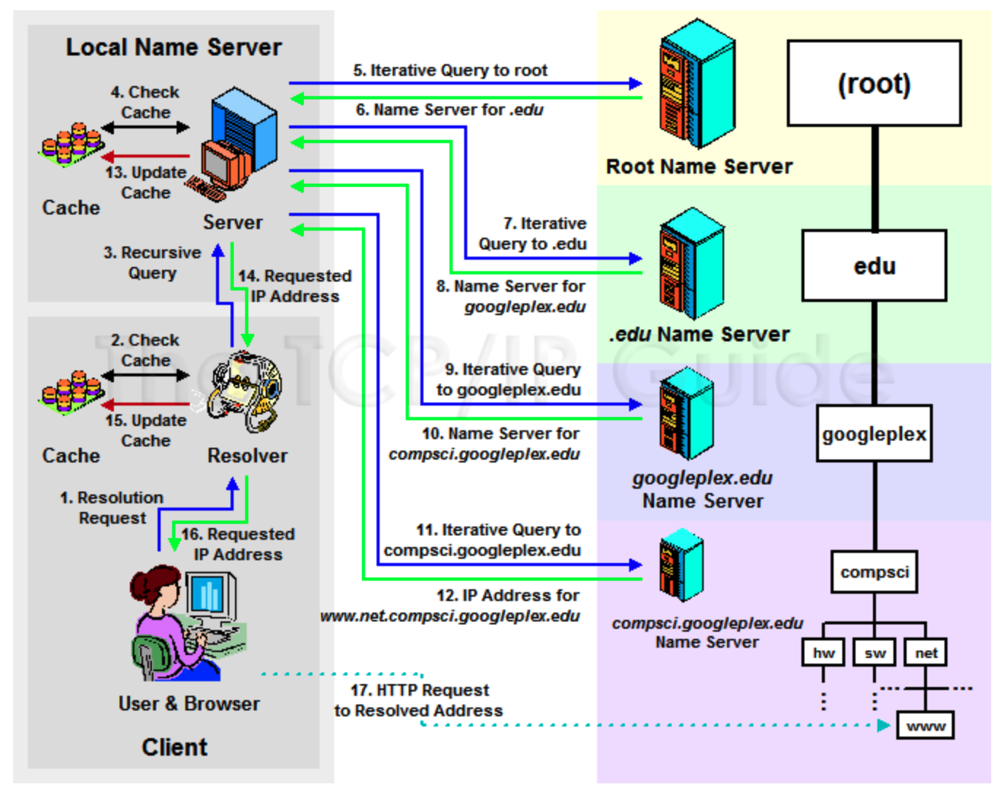
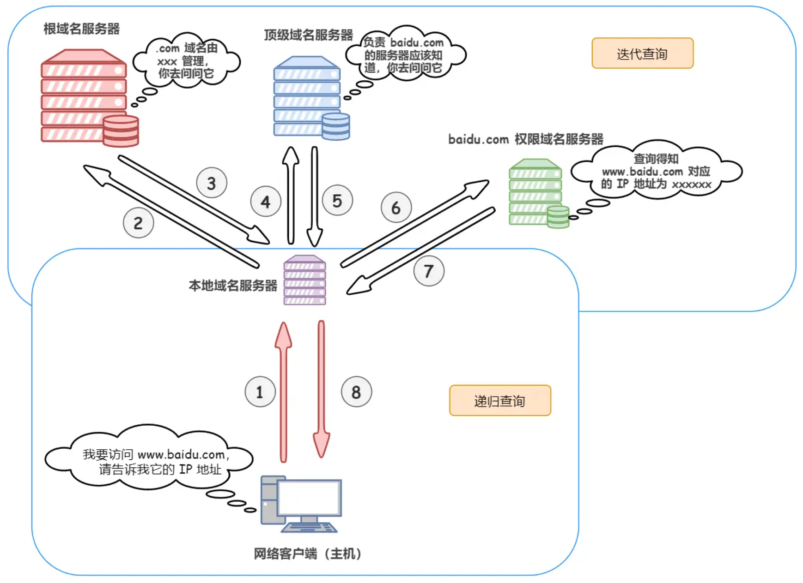
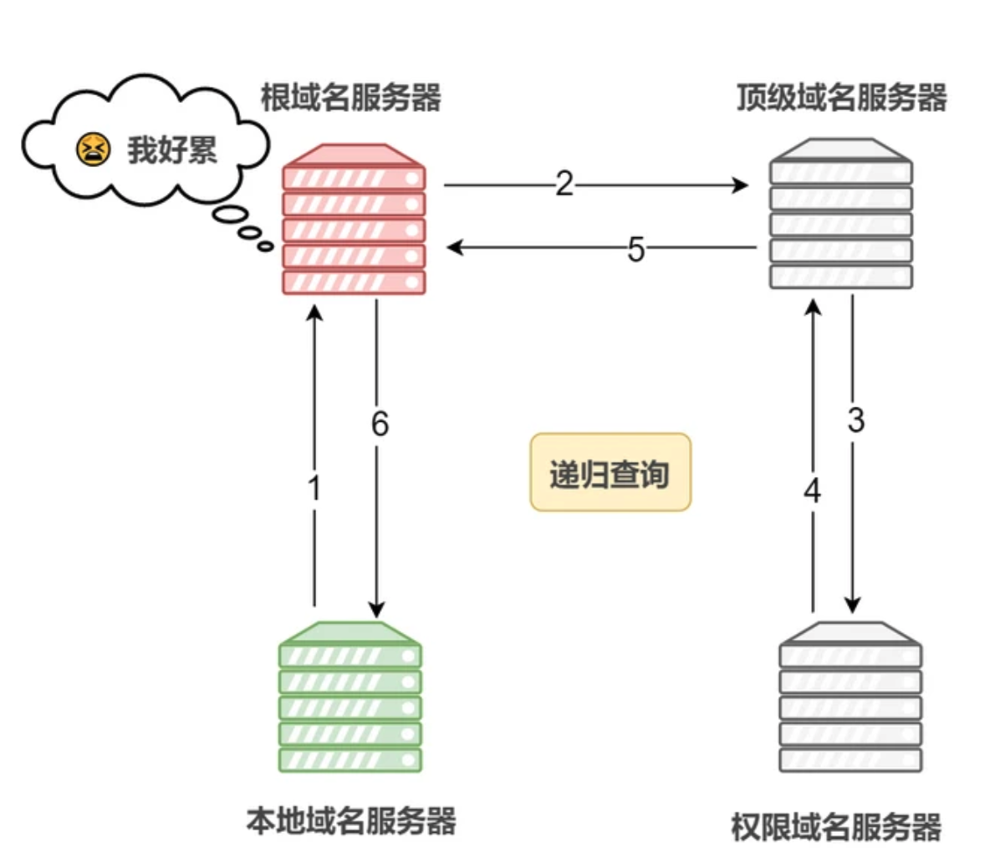
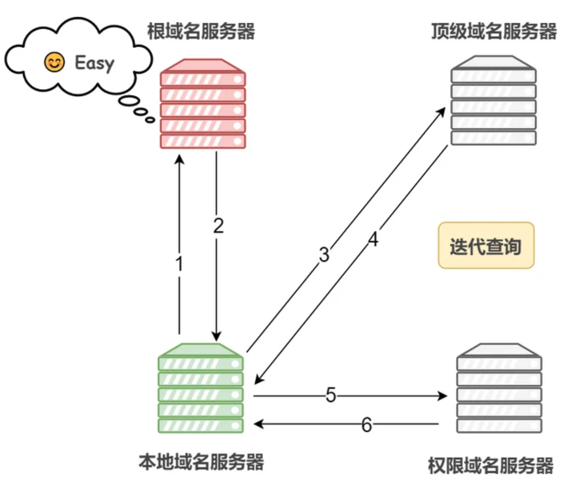

## 了解 DNS


### 1 DNS (Domain Name System) 

> [域名系统 from 维基百科](https://zh.wikipedia.org/wiki/%E5%9F%9F%E5%90%8D%E7%B3%BB%E7%BB%9F)
>
> DNS 作为将域名和IP地址相互映射的一个分布式数据库，能够使人方便地访问互联网。DNS 使用 TCP 和 UDP 端口 53.当前，对于每一级域名长度的限制是63个字符，域名总长度则不能超过253个字符。
>
> 
>
> DNS系统中，常见的资源记录类型有：
>
> - 主机记录（A记录）：RFC 1035定义，A记录是用于名称解析的重要记录，它将特定的主机名映射到对应主机的IP地址上。
> - 别名记录（CNAME记录）: RFC 1035定义，CNAME记录用于将某个别名指向到某个A记录上，这样就不需要再为某个新名字另外创建一条新的A记录。
> - IPv6主机记录（AAAA记录）: RFC 3596定义，与A记录对应，用于将特定的主机名映射到一个主机的[IPv6](https://zh.wikipedia.org/wiki/IPv6)地址。
> - 服务位置记录（SRV记录）: RFC 2782定义，用于定义提供特定服务的服务器的位置，如主机（hostname），端口（port number）等。
> - 域名服务器记录（NS记录） ：用来指定该域名由哪个DNS服务器来进行解析。 您注册域名时，总有默认的DNS服务器，每个注册的域名都是由一个DNS域名服务器来进行解析的，DNS服务器NS记录地址一般以以下的形式出现： ns1.domain.com、ns2.domain.com等。 简单的说，NS记录是指定由哪个DNS服务器解析你的域名。
> - NAPTR记录：RFC 3403定义，它提供了[正则表达式](https://zh.wikipedia.org/wiki/正则表达式)方式去映射一个域名。NAPTR记录非常著名的一个应用是用于[ENUM](https://zh.wikipedia.org/w/index.php?title=ENUM&action=edit&redlink=1)查询。


域名系统，使得使用者不需要直接接触难阅读和记忆的 IP 地址（之前的文章里已经聊过 [IP协议](./articles/2018/2018-9-2-互联网协议3.md)），另一方面因为服务器的 IP 地址可能会经常变动，如果没有了 DNS ，那么 IP 地址一旦发生了更改，当前服务器的客户端就没有办法连接到目标的服务器了。所以，`域名 <--> IP` 的关系，可以保证集群对外提供的服务能够相对稳定地被其他客户端访问。

> ps.通过域名映射成IP地址称为正向解析；将 IP 地址映射成域名称为反向解析


### 2 域名

ICANN，`Internet Corporation for Assigned Names and Numbers` 负责管理全球域名系统的运作。

#### 2.1 域名层次结构



##### 2.1.1 根域名

理论上，**所有域名的查询都必须先查询根域名**，因为只有根域名才能告诉你，某个顶级域名由哪台服务器管理。

ICANN 维护根域名列表（**DNS Root Zone**），里面记载着顶级域名和对应的托管商。

其实，根域名列表变化较小，大多数 DNS 服务商都会提供它的缓存，所以根域名的查询事实上不是那么频繁。


##### 2.1.2 顶级域名（TLD）Top Level Domains

`www.apple.com` 的顶级域名是 `.com` 

ICANN 的一项主要工作，就是规定那些字符串可以当做顶级域名。各顶级域名都由 ICANN 指定的托管商实际运营

- 通用顶级域名（gTLD）：`.com` `.net` `.edu` 等
- 国家顶级域名（ccTLD）：`.cn` `.io` `.cc` 等


##### 2.1.3 二级域名 Second Level Domain

- 通用顶级域名下的二级域名：`baidu.com` ... 商业组织通常使用自己的商标、商号或其他商业标志作为自己的网上名称
- 国家顶级域名下的二级域名：一般是指类似于通用顶级域名的表示注册人类别和功能的标志。例如，在 `.com.cn` 域名结构中，`.com` 此时是置于国家顶级域名 `.cn` 下的二级域名，表示中国的商业性组织，以此类推。

**三级域名**是形如 `www.baidu.com` 的域名，可以当做二级域名的子域名，特征为域名包含两个`.` 一般称为域名下的”**二级目录**“

对于域名所有者/使用者而言，三级域名都是二级域名的附属物而无需单独费用。


### 3 域名服务器

> 管理域名的主机和相应的软件，域名服务器可以管理所在分层（ZONE）的域名的相关信息。
>
> 域名的每层都设有一个域名服务器：
>
> - 根域名服务器
>   - 保存 DNS 根区文件的服务器
>   - 保存所有的顶级域名的服务器的地址
> - 顶级域名服务器
>   - 管理注册在该顶级域名下的所有二级域名
>   - 记录这些二级域名的 IP 地址
> - 权限域名服务器
>   - 负责管理一个 **区** 的域名服务器
>   - 分区具体是根据域名多少、访问多少等情况自己规定的
>
> 此外，还有
>
> - **本地域名服务器**也叫 （**权威域名服务器**）
>   - 是电脑解析时的**默认** 域名服务器，即电脑设置的首选 DNS 服务器和备选 DNS 服务器。常见的有：
>     - 电信
>     - 联通
>     - 阿里
>     - ...
>
> 每个因特网服务提供者或一所大学，甚至一所大学中的各个系，都可以拥有一个本地域名服务器。
>
> **当一台主机发出 DNS 查询请求时，这个查询请求报文就发送给该主机的本地域名服务器**。**本地域名服务器管理本地域名的解析和映射，并且能够向上级域名服务器进行查询**。


### 4 域名解析过程

#### 4.1 使用命令追踪

##### 4.1.1  dig 

`+trace`参数可以显示DNS的整个分级查询过程。

`+short`参数可以显示简化的结果。

`dig`命令可以单独查看每一级域名的NS记录。`dig ns com`

eg.

```c
➜  ~ dig +trace www.baidu.com

; <<>> DiG 9.10.6 <<>> +trace www.baidu.com
;; global options: +cmd
.			194835	IN	NS	e.root-servers.net.
.			194835	IN	NS	b.root-servers.net.
.			194835	IN	NS	a.root-servers.net.
.			194835	IN	NS	i.root-servers.net.
.			194835	IN	NS	f.root-servers.net.
.			194835	IN	NS	d.root-servers.net.
.			194835	IN	NS	h.root-servers.net.
.			194835	IN	NS	j.root-servers.net.
.			194835	IN	NS	c.root-servers.net.
.			194835	IN	NS	l.root-servers.net.
.			194835	IN	NS	g.root-servers.net.
.			194835	IN	NS	k.root-servers.net.
.			194835	IN	NS	m.root-servers.net.
.			518398	IN	RRSIG	NS 8 0 518400 20210804050000 20210722040000 26838 . BCVTDa1QNhQhCSsEW7xcFICVsgMdYCum/+miloQ1QlKX3MAY1hbq6ull 5qzqDwiCHcpQJZLVp4Ndeap5I9EVBlProR1afNfO9w3cIBRRNzdMbHeP jJsBJh9wfDdM0ZS7HJY2aDOMRzWRHUrmGanJVKYA8vNdwkLvFbN2IL+b X7kM9fGi58XY5E8ZVe9f1ndtdA2h7B9A5XfUdO83AJOht19kK0akZlex JW6IA+o8iwc6LVh8pwUM2uny+msLxVU1BovtSlr5Da7jXqUThlK5Hvwl rB9Rz4T2J8gPuqse3JaVWlryBC8rZqJbZdGdnAqMRaLgkbCmrQSDjuCk pzS4Cw==
;; Received 1097 bytes from 8.8.8.8#53(8.8.8.8) in 32 ms

www.baidu.com.		117	IN	CNAME	www.a.shifen.com.
www.a.shifen.com.	93	IN	A	39.156.66.14
www.a.shifen.com.	93	IN	A	39.156.66.18
com.			22037	IN	NS	e.gtld-servers.net.
com.			22037	IN	NS	d.gtld-servers.net.
com.			22037	IN	NS	c.gtld-servers.net.
com.			22037	IN	NS	b.gtld-servers.net.
com.			22037	IN	NS	l.gtld-servers.net.
com.			22037	IN	NS	g.gtld-servers.net.
com.			22037	IN	NS	k.gtld-servers.net.
com.			22037	IN	NS	f.gtld-servers.net.
com.			22037	IN	NS	h.gtld-servers.net.
com.			22037	IN	NS	j.gtld-servers.net.
com.			22037	IN	NS	a.gtld-servers.net.
com.			22037	IN	NS	m.gtld-servers.net.
com.			22037	IN	NS	i.gtld-servers.net.
;; Received 897 bytes from 192.58.128.30#53(j.root-servers.net) in 3 ms
```

简单提几点：

1. 93 是TTL值 Time to live
2. A 是 A记录 ；上述有2条 A记录，即2个IP地址
3. NS 是 NS 记录；上述有13条 NS 记录，即向其中任意一台查询都能查到`baidu.com` 的IP地址
4. 查询端口 53


##### 4.1.2 nslookup命令

查看一下百度的ip是不是上面显示的两个:

```c
➜  ~ nslookup www.baidu.com
Server:		8.8.8.8
Address:	8.8.8.8#53

Non-authoritative answer:
www.baidu.com	canonical name = www.a.shifen.com.
Name:	www.a.shifen.com
Address: 39.156.66.18
Name:	www.a.shifen.com
Address: 39.156.66.14
```


#### 4.2 解析过程

##### 4.2.1 解析过程-1

DNS 解析器从根域名服务器查找到顶级域名服务器的 IP 地址，又从顶级域名服务器查找到权威域名服务器的 IP 地址，最终从权威域名服务器查出了对应服务的 IP 地址。




1. 浏览器输入 `www.baidu.com` 发出解析 request

2. 本机解析器 Resolver 查询本地缓存和 host 文件中是否为域名映射关系，如果有则调用这个 IP 地址映射，完成解析

   > SwitchHosts 编辑 Host 文件

3. 如果hosts与本机解析器缓存都没有响应的网址映射关系，则本机解析器 Resolver 会向 TCP/IP 参数中设置的首选项 DNS 服务器（Local DNS 服务器）发起一个递归的查询请求

4. 服务器收到 request 时，如果要查询的域名由自己负责解析，则返回解析结果给client，完成域名解析，此解析具有**权威性**。如果要查询的域名，不由 Local DNS 服务器解析，但该服务已缓存了此网址映射关系，则调用这个 IP 地址映射，完成域名解析，此解析不具有权威性。

5. 如果 Local DNS 服务器本地区域文件与缓存解析都失败，则根据 Local DNS 服务器的设置（是否递归）进行查询，如果未设置递归，Local DNS 就把请求发送至 13 台Root DNS 。如果是递归，该 DNS 服务器就会把请求转发至上一级 DNS 服务器，由上一级服务器进行解析，上一级不能解析，或者找根DNS或者把请求转至上上级，以此循环。

   > 为什么是13台Root DNS
   >
   > 由于早期的 DNS 查询结果是一个 512 字节的 UDP 数据包。这个包最多可以容纳 13 个服务器的地址，因此就规定全世界有 13 个根域名服务器，编号从 `a.root-servers.net` 一直到 `m.root-servers.net`。其中 10 台设置在美国，另外各有一台设置于荷兰、瑞典和日本。
   >
   > 向预置的 13 组根域名服务器发出请求获取顶级域名的地址：a-m。虽然域名服务器总共只有 13 组，但是每一组服务器都通过提供了镜像服务，全球大概也有几百台的根域名服务器在运行。

   

6. Root DNS 服务器收到request后会判断这个域名是谁来授权管理，并会返回一个负责该顶级域名服务器的一个 IP
7. Local DNS 服务器收到 IP 信息后，将会联系负责 `.com` 域的这台服务器
8. 负责 `.com` 域的这台服务器收到请求后，如果自己无法解析，它就会找一个管理 `.com` 域的下一级 DNS 服务器地址给本地 DNS 服务器
9. 当 Local DNS 服务器收到这个地址后，就会找 `baidu.com` 域服务器，10、11 重复上面的动作，进行查找
10. 最后 `www.baidu.com` 返回需要解析的域名的 IP 地址给 Local DNS 服务器
11. Local DNS 服务器缓存这个解析结果（同时也会缓存，6、8、10 返回的结果）
12. Local DNS 服务器同时将结果返回给本机域名解析器
13. 本机缓存解析结果
14. 本机解析器Resolver将结果返回给浏览器
15. 浏览器通过返回的 IP 地址发起请求


##### 4.2.2 解析过程-2

1）首先搜索**浏览器的 DNS 缓存**，缓存中维护一张域名与 IP 地址的对应表；

2）若没有命中，则继续搜索**操作系统的 DNS 缓存**；

3）若仍然没有命中，则操作系统将域名发送至**本地域名服务器**，本地域名服务器查询自己的 DNS 缓存，查找成功则返回结果（注意：主机和本地域名服务器之间的查询方式是**递归查询**）；

4）若本地域名服务器的 DNS 缓存没有命中，则本地域名服务器向上级域名服务器进行查询，通过以下方式进行**迭代查询**（注意：本地域名服务器和其他域名服务器之间的查询方式是迭代查询，防止根域名服务器压力过大）：

- 首先本地域名服务器向**根域名服务器**发起请求，根域名服务器是最高层次的，它并不会直接指明这个域名对应的 IP 地址，而是返回顶级域名服务器的地址，也就是说给本地域名服务器指明一条道路，让他去这里寻找答案
- 本地域名服务器拿到这个**顶级域名服务器**的地址后，就向其发起请求，获取**权限域名服务器**的地址
- 本地域名服务器根据权限域名服务器的地址向其发起请求，最终得到该域名对应的 IP 地址

4）本地域名服务器将得到的 IP 地址返回给操作系统，同时自己将 IP 地址缓存起来

5）操作系统将 IP 地址返回给浏览器，同时自己也将 IP 地址缓存起来

6）至此，浏览器就得到了域名对应的 IP 地址，并将 IP 地址缓存起来




#### 4.3 查询方式

一般来说，**域名服务器之间的查询使用迭代查询方式，以免根域名服务器的压力过大**。

##### 4.3.1 递归查询

如果主机所询问的本地域名服务器不知道被查询域名的 IP 地址，那么本地域名服务器就以 DNS 客户的身份，向其他根域名服务器继续发出查询请求报文，而不是让该主机自己进行下一步的查询。



##### 4.3.2 迭代查询

所谓迭代就是，如果请求的接收者不知道所请求的内容，那么**接收者将扮演请求者**，发出有关请求，直到获得所需要的内容，然后将内容返回给最初的请求者。

通俗点来说，在递归查询中，如果 A 请求 B，那么 B 作为请求的接收者一定要给 A 想要的答案；而迭代查询则是指，如果接收者 B 没有请求者 A 所需要的准确内容，接收者 B 将告诉请求者 A，如何去获得这个内容，但是自己并不去发出请求。




#### 4.4 DNS 解析器缓存

为了提升域名查询效率，设计了域名缓存机制，当访问过某个网站并得到其IP后，会将其域名和IP缓存下来，下一次访问的时候，就不需要再请求域名服务器获取IP，直接使用缓存中的IP，提高了响应的速度。当然缓存是有有效时间（即TTL值）的，当过了有效时间后，再次请求网站，还是需要先请求域名解析。


**4.4.1 操作系统DNS缓存**：系统维护的缓存服务，它包含有最近的网站和其他 Internet 域的访问记录。各操作系统的缓存时间也存在着差异。

**4.4.2 浏览器DNS缓存**：浏览器DNS缓存的时间跟DNS服务器返回的TTL值无关。浏览器在获取网站域名的实际 IP 地址后会对其IP进行缓存，减少网络请求的损耗。每种浏览器都有一个固定的 DNS 缓存时间。


### 参考文献

- [为什么 DNS 使用 UDP 协议](https://draveness.me/whys-the-design-dns-udp-tcp/)
- [为什么 DNS 使用 UDP 协议](https://draveness.me/dns-coredns/)
- [HttpDns 原理是什么](http://www.linkedkeeper.com/171.html)
- [超详细DNS协议解析](https://segmentfault.com/a/1190000039039275)
- [万字长文爆肝DNS协议](https://network.51cto.com/art/202101/641655.htm)
- [RFC 1035](https://datatracker.ietf.org/doc/html/rfc1035)

