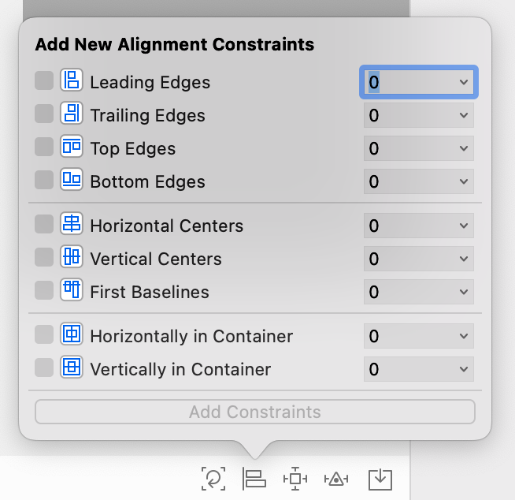
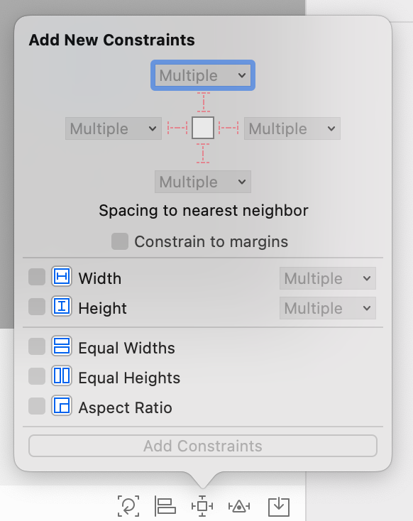
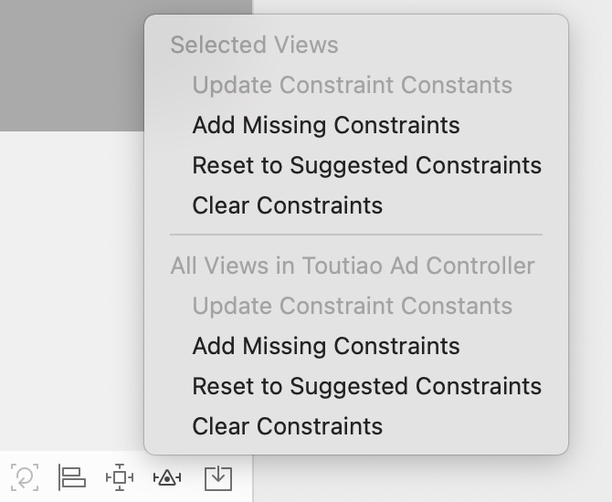
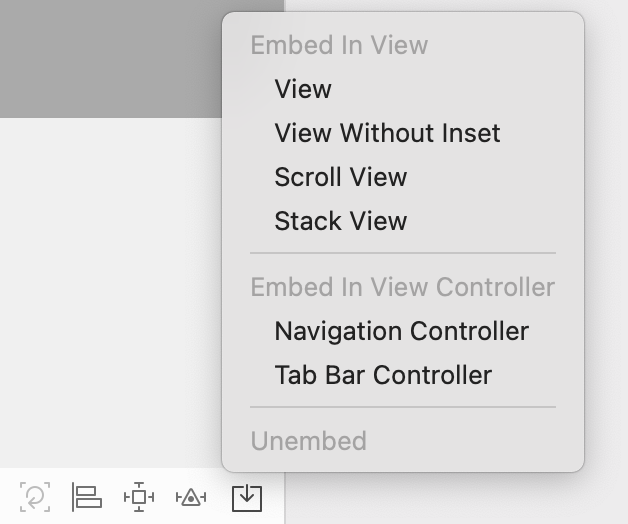

## Masonry

> [Masonry](https://github.com/SnapKit/Masonry) is still actively maintained, we are committed to fixing bugs and merging good quality PRs from the wider community. However if you're using Swift in your project, we recommend using [SnapKit](https://github.com/SnapKit/SnapKit) as it provides better type safety with a simpler API.


### MASViewAttribute

| MASViewAttribute  | NSLayoutAttribute         |
| ----------------- | ------------------------- |
| view.mas_left     | NSLayoutAttributeLeft     |
| view.mas_right    | NSLayoutAttributeRight    |
| view.mas_top      | NSLayoutAttributeTop      |
| view.mas_bottom   | NSLayoutAttributeBottom   |
| view.mas_leading  | NSLayoutAttributeLeading  |
| view.mas_trailing | NSLayoutAttributeTrailing |
| view.mas_width    | NSLayoutAttributeWidth    |
| view.mas_height   | NSLayoutAttributeHeight   |
| view.mas_centerX  | NSLayoutAttributeCenterX  |
| view.mas_centerY  | NSLayoutAttributeCenterY  |
| view.mas_baseline | NSLayoutAttributeBaseline |

### 使用与理解

#### 宏定义

```objective-c
/**
 *  Convenience auto-boxing macros for MASConstraint methods.
 *
 *  Defining MAS_SHORTHAND_GLOBALS will turn on auto-boxing for default syntax.
 *  A potential drawback of this is that the unprefixed macros will appear in global scope.
 */
#define mas_equalTo(...)                 equalTo(MASBoxValue((__VA_ARGS__)))
#define mas_greaterThanOrEqualTo(...)    greaterThanOrEqualTo(MASBoxValue((__VA_ARGS__)))
#define mas_lessThanOrEqualTo(...)       lessThanOrEqualTo(MASBoxValue((__VA_ARGS__)))

#define mas_offset(...)                  valueOffset(MASBoxValue((__VA_ARGS__)))


#ifdef MAS_SHORTHAND_GLOBALS

#define equalTo(...)                     mas_equalTo(__VA_ARGS__)
#define greaterThanOrEqualTo(...)        mas_greaterThanOrEqualTo(__VA_ARGS__)
#define lessThanOrEqualTo(...)           mas_lessThanOrEqualTo(__VA_ARGS__)

#define offset(...)                      mas_offset(__VA_ARGS__)

#endif
```


#### 基础方法

- `mas_makeConstraints`:添加约束
- `mas_updateConstraints`：更新约束、亦可添加新约束（保留未更新的约束）
- `mas_remakeConstraints`：重写之前的约束（remake会将之前的全部移除，然后重新添加）

#### 注意点

1. `mas_makeConstraints` 是给view添加约束，约束有几种，分别是边距，宽，高，左上右下距离，基准线。添加过约束后可以有修正，修正 有`offset`（位移）修正和`multipliedBy`（倍率）修正

   1. 使用`multipliedBy`必须是对同一个控件本身，如果修改成相对于其它控件会出导致Crash

2. 语法一般是 `make.equalTo` or `make.greaterThanOrEqualTo` or `make.lessThanOrEqualTo` + 倍数和位移修正

3. 使用 `mas_makeConstraints`方法的元素必须**事先添加到父元素的中**，例如`[self.view addSubview:view];`

4. ```objective-c
   //define this constant if you want to use Masonry without the 'mas_' prefix
   // (只要在导入Masonry主头文件之前定义这个宏, 那么以后在使用Masonry框架中的属性和方法的时候, 就可以省略mas_前缀)
   #define MAS_SHORTHAND
   
   //define this constant if you want to enable auto-boxing for default syntax
   // （只要在导入Masonry主头文件之前定义这个宏,那么就可以让equalTo函数接收基本数据类型, 内部会对基本数据类型进行包装）
   #define MAS_SHORTHAND_GLOBALS
   ```

5.  `mas_equalTo` 和 `equalTo` 区别：`mas_equalTo` 比`equalTo`多了类型转换操作，一般来说，大多数时候两个方法都是 通用的，但是对于数值元素使用`mas_equalTo`。对于对象或是多个属性的处理，使用`equalTo`。特别是多个属性时，必须使用`equalTo`,例如 `make.left.and.right.equalTo(self.view);`

6. 注意到方法`with`和`and`,这连个方法其实没有做任何操作，方法只是返回对象本身，这这个方法的左右完全是为了方法写的时候的**可读性** 。`make.left.and.right.equalTo(self.view);`和`make.left.right.equalTo(self.view);`是完全一样的，但是明显的加了`and`方法的语句可读性更好点。

7. 大开销的场景下，动画和渲染，还是使用原始的`frame`布局来做。


#### 更新约束

当你的所有约束都在 `updateConstraints` 内调用的时候，你就需要在此调用此方法，因为 `updateConstraints`方法是需要触发的

```objectivec
// 调用在view 内部，而不是viewcontroller
+ (BOOL)requiresConstraintBasedLayout {
    return YES;
}

/**
 *  苹果推荐 约束 增加和修改 放在此方法种
 */
- (void)updateConstraints {
    [self.growingButton updateConstraints:^(MASConstraintMaker *make) {
        make.center.equalTo(self);
        make.width.equalTo(@(self.buttonSize.width)).priorityLow();
        make.height.equalTo(@(self.buttonSize.height)).priorityLow();
        make.width.lessThanOrEqualTo(self);
        make.height.lessThanOrEqualTo(self);
    }];
    //最后记得回调super方法
    [super updateConstraints];
}
```

一种有误区的写法是在`(void)updateConstraints`方法中进行初次`constraint`设置，这是不被推荐的。推荐的写法是在`init`或者`viewDidLoad`中进行`view`的初次`constraint`设置。


#### 动画

```objective-c
[aniView mas_makeConstraints:^(MASConstraintMaker *make) {
    make.top.bottom.left.right.equalTo(self.view).offset(10);
}];

[aniView mas_updateConstraints:^(MASConstraintMaker *make) {
    make.top.equalTo(self.view).offset(30);
}];

[UIView animateWithDuration:3 animations:^{
    [self.view layoutIfNeeded];
}];
```


### Xib of AutoLayout

图1



图2



图3




图4



#### AutoLayout 的调试

- [Autolayout Breakpoints](https://nshint.io/blog/2015/08/17/autolayout-breakpoints/)

- [Debugging iOS AutoLayout Issues](https://staxmanade.com/2015/06/debugging-ios-autolayout-issues/)

#### AutoLayout method

- setNeedsLayout：告知页面需要更新，但是不会立刻开始更新。执行后会立刻调用layoutSubviews。
- layoutIfNeeded：告知页面布局立刻更新。所以一般都会和setNeedsLayout一起使用。如果希望立刻生成新的frame需要调用此方法，利用这点一般布局动画可以在更新布局后直接使用这个方法让动画生效。
- layoutSubviews：系统重写布局
- setNeedsUpdateConstraints：告知需要更新约束，但是不会立刻开始
- updateConstraintsIfNeeded：告知立刻更新约束
- updateConstraints：系统更新约束
