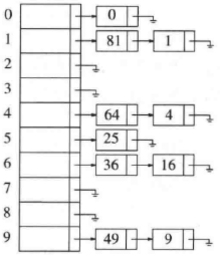

## 散列表

> 来自 [维基百科](https://zh.wikipedia.org/wiki/%E5%93%88%E5%B8%8C%E8%A1%A8)
>
> 散列表（Hash table， 也叫**哈希表**），是根据**键**（key）而直接访问在内存存储位置的**数据结构**。它通过计算一个关于键值的函数，将所需查询的数据**映射**到表中一个位置来访问记录，加快了查找速度。这个映射函数称作 **散列函数**，存放记录的数组称作**散列表**。
>
> #### 基本概念
>
> - 若关键字为 k ，则其值存放在 f(k) 的存储位置上。由此，不需要比较就可以直接取得所查记录。称这个对应关系 f 为 **散列函数**，按这个思想建立的表为 **散列表**。
> - 对不同的关键字 k 可能得到同一散列地址，即 k1 != k2 ，而 f(k1) = f(k2)，这种现象称为 **冲突**（collision）。具有相同函数值得关键字对该散列函数来说称做**同义词**。根据散列函数 f(k) 和处理冲突的方法将一组关键字映射到一个有限的连续的地址集（区间）上，并以关键字在地址集中的**像**作为记录在表中的存储位置，这种表便称为**散列表**，这一映射过程为**散列造表**或**散列**，所得的存储位置称**散列地址**。
> - 若对于关键字集合中的任一个关键字，经散列函数映像到地址集合中任何一个地址的概率是相等的，则称此类散列函数为 **均匀散列函数**，这就是关键字经过散列函数得到一个 “随机的地址”，从而减少冲突。
>   - （均匀散列假设）我们使用的散列函数能够均匀并独立地将所有的键散布于0到M – 1之间。

### 散列函数

散列函数能使对一个数据序列的访问过程更加迅速有效，通过散列函数，数据元素将被更快定位。

1. 直接定址法

   > 取关键字或关键字的某个线性函数值为散列地址。即` hash(k) = k / hash(k) = a*k + b , （a,b 为常数）`（这种散列函数叫做自身函数）

2. 数字分析法

   > 假设关键字是以 r 为基的数，并且哈希表中可能出现的关键字都是事先知道的，则可取关键字的若干数位组成哈希地址。

3. 平方取中法

   > 取关键字平方后的中间几位为哈希地址。通常在选定哈希函数时不一定能知道关键字的全部情况，取其中的哪几位也不一定合适，而一个数平方后的中间几位数和数的每一位都有相关，由此使随机分布的关键字得到哈希地址也是随机的。取的位数由表长决定。

4. 折叠法

   > 将关键字分割成位数相同的几部分（最后一部分的位数可以不同），然后取这几部分的叠加和（舍去进位）作为哈希地址。

5. 随机数法

6. 除留余数法

   > 取关键字被某个不大于散列表表长m的数p除后所得的**余数**为散列地址。即` hash(k) = k mod p, p<=m`。不仅可以对关键字直接取模，也可在折叠法、平方取中法等运算之后取模。对 p 的选择很重要，**一般取素数或m，若 p 选择不好，容易产生冲突**。

散列函数的特点：

- 确定性，如果两个散列值是不同的（根据同一函数），那么这两个散列值的原始输入也是不同的
- 散列碰撞，散列函数的输入和输出不是唯一对应关系，如果两个散列值相同，两个输入值可能是相同的，但也可能不同。
- 不可逆性，一个哈希值对应无数个明文，理论上你并不知道哪个是
- 混淆特性，输入一些数据计算出散列值，然后部分改变输入值，一个具有强混淆特性的散列函数会产生一个完全不同的散列值。

#### 常见的散列函数

##### MD5 消息摘要算法

一种被广泛使用的**密码散列函数**，可以生产出一个 128 位（16字节）的散列值，用于确保信息传输完整一致。

##### SHA-1

一种**密码散列函数**，中文名：安全散列算法1 。它可以生成一个被称为消息摘要的 160 位（20字节）散列值，散列值通常的呈现形式为 40 个十六进制数。

### 散列冲突

事实上，再好的散列函数都无法避免散列冲突。因为，假设有n个存储区域，当需要存储的数据大于n时，那么必然会存在哈希值相同的情况。

常用的散列冲突解决方法有两类，**开放寻址法** 和 **链表法**。

#### 开放寻址法

当遇到了哈希冲突，我们就重新探索一个空闲位置，然后插入。

##### 线性探测

当我们往散列表中插入数据时，经过散列函数发现未知已经被占用了，我们就从当前位置开始，依次往后查找，知道找到空闲位置为止。

- 线性探测的插入：比如一个散列表的大小为10，一个数据经过散列后，到了下标为7的位置，但是发现这个位置已有数据了，那么就依次往后遍历，如果到了尾部，还是没有找到空闲位置，那么久再从头开始，直到找到空闲位置。
- 线性探测的查找：通过散列函数计算出哈希值，然后找到对应位置数据，然后与查找的元素进行比较，如果相等，则它就是我们要找的数据，如果不相等，就依次往后遍历，如果遍历到空闲位置还没找到，就说明元素不在散列表中。
- 线性探测的删除：我们不直接删除数据，因为我们在查找的时候，如果找到了一个空闲位置，就说元素不再散列表中，如果我们直接删除了之后可能会导致某些元素找不到。所以我们将要删除的元素，标记为 deleted，当我们查找的时候，遇到标记为 deleted 的元素，继续往下遍历。

线性探测法的缺点：

当散列表中插入的元素越来越多时，发生散列冲突的概率就越来越大，空闲的位置就越来越少，线性探测的时间就会越来越长，甚至在极端情况下，我们需要遍历整个散列表。

##### 二次探测

使用二次探测进行探测的步长变成了原来的“二次方”，即 `hash(k)+0 ` , `hash(k)+1^2 or hash(k)-1^2` , `hash(k)+2^2 or hash(k)-2^2`

比如一个散列表的大小为10，一个数据经过散列后，到了下标为7的位置，但是发现这个位置已有数据了，那么就产生了冲突。按照二次探测法，有冲突就先 `hash(k)+1^2 or hash(k)-1^2`，假设 8和 6 这两个位置也有值了，冲突； `hash(k)-2^2` 6这个位置，冲突；  于是 `hash(k)-3^2`  1这个位置是空闲的，插入。

##### 双散列 Double Hashing

`hi(k) = hash1(k) + i * hash2(k)`

eg.

`hash1 = k mod 10`

`hash2 = 7 - (k mode 7)`

| 散列地址 | 空表 | 插入89 | 插入18 | 插入49 | 插入58 | 插入69 |
| :------: | :--: | :----: | :----: | :----: | :----: | :----: |
|    0     |      |        |        |        |        |   69   |
|    1     |      |        |        |        |        |        |
|    2     |      |        |        |        |        |        |
|    3     |      |        |        |        |   58   |   58   |
|    4     |      |        |        |        |        |        |
|    5     |      |        |        |        |        |        |
|    6     |      |        |        |   49   |   49   |   49   |
|    7     |      |        |        |        |        |        |
|    8     |      |        |   18   |   18   |   18   |   18   |
|    9     |      |   89   |   89   |   89   |   89   |   89   |

{89, 18, 49, 58 ,69}

h0(89) = 9 没有与第9号位置冲突，所以插入到 9号

h0(18) = 8 没有与第8号位置冲突，所以插入到 8号

h0(49) = 9 冲突，所以需要 h1 哈希函数

h1(49) = (49mod10 + (7 - 49 mod 7)) mod 10= 6 ，没有冲突，所以插入到 6 号

h0(58) = 8 冲突，所以需要 h1 哈希函数

h1(58) = (8 + (7- 58 mode 7)) mod 10 = 3 ，没有冲突，所以插入到 3号

h0(69) = 9 冲突，所以需要 h1 哈希函数

h1(69) = (9 + (7 - 69mod7)) mod 10 = 0，没有冲突，所以插入到 0号

##### 再散列

> `hashi = Rehashi(k) , i = 1, 2, 3, ...k ` Rehashi 是一些散列函数。
>
> 在上次散列计算发生冲突时，利用该冲突的散列函数地址产生新的散列函数地址，直到冲突不再发生。这种方法不易产生**聚集** (Cluster) ，但增加了计算时间。
>
> ps.再散列是为了解决插入操作运行时间过长的问题，而不是为了解决冲突。

Eg.

对于使用平方探测的开放定址散列法，如果散列填的太满，那么操作的运行时间将消耗过长，且插入操作可能失败。这可能发生在有太多的删除和插入混杂的场合。此时，一种解决方法是建立另外一个大约两倍大的表（而且使用一个相关的新散列函数），扫描整个原始散列表，计算每个（未删除的）元素的新散列值并将其插入到新表中。

hash1 = k mod 7

使用线性探测法 {13, 15, 24, 6}

| 序号 | 存储空间 |
| ---- | -------- |
| 0    | 6        |
| 1    | 15       |
| 2    |          |
| 3    | 24       |
| 4    |          |
| 5    |          |
| 6    | 13       |

如果将23插入表中，从下表可以看出，插入后表将有 5/7 的单元是满的，因为表填的过慢

| 序号 | 存储空间 |
| ---- | -------- |
| 0    | 6        |
| 1    | 15       |
| 2    | 23       |
| 3    | 24       |
| 4    |          |
| 5    |          |
| 6    | 13       |

所以我们新建一个表，该表的大小为 17 ，选 17 是因为17 是原表大小两倍后的第一个 **素数** ；新的散列函数为 rehash1 = k mod 17；扫描原来的表，并将元素依次插入，得到如下

| 序号 | 存储空间 |
| ---- | -------- |
| 0    |          |
| 1    |          |
| 2    |          |
| 3    |          |
| 4    |          |
| 5    |          |
| 6    | 6        |
| 7    | 23       |
| 8    | 24       |
| 9    |          |
| 10   |          |
| 11   |          |
| 12   |          |
| 13   | 13       |
| 14   |          |
| 15   | 15       |
| 16   |          |

##### 建立公共溢出区
> 这种方法的基本思想是：将哈希表分为基本表和溢出表两部分，凡是和基本表发生冲突的元素，一律填入溢出表

再散列可以用平方探测以多种方法实现：

1. 只要表满到一半就再散列
2. 只有当插入失败是才再散列
3. 当表到达某一个**装填因子** 时再散列。由于随着装填因子的增加，表的性能有所下降。

> 荷载因子（装填因子）
>
> a = 填入表中的元素个数 / 散列表的长度
>
> 由于表长是定值，a 与 填入表中的元素个数成正比，所以 a 越大，表明填入表中的元素越多，产生冲突的可能性就越大。
>
> 对于开放定址法，荷载因子，应严格限制在 0.7-0.8以下。超过 0.8 ，查表的CPU 缓存不命中按照指数曲线上升。因此一些采用开放定址法的hash 库，如 java 的系统库限制了荷载因子为 0.75 ，超过此值将 resize 散列表。

#### 链表法

将散列到同一个值得所有元素保留到一个链表中。

当查询的时候，首先找到元素所在的链表，然后遍历链表查找对应的元素。

当执行`insert`时，需要检查相应的链表看看该元素是否已经处在相应的位置。如果这个元素是个新的元素，那么它将被插入到链表的前端，这不仅是因为方便，而且还因为常常发生这样的事实：新近插入的元素最有可能不久又被访问。

除链表外，任何合理的方案也都可以解决冲突现象，一颗二叉查找树或甚至另一个散列表均可，但是我们期望，如果散列表是大的并且散列函数是好的，那么所有的链表都应该是短的，从而基本的分离链表法就没有必要再尝试任何复杂的手段了。

我们定义散列表的**装填因子λ**为散列表中的元素个数对该表大小的比。在上面的例子中，`λ = 1.0`。链表的平均长度为λ。执行一次查找所需的代价，是计算散列函数值所需要的常数时间加上遍历所用的时间。在一次不成功的查找中，要遍历的节点数平均为`λ`。一次成功的查找则需要遍历大约`1+(λ/2)`个链。