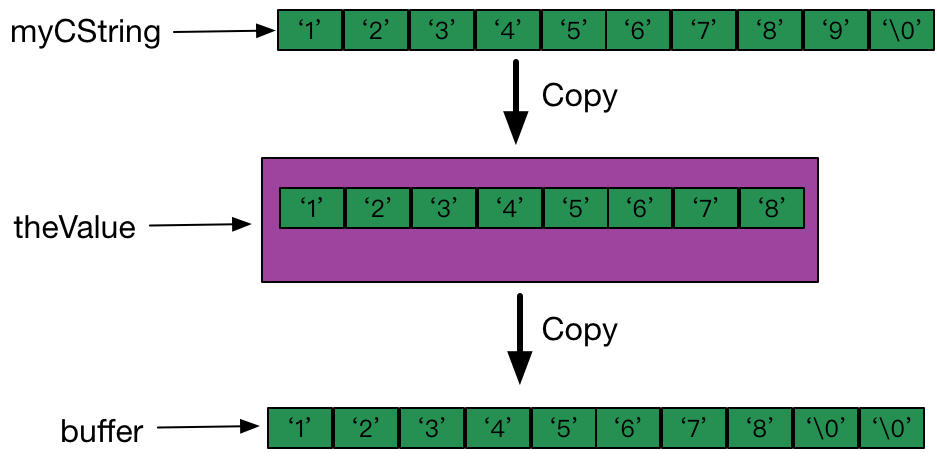
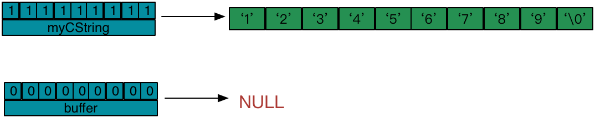
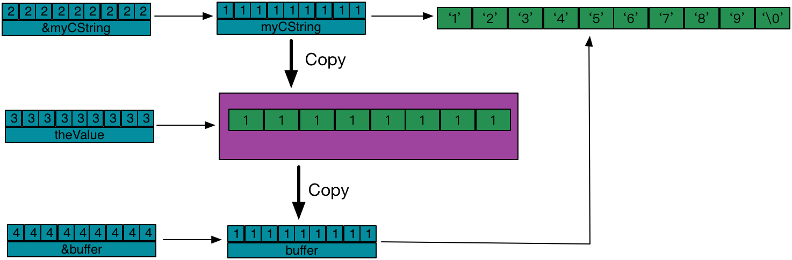

## NSValue

> [Overview](https://developer.apple.com/documentation/foundation/nsvalue)
>
> An `NSValue` object can hold any of the scalar types such as `int`, `float`, and `char`, as well as pointers, structures, and object `id` references. Use this class to work with such data types in collections (such as [`NSArray`](https://developer.apple.com/documentation/foundation/nsarray) and [`NSSet`](https://developer.apple.com/documentation/foundation/nsset)), [Key-value coding](https://developer.apple.com/library/archive/documentation/General/Conceptual/DevPedia-CocoaCore/KeyValueCoding.html#//apple_ref/doc/uid/TP40008195-CH25), and other APIs that require Objective-C objects. `NSValue` objects are always immutable.

`NSValue` 是基本数据类型或自定义数据类型所定义变量的对象包装器。


#### 处理 struct

现在系统支持的结构体类型有以下几种：

| 支持类型                | 便捷设置方法                      | 取值方法                   |
| :---------------------- | :-------------------------------- | :------------------------- |
| CGPoint                 | + valueWithCGPoint:               | CGPointValue               |
| CGVectorValue           | + valueWithCGVector:              | CGVectorValue              |
| CGSize                  | + valueWithCGSize:                | CGSizeValue                |
| CGRect                  | + valueWithCGRect:                | CGRectValue                |
| CGAffineTransform       | + valueWithCGAffineTransform:     | CGAffineTransformValue     |
| UIEdgeInsets            | + valueWithUIEdgeInsets:          | UIEdgeInsetsValue          |
| NSDirectionalEdgeInsets | + valueWithDirectionalEdgeInsets: | directionalEdgeInsetsValue |
| UIOffset                | + valueWithUIOffset:              | UIOffsetValue              |


#### 自定义 struct

开发中会遇到把`结构体`或者`基本数据类型`加入`数组`或`字典`的需求，比如`CGSize`,`CGRect`,`CGPoint`等数据，但是大家都知道OC的容器中只能加入对象类型的数据。
我们可以转成 `NSString` ，用时再从`NSString`转成需要的数据类型，上述提到的结构体类型就可以实现。但不支持自定义类型的结构体，且性能太差！

那么我们如何实现自定义结构体的对象化包装呢？直接上代码：

```objective-c
// ---- .h文件中 -------------

#import <Foundation/Foundation.h>

// 一条线的结构体，用两个点表示
typedef struct LinePoint {
    CGPoint pointA;
    CGPoint pointB;
}LinePoint;

@interface NSValue (CustomValue)
// 为LinePoint结构体生成NSValue对象的便捷方法
+ (instancetype)valuewithLinePoint:(LinePoint)value;

// 取值
@property (readonly) LinePoint LinePointValue;

@end

// ---- .m文件中 -------------

#import "NSValue+CustomValue.h"

@implementation NSValue (CustomValue)
+ (instancetype)valuewithLinePoint:(LinePoint)value {

    return [NSValue value:&value withObjCType:@encode(LinePoint)];
}

- (LinePoint)LinePointValue {

    LinePoint linePoint;


    if (@available(iOS 11.0, *)) {
        // iOS 11以后推荐用此方法
        [self getValue:&linePoint size:sizeof(LinePoint)];
    } else {
        // 此方法在将来可能会被废弃
        [self getValue:&linePoint];
    }

    return linePoint;
}

@end

// ---- 用法 ---------

LinePoint *line = malloc(sizeof(LinePoint));

line_1->pointA = CGPointMake(0, 0);
line_1->pointB = CGPointMake(100, 100);

NSValue *value = [NSValue valuewithLinePoint:*line];

LinePoint resultLine = [value LinePointValue];

NSLog(@"resultLine --- A:%@,B:%@",NSStringFromCGPoint(resultLine.pointA),NSStringFromCGPoint(resultLine.pointB));

// ---- 打印结果 ---------
resultLine --- A:{0, 0},B:{100, 100}
```


#### API

- `+valueWithBytes:objCType:`
  - Creates a value object containing the specified value, interpreted with the specified Objective-C type.


```objective-c
// 结构体定义
typedef struct ABData {
   int a;
   float b;
} AB;

AB ab1;
ab1.a = 1;
ab1.b = 2.345 ;
NSValue *value = [NSValue valueWithBytes:&ab1 objCType:@encode(AB)];
AB ab2;
[value getValue:&ab2] ;
NSLog(@"%d,%0.3f",ab2.a,ab2.b);
```


自定义类型必须是固定长度类型，不能将 `C` 字符串，可变长度的数组和结构体，以及其它变长类型存储在`NSValue`中，这些可变类型应该使用`NSString`或`NSData`来包装成对象类型。但可以将可变数据类型的指针保存在`NSValue`中。

```objective-c
char *myCString = "123456789";
NSValue *theValue = [NSValue valueWithBytes:myCString objCType:@encode(char *)];
char buffer[10] = {0};
[theValue getValue:buffer];
NSLog(@"%s", buffer); // 12345678
```

上述，输出是：12345678

原因是`valueWithBytes:objCType`方法保存的是`myCString`指向的内容(即字符串"123456789")，并且将这个内容当成一个`char *`指针，而一个指针只有`8个字节`(具体大小可能因机器而异)，所以`theValue`只能保存字符串的前`8个字节`，因此，使用`NSValue`的`getValue:`方法取出的内容是`12345678`，而不是`123456789`



要解决这个问题，可以向 `valueWithBytes:objCType` 传递 `myCString` 变量本身的地址，如下面代码所示:

```objective-c
char *myCString = "123456789";
NSValue *theValue = [NSValue valueWithBytes:&myCString objCType:@encode(char *)];
        
char *buffer = NULL;
[theValue getValue:&buffer];
NSLog(@"%s", buffer); // 123456789
```



在上面的图中，变量名上方的数字表示该指针变量存储的地址值，比如，`myCString`指向字符串`123456789`，这个字符串的首地址是`11111111`，`buffer`变量指向`NULL`。

调用`vaueWithBytes:objCType`之后，由于向`valueWithBytes:objCType`传递的是`myCString`变量本身的地址`&myCString`，那么`theValue`就保存这个地址所指向的内容,即`myCString`变量保存的地址值`11111111`，并把这个值当成`char *`看待。

当将`buffer`变量本身的地址传递给`NSValue的getValue`方法时，`getValue`方法将`theValue`保存的值`copy`给`&buffer`指向的缓存区，即`copy`给`buffer`变量，因此，`buffer`变量保存的值就成了`11111111`，这个值就是字符串`123456789`的地址，`buffer`变量就指向了这个字符串。具体流程如下图所示:




#### 扩展方法处理 pointer 类型

```objective-c
// 结构体的指针包装
AB *ab = (AB *)malloc(sizeof(AB));
ab->a = 1;
ab->b = 2;
NSValue *pValue = [NSValue valueWithPointer:ab];
AB *ba = (AB*)[pValue pointerValue];
NSLog(@"%d,%0.3f",ba->a,ba->b); // 1,2.000
free(ab);
ab = NULL;
ba = NULL;

// 方法指针的包装
NSValue *selValue = [NSValue valueWithPointer:@selector(p_selecterTest)];
[self performSelector:[selValue pointerValue]];

- (void)p_selecterTest {
    NSLog(@"此方法被运行 --- %s",__func__); // 此方法被运行 --- -[ValueTestViewController p_selecterTest]
}
```


#### 处理 NSRange

```objective-c
// location,length
NSRange r = {4, 10};

// 创建 NSRange 的值对象
NSValue *rv = [NSValue valueWithRange: r];

// 获取值对象包含的值
NSRange r1 = [rv rangeValue];

```


> ps. This method is unsafe because it could potentially cause buffer overruns. You should use `-getValue:size: `instead.


#### 扩展方法可以弱引用保存一个对象

```objective-c
NSMutableArray *array = @[].mutableCopy;
// 添加
NSObject *obj = [NSObject new];
[array addObject:[NSValue valueWithNonretainedObject:obj]];
// 读取
NSValue *value = array[0];
NSObject *obj2 = [value nonretainedObjectValue];
```

> **注意**：使用 `NSValue` 的方式，确实可以实现对对象的弱引用（即被添加到集合中时，对象的引用计数不会+1），但是当对象被释放的时候，数组中对应的对象会变成**野指针**，因此需要手动删除 `NSArray` 中对应对象的值，否则会在执行 `[value nonretainedObjectValue]` 时崩溃；而使用 `NSPointerArray `不会有这个问题，对象的释放会使得集合中的对象变为 `NULL`


### 参考

- [Using Values](https://developer.apple.com/library/archive/documentation/Cocoa/Conceptual/NumbersandValues/Articles/Values.html#//apple_ref/doc/uid/20000174-BAJJHDEG)

- [NSValue](https://developer.apple.com/documentation/foundation/nsvalue?language=objc)


