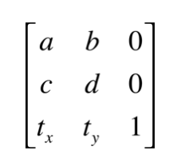
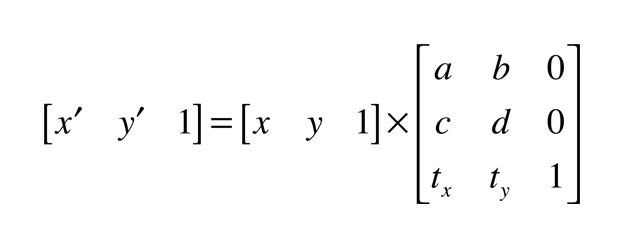
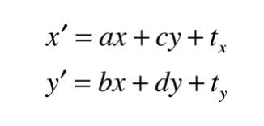
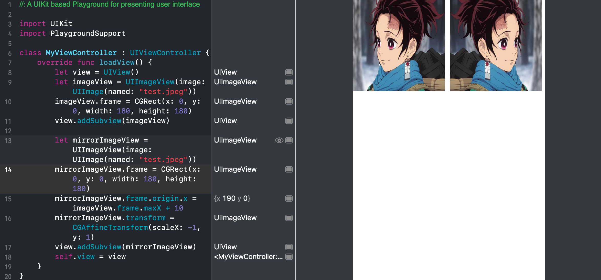
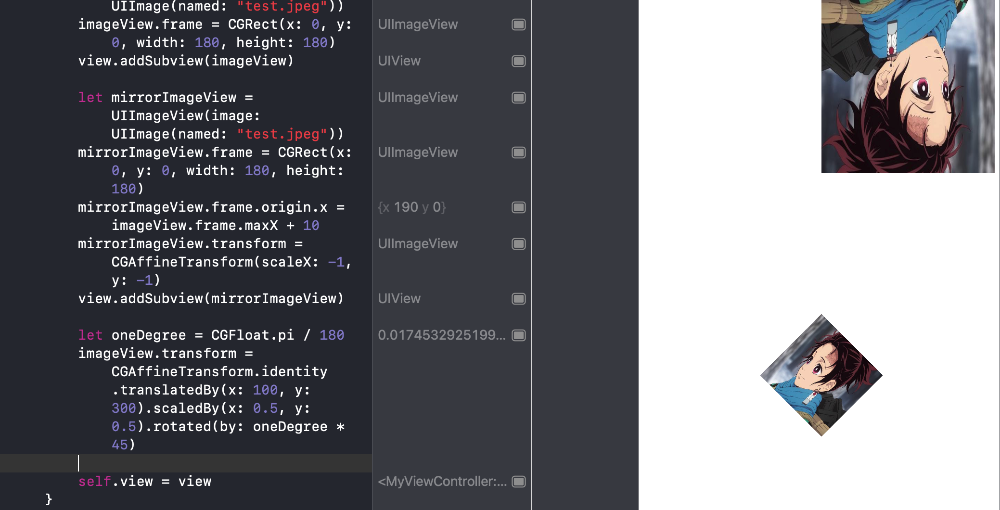
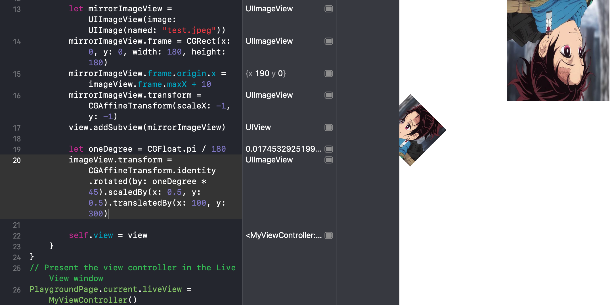

## CGAffineTransform

> [CGAffineTransform](https://developer.apple.com/documentation/coregraphics/cgaffinetransform?language=objc)
>
> An affine transformation matrix for use in drawing 2D graphics.
>
> An affine transformation matrix is used to rotate, scale, translate, or skew the objects you draw in a graphics context. The `CGAffineTransform` type provides functions for creating, concatenating, and applying affine transformations.
>
> 
>
> 
>
> 


### 缩放

```swift
// 放大两倍
imageView.transform = CGAffineTransform(scaleX: 2, y: 2)
// or 这么写
imageView.transform = CGAffineTransform.identity.scaledBy(x: 2, y: 2)
```

#### 镜像效果



如果将 scale 的 y 设置为 -1 ，垂直方向会上线翻转


### 位移

```swift
imageView.transform = CGAffineTransform(translationX: 100, y: 300)

// or
imageView.transform = CGAffineTransform.identity.translatedBy(x: 100, y: 300)
```


### 旋转

```swift
// 一度
let oneDegree = CGFloat.pi / 180
// 旋转45°
imageView.transform = CGAffineTransform(rotationAngle: oneDegree * 45)

// or
let oneDegree = CGFloat.pi / 180
imageView.transform = CGAffineTransform.identity.rotated(by: oneDegree * 45)

```


### 组合缩放、位移和旋转

```swift
let oneDegree = CGFloat.pi / 180
imageView.transform = CGAffineTransform.identity.translatedBy(x: 100, y: 300).scaledBy(x: 0.5, y: 0.5).rotated(by: oneDegree * 45)
```

ps. 需要注意缩放、位移和旋转的顺序，因为涉及到矩阵运算，所以不同组合的效果不一样！







### 复位

```swift
imageView.transform = CGAffineTransform.identity
```

