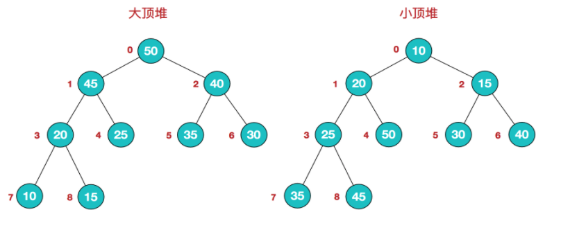
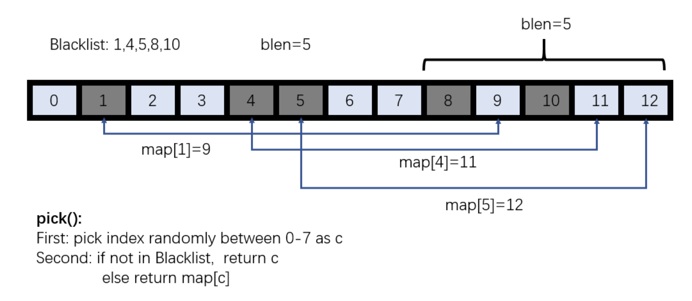

## 每日一题 Follow

题目来源于 [只有熟练掌握基础的数据结构与算法，才能对复杂问题迎刃有余。](https://github.com/azl397985856/leetcode)

> 计划，通过每日一题来加强对数据结构和算法的掌握。

### 题目

1 本次题目来自牛客网分享的一次华为面试题：

```c
终端产品在进行一项噪音监测实验。若将空实验室平面图视作一个 nm 的二维矩阵（左上角为 [0,0]）。
工作人员在实验室内设置了若干噪音源，并以 [噪音源所在行，噪音源所在列，噪音值] 的形式记录于二维数组 noise 中。
噪音沿相邻八个方向传播，在传播过程中，噪音值（单位为分贝）逐级递减 1 分贝，直至分贝削弱至 1
（即噪音源覆盖区域边缘噪音分贝为 1）；
 若同一格被多个噪音源的噪音覆盖，监测结果不叠加，仅保留较大的噪音值
 （噪音源所在格也可能被其他噪音源的噪声传播所覆盖）。
 在所有噪音源开启且持续传播情况稳定后，请监测每格噪音分贝数并返回他们的总和。
注意：
    除噪音源以外的所有格初始值为 0 分贝； 不考虑墙面反射。示例 1：
    输入：n = 5, m = 6, noise = [[3,4,3],[1,1,4]]输出：63

作者：我会个锤子的算法
链接：https://www.nowcoder.com/discuss/643910?source_id=discuss_experience_nctrack&channel=-1
来源：牛客网
```


分析：

```c
例子是5行6列，计数是从 0 开始，输入两个噪音点`[3,4,3]`和`[1,1,4]`

1. 向8个方向传播（向四周扩散）
2. 传播过程中，噪音值逐级递减 1 至 1 分贝
3. 同一格被多个音源的噪音覆盖，不叠加保留较大者


    0  |  1  |  2  |  3  |   4   |   5  |

0 | 3     3     3     2      1       0

1 | 3     4     3     2      1       1

2 | 3     3     3     2      2       2

3 | 2     2     2     2      3       2

4 | 1     1     1     2      2       2

=> sum: 63
```


---

代码：

```swift
struct NoisePoint {
    var x = 0
    var y = 0
    var value = 0
    init(x: Int, y: Int, value: Int) {
        self.x = x
        self.y = y
        self.value = value
    }
}

enum SpreadError: Error {
    case inValidInput                 // 无效输入
}

class Solution {
    func sumOfArray(array: [Int]) -> Int {
        var result = 0
        for num in array {
            result += num
        }
        return result
    }
    /// 对噪音点在平面空间传播
    func spreadNoise(matrix: inout [[Int]], row: Int, column: Int, point: NoisePoint) throws {
        // 噪音点填充到矩阵
        matrix[point.x][point.y] = point.value
        // 用于存放噪音点
        var points = [NoisePoint]()
        // 将首个点存入
        points.append(point)
        
        while points.count > 0 {
            let pt = points.popLast()!
            
            // 同一格被多个音源的噪音覆盖，不叠加保留较大者
            if matrix[pt.x][pt.y] < pt.value {
                matrix[pt.x][pt.y] = pt.value
            }
            /* 以噪音点为中心向周围传播
               1. 传播过程中，噪音值逐级递减 1 至 1 分贝（传播过程中会有新的噪音点）
             */
            if pt.x > 0, pt.y > 0, pt.x < row, pt.y < column, pt.value > 1 {
                points.append(NoisePoint(x: pt.x-1, y: pt.y, value: pt.value-1))
                points.append(NoisePoint(x: pt.x+1, y: pt.y, value: pt.value-1))
                points.append(NoisePoint(x: pt.x, y: pt.y+1, value: pt.value-1))
                points.append(NoisePoint(x: pt.x, y: pt.y-1, value: pt.value-1))
                points.append(NoisePoint(x: pt.x-1, y: pt.y-1, value: pt.value-1))
                points.append(NoisePoint(x: pt.x-1, y: pt.y+1, value: pt.value-1))
                points.append(NoisePoint(x: pt.x+1, y: pt.y+1, value: pt.value-1))
                points.append(NoisePoint(x: pt.x+1, y: pt.y-1, value: pt.value-1))
            }
        }
    }
    /// 测试
    func test(_ x: Int, _ y: Int, noisePoints: [NoisePoint]) throws -> Int {
        guard noisePoints.count > 0, x > 0, y > 0 else {
            throw SpreadError.inValidInput
        }
        // x行y列的矩阵（最终的结果矩阵）
        var matrix = [[Int]](repeating: [Int](repeating: 0, count: y), count: x)
        
        for point in noisePoints {
            try spreadNoise(matrix: &matrix, row: x-1, column: y-1, point: point)
        }

        var result = 0
        for a in matrix {
            result += sumOfArray(array: a)
        }
        return result
    }

}

let inputs: [NoisePoint] = [NoisePoint(x: 3, y: 4, value: 3), NoisePoint(x: 1, y: 1, value: 4)]
let result = try Solution().test(5, 6, noisePoints: inputs)
print(result)
```


---

---

2 题目描述：交换比特（bit）。对一个整数每两位交换一次，并返回交换后的数。

```swift
class Solution {
    func swap_bit(x: Int) -> Int {
        // Mask A - a, in binary, is 1010
        let maskA = 0xAA
        // Mask 5 -  5, in binary, is 0101
        let mask5 = 0x55;
        let r1 = (x & maskA) >> 1
        let r2 = (x & mask5) << 1
        let result = r1 | r2
        return result
    }

    func testSwapBit(x: Int) {
        print(swap_bit(x: x))
    }
}

Solution().testSwapBit(x: 7)
```


上述，涉及到一个知识点叫：**位屏蔽**。

Stack Overflow 上的一个问题：[What are 0xaa and 0x55 doing?](https://stackoverflow.com/questions/43923906/what-are-0xaa-and-0x55-doing)

```c
     First, we'll look at (x & 0xaaaaaaaa). If you break 0xaaaaaaaa down to the bit level, you end up with 1010 1010 1010 1010 1010 1010 1010 1010 (as a, in binary, is 1010). So (x & 0xaaaaaaaa) is saying, return only every even-placed 1 in x. This is called bit masking. Then, you right shift it by one place - this is how you make the even numbers switch place (so now the second bit occupies the place of the first bit, and the fourth the third, etc).

     You do the same thing with (x & 0x55555555) - if you break it down to the bit level, you end up with 0101 0101 0101 0101 0101 0101 0101 0101 (as 5, in binary, is 0101). This masks all the even-placed bits in x, and gives you all the odd-placed bits. Then, you shift all bits left by 1. Finally, you use the or (|) operator to combine the two bit-sequences, and that's your answer.

     Example: Let's take 2456086205. We convert that into binary and get 1001 0010 0110 0100 1110 0110 1011 1101. Now, we do (x & 0xaaaaaaaa), and get

     1001 0010 0110 0100 1110 0110 1011 1101 & 1010 1010 1010 1010 1010 1010 1010 1010,

     which equals 1000 0010 0010 0000 1010 0010 1010 1000. Shift this to the right and you get 0100 0001 0001 0000 0101 0001 0101 0100.

     Now, do (x & 0x55555555), and get

     1001 0010 0110 0100 1110 0110 1011 1101 & 0101 0101 0101 0101 0101 0101 0101 0101,

     which equals 0001 0000 0100 0100 0100 0100 0001 0101. Shift this to the left and you get 0010 0000 1000 1000 1000 1000 0010 1010.

     Finally, we do 0100 0001 0001 0000 0101 0001 0101 0100 | 0010 0000 1000 1000 1000 1000 0010 1010. We then get 0110 0001 1001 1000 1101 1001 0111 1110, which, as you can see, is the the solution!
```


---

---

3 [尼姆游戏](https://zh.wikipedia.org/wiki/%E5%B0%BC%E5%A7%86%E6%B8%B8%E6%88%8F)

> 尼姆游戏，是一种两人玩儿的回合制数学战略游戏。游戏者轮流从几排棋子（或者任何道具）中选择一排，再由这一排中取走一个或者多个，依规则不同，拿走最后一个的可能是输家，也有可能是赢家。当指定相应数量时，一堆这样的棋子称作一个**尼姆堆**。古代就有许多尼姆游戏的变体。最早欧洲有关尼姆游戏的参考资料是在16世纪，目前使用的名称是由[哈佛大学](https://zh.wikipedia.org/wiki/哈佛大学)的Charles L. Bouton命名，他也在1901年提出了此游戏的完整理论，不过没有说明名称的由来。

题目描述：有两堆球，一堆8个 一堆10个， 每人每次只能从某一堆上至少拿走一个上不封顶，拿走最后一个的输，两个人轮流拿 ，你先拿怎么赢？ 

```c
读完题干，如果你仔细看了上述维基百科，我们可以吧两堆球，理解为两排。

胜利的策略就是在取走球后，使尼姆和为0。

题目描述的是 misère 版（拿到最后一个棋子的输），而且是一个特别简单的情况，只有两排。
必胜的策略：在个数较多的那排拿走部分球，使两者数量相同。接下来对手不论怎么下，都继续使另一排的数量相同，最后即可胜利。
```


```swift
enum GameType: String {
    case NORMAL = "Normal"
    case MISERE = "Misere"
}

/**
 在normal版本（拿到最后一个棋子的赢）中，胜利的策略就是在取走棋子后，使尼姆和为0。只要取走棋子前，尼姆和不为0，一定有办法取走部分棋子使尼姆和为0。另一个游戏者无论怎么拿，取走棋子后尼姆和都不会为0。以此策略，只要在取棋子时照策略进行，一定会胜利。要找到要拿走的棋子，可以令X是原来各排棋子数的尼姆和，游戏策略是要分别计算各排棋子数和X的尼姆和，找到尼姆和比该排棋子数少的那一排，接下来就要取走这一排的棋子，使该排棋子数等于尼姆和。以上例中，原来各排棋子数的尼姆和是X = 3 ⊕ 4 ⊕ 5 = 2。A=3、B=4、C=5且X=2，因此得到

 A ⊕ X = 3 ⊕ 2 = 1 [因为 (011) ⊕ (010) = 001 ]
 B ⊕ X = 4 ⊕ 2 = 6
 C ⊕ X = 5 ⊕ 2 = 7
 因此下一步是取走A排的棋子，使其数量变1（拿走二个棋子）。

 有一个特别简单的例子，是只剩二排的情形，其策略是在个数较多的那排拿走部分棋子，使两者数量相同。接下来对手不论怎么下，都继续使二排的数量相同，最后即可胜利。

 若是玩misère版本。前面的策略都一样，只到只剩一排的棋子超过一个（二个或二个以上）时才有不同。此时的策略都是针对超过一个棋子的那排棋子取子，使留下来的每一排都只有一个棋子。接下来玩的人只能从这几排中选一排拿走。取子可能是那排全部取完，或是只剩一个，视游戏版本而定，在玩misère版本（拿到最后一个棋子的输）时，要使留下来的排数是单数（因此对方会拿到最后一个棋子），在玩normal版本游戏时，要使留下来的排数是偶数。（因此自己会拿到最后一个棋子）。
 */
class Solution {
    /// 支持两种游戏模式：normal and misere。计算输入排，下一步该移除哪一排的多少数量
    func nim(heaps: [Int], type: String) -> (Int, Int) {
        print("game type \(type)", heaps)
        // 判断当前 nim 游戏类型
        let isMisere = (type == GameType.MISERE.rawValue)
        // 游戏是否进入到后半程
        let isNearEnd = self.isNearEndGame(heaps: heaps)
        // 如果游戏进入后半程，misere 与 normal 不同
        if isMisere, isNearEnd {
            // 计算剩余非 0 的排
            let left = self.movesLeft(heaps: heaps)
            // 排数是否为单数
            let isOdd = (left % 2) == 1
            
            // 针对超过一个棋子的那排棋子取子，使留下来的每一排都只有一个棋子 ps.要使留下来的排数是单数
            let max = self.maxOfHeap(heaps: heaps)
            let maxValue = max.1
            let maxIndex = max.0
            if maxValue == 1, isOdd {
                print("U will lose, No matter how you try :(")
                return (0,0)
            }
            return (maxIndex, maxValue)
        }
        // 尼姆和
        let nimSum = xorHeap(heaps: heaps)
        // 胜利的策略就是在取走棋子后，使尼姆和为0。所以，另一个游戏者无论怎么拿，取走棋子后尼姆和都不会为0。
        if nimSum == 0 {
            print("U will lose, No matter how you try :(")
            return (0,0)
        }
        // 找到要拿走的棋子
        var willRemoveSize = 1
        for (i, v) in heaps.enumerated() {
            // 要分别计算各排棋子数和nimSum 的尼姆和
            willRemoveSize = v ^ nimSum
            // 找到尼姆和比该排棋子数少的那一排，接下来就要取走这一排的棋子，使该排棋子数等于尼姆和。
            if willRemoveSize < v {
                let amountToRemove = v - willRemoveSize
              	// ps.这里找到一种赢的方式就返回了，此处可以计数，算出（游戏前半程）赢的方式数目
                return (i, amountToRemove)
            }
        }
        return (0,0)
    }
    /// Misere 只到只剩一排的棋子超过一个（二个或二个以上）时才有不同
    func isNearEndGame(heaps: [Int]) -> Bool {
        var result = 0
        for v in heaps {
            if v > 1 {
                result += 1
            }
        }
        
        return result <= 1
    }
    /// 剩余非 0 的排
    func movesLeft(heaps: [Int]) -> Int {
        var result = 0
        for v in heaps {
            if v > 0 {
                result += 1
            }
        }
        return result
    }
    /// 找到最大值及所在的排
    func maxOfHeap(heaps: [Int]) -> (Int, Int) {
        var result = 0
        var index = 0
        for (i,v) in heaps.enumerated() {
            if v > result {
                result = v
                index = i
            }
        }
        
        return (index,result)
    }
    /// heaps中的元素异或运算
    func xorHeap(heaps: [Int]) -> Int {
        var result = heaps[0]
        for i in 1..<heaps.count {
            result ^= heaps[i]
        }
        print("nimSum =",result)
        
        return result
    }
}

print("next step", Solution().nim(heaps: [3,4,5], type: GameType.MISERE.rawValue))
//        print("next step", Solution().nim(heaps: [1,4,5], type: GameType.MISERE.rawValue))
        print("next step", Solution().nim(heaps: [1,4,3], type: GameType.MISERE.rawValue))
//        print("next step", Solution().nim(heaps: [1,2,3], type: GameType.MISERE.rawValue))
        print("next step", Solution().nim(heaps: [1,2,2], type: GameType.MISERE.rawValue))
//        print("next step", Solution().nim(heaps: [0,2,2], type: GameType.MISERE.rawValue))
        print("next step", Solution().nim(heaps: [0,2,1], type: GameType.MISERE.rawValue))
//        print("next step", Solution().nim(heaps: [0,0,1], type: GameType.MISERE.rawValue))

/**
 * 打印
 game type Misere [3, 4, 5]
 nimSum = 2
 next step (0, 2)

 game type Misere [1, 4, 3]
 nimSum = 6
 next step (1, 2)

 game type Misere [1, 2, 2]
 nimSum = 1
 next step (0, 1)

 game type Misere [0, 2, 1]
 next step (1, 2)

*/
```


```python
import functools

MISERE = 'misere'
NORMAL = 'normal'

def nim(heaps, game_type):
    """Computes next move for Nim, for both game types normal and misere.

    if there is a winning move:
        return tuple(heap_index, amount_to_remove)
    else:
        return "You will lose :("

    - mid-game scenarios are the same for both game types

    >>> print(nim([1, 2, 3], MISERE))
    misere [1, 2, 3] You will lose :(
    >>> print(nim([1, 2, 3], NORMAL))
    normal [1, 2, 3] You will lose :(
    >>> print(nim([1, 2, 4], MISERE))
    misere [1, 2, 4] (2, 1)
    >>> print(nim([1, 2, 4], NORMAL))
    normal [1, 2, 4] (2, 1)

    - endgame scenarios change depending upon game type

    >>> print(nim([1], MISERE))
    misere [1] You will lose :(
    >>> print(nim([1], NORMAL))
    normal [1] (0, 1)
    >>> print(nim([1, 1], MISERE))
    misere [1, 1] (0, 1)
    >>> print(nim([1, 1], NORMAL))
    normal [1, 1] You will lose :(
    >>> print(nim([1, 5], MISERE))
    misere [1, 5] (1, 5)
    >>> print(nim([1, 5], NORMAL))
    normal [1, 5] (1, 4)
    """

    print(game_type, heaps)

    is_misere = game_type == MISERE

    is_near_endgame = False
    count_non_0_1 = sum(1 for x in heaps if x > 1)
    is_near_endgame = (count_non_0_1 <= 1)

    # nim sum will give the correct end-game move for normal play but
    # misere requires the last move be forced onto the opponent
    if is_misere and is_near_endgame:
        # 列表推导式 list comprehension，是在一组字符串或者一组对象上执行一条相同操作的简洁写法！
        # eg. heaps = [0,2,1] => sum([1,1]) => 2
        # eg. sum(x * x for x in range(10))  => sum([1*1, 2*2, 3*3, ...])
        moves_left = sum(1 for x in heaps if x > 0)
        is_odd = (moves_left % 2 == 1)
        sizeof_max = max(heaps)
        index_of_max = heaps.index(sizeof_max)

        if sizeof_max == 1 and is_odd:
            return "You will lose :("

        # reduce the game to an odd number of 1's
        return index_of_max, sizeof_max - int(is_odd)

    nim_sum = functools.reduce(lambda x, y: x ^ y, heaps)
    if nim_sum == 0:
        return "You will lose :("

    # Calc which move to make
    for index, heap in enumerate(heaps):
        target_size = heap ^ nim_sum
        if target_size < heap:
            amount_to_remove = heap - target_size
            return index, amount_to_remove


# print(nim([3,4,5,6], MISERE))
# print(nim([3,0,5,6], MISERE))
# print(nim([1,2,2], MISERE))
# print(nim([0,2,1], MISERE))

if __name__ == "__main__":
    import doctest
    doctest.testmod()
```


题外话：

> ```python
> sum(...)
>     sum(iterable[, start]) -> value
> 
>     Return the sum of an iterable or sequence of numbers (NOT strings)
>     plus the value of 'start' (which defaults to 0).  When the sequence is
>     empty, return start.
> ```
>
> 
>
> 比如:[[1],[2,3],[4,5,6]]，将其转成[1, 2, 3, 4, 5, 6].
>
> 这个时候使用Python自带的sum函数会很简单。

---

---


4 给8个数字11223344，重新排列要求两个1之间有一个数，两个2之间有两个数，两个3之间有三个数，两个4之间有四个数。


```c
/* 分析：
 * 对8个位置 _ _ _ _ _ _ _ _ 插入题干给的 11223344 8个数字
 * 把最大的数放在第一位，否则是无法包裹4个数字的
 * _4_1_3_1_2_4_3_2
 * 翻转如下：
 * _2_3_4_2_1_3_1_4
 */

```


5 最少的砝码：如何用尽可能少的砝码称量出 `[1, N] `之间的所有重量？（只能在天秤的一端放砝码）

```c
分析：
比如 N = 100 其二进制表示为：1100100
用 2^2 2^5 2^6 三个砝码即可
题干说：天秤的一端放砝码，所以只有两种情况需要考虑：
1. 放
2. 不放

对于 n 个砝码，可能出现的总的状态有 2^n ，那么称量 [1,N] 
2^n >= N ==> log2N（以2为底N的对数）

上述 100 时，最小取 7

拓展：
如果不限制只放在天秤的一端呢？
1. 不放
2. 放左边
3. 放右边
可能出现的总的状态有 3^n
3^n >= N ==> log3N（以3为底N的对数）

上述 100 时，最小取 5

```

6 绝对值表达式的最大值

```c
给你两个长度相等的整数数组，返回下面表达式的最大值：

|arr1[i] - arr1[j]| + |arr2[i] - arr2[j]| + |i - j|

其中下标 i，j 满足 0 <= i, j < arr1.length。

示例 1：
输入：arr1 = [1,2,3,4], arr2 = [-1,4,5,6]
输出：13

示例 2：
输入：arr1 = [1,-2,-5,0,10], arr2 = [0,-2,-1,-7,-4]
输出：20

提示：
2 <= arr1.length == arr2.length <= 40000
-10^6 <= arr1[i], arr2[i] <= 10^6

来源：力扣（LeetCode）
链接：https://leetcode-cn.com/problems/maximum-of-absolute-value-expression
著作权归领扣网络所有。商业转载请联系官方授权，非商业转载请注明出处。
```

最近刚好在看数学书，我看到绝对值就有了去绝对值的想法：

```c
|a| = a , a>0
|a| = -a , a<0
所以如下：
  |arr1[i] - arr1[j]| + |arr2[i] - arr2[j]| + |i - j|
=> 会有 8 种情况：
// --1--
arr1[i] - arr1[j] + arr2[i] - arr2[j] + i - j
-(arr1[i] - arr1[j]) - (arr2[i] - arr2[j]) - (i - j)
// --2--
arr1[i] - arr1[j] - (arr2[i] - arr2[j]) + i - j
-(arr1[i] - arr1[j]) + (arr2[i] - arr2[j]) - (i - j)
// --3--
-(arr1[i] - arr1[j]) + arr2[i] - arr2[j] + i - j
(arr1[i] - arr1[j]) - (arr2[i] - arr2[j]) - (i - j)
// --4--
-(arr1[i] - arr1[j]) - (arr2[i] - arr2[j]) + i - j
arr1[i] - arr1[j] + arr2[i] - arr2[j] - (i - j)
  
由于，i 和 j 之间没有大关系，也就是说二者可以相互替代。因此只需要计算 4 个算式就可以了：
arr1[i] - arr1[j] + arr2[i] - arr2[j] + i - j
arr1[i] - arr1[j] - (arr2[i] - arr2[j]) + i - j
-(arr1[i] - arr1[j]) + arr2[i] - arr2[j] + i - j
-(arr1[i] - arr1[j]) - (arr2[i] - arr2[j]) + i - j
  
=> 整理如下：
arr1[i]  + arr2[i] + i  - (arr1[j] + arr2[j] + j)
arr1[i]  - arr2[i] + i  - (arr1[j] - arr2[j] + j)
arr2[i]  - arr1[i] + i  - (arr2[j] - arr1[j] + j)
-arr2[i] - arr1[i] + i  - (-arr1[j] - arr2[j] + j)
  
  
再仔细观察，会发现前面部分和后面部分是一样的，原因还是上面所说的 i 和 j 可以互换。因此我们要做的就是：
1. 遍历一遍数组，然后计算四个表达式， arr1[i] + arr2[i] + i，arr1[i] - arr2[i] + i，arr2[i] - arr1[i] + i 和 -1 * arr2[i] - arr1[i] + i 的 最大值和最小值。
2. 分别取出四个表达式最大值和最小值的差值（就是这个表达式的最大值）
3. 从四个表达式最大值再取出最大值  
```

```swift
class S {
    func maxOfAbsoluteValue(arr1: [Int], arr2:[Int]) -> Int {
        var r1 = [Int]()
        var r2 = [Int]()
        var r3 = [Int]()
        var r4 = [Int]()
        var result = [Int]()
        for i in (0..<arr1.count) {
            let one = arr1[i]  + arr2[i] + i
            let two = arr1[i]  - arr2[i] + i
            let three = arr2[i]  - arr1[i] + i
            let four = -arr2[i] - arr1[i] + i
            
            r1.append(one)
            r2.append(two)
            r3.append(three)
            r4.append(four)
        }
        
        let m1 = r1.max()! - r1.min()!
        let m2 = r2.max()! - r2.min()!
        let m3 = r3.max()! - r3.min()!
        let m4 = r4.max()! - r4.min()!
        
        result.append(m1)
        result.append(m2)
        result.append(m3)
        result.append(m4)
        
        return result.max() ?? 0
    }
}

print(S.init().maxOfAbsoluteValue(arr1: [1,-2,-5,0,10], arr2: [0,-2,-1,-7,-4])) // 20
```

7 赛马问题

```c
有25匹马，速度都不同，但每匹马的速度都是定值。现在只有5条赛道，无法计时，即每赛一场最多只能知道5匹马的相对快慢。
问最少赛几场可以找出25匹马中速度最快的前3名？

分析：
由于每一匹马我们都需要比赛才行，因此至少先比赛 25 / 5 = 5 次，比赛成绩编队为：
A B C D E

A 每一组的第1名  5匹马
B 每一组的第2名  5匹马
C 每一组的第3名  5匹马
D 每一组的第4名  5匹马
E 每一组的第5名  5匹马
  
然后我们可以选择出A组的5匹马 跑一次。这个时候我们已经决出了第一名，并且比赛了6次。

那么D E所在的组一共 10 匹马是没有比赛的必要的， 不可能是前三。
C 中只有第一名可能是前三，其他四个可以直接舍弃
B 中前两名可能是前三
A 中的二三名也可能是前三
  
这五匹马在赛一次即可

总共 7 次比赛
```


8 实现一个算法，确定一个字符串 s 的所有字符是否全都不同。

```c
示例 1：
输入: s = "leetcode"
输出: false
  
示例 2：
输入: s = "abc"
输出: true
限制：
0 <= len(s) <= 100
  
如果你不使用额外的数据结构，会很加分。

来源：力扣（LeetCode）
链接：https://leetcode-cn.com/problems/is-unique-lcci
著作权归领扣网络所有。商业转载请联系官方授权，非商业转载请注明出处。
```


```swift
class Solution {
    /// 嵌套for循环
    func isUnique_forfor(input: String) -> Bool {
        let characters = Array(input)
        if characters.count == 0 {
            return true
        }
        if characters.count == 1 {
            return true
        }
        var arr = [Character]()
        
        if characters.count>0 {
            arr.append(characters.first ?? "$")
        }
        
        for i in 1..<characters.count {
            for c in arr {
                if c == characters[i] {
                    return false
                } else {
                    arr.append(characters[i])
                    continue
                }
            }
        }
        
        return true
    }
    /// 使用字典
    func isUnique_dic(input: String) -> Bool {
        let characters = Array(input)
        var map = [Character: Int]()
        for c in characters {
            map[c, default:0] += 1
        }
        for v in map.values {
            if v > 1 {
                return false
            }
        }
        return true
    }
    /// 位运算
    /* 分析：
     每个字符的ASCII码都不一样，移动不同位数表示不同的字符而且只有第一位是1，取 | 运算相当于把当前字符保存在了int64的不同位上，
     如果没有相同字符 & 运算会一直为0，有相同字符对应位的数就会是1（二进制位1表示出现过， 0表示未出现过）
     位运算：
     1 计算出字符char离'a'这个字符的距离，即我们要位移的距离，用offset_bit表示，
     2 使用左移运算符1 << offset_bit 则可以得到对应下标为1，其余下标为0的数，如：字符char = 'c'，则得到的数为000...00100
     3 将这个数跟 mark 做与运算，由于这个数只有一个位为1，其他位为0，那么与运算的结果中，其他位肯定是0，而对应的下标位是否0则取决于之前这个字符有没有出现过，
        3-1 若出现过则被标记为1，那么与运算的结果就不为0；
        3-2 若之前没有出现过，则对应位的与运算的结果也是0，那么整个结果也为0。
     4 对于没有出现过的字符，我们用或运算 mark | (1 << offset_bit) 将对应下标位的值置为1。
    */
    func isUnique_bit(input: String) -> Bool {
        let characters = Array(input)
        var mark: Int64 = 0
        let beginCharacter = Character("a").asciiValue!
        for c in characters {
            let offset_bit = c.asciiValue! - beginCharacter
            // 判断这个字符在 mark 上是否是 1
            if mark & 1 << offset_bit != 0 {
                return false
            }
            // 将这个字符存在 mark 上
            mark |= 1 << offset_bit
            
        }
        
        return true
    }
    /// Swift API
    func isUnique_set(input: String) -> Bool {
        let s: Set<Character> = Set(input)
        return s.count == input.count
    }
}

```


9 给定一个二维网格和一个单词，找出该单词是否存在于网格中。

单词必须按照字母顺序，通过相邻的单元格内的字母构成，其中“相邻”单元格是那些水平相邻或者垂直相邻的单元格。同一个单元格内的字母不允许被重复使用。


eg.

```c
board = [

['A', 'B', 'C', 'E'],

['S', 'F', 'C', 'S'],

['A', 'D', 'E', 'E'],

]
```


给定 Word = “ABCCED”，返回 true

给定 Word = “SEE”，返回 true

给定 Word = “ABCB”，返回 false


> 提示：board 和  word 中只包含大写和小写英文字母
>
> 1 <= board.length <= 200
>
> 1 <= board[i].length <= 200
>
> 1 <= word.length <= 10^3

```swift
class SearchWord {
    /**
     思路：
     在 2D 表中搜索是否有满足给定单词的字符组合，要求所有字符都是相邻的（方向不限). 题中也没有要求字符的起始和结束位置。
     在起始位置不确定的情况下，扫描二维数组，找到字符跟给定单词的第一个字符相同的，四个方向（上，下，左，右）分别 DFS 搜索，
        > 如果任意方向满足条件，则返回结果。
        > 不满足，回溯，重新搜索。
     关键点：
     1. 遍历二维数组的每一个点，找到起始点相同的字符，做 DFS
     2. DFS 过程中，要记录已经访问过的节点，防止重复遍历，这里用 ✅ 表示当前已经访问过，也可以用 Set 或者是 boolean[][]数组记录访问过的节点位置。
     3. 是否匹配当前单词中的字符，不符合回溯，这里记得把当前 ✅ 重新设为当前字符。如果用 Set 或者是 boolean[][]数组，记得把当前位置重设为没有访问过。
     */
    func existWord (board: [[Character]]?, word: String?) -> Bool {
        guard let brd = board else { return false }
        guard let w = word else { return false }
        
        if brd.count == 0 {
            return false
        }
        if w.count == 0 {
            return true
        }
        
        var b = brd // 为了标记 ✅
        let characters:[Character] = Array(w)
        let row = b.count
        let col = b[0].count
        
        /// O(i*j) - i 是二维数组行数， j 是二维数组列数
        for r in 0..<row {
            for c in 0..<col {
              	// 找到起始点相同的字符做 DFS
                if b[r][c] == characters[0] {
                    if dfs(board: &b, words: characters, r: r, c: c, index: 0) {
                        return true
                    }
                }
            }
        }
        return false
    }
    
    func dfs (board: inout [[Character]], words: [Character], r: Int, c: Int, index: Int) -> Bool {
        if index == words.count {
            return true
        }

        if !isValid(board: board, r: r, c: c) {
            return false
        }
        if board[r][c] != words[index] {
            return false
        }
        
        // 标记访问过
        board[r][c] = "✅"
        
        // 对四个方向 dfs 查找 上 下 左 右
        let result = dfs(board: &board, words: words, r: r-1, c: c, index: index+1)
            || dfs(board: &board, words: words, r: r+1, c: c, index: index+1)
            || dfs(board: &board, words: words, r: r, c: c-1, index: index+1)
            || dfs(board: &board, words: words, r: r, c: c+1, index: index+1)
        
        // 执行深度优先遍历，从较深层的结点返回到较浅层结点的时候，需要做「状态重置」，即「回到过去」、「恢复现场」
        board[r][c] = words[index]
        
        return result
    }
    
    /// 检查有效性 board 二维数组 r 行 c 列
    func isValid(board: [[Character]], r: Int, c: Int) -> Bool {
        return r >= 0 && r < board.count && c >= 0 && c < board[0].count
    }

}
```


10 回溯

上一题其实已经用到了 **回溯** 接下来，我们再继续加深一下

> 回溯法是一种选优搜索法，按选优条件向前搜索，以达到目标。
>
> 但当探索到某一步时，发现原先选择并不优或达不到目标，就退回一步重新选择，这种走不通就退回再走的技术为回溯法，而满足回溯条件的某个状态的点称为“**回溯点**”。

**回溯算法**

> 采用试错的思想，它尝试分步的去解决一个问题。在分步解决问题的过程中，当它通过尝试发现现有的分步答案不能得到有效的正确的解答的时候，它将取消上一步甚至是上几步的计算，再通过其它的可能的分步解答再次尝试寻找问题的答案。
>
> 回溯法通常用最简单的递归方法来实现，在反复重复上述的步骤后可能出现两种情况：
>
> - 找到一个可能存在的正确的答案；
> - 在尝试了所有可能的分步方法后宣告该问题没有答案。
>
> 作者：liweiwei1419
> 链接：https://leetcode-cn.com/problems/permutations/solution/hui-su-suan-fa-python-dai-ma-java-dai-ma-by-liweiw/
> 来源：力扣（LeetCode）
> 著作权归作者所有。商业转载请联系作者获得授权，非商业转载请注明出处。

```python
/* 算法框架--递归回溯框架
   	result = []
		def backtrack(路径, 选择列表):
      if 满足结束条件:
          result.add(路径)
          return
      for 选择 in 选择列表:
        # 做选择
        将该选择从选择列表移除
        路径.add(选择)
        backtrack(路径, 选择列表)
        # 撤销选择
        路径.remove(选择)
        将该选择再加入选择列表
*/   
```


eg.

**实例1：八皇后问题**

> **八皇后问题**是一个以[国际象棋](https://zh.wikipedia.org/wiki/国际象棋)为背景的问题：如何能够在8×8的国际象棋棋盘上放置八个[皇后](https://zh.wikipedia.org/wiki/后_(国际象棋))，使得任何一个皇后都无法直接吃掉其他的皇后？为了达到此目的，任两个皇后都不能处于同一条横行、纵行或斜线上。八皇后问题可以推广为更一般的**n皇后摆放问题**：这时棋盘的大小变为*n*×*n*，而皇后个数也变成*n*。[当且仅当](https://zh.wikipedia.org/wiki/当且仅当)*n* = 1或*n* ≥ 4时问题有解[[1\]](https://zh.wikipedia.org/wiki/八皇后问题#cite_note-1)
>
> 八个皇后在8x8棋盘上共有4,426,165,368（[64C8](https://zh.wikipedia.org/wiki/組合)）种摆放方法，但只有92个**互不相同**的解。如果将旋转和对称的解归为一种的话，则一共有12个独立解
>
> 下表给出了*n*皇后问题的解的个数包括独立解U（[OEIS](https://zh.wikipedia.org/wiki/整數數列線上大全)中的数列[A002562](https://oeis.org/A002562)）以及互不相同的解D（[OEIS](https://zh.wikipedia.org/wiki/整數數列線上大全)中的数列[A000170](https://oeis.org/A000170)）的个数：
>
> | *n*  |  1   |  2   |  3   |  4   |  5   |  6   |  7   |  8   |  9   |  10  |  11   |   12   |   13   |   14    |  ..  |
> | :--: | :--: | :--: | :--: | :--: | :--: | :--: | :--: | :--: | :--: | :--: | :---: | :----: | :----: | :-----: | :--: |
> |  U   |  1   |  0   |  0   |  1   |  2   |  1   |  6   |  12  |  46  |  92  |  341  | 1,787  | 9,233  | 45,752  |  ..  |
> |  D   |  1   |  0   |  0   |  2   |  10  |  4   |  40  |  92  | 352  | 724  | 2,680 | 14,200 | 73,712 | 365,596 |  ..  |

```swift
class BackTracking {
    /// 8皇后
    var queenNumber = 8
    /// 记录皇后的位置
    var queenPositions = Array(repeating: -1, count: 8)
    /// 结果
    var result = 0
    
    /// 传入皇后的数量
    func nQueen(_ n: Int) -> Int {
        // n 皇后
        queenNumber = n
        // 从第一行开始遍历
        back_tracking(0)
        
        return result
    }
    
    /// 回溯算法
    func back_tracking(_ row: Int) {
        if row == queenNumber {
            result += 1
            return
        }
        for j in 0..<queenNumber {
            queenPositions[row] = j
            if isValid(row: row) {
                back_tracking(row+1)
            }
        }
    }
    /// 判断设置的皇后是否在同一行，同一列，或者同一斜线上
  	/*
      假设一个点A的坐标是[a,b]，那么和该点在同一斜线上的点A′ 有四种，分别是：
      [a+x,b+x]
      [a-x,b-x]
      [a+x,b-x]
      [a-x,b+x]
      前两种点横纵坐标相减和A点横纵坐标相减后一样。后两种点横纵坐标相加和A点横纵坐标相加一样。
      (a+x)-(b+x) = a-b
      (a-x)-(b-x) = a-b
      (a+x)+(b-x) = a+b
      (a-x)+(b+x) = a+b
  		只要两个点横纵坐标相加结果相等或者相减结果相等，就可以判断两个点在同一斜线上。
  	*/
    func isValid(row: Int) -> Bool {
        for j in 0..<row {
            if queenPositions[row] == queenPositions[j]
                || row-queenPositions[row] == j-queenPositions[j]
                || row+queenPositions[row] == j+queenPositions[j]  {
                return false
            }
        }
        
        return true
    }
}
print(BackTracking.init().nQueen(8)) // 92
print(BackTracking.init().nQueen(7)) // 40
print(BackTracking.init().nQueen(6)) // 4
```


```c
#include<stdio.h>

#define PRINTF_IN 1 //定义是否打印，1：打印，0：不打印

int queens(int Queens){
    int i, k, flag, not_finish=1, count=0;
    //正在处理的元素下标，表示前i-1个元素已符合要求，正在处理第i个元素
    int a[Queens+1];    //八皇后问题的皇后所在的行列位置，从1幵始算起，所以加1
    i=1;
    a[1]=1;  //为数组的第一个元素赋初值

    printf("%d皇后的可能配置是:",Queens);

    while(not_finish){  //not_finish=l:处理尚未结束
        while(not_finish && i<=Queens){  //处理尚未结束且还没处理到第Queens个元素
            for(flag=1,k=1; flag && k<i; k++) //判断是否有多个皇后在同一行
                if(a[k]==a[i])
                    flag=0;

            for (k=1; flag&&k<i; k++)  //判断是否有多个皇后在同一对角线
                if( (a[i]==a[k]-(k-i)) || (a[i]==a[k]+(k-i)) )
                    flag=0;

            if(!flag){  //若存在矛盾不满足要求，需要重新设置第i个元素
                if(a[i]==a[i-1]){  //若a[i]的值已经经过一圈追上a[i-1]的值
                    i--;  //退回一步，重新试探处理前一个元素

                    if(i>1 && a[i]==Queens)
                        a[i]=1;  //当a[i]为Queens时将a[i]的值置1
                    else
                        if(i==1 && a[i]==Queens)
                            not_finish=0;  //当第一位的值达到Queens时结束
                        else
                            a[i]++;  //将a[il的值取下一个值
                }else if(a[i] == Queens)
                    a[i]=1;
                else
                    a[i]++;  //将a[i]的值取下一个值
            }else if(++i<=Queens)
                if(a[i-1] == Queens )
                    a[i]=1;  //若前一个元素的值为Queens则a[i]=l
                else
                    a[i] = a[i-1]+1;  //否则元素的值为前一个元素的下一个值
        }

        if(not_finish){
            ++count;
            if(PRINTF_IN){
                printf((count-1)%6 ? "   [%2d]:" : "\n[%2d]:", count);
                
                for(k=1; k<=Queens; k++) //输出结果
                printf(" %d", a[k]);
            }
   
            if(a[Queens-1]<Queens )
                a[Queens-1]++;  //修改倒数第二位的值
            else
                a[Queens-1]=1;

            i=Queens -1;    //开始寻找下一个满足条件的解
        }
    }
    return count;
}
```

11 多人运动

> 已知小猪每晚都要约好几个女生到酒店房间。每个女生 i 与小猪约好的时间由 [si , ei］表示，其中 si 表示女生进入房间的时间， ei 表示女生离开房间的时间。由于小猪心胸开阔，思想开明，不同女生可以同时存在于小猪的房间。请计算出小猪最多同时在做几人的「多人运动」。例子：
> Input ： [[ 0 , 30] ,[ 5 , 10 ] ， [15 , 20 ] ]
> OutPut ：最多同时有两个女生的「三人运动」
>
> 思路：
> 对开始时间进行升序排序
> 用一个小顶堆，维护当前每个女约会结束的时间
> 当一个新的女出现的时候入堆，并判断一下是否和上一个女有重叠。没有重叠（人数不变），弹出一个元素，保持堆的人数不变
> 堆的大小表示的就是多人运动的最大人数，返回堆的大小即可
> ps.进入房间的女要和房间里结束最早的女比较，每次有新的女进入房间后，都要对房间内的女进行排序，让结束时间最早的女排到栈顶。（这样的数据结构使用小顶堆比栈要更合适）
>
> 同下面的会议室问题：
> 给定一系列的会议时间间隔intervals，包括起始和结束时间[[s1,e1],[s2,e2],...] (si < ei)，找到所需的最小的会议室数量。
>
> ```
> 输入: intervals = [(0,30),(5,10),(15,20)]
> 输出: 2
> 解释:
> 需要两个会议室
> 会议室1:(0,30)
> 会议室2:(5,10),(15,20)
> 
> 输入: intervals = [(2,7)]
> 输出: 1
> 解释:
> 只需要1个会议室就够了
> ```


> 小顶堆：根结点（亦称为堆顶）的关键字是堆里所有结点关键字中最小者，称为小顶堆。小根堆要求根节点的关键字既小于或等于左子树的关键字值，又小于或等于右子树的关键字值。
>
> 

```c++
/**
 * Definition of Interval:
 * classs Interval {
 *     int start, end;
 *     Interval(int start, int end) {
 *         this->start = start;
 *         this->end = end;
 *     }
 * }
 */

class Solution {
public:
    /**
     * @param intervals: an array of meeting time intervals
     * @return: the minimum number of conference rooms required
     */
    int minMeetingRooms(vector<Interval> &intervals) {
        // 01根据会议开始时间从小到大排序。如果不排序。观察出来规律就无效
        sort(intervals.begin(), intervals.end(),
            [](Interval& a, Interval& b) { return a.start < b.start; });

        // 02从[0..i]判断历史会议由没有结束。
        //利用优先级队列符合这个特点。
        //最小如果还没结束，剩余根本不需要比较,如果结束了只需要返回一个就可以。
        priority_queue<int, vector<int>, greater<int>> smallHeap;
        // https://zh.cppreference.com/w/cpp/container/priority_queue

        for (auto it : intervals) {
            //判断历史会议，有结束的吗
            if (!smallHeap.empty() && it.start > smallHeap.top()) {
                smallHeap.pop();  //  【1,30】【1,10】---【15,20】
                                // a<b <c<d a<d
            }
            smallHeap.push(it.end);
        }
        return smallHeap.size();  //无重叠会议个数。
    }
};
```


12 给定一个包含 [0，n) 中不重复整数的黑名单 blacklist ，写一个函数从 [0, n) 中返回一个不在 blacklist 中的随机整数。

```c++
对它进行优化使其尽量少调用系统方法 Math.random() 。

提示:
1 <= n <= 1000000000
0 <= blacklist.length < min(100000, N)
[0, n) 不包含 n ，详细参见 interval notation 。
 
示例 1：
输入：
["Solution","pick","pick","pick"]
[[1,[]],[],[],[]]
输出：[null,0,0,0]
 
 
示例 2：
输入：
["Solution","pick","pick","pick"]
[[2,[]],[],[],[]]
输出：[null,1,1,1]
 
示例 3：
输入：
["Solution","pick","pick","pick"]
[[3,[1]],[],[],[]]
输出：[null,0,0,2]

示例 4：
输入： 
["Solution","pick","pick","pick"]
[[4,[2]],[],[],[]]
输出：[null,1,3,1]
 
输入语法说明：
输入是两个列表：调用成员函数名和调用的参数。Solution的构造函数有两个参数，n 和黑名单 blacklist。pick 没有参数，输入参数是一个列表，即使参数为空，也会输入一个 [] 空列表。

来源：力扣（LeetCode）
链接：https://leetcode-cn.com/problems/random-pick-with-blacklist
著作权归领扣网络所有。商业转载请联系官方授权，非商业转载请注明出处。
```

我擦嘞！我对题干的描述后的输入、输出和实际上题目给出的输入、输出竟然一点儿都不一样。。。直到我看了输入语法说明。。。瞬间感觉自己的思路low了，格局小了

```c++
// 维护白名单【时间复杂度O(N)/随机选择的时间复杂度O(N)、空间复杂度O(N)】
class Solution {
  public:
  	vector<int> w;
  	Solution(int n, vector<int> blacklist) {
      unordered_set<int> W;
      for (int i = 0; i<n; i++) W.insert(i);
      for (int x: blacklist) W.erase(x);
      for (auto it = W.begin(); it != W.end(); it++) W.push_back(*it);
    }
  
  	int pick() {
      return W[rand() % W.size()];
    }
}

```

二分查找解题

```c++
// 二分查找
// 白名单中数的个数为 M = N - len(B)，那么可以直接在 [0, M) 中差生随机数 k，通过在黑名单上二分查找的方法，得到白名单中第 k 个数。即如何快速确定 白名单 中的第k个数在 总名单上的第几个位置

/**
我们设黑名单为 B，白名单为 W，给定 k，需要得到白名单中的第 k 个数 W[k]。
首先我们将黑名单中的数进行排序，并在黑名单上二分查找。初始的值为 lo = 0 和 hi = len(B) - 1，在二分查找的每一轮中：
  mid = (lo + hi + 1) / 2；
  令 c = B[mid] - mid，表示比 B[mid] 小的在白名单中的数的个数；
    如果 c > k，说明 B[mid] 大于 W[k]，因此设置 hi = mid - 1；
    如果 c <= k，说明 B[mid] 小于 W[k]，因此设置 lo = mid；
在二分查找结束后，会有两种情况。
	第一种是 B 中最小的数都大于 k，那么此时 W[k] 就等于 k。
	第二种是 W[k] 大于 B[lo]，那么此时 W[k] 等于 k + lo + 1。
 */
/**
产生一定范围随机数的通用表示公式
要取得[a,b)的随机整数，使用(rand() % (b-a))+ a;
要取得[a,b]的随机整数，使用(rand() % (b-a+1))+ a;
要取得(a,b]的随机整数，使用(rand() % (b-a))+ a + 1;
通用公式:a + rand() % n；其中的a是起始值，n是整数的范围。
要取得a到b之间的随机整数，另一种表示：a + (int)b * rand() / (RAND_MAX + 1)。
要取得0～1之间的浮点数，可以使用rand() / double(RAND_MAX)。
eg.
v1 = rand() % 100;         // v1 in the range 0 to 99
v2 = rand() % 100 + 1;     // v2 in the range 1 to 100
v3 = rand() % 30 + 1985;   // v3 in the range 1985-2014 

*/
#ifndef Answer_hpp
#define Answer_hpp

#include <stdio.h>
#include <vector>
#include <iostream>
#include <unordered_map>
#include <unordered_set>

using namespace std;

class Solution {
    int n;
    vector<int> b;
public:
    Solution(int N, vector<int> blackList) {
        n = N;
        sort(blackList.begin(), blackList.end());
        b = blackList;
    }
    
    int pick() {
        int k = rand() % (n-b.size());
        int low = 0;
        int high = b.size() -1;
        
        while (low < high) {
            int i = (low + high + 1)/2;
            if (b[i]-i > k) {
                high = i - 1;
            } else {
                low = i;
            }
        }
        
        return (low == high) && (b[low] - low <= k) ? k+low+1 : k;
    }
};


#endif /* Answer_hpp */
```

黑名单映射解题



```c++
/*
基本思想是：设总名单长度为N，黑名单长度为blen，则白名单长度为 N-blen。黑名单分散在总名单的各个位置，有的分布在[0,N-blen)，有的则分布在[N-blen,N)。首先我们生成[0,N-blen)中的随机数，那么：

对于分布在[N-blen,N)中的黑名单成员，不用管它们，因为生成的随机数达不到这个范围。
对于分布在[0,N-blen)中的黑名单成员，完全有可能碰撞到它们。为他们建立一一映射，映射到[N-blen,N)范围内的白名单成员中去，一旦发生碰撞则映射一次。
最终的效果就是能够随机均匀挑选到所有白名单成员。

黑名单映射代码实现
采用集合来存储[N-blen,N)范围内的白名单成员，首先假设[N-blen,N)全是白名单成员，然后遍历黑名单，过程中删除集合中的黑名单成员。然后为[0,N-blen)中的黑名单成员建立映射即可：如果随机生成的整数出现在黑名单中，我们就返回它唯一对应的那个出现在白名单中的数即可。例如：
例如当 N = 6，B = [0, 2, 3] 时，我们在 [0, 3) 中随机生成整数，并将 2 映射到 4，3 映射到 5，这样随机生成的整数就是 [(0)4, 1, (2)5] 中的一个。
*/
class Solution {
public:

    unordered_map<int, int> m;
    int wlen;

    Solution(int n, vector<int> b) {
        wlen = n - b.size();
        unordered_set<int> w;
        for (int i = wlen; i < n; i++) w.insert(i);
        for (int x : b) w.erase(x);
        auto wi = w.begin();
        for (int x : b)
            if (x < wlen)
                m[x] = *wi++;
    }

    int pick() {
        int k = rand() % wlen;
        return m.count(k) ? m[k] : k;
    }
};
```


13 检查方位规则是否有效

```
A rule looks like this:
A NE B
This means this means point A is located northeast of point B.
A SW C
means that point A is southwest of C.
Given a list of rules, check if the sum of the rules validate. For example:
A N B
B NE C
C N A
does not validate, since A cannot be both north and south of C.
A NW B
A N B
is considered valid.
```

思路：

```
// 坐标化规则
// 比如 A NE B ==> A(0,0) B(-1,-1)
// 规则落到坐标系如下：
N y-1
W x-1
S y+1
W x+1
ps. 上述是用A计算B，如果反过来，则需要反转一下坐标再计算

// 判断规则
A N B ==> A.y > B.y
A W B ==> A.x < B.x
A NW B ==> A N B && A W B
```

```swift
struct Point {
    var x = 0
    var y = 0
}
func RegularExpression (regex:String,validateString:String) -> [String]{
    do {
        let regex: NSRegularExpression = try NSRegularExpression(pattern: regex, options: [])
        let matches = regex.matches(in: validateString, options: [], range: NSMakeRange(0, validateString.count))
        
        var data:[String] = Array()
        for item in matches {
            let string = (validateString as NSString).substring(with: item.range)
            data.append(string)
        }
        
        return data
    }
    catch {
        return []
    }
}

class Solution {
    func validate(rules: [String]) -> Bool {
        if rules.count == 0 {
            return true
        }
        var dict = [String: Point]()
        for str in rules {
            let arr = str.split(separator: " ")
            if arr.count != 3 {
              print("input format error")
              return false
            }
            let point1Key = String(arr[0])
            let point2Key = String(arr[2])
            // 正则匹配
            let reg1 = "[^a-zA-Z]"
            let result1 = RegularExpression(regex: reg1, validateString: point1Key)
            let result2 = RegularExpression(regex: reg1, validateString: point2Key)
            if result1.count>0 || result2.count>0 {
                print("pointKey should only English letters")
                return false
            }
            
            // 初始化一个(0,0)点
            var pointValue = Point(x: 0, y: 0)
            // 方位
            let direction = String(arr[1])
            
            if direction.count > 2 {
                print("direction invalid")
                return false
            }
            
            // NSWE 正则匹配
            let regex = "[^NSWE]"
            let result = RegularExpression(regex: regex, validateString: direction)
            if result.count>0 {
                print("direction should only contain NSWE")
                return false
            }
            
            // 如果该条描述信息两个点都没有落坐标，那么直接落这两个点的坐标
            if dict[point1Key] == nil && dict[point2Key] == nil {
                // 该条描述的第一个点，当这也是整个程序开始的第一个点时为（0，0）
                dict.updateValue(pointValue, forKey: point1Key)
                // 该条描述的第二个点
                pointValue = pointCal(direction: direction, releativePoint: dict[point1Key]!)
                dict.updateValue(pointValue, forKey: point2Key)
            } else {
                // 如果该条描述信息两个点都有落坐标
                let p1 = dict[point1Key]
                let p2 = dict[point2Key]
                var ret = false
                if (p1 != nil) && (p2 != nil) {
                    // 规则检查
                    ret = ruleCheck(direction: direction, point1: p1!, point2: p2!)
                } else if p2 != nil {
                    // 如果第二个点落过坐标，那么需要根据第二个点计算第一个点的坐标，这时候 direction 要改成对角线的方向
                    let invert = changeDirection(direction: direction)
                    pointValue = pointCal(direction: invert, releativePoint: p2!)
                    dict.updateValue(pointValue, forKey: point1Key)
                    // 规则检查
                    ret = ruleCheck(direction: direction, point1: dict[point1Key]!, point2: dict[point2Key]!)
                } else {
                    // 如果第一个点落过坐标，那么需要根据第一个点计算第二个点的坐标
                    pointValue = pointCal(direction: direction, releativePoint: p1!)
                    dict.updateValue(pointValue, forKey: point2Key)
                    // 规则检查
                    ret = ruleCheck(direction: direction, point1: dict[point1Key]!, point2: dict[point2Key]!)
                }
                if (ret) {
                    continue
                } else {
                    return ret
                }
            }
        }
        
        return true
    }
    func changeDirection(direction: String) -> String {
        if direction.count == 1 {
            switch direction {
            case "N":
                return "S"
            case "E":
                return "W"
            case "S":
                return "N"
            case "W":
                return "E"
            default:
                print("case error")
            }
        } else {
            // 处理诸如：NE SW ...的情况
            switch direction {
            case "EN","NE":
                return "SW"
            case "NW","WN":
                return "SE"
            case "SE", "ES":
                return "NW"
            case "SW", "WS":
                return "NE"
            default:
                print("case error")
            }
        }
        
        return ""
    }
    func pointCal(direction: String, releativePoint: Point) -> Point {
        var resultPoint = releativePoint
        /**
         比如 A NE B ==> A(0,0) B(-1,-1)
         规则落到坐标系如下：
         N y-1
         W x-1
         S y+1
         W x+1
        */
        // 处理诸如：N E S W 的情况
        if direction.count == 1 {
            switch direction {
            case "N":
                resultPoint.y -= 1
            case "E":
                resultPoint.x -= 1
            case "S":
                resultPoint.y += 1
            case "W":
                resultPoint.x += 1
            default:
                print("case error")
            }
        } else {
            // 处理诸如：NE SW ...的情况
            switch direction {
            case "EN","NE":
                resultPoint.y -= 1
                resultPoint.x -= 1
            case "NW","WN":
                resultPoint.y -= 1
                resultPoint.x += 1
            case "SE", "ES":
                resultPoint.y += 1
                resultPoint.x -= 1
            case "SW", "WS":
                resultPoint.y += 1
                resultPoint.x += 1
            default:
                print("case error")
            }
        }
        
        return resultPoint
    }
    func ruleCheck(direction: String, point1: Point, point2: Point) -> Bool {
        var ret:Bool = false
        /**
         这里检查一下是否满足:
         A N B ==> A.y > B.y
         A W B ==> A.x < B.x
         A NW B ==> A N B and A W B
         ...
         */
        // 处理诸如：N E S W 的情况
        if direction.count == 1 {
            switch direction {
            case "N":
                ret = point1.y > point2.y
            case "E":
                ret = point1.x > point2.x
            case "S":
                ret = point1.y < point2.y
            case "W":
                ret = point1.x < point2.x
            default:
                print("case error")
            }
        } else {
            // 处理诸如：NE SW ...的情况
            switch direction {
            case "EN","NE":
                ret = (point1.y > point2.y) && (point1.x > point2.x)
            case "NW","WN":
                ret = (point1.y > point2.y) && (point1.x < point2.x)
            case "SE", "ES":
                ret = (point1.y < point2.y) && (point1.x > point2.x)
            case "SW", "WS":
                ret = (point1.y < point2.y) && (point1.x < point2.x)
            default:
                print("case error")
            }
        }
        return ret
    }
}
```

