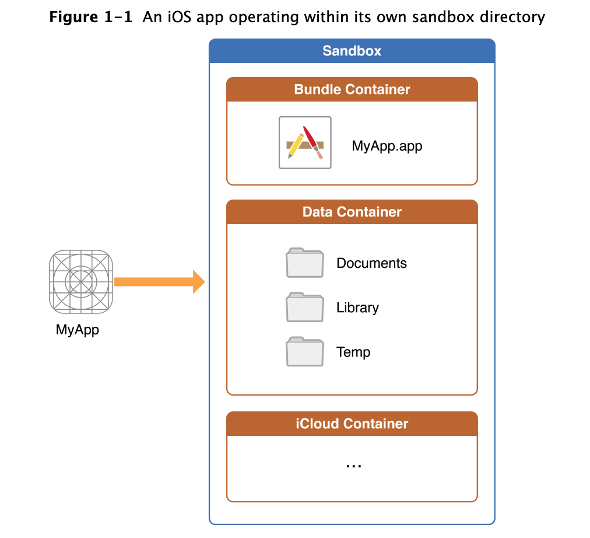
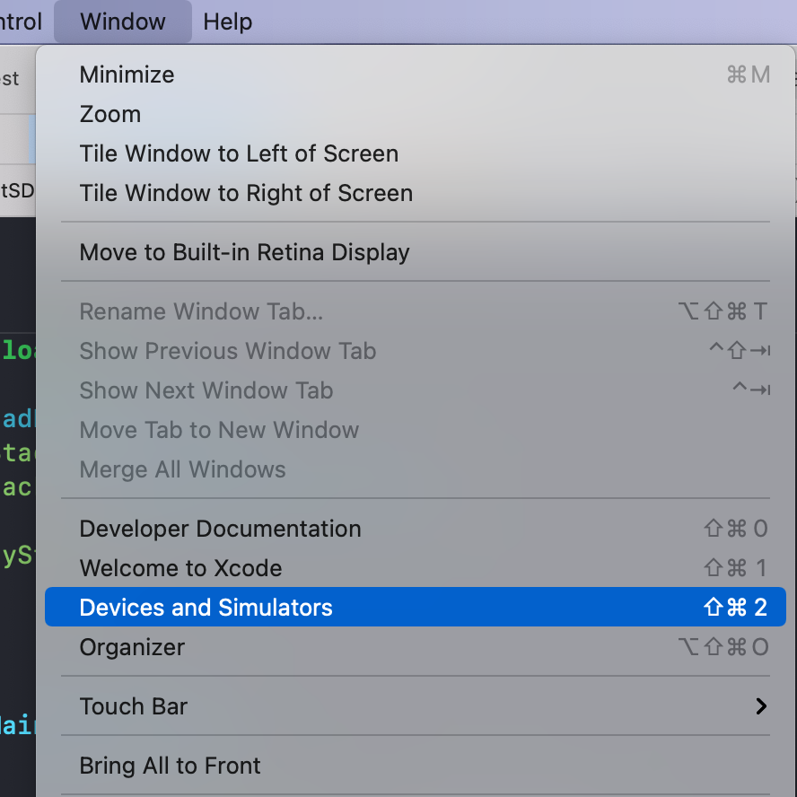
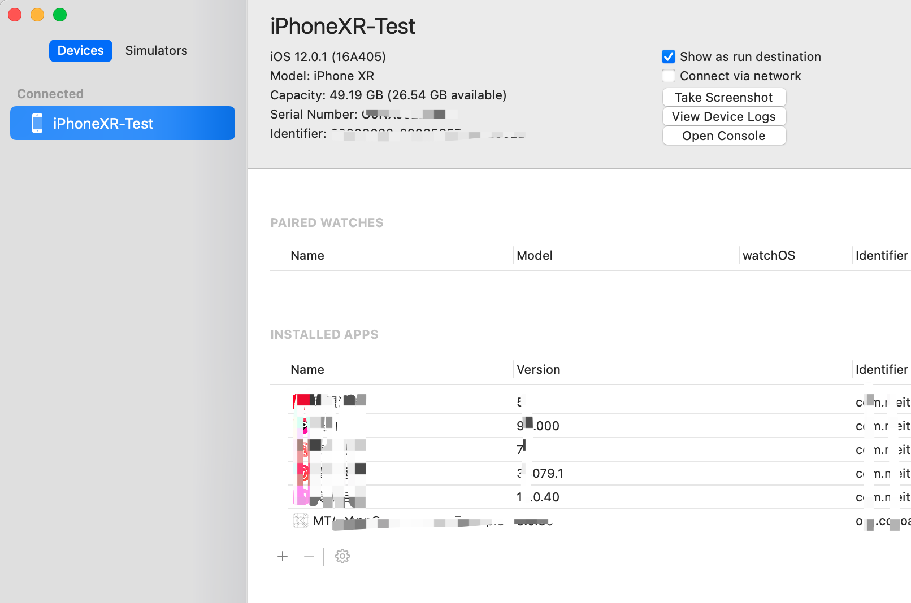
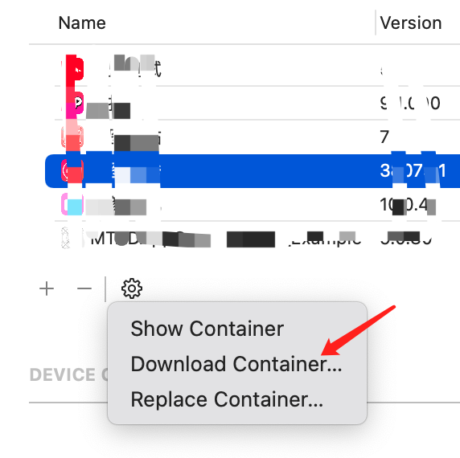

## 实时访问真机沙盒文件

### 背景

收藏了好多的书签和博客文章。心理上大概觉得收藏了就会了。。。所以，还是得整理一下梳理成自己比较容易理解的知识点，后续会陆续整理一下文章，情况收藏夹和收藏标签。


### iPhone 和 iPad 沙盒化

> [From](https://support.apple.com/zh-cn/guide/deployment-reference-ios/apd826604be4/web)
>
> **所有第三方 App 均已经过“沙盒化”，因此它们在访问其他 App 储存的文件或对设备进行更改时会受到限制。沙盒化可以防止 App 收集或修改其他 App 储存的信息。每个 App 还拥有唯一的主目录来存放其文件，主目录是在安装 App 时随机分配的。如果第三方 App 需要访问除自身信息以外的其他信息，只能通过 iOS 和 iPadOS 明确提供的服务来实现。**
>
> **系统文件和资源也会与用户的 App 保持隔离。与所有第三方 App 一样，绝大部分 iOS 和 iPadOS 系统文件和资源以非权限用户“mobile”的身份运行。整个操作系统分区以只读方式装载。不必要的工具（如远程登录服务）未包含在系统软件中，并且 API 不允许 App 提升自己的权限来修改其他 App 或者 iOS 和 iPadOS。**



| Directory         | Description                                                  |
| :---------------- | :----------------------------------------------------------- |
| *AppName*`.app`   | This is the app’s bundle. This directory contains the app and all of its resources.You cannot write to this directory. To prevent tampering, the bundle directory is signed at installation time. Writing to this directory changes the signature and prevents your app from launching. You can, however, gain read-only access to any resources stored in the apps bundle. For more information, see the *[Resource Programming Guide](https://developer.apple.com/library/archive/documentation/Cocoa/Conceptual/LoadingResources/Introduction/Introduction.html#//apple_ref/doc/uid/10000051i)*The contents of this directory are not backed up by iTunes or iCloud. However, iTunes does perform an initial sync of any apps purchased from the App Store. |
| `Documents/`      | Use this directory to store user-generated content. The contents of this directory can be made available to the user through file sharing; therefore, this directory should only contain files that you may wish to expose to the user.The contents of this directory are backed up by iTunes and iCloud. |
| `Documents/Inbox` | Use this directory to access files that your app was asked to open by outside entities. Specifically, the Mail program places email attachments associated with your app in this directory. Document interaction controllers may also place files in it.Your app can read and delete files in this directory but cannot create new files or write to existing files. If the user tries to edit a file in this directory, your app must silently move it out of the directory before making any changes.The contents of this directory are backed up by iTunes and iCloud. |
| `Library/`        | This is the top-level directory for any files that are not user data files. You typically put files in one of several standard subdirectories. iOS apps commonly use the `Application Support` and `Caches` subdirectories; however, you can create custom subdirectories.Use the `Library` subdirectories for any files you don’t want exposed to the user. Your app should not use these directories for user data files.The contents of the `Library` directory (with the exception of the `Caches` subdirectory) are backed up by iTunes and iCloud.For additional information about the Library directory and its commonly used subdirectories, see [The Library Directory Stores App-Specific Files](https://developer.apple.com/library/archive/documentation/FileManagement/Conceptual/FileSystemProgrammingGuide/FileSystemOverview/FileSystemOverview.html#//apple_ref/doc/uid/TP40010672-CH2-SW1). |
| `tmp/`            | Use this directory to write temporary files that do not need to persist between launches of your app. Your app should remove files from this directory when they are no longer needed; however, the system may purge this directory when your app is not running.The contents of this directory are not backed up by iTunes or iCloud. |


>### Where You Should Put Your App’s Files
>
>To prevent the syncing and backup processes on iOS devices from taking a long time, be selective about where you place files. Apps that store large files can slow down the process of backing up to iTunes or iCloud. These apps can also consume a large amount of a user's available storage, which may encourage the user to delete the app or disable backup of that app's data to iCloud. With this in mind, you should store app data according to the following guidelines:
>
>- Put user data in `Documents/`. User data generally includes any files you might want to expose to the user—anything you might want the user to create, import, delete or edit. For a drawing app, user data includes any graphic files the user might create. For a text editor, it includes the text files. Video and audio apps may even include files that the user has downloaded to watch or listen to later.
>- Put app-created support files in the `Library/Application support/` directory. In general, this directory includes files that the app uses to run but that should remain hidden from the user. This directory can also include data files, configuration files, templates and modified versions of resources loaded from the app bundle.
>- Remember that files in `Documents/` and `Application Support/` are backed up by default. You can exclude files from the backup by calling` -[NSURL setResourceValue:forKey:error:]` using the `NSURLIsExcludedFromBackupKey` key. Any file that can be re-created or downloaded must be excluded from the backup. This is particularly important for large media files. If your application downloads video or audio files, make sure they are not included in the backup.
>- Put temporary data in the `tmp/` directory. Temporary data comprises any data that you do not need to persist for an extended period of time. Remember to delete those files when you are done with them so that they do not continue to consume space on the user’s device. The system will periodically purge these files when your app is not running; therefore, you cannot rely on these files persisting after your app terminates.
>- Put data cache files in the `Library/Caches/` directory. Cache data can be used for any data that needs to persist longer than temporary data, but not as long as a support file. Generally speaking, the application does not require cache data to operate properly, but it can use cache data to improve performance. Examples of cache data include (but are not limited to) database cache files and transient, downloadable content. Note that the system may delete the `Caches/` directory to free up disk space, so your app must be able to re-create or download these files as needed.


### 模拟器

iOS 开发过程经常需要访问沙盒文件来调试持久化文件，数据库等。模拟器一般可以通过收费软件 [SimPholders](https://simpholders.com/) 或者开源的 [SimSim](https://github.com/dsmelov/simsim) 来实时访问沙盒。


对于真机，我们有哪些方式？

### Xcode








### GCDWebServer

利用 [GCDWebServer](https://github.com/swisspol/GCDWebServer) 内置的 `GCDWebUploader` 扩展来实现这个目的，使用方法很简单。

> - [GCDWebUploader](https://github.com/swisspol/GCDWebServer/blob/master/GCDWebUploader/GCDWebUploader.h): subclass of `GCDWebServer` that implements an interface for uploading and downloading files using a web browser

```objective-c
//1.想要访问的沙盒路径
NSString *docPath = NSSearchPathForDirectoriesInDomains(NSDocumentDirectory, NSUserDomainMask, YES).firstObject;
//2.初始化服务器
_server = [[GCDWebUploader alloc] initWithUploadDirectory:docPath];
//3.启动服务器(port代表端口号)
[_server startWithPort:8889 bonjourName:@""];

//other code……
```


### 参考

- [File System Programming Guide](https://developer.apple.com/library/archive/documentation/FileManagement/Conceptual/FileSystemProgrammingGuide/FileSystemOverview/FileSystemOverview.html)

- For information about how to get references to the preceding directories from your iOS app, see [Locating Items in the Standard Directories](https://developer.apple.com/library/archive/documentation/FileManagement/Conceptual/FileSystemProgrammingGuide/AccessingFilesandDirectories/AccessingFilesandDirectories.html#//apple_ref/doc/uid/TP40010672-CH3-SW3). For tips on where to put files, see [Where You Should Put Your App’s Files](https://developer.apple.com/library/archive/documentation/FileManagement/Conceptual/FileSystemProgrammingGuide/FileSystemOverview/FileSystemOverview.html#//apple_ref/doc/uid/TP40010672-CH2-SW28).

