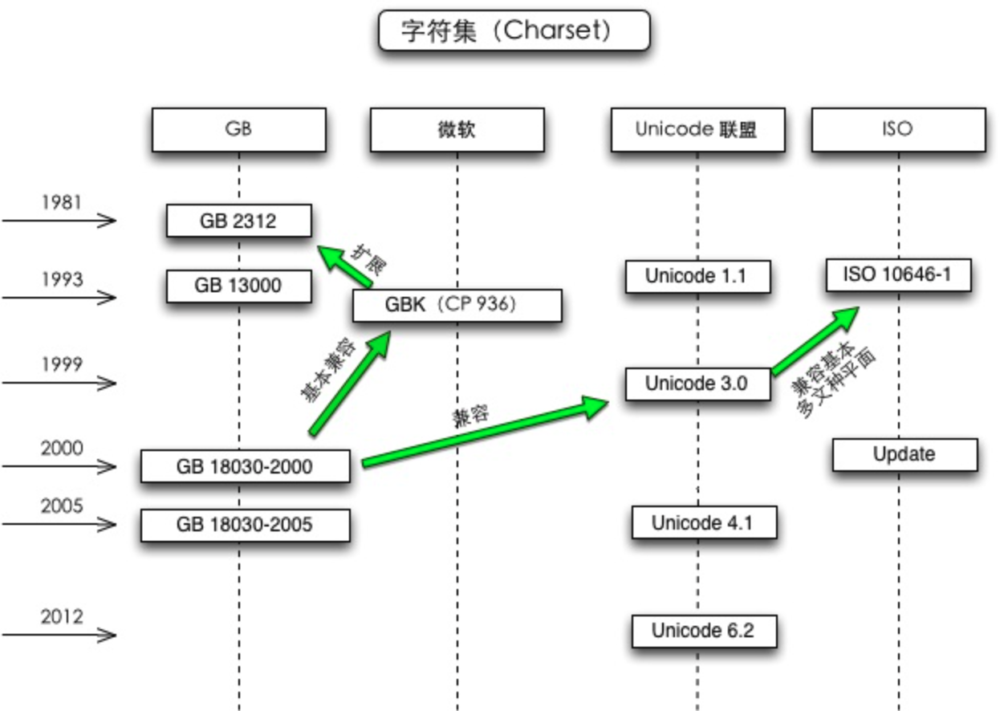

### Unicode / UTF-8 / ANSI

---

---


作者：梁海
链接：https://www.zhihu.com/question/20650946/answer/15745831
来源：知乎
著作权归作者所有。商业转载请联系作者获得授权，非商业转载请注明出处。


一句话建议：涉及兼容性考量时，不要用记事本，用专业的文本编辑器保存为不带 BOM 的 UTF-8。

如果是为了跨平台兼容性，只需要知道，在 Windows 记事本的语境中：

- 所谓的「ANSI」指的是对应当前系统 locale 的遗留（legacy）编码。[1]
- 所谓的「Unicode」指的是带有 BOM 的小端序 UTF-16。[2]
- 所谓的「UTF-8」指的是带 BOM 的 UTF-8。[3]


GBK 等遗留编码最麻烦，所以除非你知道自己在干什么否则不要再用了。
UTF-16 理论上其实很好，字节序也标明了，但 UTF-16 毕竟不常用。
UTF-8 本来是兼容性最好的编码但 Windows 偏要加 BOM 于是经常出问题。

所以，跨平台兼容性最好的其实就是不用记事本。
建议用 Notepad++ 等正常的专业文本编辑器保存为不带 BOM 的 UTF-8。

另外，如果文本中所有字符都在 ASCII 范围内，那么其实，记事本保存的所谓的「ANSI」文件，和 ASCII 或无 BOM 的 UTF-8 是一样的。


阮一峰那篇〈字符编码笔记：ASCII，Unicode和UTF-8〉的确很有名，但从那篇文章能看出来他其实还是没完全搞清楚 Unicode 和 UTF-8 的关系。他依旧被 Windows 的混乱措词误导。事实上，几年前我读完他那篇文章之后依旧一头雾水，最终还是自己看维基百科看明白的。
所以，那篇文章不值得推荐。


关于字符集（character set）和编码（encoding），某几篇答案中似乎有些混淆。

对于 ASCII、GB 2312、Big5、GBK、GB 18030 之类的遗留方案来说，基本上一个字符集方案只使用一种编码方案。
比如 ASCII 这部标准本身就直接规定了字符和字符编码的方式，所以既是字符集又是编码方案；而 GB 2312 只是一个区位码形式的字符集标准，不过实际上基本都用 EUC-CN 来编码，所以提及「GB 2312」时也说的是一个字符集和编码连锁的方案；GBK 和 GB 18030 等向后兼容于 GB 2312 的方案也类似。
于是，很多人受这些遗留方案的影响而无法理解字符集和编码的关系。

对于 Unicode，字符集和编码是明确区分的。Unicode/UCS 标准首先是个统一的字符集标准。而 Unicode/UCS 标准同时也定义了几种可选的编码方案，在标准文档中称作「encoding form」，主要包括 UTF-8、UTF-16 和 UTF-32。
所以，对 Unicode 方案来说，同样的基于 Unicode 字符集的文本可以用多种编码来存储、传输。
所以，用「Unicode」来称呼一个编码方案不合适，并且误导。


[1] Windows 里说的「ANSI」其实是 Windows code pages，这个模式根据当前 locale 选定具体的编码，比如简中 locale 下是 GBK。把自己这些 code page 称作「ANSI」是 Windows 的

臭毛病

。在 ASCII 范围内它们应该是和 ASCII 一致的。
[2] 把带有 BOM 的小端序 UTF-16 称作「Unicode」也是 Windows 的

臭毛病

。Windows 从 Windows 2000 开始就已经支持 surrogate pair 了，所以已经是 UTF-16 了，「UCS-2」这个说法已经不合适了。UCS-2 只能编码 BMP 范围内的字符，从 1996 年起就在 Unicode/ISO 标准中被 UTF-16 取代了（UTF-16 通过蛋疼的 surrogate pair 来编码超出 BMP 的字符）。都十多年了，求求大家别再误称了……
[3] 把带 BOM 的 UTF-8 称作「UTF-8」又是 Windows 的

臭毛病

。如果忽略 BOM，那么在 ASCII 范围内与 ASCII 一致。


作者：陈甫鸼
链接：https://www.zhihu.com/question/20650946/answer/15757101
来源：知乎
著作权归作者所有。商业转载请联系作者获得授权，非商业转载请注明出处。

---

---


其实前面他自己的回答已经很完善了。我补充一些细节就可以。

ANSI 确实是遗留编码，在不同语言的系统中编码不同，这一部分在微软的术语中叫 code page。比如所谓 GBK 编码，实际上更多地被叫做 CP936。这个术语是从 IBM 早期的一些工作中继承下来的，现在也没改变。但是，代码页这个概念在引入更大的字符集时已经遇到了问题，比如当初 GBK 扩展到 GB18030 时，它无法自然地用同一个代码页解决问题，不得不使用非常复杂的映射技术在几个代码页中切换才最终达到目的。

所谓微软的 Unicode，确实是 UTF-16LE。这个问题上 MSDN 文档在术语运用上有很多前后矛盾的地方，所以很多程序员都不太了解。再加上微软 SDK 默认的 WCHAR 是两个字节，进一步加剧了混乱程度。事实上时至今日，微软的默认编码不一定是两字节了，因为 Unicode 早已超过了 65536 个字符。

如果是为了跨平台，那么最有效的办法确实是坚持使用 UTF-8。不过是否使用 BOM 则未必真的需要很纠结。事实上现代的编辑器都可以很好地处理 BOM，比如 VIM。在 UNIX 环境下不适合使用 BOM 的场合有两个：一个是 XML，另一个是老旧的 shell 脚本。前者是因为规范里就没有 BOM 的位置，而后者则是因为历史原因而不能很好支持。而更大范围内的应用，比如 Python 脚本，则可以很好地处理 BOM。


作者：时国怀
链接：https://www.zhihu.com/question/20650946/answer/15751688
来源：知乎
著作权归作者所有。商业转载请联系作者获得授权，非商业转载请注明出处。

---

---


先来解释一下这三种编码的历史吧：

ANSI：最早的时候计算机ASCII码只能表示256个符号（含控制符号），这个字符集表示英文字母足够，其中，我们键盘上可见的符号的编码范围是从32到126（大小写英文字母、数字、英文符号等）。但表示汉字、日语、韩语就不太够用了，汉字常用字有3000多个。

但是中国人也要用电脑打字，于是，中国人就研究出来了最早的中文字符集GB2312（GBK就是后来的扩展），GB2312的做法是，把ASC码取值范围的128～255这个区间挪用了一下，用两个ASC码表示一个汉字，这样可用的编码范围用十六进制表示就是0x8080到0xFFFF，这大概能表示一万多个符号，足够了。[注:实际没用那么多，GBK的范围是8140-FEFE]

那个时候，计算机技术还不发达，各个国家搞自己的，比如台湾，也另搞了一套，叫BIG5（俗称：大五码），跟大陆的也不太一样，但方法是类似的，都是用0x80到0xFF这个区间。
然后日语（有编码JIS）、韩语等等也各搞一套。

这些国家的编码区间都是重叠的，但同一个汉字（比如有一些汉字同时存在于简体、繁体、日语汉字中）有不同的编码，很混乱是不是？但也凑合用了。编码不同导致了很多麻烦，比如一个网页，如果你不知道它是什么编码的，那么你可能很难确定它显示的是什么，一个字符可能是大陆简体/台湾繁体/日本汉字，但又完全是不同的几个字。

所以如果用一些很老的软件，可能会听说有中文版/日文版之类的，对应的版本只能在对应的系统上运行。

后来，这个对操作系统的开发实在是太困难了，因为这意味着不同语言的版本，都要重新编码。于是发明了Unicode。

Unicode这个东西，就是要把地球上所有的语言的符号，都用**统一的字符集**来表示，一个编码真正做到了唯一。

**Unicode里有几种方式：**

UTF-16BE/LE：UTF-16就是Windows模式的编码模式(Windows里说的Unicode一般都是指这种编码），用2个字节表示任意字符，注意：英文字符也占2个字节（变态不？），这种编码可以表示65536个字符，至于LE和BE，就是一个数值在内存/磁盘上的保存方式，比如一个编码0x8182，在磁盘上应该是0x81 0x82呢？还是0x82 0x81呢？就是高位是最先保存还是最后保存的问题，前者为BE，后者为LE。

UTF-8：UTF-8则是网页比较流行的一种格式：用一个字节表示英文字符，用3个字节表示汉字，准确的说，UTF-8是用二进制编码的前缀，如果某个UTF-8的编码的第一个字节的最高二进制位是0，则这个编码占1字节，如果是110，则占2字节，如果是1110，则占3字节……

**好了，说了这么，再来研究Windows的记事本。**

Windows早期（至少是95年以前的事情了）是ANSI字符集的，也就是说一个中文文本，在Windows简体中文版显示的是中文，到Windows日文版显示的就不知道是什么东西了。

后来，Windows支持了Unicode，但当时大部分软件都是用ANSI编码的，unicode还不流行，怎么办？Windows想了个办法，就是允许一个默认语言编码，就是当遇到一个字符串，不是unicode的时候，就用默认语言编码解释。（在区域和语言选项里可以改默认语言）

这个默认语言，在不同Windows语言版本里是不同的，在简体中文版里，是GBK，在繁体中文版里，是BIG5，在日文版里是JIS

而记事本的ANSI编码，就是这种默认编码，所以，一个中文文本，用ANSI编码保存，在中文版里编码是GBK模式保存的时候，到繁体中文版里，用BIG5读取，就全乱套了。

记事本也不甘心这样，所以它要支持Unicode，但是有一个问题，一段二进制编码，如何确定它是GBK还是BIG5还是UTF-16/UTF-8？记事本的做法是在TXT文件的最前面保存一个标签，如果记事本打开一个TXT，发现这个标签，就说明是unicode。标签叫BOM，如果是0xFF 0xFE，是UTF16LE，如果是0xFE 0xFF则UTF16BE，如果是0xEF 0xBB 0xBF，则是UTF-8。如果没有这三个东西，那么就是ANSI，使用操作系统的默认语言编码来解释。

Unicode的好处就是，不论你的TXT放到什么语言版本的Windows上，都能正常显示。而ANSI编码则不能。（UTF-8的好处是在网络环境下，比较节约流量，毕竟网络里英文的数据还是最多的）

举例：

同样一段中文文本（可以插入一些英文），保存成ANSI/Unicode/UTF-8，三个文件。

修改windows的默认语言为日语之类的（WIN7的改法是：控制面板-时钟、语言和区域-更改显示语言-区域和语言-管理-非unicode程序语言-更改区域设置/WNIXP改法是：控制面板-区域和语言选项-非unicode程序语言）。

修改完要求重启，重启以后，再打开这三个文件，ANSI的编码全乱了，其余两个都正常显示，这就是UNICODE的作用。

另外，为什么记事本、开始菜单什么的还是正确的中文呢？明明我已经改了默认语言了？因为它们的程序编码也是unicode的。

要把txt发给国外的朋友或者用在非中文的操作系统/软件里，那么你的编码最好选择unicode

-完-

---

---


发布过编码规范的组织有 GB、微软、Unicode 联盟和 ISO 等，互相之间有的兼容，有的不兼容。
GB 是国标，中国的一个发布编码规范的机构，可以忽略掉，通用性太差了。
微软在 GB2312 的基础上扩展了 GBK，也可以忽略掉。
UTF-8（一种**编码方式**） 是 Unicode（一种标准） 的实现方式。记事本把 Unicode 和 UTF-8 并列，我不太懂它什么意思。
ANSI 并不是确定的一种编码，在简体中文操作系统指的是 GB2312，在繁体操作系统指的是 BIG5。


一句话，最好用 UTF-8。
多说一句：不要使用 Windows 自带的记事本！说记事本是垃圾，一点不为过。



作者：方应杭
链接：https://www.zhihu.com/question/20650946/answer/15745835
来源：知乎
著作权归作者所有。商业转载请联系作者获得授权，非商业转载请注明出处。


---

---

---


1,542 人赞同了该回答

举一个例子：It's 知乎日报你看到的unicode字符集是这样的编码表：

```c
I 0049
t 0074
' 0027
s 0073
  0020
知 77e5
乎 4e4e
日 65e5
报 62a5
```


每一个字符对应一个十六进制数字。

计算机只懂二进制，因此，严格按照unicode的方式(UCS-2)，应该这样存储：

```c
I 00000000 01001001
t 00000000 01110100
' 00000000 00100111
s 00000000 01110011
  00000000 00100000
知 01110111 11100101
乎 01001110 01001110
日 01100101 11100101
报 01100010 10100101
```


这个字符串总共占用了18个字节，但是对比中英文的二进制码，可以发现，英文前9位都是0！浪费啊，浪费硬盘，浪费流量。

怎么办？

UTF。

UTF-8是这样做的：

1. 单字节的字符，字节的第一位设为0，对于英语文本，UTF-8码只占用一个字节，和ASCII码完全相同；

2. n 个字节的字符(n>1)，第一个字节的前n位设为1，第n+1位设为0，后面字节的前两位都设为10，这n个字节的其余空位填充该字符unicode码，高位用0补足。

这样就形成了如下的UTF-8标记位：

```c
	 0xxxxxxx
   110xxxxx 10xxxxxx
   1110xxxx 10xxxxxx 10xxxxxx
   11110xxx 10xxxxxx 10xxxxxx 10xxxxxx
   111110xx 10xxxxxx 10xxxxxx 10xxxxxx 10xxxxxx
   1111110x 10xxxxxx 10xxxxxx 10xxxxxx 10xxxxxx 10xxxxxx
   ... ...
```


于是，”It's 知乎日报“就变成了：

```c
I 01001001
t 01110100
' 00100111
s 01110011
  00100000
知 11100111 10011111 10100101
乎 11100100 10111001 10001110
日 11100110 10010111 10100101
报 11100110 10001010 10100101
```

和上边的方案对比一下，英文短了，每个中文字符却多用了一个字节。但是整个字符串只用了17个字节，比上边的18个短了一点点。


下边是课后作业：


请将”It's 知乎日报“的GB2312和GBK码(自行google)转成二进制。不考虑历史因素，从技术角度解释为什么在unicode和UTF-8大行其道的同时，GB2312和GBK仍在广泛使用。


剧透：一切都是为了节省你的硬盘和流量。


作者：uuspider
链接：https://www.zhihu.com/question/23374078/answer/65352538
来源：知乎
著作权归作者所有。商业转载请联系作者获得授权，非商业转载请注明出处。


---

---


很久很久以前，有一群人，他们决定用8个可以开合的晶体管来组合成不同的状态，以表示世界上的万物。他们看到8个开关状态是好的，于是他们把这称为”**字节**“。再后来，他们又做了一些可以处理这些字节的机器，机器开动了，可以用字节来组合出很多状态，状态开始变来变去。他们看到这样是好的，于是它们就这机器称为”**计算机**“。


开始计算机只在美国用。八位的字节一共可以组合出256(2的8次方)种不同的状态。 
他们把其中的编号从0开始的32种状态分别规定了特殊的用途，一但终端、打印机遇上约定好的这些字节被传过来时，就要做一些约定的动作：

遇上0×10, 终端就换行；

遇上0×07, 终端就向人们嘟嘟叫；

遇上0x1b, 打印机就打印反白的字，或者终端就用彩色显示字母。

他们看到这样很好，于是就把这些0×20以下的字节状态称为”控制码”。他们又把所有的空 
格、标点符号、数字、大小写字母分别用连续的字节状态表示，一直编到了第127号，这样计算机就可以用不同字节来存储英语的文字了。大家看到这样，都感觉
 很好，于是大家都把这个方案叫做 **ANSI** 的”Ascii”编码（American Standard Code for Information Interchange，美国信息互换标准代码）。当时世界上所有的计算机都用同样的**ASCII**方案来保存英文文字。


后来，就像建造巴比伦塔一样，世界各地都开始使用计算机，但是很多国家用的不是英文，他们的字母里有许多是ASCII里没有的，为了可以在计算机保存他们的文字，他们决定采用 
127号之后的空位来表示这些新的字母、符号，还加入了很多画表格时需要用下到的横线、竖线、交叉等形状，一直把序号编到了最后一个状态255。从128 到255这一页的字符集被称”**扩展字符集**“。从此之后，贪婪的人类再没有新的状态可以用了，美帝国主义可能没有想到还有第三世界国家的人们也希望可以用到计算机吧！


等中国人们得到计算机时，已经没有可以利用的字节状态来表示汉字，况且有6000多个常用汉字需要保存呢。但是这难不倒智慧的中国人民，我们不客气地把那些127号之后的奇异符号们直接取消掉, 规定：一个小于127的字符的意义与原来相同，但两个大于127的字符连在一起时，就表示一个汉字，前面的一个字节（他称之为高字节）从0xA1用到0xF7，后面一个字节（低字节）从0xA1到0xFE，这样我们就可以组合出大约7000多个简体汉字了。在这些编码里，我们还把数学符号、罗马希腊的字母、日文的假名们都编进去了，连在 ASCII 里本来就有的数字、标点、字母都统统重新编了两个字节长的编码，这就是常说的”全角”字符，而原来在127号以下的那些就叫”半角”字符了。中国人民看到这样很不错，于是就把这种汉字方案叫做 “**GB2312**“。GB2312 是对 ASCII 的中文扩展。


但是中国的汉字太多了，我们很快就就发现有许多人的人名没有办法在这里打出来，特别是某些很会麻烦别人的国家领导人。于是我们不得不继续把GB2312 没有用到的码位找出来老实不客气地用上。后来还是不够用，于是干脆不再要求低字节一定是127号之后的内码，只要第一个字节是大于127就固定表示这是一个汉字的开始，不管后面跟的是不是扩展字
符集里的内容。结果扩展之后的编码方案被称为 **GBK** 标准，GBK包括了GB2312 的所有内容，同时又增加了近20000个新的汉字（包括繁体字）和符号。 后来少数民族也要用电脑了，于是我们再扩展，又加了几千个新的少数民族的字，GBK扩成了 **GB18030**。从此之后，中华民族的文化就可以在计算机时代中传承了。 中国的程序员们看到这一系列汉字编码的标准是好的，于是通称他们叫做 “**DBCS**“（Double Byte Charecter Set 双字节字符集）。在DBCS系列标准里，最大的特点是两字节长的汉字字符和一字节长的英文字符并存于同一套编码方案里，因此他们写的程序为了支持中文处理，必须要注意字串里的每一个字节的值，如果这个值是大于127的，那么就认为一个双字节字符集里的字符出现了。那时候凡是受过加持，会编程的计算机僧侣们都要每天念下面这个咒语数百遍： “一个汉字算两个英文字符！一个汉字算两个英文字符……”


因为当时各个国家都像中国这样搞出一套自己的编码标准，结果互相之间谁也不懂谁的编码，谁也不支持别人的编码，连大陆和台湾这样只相隔了150海里，使用着同一种语言的兄弟地区，也分别采用了不同的 DBCS 编码方案——当时的中国人想让电脑显示汉字，就必须装上一个”汉字系统”，专门用来处理汉字的显示、输入的问题，像是那个台湾的愚昧封建人士写的算命程序就必须加装另一套支持 BIG5 编码的什么”倚天汉字系统”才可以用，装错了字符系统，显示就会乱了套！这怎么办？而且世界民族之林中还有那些一时用不上电脑的穷苦人民，他们的文字又怎么办？ 真是计算机的巴比伦塔命题啊！


正在这时，大天使加百列及时出现了——一个叫 **ISO**（国际标准化组织）的国际组织决定着手解决这个问题。他们采用的方法很简单：废了所有的地区性编码方案，重新搞一个包括了地球上所有文化、所有字母和符号 的编码！他们打算叫它”Universal Multiple-Octet Coded Character Set”，简称 **UCS**, 俗称 “**unicode**“。


unicode开始制订时，计算机的存储器容量极大地发展了，空间再也不成为问题了。于是 ISO 
就直接规定必须用两个字节，也就是16位来统一表示所有的字符，对于ASCII里的那些“半角”字符，unicode包持其原编码不变，只是将其长度由原来的8位扩展为16位，而其他文化和语言的字符则全部重新统一编码。由于”半角”英文符号只需要用到低8位，所以其高8位永远是0，因此这种大气的方案在保存英文文本时会多浪费一倍的空间。


这时候，从旧社会里走过来的程序员开始发现一个奇怪的现象：他们的 *strlen* 函数靠不住了，一个汉字不再是相当于两个字符了，而是一个！是的，从unicode开始，无论是半角的英文字母，还是全角的汉字，它们都是统一的”**一个字符**“！同时，也都是统一的”**两个字节**“，请注意”字符”和”字节”两个术语的不同，“**字节**”是一个8位的物理存贮单元，而“**字符**”则是一个文化相关的符号。在unicode中，一个字符就是两个字节。一个汉字算两个英文字符的时代已经快过去了。


unicode同样也不完美，这里就有两个的问题，一个是，如何才能区别unicode和ascii？计算机怎么知道三个字节表示一个符号，而不是分别表示三个符号呢？第二个问题是，我们已经知道，英文字母只用一个字节表示就够了，如果unicode统一规定，每个符号用三个或四个字节表示，那么每个英文字母前都必然有二到三个字节是0，这对于存储空间来说是极大的浪费，文本文件的大小会因此大出二三倍，这是难以接受的。


unicode在很长一段时间内无法推广，直到互联网的出现，为解决unicode如何在网络上传输的问题，于是面向传输的众多 **UTF**（UCS Transfer Format）标准出现了，顾名思义，**UTF-8**就是每次8个位传输数据，而**UTF-16**就是每次16个位。UTF-8就是在互联网上使用最广的一种unicode的实现方式，这是为传输而设计的编码，并使编码无国界，这样就可以显示全世界上所有文化的字符了。UTF-8最大的一个特点，就是它是一种变长的编码方式。它可以使用1~4个字节表示一个符号，根据不同的符号而变化字节长度，当字符在ASCII码的范围时，就用一个字节表示，保留了ASCII字符一个字节的编码做为它的一部分，注意的是unicode一个中文字符占2个字节，而UTF-8一个中文字符占3个字节）。从unicode到utf-8并不是直接的对应，而是要过一些算法和规则来转换。


Unicode符号范围         |   UTF-8编码方式

(十六进制)                    |  （二进制）
—————————————————————–
0000 0000-0000 007F | 0xxxxxxx

0000 0080-0000 07FF | 110xxxxx 10xxxxxx

0000 0800-0000 FFFF | 1110xxxx 10xxxxxx 10xxxxxx

0001 0000-0010 FFFF | 11110xxx 10xxxxxx 10xxxxxx 10xxxxxx


最后简单总结一下：

- 中国人民通过对 ASCII 编码的中文扩充改造，产生了 GB2312 编码，可以表示6000多个常用汉字。
- 汉字实在是太多了，包括繁体和各种字符，于是产生了 GBK 编码，它包括了 GB2312 中的编码，同时扩充了很多。
- 中国是个多民族国家，各个民族几乎都有自己独立的语言系统，为了表示那些字符，继续把 GBK 编码扩充为 GB18030 编码。
- 每个国家都像中国一样，把自己的语言编码，于是出现了各种各样的编码，如果你不安装相应的编码，就无法解释相应编码想表达的内容。
- 终于，有个叫 ISO 的组织看不下去了。他们一起创造了一种编码 UNICODE ，这种编码非常大，大到可以容纳世界上任何一个文字和标志。所以只要电脑上有 UNICODE 这种编码系统，无论是全球哪种文字，只需要保存文件的时候，保存成 UNICODE 编码就可以被其他电脑正常解释。
- UNICODE 在网络传输中，出现了两个标准 UTF-8 和 UTF-16，分别每次传输 8个位和 16个位。于是就会有人产生疑问，UTF-8 既然能保存那么多文字、符号，为什么国内还有这么多使用 GBK 等编码的人？因为 UTF-8 等编码体积比较大，占电脑空间比较多，如果面向的使用人群绝大部分都是中国人，用 GBK 等编码也可以。


来源于网络，出处实在无法考证，无法署名，有删减修改，如有侵权请直接联系。

可能的原文：[unicode,ansi,utf-8,unicode big endian编码的区别](https://link.zhihu.com/?target=http%3A//wenku.baidu.com/view/cb9fe505cc17552707220865.html)，[网页编码就是那点事](https://link.zhihu.com/?target=http%3A//www.qianxingzhem.com/post-1499.html)


