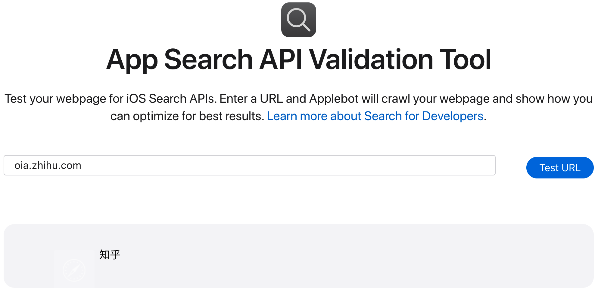
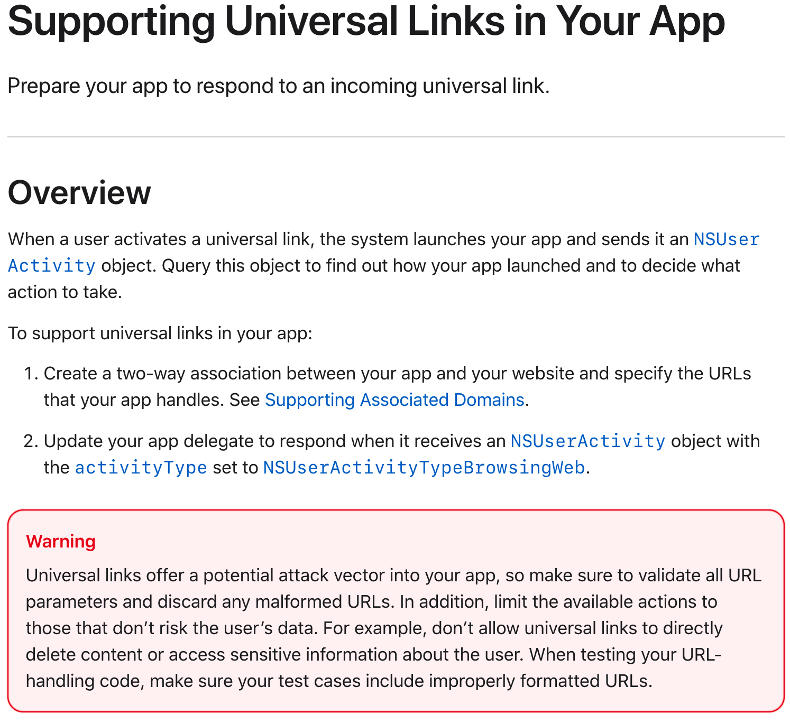
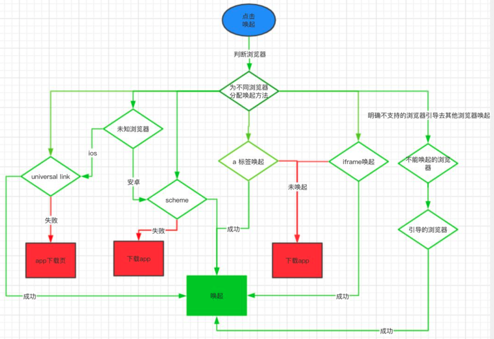

## Universal Link

> universal links are:
>
> - **Unique.** Unlike custom URL schemes, universal links can’t be claimed by other apps, because they use standard HTTP or HTTPS links to your website.
> - **Secure.** When users install your app, iOS checks a file that you’ve uploaded to your web server to make sure that your website allows your app to open URLs on its behalf. Only you can create and upload this file, so the association of your website with your app is secure.
> - **Flexible.** Universal links work even when your app is not installed. When your app isn’t installed, tapping a link to your website opens the content in Safari, as users expect.
> - **Simple.** One URL works for both your website and your app.
> - **Private.** Other apps can communicate with your app without needing to know whether your app is installed.


> - 唯一性：不像自定义的scheme,因为它使用标准的HTTP/HTTPS链接到你的web站点,所以它不会被其它的app所声明.另外,Custom URL scheme 因为是自定义的协议，所以在没有安装 app 的情况下是无法直接打开的，而Universal Links本身是一个HTTP/HTTPS链接，所以有更好的兼容性；
>
> - 安全：当用户的手机上安装了你的app，那么iOS将去你的网站上去下载你上传上去的说明文件(这个说明文件声明了APP可以打开哪些类型的http链接)。因为只有你自己才能上传文件到你网站的根目录,所以你的网站和你的app之间的关联是安全的；
>
> - 可变：当用户手机上没有安装你的app的时候，Universal Links也能够工作。如果你愿意，在没有安装APP的时候，用户点击链接，会在safari中展示你网站的内容；
>
> - 简单：一个URL链接，可以同时作用于网站和app，可以定义统一的web-native协议；
>
> - 私有：其它APP可以在不需要知道是否安装了的情况下和你的APP相互通信；


> Universal Link是苹果在WWDC 2015上提出的iOS 9的新特性之一。此特性类似于深层链接，并能够方便地通过打开一个Https链接来直接启动您的客户端应用(手机有安装App)。对比以往所使用的URLSheme, 这种新特性在实现web-app的无缝链接时,能够提供极佳的用户体验。 使用前请阅读[苹果官方文档](https://developer.apple.com/library/archive/documentation/General/Conceptual/AppSearch/UniversalLinks.html#//apple_ref/doc/uid/TP40016308-CH12-SW1)。
>
> 由于苹果iOS 13系统版本安全升级，微信SDK1.8.6版本要求支持Universal Links方式跳转，以便进行合法性校验，提升安全性。更多详情请参考[微信官方说明](https://developers.weixin.qq.com/doc/oplatform/Mobile_App/Access_Guide/iOS.html)


以前你的APP要打开其他APP是[通过URLScheme](http://www.html5plus.org/doc/zh_cn/runtime.html#plus.runtime.launchApplication)实现，后来苹果提出用Https链接来启动，手机上对应的app（已安装），更方便与web-app的无缝对接。微信响应了这个方案。所以大家开发的APP无论是微信登陆、微信支付，还是微信分享等一切会跳转到微信，再跳回来的场景，需要提供这个链接。要不然你的应用打开了微信，微信就打不开你的应用。


### 1 概述

支持`Universal Link`（通用链接） 先决条件：必须有一个支持`HTTPS`的域名，并且拥有该域名下上传到根目录的权限（为了上传`Apple`指定文件）

配置通用链接需要:

1. 在苹果开发者中心：开启Associated Domains服务

2. 工程配置 `targets->Capabilites->Associated Domains`，在其中的`Domains`中填入你想支持的域名，必须以`applinks:`为前缀，如：`applinks:domain`

3. 获取相关参数，手动创建`apple-app-site-association`文件，切记没后缀名

   ```objective-c
   {
       "applinks": {
           "apps": [],
           "details": [
               {
                   "appID": "9JA89QQLNQ.com.apple.wwdc",
                   "paths": [ "/wwdc/news/", "/videos/wwdc/2015/*"]
               },
               {
                   "appID": "ABCD1234.com.apple.wwdc",
                   "paths": [ "*" ]
               }
           ]
       }
   }
   
   ```

   `appID`：组成方式是`TeamID.BundleID`。如上面的`9JA89QQLNQ`就是`teamId`。登陆开发者中心，在`Account -> Membership`里面可以找到`Team ID` 

   `paths`：设定你的`app`支持的路径列表，只有这些指定路径的链接，才能被`app`所处理。`*`的写法代表了可识别域名下所有链接

   [App Search API Validation Tool](https://search.developer.apple.com/appsearch-validation-tool/) 可以验证apple-app-site-association是否合法有效

   

   [知乎的 apple-app-site-association 文件](https://oia.zhihu.com/apple-app-site-association)，`applinks` 是universal link相关字段

   ```json
   {
       "applinks": {
           "apps": [],
           "details": {
               "8J52SRPW6X.com.zhihu.ios": {
                   "paths": [
                       "*"
                   ]
               },
               "886PYH8YW5.com.zhihu.ios": {
                   "paths": [
                       "*"
                   ]
               },
               "B6MTNRMU2Y.com.zhihu.ios": {
                   "paths": [
                       "*"
                   ]
               },
               "B6MTNRMU2Y.com.zhihu.ios-dev": {
                   "paths": [
                       "*"
                   ]
               }
           }
       },
       "webcredentials": {
           "apps": [
               "8J52SRPW6X.com.zhihu.ios",
               "886PYH8YW5.com.zhihu.ios",
               "B6MTNRMU2Y.com.zhihu.ios",
               "B6MTNRMU2Y.com.zhihu.ios-dev"
           ]
       },
       "activitycontinuation": {
           "apps": [
               "8J52SRPW6X.com.zhihu.ios",
               "886PYH8YW5.com.zhihu.ios",
               "B6MTNRMU2Y.com.zhihu.ios",
               "B6MTNRMU2Y.com.zhihu.ios-dev"
           ]
       }
   }
   ```

   

4. 部署apple-app-site-association文件到自己的云服务器，配置SSL证书解析域名

   上传该文件到你的域名所对应的`根目录`或者`.well-known目录`下，这是为了苹果能获取到你上传的文件。上传完后，先访问一下，看看是否能够获取到，当你在浏览器中输入这个文件链接后，应该是直接下载`apple-app-site-association`文件

5. **Support Universal Links in Your App**



**Update Your App Delegate to Respond to a Universal Link**

```objective-c
#pragma mark Universal Links 
- (BOOL)application:(UIApplication *)application continueUserActivity:(NSUserActivity*)userActivity restorationHandler:(void (^)(NSArray * _Nullable))restorationHandler { 
    if ([userActivity.activityType isEqualToString:NSUserActivityTypeBrowsingWeb]) { 
        NSURL *webUrl = userActivity.webpageURL; 
        [self handleUniversalLink:webUrl]; // 转化为App路由 
    } 
    return YES; 
}
```


其中需要注意的细节较多，且调试起来困难繁琐，困扰了大量开发者。


### 2 问题

#### 2.1 [Troubleshooting Universal Links](https://developer.apple.com/library/archive/qa/qa1916/_index.html#//apple_ref/doc/uid/DTS40017117)

#### 2.2 问题汇总

##### 2.2.1 跨域

知乎为什么使用`oia.zhihu.com`做Universal Link？

- 假如当前网页的域名是 A
- 当前网页发起跳转的域名是 B
- 必须要求 B 和 A 是不同域名，才会触发Universal Link
- 如果B 和 A 是相同域名，只会继续在当前WebView里面进行跳转，哪怕你的Universal Link一切正常，根本不会打开App

知乎的一般网页URL都是`www.zhihu.com`域名，在各处分享传播的时候，也都是直接分享基于主域名的url，但为了解决苹果强制要求跨域才生效的问题，Universal Link就不能配置在主域名下，于是知乎才会准备一个`oia.zhihu.com`域名，专为Universal Link使用，不会跟任何主动传播分享的域名撞车，从而在任何活动WAP页面里，都能顺利让Universal Link生效。

#### 2.2.2 Universal link 请求 `apple-app-site-association` 时机

- 每次 App 安装后的第一次 Launch，会拉取 `apple-app-site-association`
- 每次 App 更新后的第一次 Launch，会拉取 `apple-app-site-association`

这就导致了一个问题，如果服务器上的 `apple-app-site-association` 文件被修改了，如何让用户无感的更新到最新的 `apple-app-site-association`文件？

App 发版貌似是相对重新安装好一点儿。


#### 2.2.3 网上更多人遇到的问题

- **按照上面写的配好了，怎么死活打不开呀？？？**

  1. 支持HTTPS呀，一定要是符合苹果认证的HTTPS证书呀。
  2. 系统问题，确保iOS9.0以上
  3. 配置文件问题，apple-app-site-association文件中配置的path和测试用的通用链接不一致，注意是区分大小写的。
  4. 域名问题，Xcode中配置的域名一不小心写错了。

- **为毛有的手机成功了，有的手机就不行呢？？？**

  1. 上面也提到过，因为网络波动有可能会导致部分用户第一次安装时，无法下载apple-app-site-association文件，这个只能引导用户删除重装或者在迭代时修改Associated Domains配置告诉系统重新下载apple-app-site-association文件。
  2. 另外一种可能是苹果抽风导致

- **全都配置好了，项目也能唤起来了，web页面到底该怎么弄呀？？？通用链接指向的服务器的页面到底应该是哪个？**

  之前iOS和安卓用的是同一个网页，也就是说从APP内分享出去的网页，可以被苹果用户和安卓用户同时查看，在这里需要由web童鞋使用js判断当前所处的平台以及其系统。

  如果是安卓用户，则显示安卓相关提示页面。

  如果是苹果用户，那么分两种：

  1. 如果是9.0以上的系统，相关的“在APP内打开”按钮的链接配置的就是我们的`Universal Link`(通用链接)了，且该通用链接地址指向的是一个APP下载引导页面，那么当用户安装了APP，即可通过通用链接唤醒APP；如果用户没有安装app，那么就会跳转到通用链接指向的APP下载引导页面，达到最大化的客户导流。
  2. 如果是9.0以下的系统，则相应的 “在APP内打开”的按钮就会发一个跳转到我们APP `URL Scheme`的重定向，以实现在`Safari`中唤醒我们的APP。

- **当使用通用链接唤醒APP之后，手机右上角有一个小按钮？**
  那个小按钮只有(在iOS10.0以下才有)是可以引导用户跳转到`Safari`中，名字叫`bread crumbs button`（面包屑），当然也去不掉;并且当用户点过这个按钮后，再点击`Universal Link`(通用链接)不会直接打开对应的APP。

- **备忘录和safari中都可以打开app，怎么分享到其他app里面就不行了？**

  未跨域导致的，如：分享到微信的链接是`https://www.mydomain.com/share.html`，然后该网页中的“在app内打开”按钮配置的通用链接为`https://www.mydomain.com/index.html`。
  跨域的意思是说，通用链接 和 调用通用链接的网页不要使用同一域名。
  即如果通用链接域名为`www.mydomain.com`，则通用链接所处的网页域名就不能是`www.mydomain.com`。

- **微信里不能跳转？？？已经禁用了`Universal Link`(通用链接)**

- **iOS13中在safari中可以打开相应APP，但是从微信或其他APP中点击去safari怎么就打开了别的APP？**
  在iOS13之前在其他APP去safari中打开`Universal Link`(通用链接)系统匹配域名是全匹配，而在iOS13之后规则发生了变化，猜测是包含关系。比如在iOS13之前，如果`Universal Link`(通用链接)为`w.mydomain.com`那么在微信或者其他APP访问`www.mydomain.com`然后点击去safari打开则不会拉起相应APP,而在iOS13则会拉起相应APP。
  而在safari中输入的链接则依然和iOS之前一样，只有`www.mydomain.com`才会提示打开相应APP。


### 3 H5 拉起 App

```js
// SCHEMA_PATH 为 URL Scheme 地址

// location.href 形式
window.top.location.href = SCHEMA_PATH;

// a标签形式
const a = document.createElement("a");
a.setAttribute("href", SCHEMA_PATH);
a.click();

// iframe形式
iframe = document.createElement('iframe');
iframe.frameBorder = '0';
iframe.style.cssText = 'display:none;border:0;width:0;height:0;';
document.body.append(iframe);
iframe.src = SCHEMA_PATH;
```




#### 3.1 Universal Link

- `优点`：提供极佳的用户体验，使用起来也非常方便，解决了同时唤起 `app` 跟 `app store` 的问题
- `缺点`：只有在 ios 9 版本之上才能使用，配置细节较多，个别浏览器不支持有兼容性问题


H5 端的 Universal Link 跳转，从产品经理的角度看，需要满足以下 2 个需求：

- 如果已安装 App，跳转对应界面
- 如果没安装 App，跳转 App 下载界面

H5 端部署 Universal Link 示例：

```js
router.use('/view', function (req, res, next) {    
  var path = req.path;    
  res.redirect('https://www.xxx.com/view' + path + '?xxx=xxx');
});
```


流程：

- 跳转`https://www.xxx.com/view/*`
- 已安装 App 
  - 打开 App 触发 handleUniversalLink
  - 走到`/view/`分支，拼接页面路由跳转
- 未安装 App
  - 原地跳转`https://``www.xxx.com``/view/*`
  - 命中服务器的**重定向**逻辑
  - 重定向到`https://``www.xxx.com``/view/*`
  - 打开相应的 H5 页


#### 3.2 URL Scheme

- `优点` 
  - 兼容性好，大部分机型都能兼容 
  - 使用方便
- `缺点`
  - 不能判断是否已经下载了 app，需要自己写逻辑判断 
  - 用户体验不如通用链接的方式。

H5 端的 URL Scheme 跳转，从产品经理的角度看，需要满足以下 2 个需求：

- 如果已安装 App，跳转对应界面
- 如果没安装 App，跳转 App 下载界面


方案：

使用URL Scheme会遇到一个棘手的问题，那就是我们无法得知是否成功唤起App。这个也可以理解，因为这个方式本质上就是访问一个URL，并没有特别的地方。但是唤端失败（通常是用户没有装这个App），我们需要引导用户去下载，这就要求我们需要通过一些手段，去检测唤端是否成功。 常见的做法是通过监听页面是否在 n秒内 隐藏来判断是否成功唤起App，因为如果唤起，那当前页面必然已经退到后台去了。 所以我们处理的流程是这样：

1. 当点击唤端后，定时器延时n秒(我们设定的是2.6秒)后执行下载操作
2. 监听 `visibilitychange` 事件，如果页面隐藏，则表示唤端成功，清除定时器  
3. 如果 `visibilitychange` 事件没有被触发，那么就代表唤端失败，n秒后就会执行下载的操作


H5 端部署 Universal Link 示例：

```js
var options = {
  delay: 2600,
  openTime: 0,
  limit_num: 100,
  url: 'you app download page url'
}

options.openTime = new Date()

// n秒后执行下载
const timer = setTimeout(() => {
  this.download(options);
}, options.delay);

// 页面隐藏，那么代表已经调起了app，就清除下载的定时器
const visibilitychange = function() {
  const tag = document.hidden || document.webkitHidden;
  tag && clearTimeout(timer);
};

document.addEventListener("visibilitychange", visibilitychange, false);
document.addEventListener("webkitvisibilitychange", visibilitychange, false);
window.addEventListener(
  "pagehide",
  function() {
    clearTimeout(timer);
  },
  false
);
/***********************************设置延时判断是否安装App*************************************************/
/*
浏览器尝试打开URL scheme并记录时间点t1，在2秒计时后，检查当前时间t2，如果t2-t1 > 2200ms,说明唤起app成功(唤起app会是浏览器的定时器延后执行)，如果t2-t1 < 2200ms,可能没有安装app，可以引导用户进入下载页。
*/
function download1 (options) {
  if(optinos.limit_num > 0){
        options.limit_num--;
   }else{
        if ((new Date()) - options.openTime < options.delay) {
            window.location.href = options.url; //'you app download page'
        }
        clearTimeout(timer);
   }
}
/*
原理上跟setTimeout相似，方法上换成设置一个比较小的时间间隔（例如20ms），运行多次(例如100),比较运行完100次的总耗时与20*100的时间差。逻辑判断同setTimeout。
*/
function download2 (options) {
  if ((new Date()) - options.openTime < options.delay) {
        window.location.href = options.url; //'you app download page'
    }
    if ((new Date()) - options.openTime > options.delay) {
        clearTimeout(timer);
    }
}
```

不过这个方法有个致命问题，就是 `n` 应该取多少，不同的手机，唤端的时间并不一样。 

- 时间设置太长，用户下载等待太久，会导致用户还没看到下载就退出了。 
- 时间设置太短，可能会导致还没有唤起App，就又同时执行了下载的逻辑。

n设置为2500ms-3000ms，是一个比较合适的值


### 参考

- [Allowing Apps and Websites to Link to Your Content](https://developer.apple.com/documentation/xcode/allowing-apps-and-websites-to-link-to-your-content?changes=latest_major)
- [Supporting Universal Links in Your App](https://developer.apple.com/documentation/xcode/supporting-universal-links-in-your-app?changes=latest_major)
- [Support Universal Links](https://developer.apple.com/library/archive/documentation/General/Conceptual/AppSearch/UniversalLinks.html#//apple_ref/doc/uid/TP40016308-CH12-SW1)
- [Lists of available trusted root certificates in iOS](https://support.apple.com/en-us/HT204132)
- [APP唤起那点破事](https://libin1991.github.io/2020/03/21/APP%E5%94%A4%E8%B5%B7%E9%82%A3%E7%82%B9%E7%A0%B4%E4%BA%8B/)
- [唤起App在转转的实践](https://zhuanlan.zhihu.com/p/222864158)

