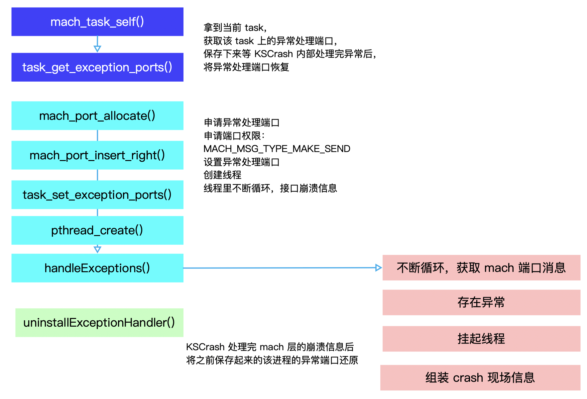
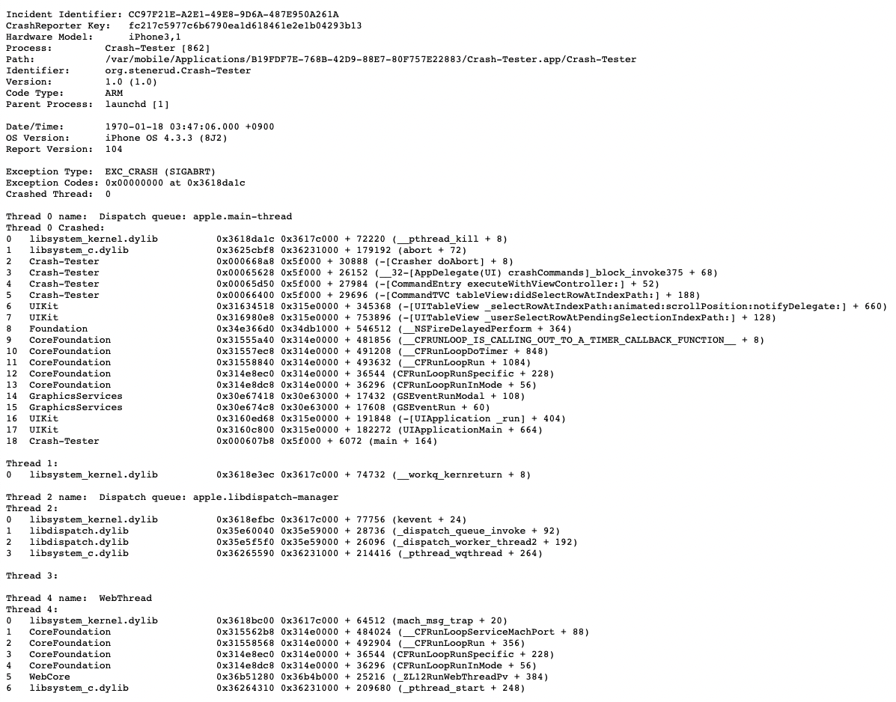
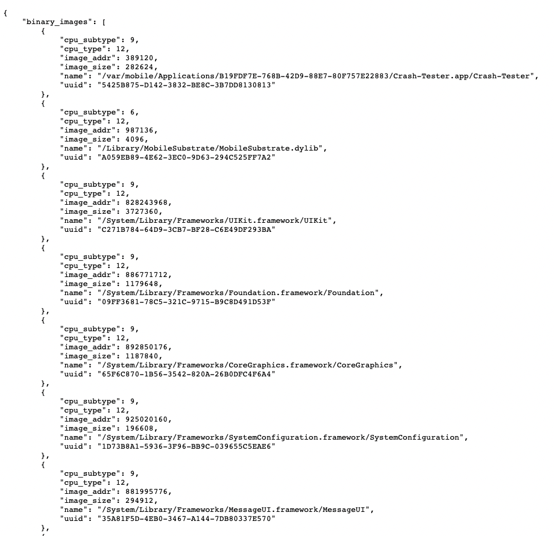
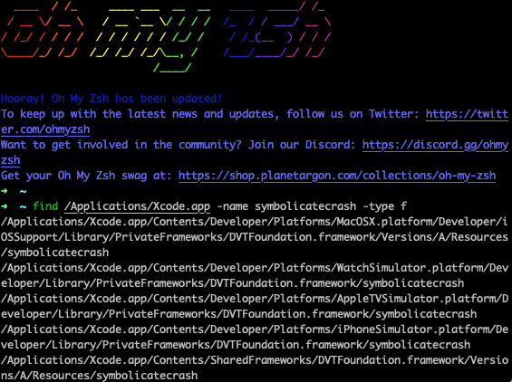
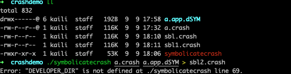

## iOS 收集 Crash Log

[toc]

每个团队对 crash 率都有一定的要求，也是开发团队的基本信誉。为了能够快速、准确的发现和定位问题，App 首先需要有崩溃日志收集方案。

常见的日志获取方式有以下几种：

1. 将崩溃设备连接到Xcode导出Crash日志，如果有符号表，则Crash日志直接被解析
2. 依赖三方应用，类似于iTools、iMazing等，可以导出Crash日志
3. 通过iTunes Connection获取，此项需要用户在客户端授权
4. 使用imobiledevice套件进行导出，这种方式在自动化测试中广泛应用
5. 使用bugly、Firebase等商业平台收集，这种方式在发布环境使用较多
6. 使用开源Crash框架收集上报，这种方式在发布环境使用较多

前4种方案在开发测试阶段非常有效，但是应用发布之后却比较无力，因为开发同学既无法获取崩溃设备，也无法保证用户授权。

方案5，当前商业平台都没有数据导出接口，所以无法获取崩溃日志。如果对数据保密要求较高也就直接pass掉了

- [Firebase](https://firebase.google.com/)
- [极光](https://docs.jiguang.cn/janalytics/guideline/intro/)
- [友盟](https://www.umeng.com/analytics)
- [Bugly](https://bugly.qq.com/docs/user-guide/instruction-manual-ios/?v=1.0.0)

方案6，使用开源Crash框架收集，可以主动获取崩溃日志。

-  [plcrashreporter](https://github.com/microsoft/plcrashreporter)

-  [KSCrash](https://github.com/kstenerud/KSCrash)


对于上述，方案6，我们展开说说😁

### 0 Mach 异常与Unix 信号

Mach 是一个XNU的微内核核心，Mach 异常是指最底层的内核级异常，被定义在 `<mach/exception_types.h>` 下。每个 thread，task，host 都有一个异常端口数组， Mach 的部分 API 暴露给了用户态，用户态的开发者可以直接通过 Mach API 设置 thread，task，host 的异常端口，来捕获 Mach 异常，抓取 Crash 事件。

所有 Mach 异常都在 host 层被`ux_exception` 转化为响应的 Unix 信号，并通过  `threadsignal` 将信号投递到错误的线程。iOS 中 的 POSIX API 就是通过 Mach 之上的 BSD 实现的。可以看出：Mach 异常处理 **先于** Unix 信号处理

因此，`EXC_BAD_ACCESS(SIGSEGV)` 表示的意思是：Mach 层的 `EXC_BAD_ACCESS` 异常，在host层被转换成 `SIGSEGV` 信号投递到出错的线程。可以通过 `signalHandler` 来捕获信号：

```c
signal(SIGSEGV, signalHandler);
```

iOS 对操作系统和用户产生的信号 (通过调用`kill`和`pthread_kill`) 也首先沉下来被转换为 Mach 异常，再转换为 Unix 信号。从而实现了机制的统一


#### 0.1 名称解释

##### 0.1.1 陷阱

> 计算机有两种运行模式：用户态， 内核态。 其中操作系统运行在内核态，在内核态中，操作系统具有对所有硬件的完全访问权限，可以使机器运行任何指令；相反，用户程序运行在用户态，在用户态下，软件只能使用少数指令，它们并不具备直接访问硬件的权限。

问题来了：假如软件需要访问硬件或者需要调用内核中的函数该怎么办呢？

这就是陷阱的作用了。陷阱指令可以使执行流程从用户态陷入内核（这也就是为什么叫做陷阱，而不是捕猎的陷阱）并把控制权转移给操作系统，使得用户程序可以调用内核函数和使用硬件从而获得操作系统所提供的服务，比如用视频软件放一个电影，视频软件就发出陷阱使用显示器和声卡从而访问硬件。

操作系统有很多系统调用接口供用程序调用。陷阱的发生时间是固定的，比如第一次用视频软件时，在加载视频时软件会向操作系统发送陷阱指令，第二次播放时，软件仍然会在同样的时刻发送陷阱指令。这一点是和中断的明显的差别之一。下面介绍中断。

##### 0.1.2 中断

> 中断是由外部事件导致并且它发生的时间是不可预测的，这一点和陷阱不同。外部事件主要是指时钟中断，硬件中断等。由于CPU一次只能运行一条指令，所以在一个时刻只能有一个程序运行，但我们感觉在我们的计算机中明明可以同时运行很多程序啊，这是由于CPU在多个进程之间快速切换所导致的伪并行。如果某一个程序运行了足够长用完了分配给它的时间片，CPU决定切换到另一个进程运行，就会产生一个时钟中断，切换到下一个进程运行。

硬件中断顾名思义就是由硬件引起的中断，比如一个程序需要用户输入一个数据，但用户一直没有输入，操作系统决定是一直等待用户输入还是转而运行别的进程，一般情况是转而运行别的进程，如果用户的输入到来了，那么键盘驱动器会产生一个中断通知操作系统，操作系统保存正在运行的程序的状态，从而切换到原来的进程处理到来的数据。

**所以中断发生是随机的且主要作用是完成进程间切换，从而支持CPU和设备之间的并行。**
中断和异常的另一个重要差别是，CPU处理中断的过程中会屏蔽中断，不接受新的中断直到此次中断处理结束。而陷阱的发生并不屏蔽中断，可以接受新的中断。

##### 0.1.3 异常

> 异常就是程序执行过程中的异常行为。

比如除零异常，缓冲区溢出异常等。不同的操作系统定义了不同种类和数量的异常并且每个异常都有一个唯一的异常号，异常会扰乱程序的正常执行流程，所以异常是在CPU执行指令时本身出现的问题，比如除数为零而出现的除零异常。异常的产生表示程序设计不合理，所以在编程的时候要尽量避免异常的产生。


### 1 KSCrash

KSCrash 是 iOS 平台最强大的崩溃收集开源库之一，支持多设备的崩溃收集(Mac\iPhone\Apple Watch\TV)。KSCrash 不能在 debugger 模式下收集 crash，测试时需要使用真机并且是在非 debugger 模式下运行 App。

#### 1.1 KSCrash 能够收集的异常

- Mach kernel exceptions (Mach内核异常)
- Fatal signals (signals异常)
- C++ exceptions (C++ 异常)
- Objective-C exceptions (Objective-C 异常)
- Main thread deadlock (experimental) (主线程死锁，实验性质)
- Custom crashes (e.g. from scripting languages)


#### 1.2 KSCrash 崩溃处理机制

##### 1.2.1 Mach 异常处理

先创建一个异常处理端口，为该端口申请权限，再设置异常端口，新建一个内核线程，在该线程内循环等待异常。但是为了防止自己注册的 Mach 异常处理抢占了其他 SDK、或者业务线开发者设置的逻辑，我们需要在最开始保存其他的异常处理端口，等逻辑执行完后将异常处理交给其他的端口内的逻辑处理。



 ##### 1.2.2 Signal 异常处理

对于 mach 异常，操作系统会将其转换为对应的 Unix 信号，所以开发者可以通过注册 signalHandler 的方式来处理。

##### 1.2.3 C++ 异常处理

依靠标准库的`std::set_terminate(CPPExceptionTerminate)` 函数，设置 `CPPException Terminate`为C++ exceptions 的异常处理函数进行捕捉。

##### 1.2.4 Objective-C 异常处理

对于 OC 层面的 `NSException` 异常处理较为容易，可以通过注册 `NSUncaughtExceptionHandler` 来捕获异常信息，通过 `NSException` 参数来做 Crash 信息的收集。某个` NSException` 导致程序 Crash 的，只有拿到这个 `NSException`，获取它的`reason`，`name`，`callStackSymbols`信息才能确定出问题的程序位置。


#### 1.3 KSCrash 日志的生成与保存

App 产生异常崩溃时，KSCrash 会将异常信息经过包装交给` kscm_handleException() `函数处理，格式化为 `json `格式的文件并写入App 沙盒目录。当 App 下次启动后，就可以读取存储的 crash 文件，然后处理数据并上传。

##### 1.3.1 KSCrash 日志格式

日志格式分为 *Apple-Style* 和 *JSON-Style* [Example-Reports](https://github.com/kstenerud/KSCrash/blob/master/Example-Reports/_README.md)

 *Apple-Style* 方便开发者查看调用栈



 *JSON-Style* 方便后台服务器存储




#### 1.4 KSCrash 的使用

KSCrash 崩溃日志提交方式有以下几种：

- Standard (标准方式，即上传自己的服务器)
- Email (通过邮件发送)
- Hockey (上传 Hockey 平台)
- QuincyKit (上传 QuincyKit 平台)
- Victory (上传 Victory 平台)

一般来说只使用 Standard、Email 这两种方式，或者自定义一种方式。

##### 1.4.1 自定义一个 KSCrashInstallation

1 创建一个 `KSCrashInstallation` 的子类 `TestCrashInstallation`，子类中使用自定义的 `TestCrashReporterSink `来返回对应的数据处理。

```objective-c
@interface TestCrashInstallation : KSCrashInstallation
 
@property (nonatomic, readwrite, strong) NSURL *url;
 
+ (instancetype)sharedInstance;
 
@end
 
 
#import "TestCrashInstallation.h"
#import <KSCrash/KSCrashInstallation+Private.h>
#import "TestCrashReporterSink.h"
 
@implementation TestCrashInstallation
 
+ (instancetype)sharedInstance {
    static TestCrashInstallation *sharedInstance = nil;
    static dispatch_once_t onceToken;
    dispatch_once(&onceToken, ^{
        sharedInstance = [[TestCrashInstallation alloc] init];
    });
    return sharedInstance;
}
 
- (id)init {
    return [super initWithRequiredProperties: nil];
}
 
- (id<KSCrashReportFilter>)sink {
    TestCrashReporterSink *sink = [[TestCrashReporterSink alloc] initWithURL:self.url];
    return [sink defaultCrashReportFilterSetAppleFmt];
//    return [sink defaultCrashReportFilterSet];
}
 
@end

```


2 创建 `TestCrashReporterSink` 类，继承于 `NSObject`，并且遵循 `KSCrashReportFilter` 协议。

```objective-c
@interface TestCrashReporterSink : NSObject<KSCrashReportFilter>
 
- (id)initWithURL:(NSURL *)url;
 
- (id<KSCrashReportFilter>)defaultCrashReportFilterSet;
- (id<KSCrashReportFilter>)defaultCrashReportFilterSetAppleFmt;
 
@end
 
 
#import "TestCrashReporterSink.h"
#import <KSCrash/KSCrashReportFilterBasic.h>
#import <KSCrash/KSCrashReportFilterAppleFmt.h>
#import <KSCrash/KSCrashReportFilterJSON.h>
#import <KSCrash/KSCrashReportFilterGZip.h>
#import <KSCrash/KSHTTPMultipartPostBody.h>
#import <KSCrash/KSHTTPRequestSender.h>
#import <KSCrash/KSReachabilityKSCrash.h>
 
@interface TestCrashReporterSink ()
 
@property (nonatomic, strong) NSURL *url;
@property (nonatomic, strong) KSReachableOperationKSCrash *reachableOperation;
 
@end
 
@implementation TestCrashReporterSink
 
- (id)initWithURL:(NSURL *)url {
    if (self = [super init]) {
        self.url = url;
    }
    return self;
}
 
/// 返回 JSON-Style 格式日志
- (id<KSCrashReportFilter>)defaultCrashReportFilterSet {
    return [KSCrashReportFilterPipeline filterWithFilters:
            [KSCrashReportFilterJSONEncode filterWithOptions:KSJSONEncodeOptionSorted | KSJSONEncodeOptionPretty],
            [KSCrashReportFilterGZipCompress filterWithCompressionLevel:-1],
            self,
            nil];
}
 
/// 返回 Apple-Style 格式日志
- (id<KSCrashReportFilter>)defaultCrashReportFilterSetAppleFmt {
    return [KSCrashReportFilterPipeline filterWithFilters:
            [KSCrashReportFilterAppleFmt filterWithReportStyle:KSAppleReportStyleSymbolicatedSideBySide],
            [KSCrashReportFilterStringToData filter],
            [KSCrashReportFilterGZipCompress filterWithCompressionLevel:-1],
            self,
            nil];
}
 
/// 对崩溃报告的最终处理，这里使用发送到服务器的方式
- (void)filterReports:(NSArray *)reports onCompletion:(KSCrashReportFilterCompletion)onCompletion {
    NSError *error = nil;
    NSMutableURLRequest *request = [NSMutableURLRequest requestWithURL:self.url
                                                           cachePolicy:NSURLRequestReloadIgnoringLocalCacheData
                                                       timeoutInterval:15];
    KSHTTPMultipartPostBody *body = [KSHTTPMultipartPostBody body];
    NSData *jsonData = [KSJSONCodec encode:reports
                                   options:KSJSONEncodeOptionSorted
                                     error:&error];
    if(jsonData == nil) {
        kscrash_callCompletion(onCompletion, reports, NO, error);
        return;
    }
 
    [body appendData:jsonData
                name:@"reports"
         contentType:@"application/json"
            filename:@"reports.json"];
 
    request.HTTPMethod = @"POST";
    request.HTTPBody = [body data];
    [request setValue:body.contentType forHTTPHeaderField:@"Content-Type"];
    [request setValue:@"KSCrashReporter" forHTTPHeaderField:@"User-Agent"];
 
    self.reachableOperation = [KSReachableOperationKSCrash operationWithHost:[self.url host] allowWWAN:YES block:^{
 
        [[KSHTTPRequestSender sender] sendRequest:request onSuccess:^(NSHTTPURLResponse *response, NSData *data) {
            // 日志处理结束后，一定要记得使用 kscrash_callCompletion 做回调。
            kscrash_callCompletion(onCompletion, reports, YES, nil);
 
        } onFailure:^(NSHTTPURLResponse *response, NSData *data) {
 
            NSString *message = [[NSString alloc] initWithData:data encoding:NSUTF8StringEncoding];
            NSError *error = [NSError errorWithDomain:[[self class] description] code:response.statusCode userInfo:[NSDictionary dictionaryWithObject:message forKey:NSLocalizedDescriptionKey]];
 
            kscrash_callCompletion(onCompletion, reports, NO, error);
 
        } onError:^(NSError *error2) {
 
            kscrash_callCompletion(onCompletion, reports, NO, error2);
        }];
 
    }];
}
 
@end
```


在 `TestCrashReporterSink` 中涉及到了 `KSCrashReportFilterPipeline` 、`KSCrashReportFilterJSONEncode`、`KSCrashReportFilterAppleFmt`、`KSCrashReportFilterStringToData`、`KSCrashReportFilterGZipCompress` 这几个类，在这里做下说明:

1. `KSCrashReportFilterJSONEncode`、`KSCrashReportFilterAppleFmt`、`KSCrashReportFilterStringToData`、`KSCrashReportFilterGZipCompress`，包括 `TestCrashReporterSink` 在内，都遵循了 `KSCrashReportFilter` 协议，实现了 **-** **`(void)filterReports:(NSArray *)reports onCompletion:(KSCrashReportFilterCompletion)onCompletion`** 方法，对 report 做了对应的处理。

   根据类名也能看处理方式有 json 格式化、apple 堆栈格式化、字符串转数据格式、数据压缩。

   

2. `KSCrashReportFilterPipeline` 这个类是对上述一系列 report 处理方式做流水线化，根据不同的处理方式以及对应处理顺序对 report 进行多次加工。以 `defaultCrashReportFilterSetAppleFmt` 中的 `KSCrashReportFilterPipeline` 为例，处理顺序是` KSCrashReportFilterAppleFmt`、`KSCrashReportFilterStringToData`、`KSCrashReportFilterGZipCompress`，`self(TestCrashReporterSink)`。

   具体过程是这样的，report 在内存中最初是以 `NSDictionary` 类型存储的，通过 `KSCrashReportFilterAppleFmt` 处理变成了记录堆栈信息的 `NSString` 类型，然后通过 `KSCrashReportFilterStringToData` 处理转成 `NSData` 类型的数据，再通过 `KSCrashReportFilterGZipCompress` 对数据进行压缩，最后通过 `TestCrashReporterSink` 发送到服务器。

根据上述逻辑，我们可以通过自定义一个类似 `KSCrashReportFilterAppleFmt` 的类来对 report 做自定义的中间处理，最后再通过 `TestCrashReporterSink` 发送。


3 在 Appdelegate 中使用

```objective-c
- (void)installCrashHandler {
    KSCrashInstallation *installation = [self makeCustomInstallation];
    [installation install];
 
    [KSCrash sharedInstance].deleteBehaviorAfterSendAll = KSCDeleteNever;
    [KSCrash sharedInstance].printPreviousLog = YES;
    /// 发送崩溃日志
    [installation sendAllReportsWithCompletion:^(NSArray* reports, BOOL completed, NSError* error) {
        if(completed) {
            NSLog(@"Sent %d reports", (int)[reports count]);
 
        }else {
            NSLog(@"Failed to send reports: %@", error);
        }
    }];
}
```


#### 1.5 KSCrash 日志本地缓存机制

##### 1.5.1 写入本地缓存

KSCrash 在捕获到崩溃信息后，会触发 `kscm_setEventCallback(onCrash)` 调用，然后在 `onCrash` 函数中对日志进行本地缓存处理，如下：

```c
static void onCrash(struct KSCrash_MonitorContext* monitorContext)
{
    KSLOG_DEBUG("Updating application state to note crash.");
    kscrashstate_notifyAppCrash();
    monitorContext->consoleLogPath = g_shouldAddConsoleLogToReport ? g_consoleLogPath : NULL;
 
    // 正在处理 crash 的时候，发生了再次 crash
    if(monitorContext->crashedDuringCrashHandling)
    {
        kscrashreport_writeRecrashReport(monitorContext, g_lastCrashReportFilePath);
    }
    else
    {
        // 1. 先根据当前时间创建新的 crash 的文件路径
        char crashReportFilePath[KSFU_MAX_PATH_LENGTH];
        kscrs_getNextCrashReportPath(crashReportFilePath);
        // 2. 将新生成的文件路径保存到 g_lastCrashReportFilePath
        strncpy(g_lastCrashReportFilePath, crashReportFilePath, sizeof(g_lastCrashReportFilePath));
        // 3. 将新生成的文件路径传入函数进行 crash 写入
        kscrashreport_writeStandardReport(monitorContext, crashReportFilePath);
    }
}
```

其中缓存文件路径 `crashReportFilePath` 包含了 `g_reportsPath`、`g_appName`、`id` 三部分。

- `g_reportsPath `：缓存文件夹路径，可以通过 KSCrash 的 `- (id) initWithBasePath:(NSString *)basePath` 初始化方法配置，默认的缓存路径为` ~/Library/Caches/KSCrash/(App 的名称)/Reports`
- `g_appName `：App 的名称，在这里是用来拼接日志的文件名，文件名格式为` (g_appName)-report-(id).json` 
- `id `：日志唯一 ID 标识，根据时间戳生成的

**完整路径示例：`~/Library/Caches/KSCrash/CrashTest/Reports/CrashTest-report-11747667b9844400.json`**


##### 1.5.2 清除本地缓存

在 KSCrash 中以下几种缓存清除方式：

**自动清除**：KSCrash 在每次初始化的时候会检测本地缓存的 reports 个数是否超出最大值，当超出最大值时，会调用 `kscrs_deleteReportWithID()` 函数自动清除超出个数的旧的崩溃日志。最大值默认为 5，可以通过 `maxReportCount `属性进行自定义设置。

```c
void kscrs_initialize(const char* appName, const char* reportsPath)
{
    pthread_mutex_lock(&g_mutex);
    g_appName = strdup(appName);
    g_reportsPath = strdup(reportsPath);
    ksfu_makePath(reportsPath);
    pruneReports();
    initializeIDs();
    pthread_mutex_unlock(&g_mutex);
}
 
static void pruneReports()
{
    int reportCount = getReportCount();
    if(reportCount > g_maxReportCount)
    {
        int64_t reportIDs[reportCount];
        reportCount = getReportIDs(reportIDs, reportCount);
         
        for(int i = 0; i < reportCount - g_maxReportCount; i++)
        {
            kscrs_deleteReportWithID(reportIDs[i]);
        }
    }
}
```

**日志发送后清除：**KSCrash 可以设置 `sendAllReportsWithCompletion：`方法调用之后是否删除日志缓存，通过 `deleteBehaviorAfterSendAll` 属性来配置，有 `KSCDeleteNever`，`KSCDeleteOnSucess`，`KSCDeleteAlways `三种，默认值为 `KSCDeleteAlways`。

```objective-c
- (void)sendAllReportsWithCompletion:(KSCrashReportFilterCompletion)onCompletion {
    NSArray* reports = [self allReports];
     
    KSLOG_INFO(@"Sending %d crash reports", [reports count]);
     
    [self sendReports:reports
         onCompletion:^(NSArray* filteredReports, BOOL completed, NSError* error)
     {
         KSLOG_DEBUG(@"Process finished with completion: %d", completed);
         if(error != nil)
         {
             KSLOG_ERROR(@"Failed to send reports: %@", error);
         }
         // KSCDeleteNever ：永不删除，当你准备自己管理 reports 的时候使用。
         // KSCDeleteOnSucess ：发送成功后删除。
         // KSCDeleteAlways ：总是删除，不论发送成功与否都会删除。
         if((self.deleteBehaviorAfterSendAll == KSCDeleteOnSucess && completed) ||
            self.deleteBehaviorAfterSendAll == KSCDeleteAlways)
         {
             kscrash_deleteAllReports();
         }
         kscrash_callCompletion(onCompletion, filteredReports, completed, error);
     }];
}
```

**手动清除**：KSCrash 提供了2个方法，可以用来手动删除 reports 的本地缓存。

```objective-c
/// 删除所有本地缓存的 report
- (void)deleteAllReports;
 
/// 删除指定的 ID 的本地缓存 report
/// @param reportID report 的 ID
- (void)deleteReportWithID:(NSNumber*) reportID;
```


对应的C函数调用：

```c
void kscrs_deleteAllReports()
{
    // 加锁
    pthread_mutex_lock(&g_mutex);
    // 删除对应路径文件夹
    ksfu_deleteContentsOfPath(g_reportsPath);
    // 解锁
    pthread_mutex_unlock(&g_mutex);
}
 
void kscrs_deleteReportWithID(int64_t reportID)
{
    char path[KSCRS_MAX_PATH_LENGTH];
    // 获取文件路径
    getCrashReportPathByID(reportID, path);
    // 删除对应路径文件
    ksfu_removeFile(path, true);
}
```


##### 1.5.3 读取本地缓存

在 KSCrash 的 `- (void)sendAllReportsWithCompletion:^(NSArray* reports, BOOL completed, NSError* error) `方法中拿到的 reports 都是所有的本地缓存日志。假如我们要读取指定日志的话，可以使用以下方法：

```objective-c
/// 获取所有本地缓存 report 的 ID。
- (NSArray*)reportIDs;
 
/// 获取指定 ID 的本地缓存 report 的内容。
/// @param reportID report 的 ID
- (NSDictionary*)reportWithID:(NSNumber*) reportID;
```

**reportIDs 方法的具体实现**

```objective-c
- (NSArray*)reportIDs
{
    // 读取本地缓存 report 的个数
    int reportCount = kscrash_getReportCount();
    int64_t reportIDsC[reportCount];
    // 获取 report ID 的个数，并且将 ID 添加到 reportIDsC
    reportCount = kscrash_getReportIDs(reportIDsC, reportCount);
    NSMutableArray* reportIDs = [NSMutableArray arrayWithCapacity:(NSUInteger)reportCount];
    for(int i = 0; i < reportCount; i++)
    {
        // 取出 report ID 放到数组
        [reportIDs addObject:[NSNumber numberWithLongLong:reportIDsC[i]]];
    }
    return reportIDs;
}
```

**reportWithID: 方法的具体实现**

```objective-c
- (NSDictionary*)reportWithID:(NSNumber*) reportID {
    return [self reportWithIntID:[reportID longLongValue]];
}
 
- (NSDictionary*)reportWithIntID:(int64_t) reportID {
    // 读取本地缓存的 report 数据 data
    NSData* jsonData = [self loadCrashReportJSONWithID:reportID];
    if(jsonData == nil)
    {
        return nil;
    }
 
    NSError* error = nil;
    // 将 data 转换成 NSMutableDictionary 格式对象
    NSMutableDictionary* crashReport = [KSJSONCodec decode:jsonData
                                                   options:KSJSONDecodeOptionIgnoreNullInArray |
                                                           KSJSONDecodeOptionIgnoreNullInObject |
                                                           KSJSONDecodeOptionKeepPartialObject
                                                     error:&error];
    if(error != nil)
    {
        KSLOG_ERROR(@"Encountered error loading crash report %" PRIx64 ": %@", reportID, error);
    }
    if(crashReport == nil)
    {
        KSLOG_ERROR(@"Could not load crash report");
        return nil;
    }
    // 校验 report 格式
    [self doctorReport:crashReport];
 
    return crashReport;
}
 
 
- (NSData*)loadCrashReportJSONWithID:(int64_t) reportID
{
    // 本质上调用了 kscrash_readReport 函数去读取本地 report 文件
    char* report = kscrash_readReport(reportID);
    if(report != NULL)
    {
        return [NSData dataWithBytesNoCopy:report length:strlen(report) freeWhenDone:YES];
    }
    return nil;
}
```


#### 1.6 Crash 日志符号化

虽然 KSCrash 日志支持堆栈符号化，但是比较受限，可以对崩溃日志作进一步处理得到更精确的堆栈。

##### 1.6.1 Symbolicatecrash

symbolicatecrash 是 Xcode 自带的一个分析工具，可以通过崩溃日志和应用的 `.dSYM `文件定位发生崩溃的位置，把 crash 日志中的一堆地址替换成代码相应位置。




1 获取 dYSM 文件

  1.1 通过 Xcode -> Window -> Organize -> Archives 找到对应的 App 包

  1.2 显示包内容

  1.3 dSYMs 文件夹下 `.dYSM` 文件

2 将 symbolicatecrash 、dYSM 文件、KSCrash 生成的 .crash 日志放入同一个文件夹下

3 执行符号化指令

```sh
./symbolicatecrash ./*.crash ./*.app.dSYM > symbol.crash
```



```sh
export DEVELOPER_DIR=/Applications/XCode.app/Contents/Developer
```

> 新增环境变量：export key=value
>
> 删除环境变量：unset key
>
> 查看环境变量：env


##### 1.6.2 第三方符号化工具

第三方开源的符号化工具可以简化日志符号化的操作，下面以 [SymbolicatorX](https://github.com/Yueoaix/SymbolicatorX) 为例。Symbolicatorx 的原理是通过 `atos` 指令对日志中每一行堆栈信息做地址转化，从而实现符号化。

使用：将 `.crash` 文件和` .dSYM `文件拖入工具中，点击 Symbolicate 即可生成对应的结果文件，结果文件和 symbolicatecrash 生成的是一致的。


### 2 PLCrashreporter

PLCrashreporter 是微软开源的一个 crash 收集框架，也具有强大的 crash 收集功能。

Mach 异常 +Unix 信号方式：即使在优选捕获 Mach 异常的情况下，也放弃捕获`EXC_CRASH`异常，而选择捕获与之对应的 SIGABRT 信号。 plcrashreporter 在代码注释中给出了详细的解释：

> We still need to use signal handlers to catch SIGABRT in-process. The kernel sends an `EXC_CRASH` mach exception to denote SIGABRT termination. In that case, catching the Mach exception in-process leads to process deadlock in an uninterruptable wait. Thus, we fall back on BSD signal handlers for SIGABRT, and do not register for `EXC_CRASH`.

#### 2.1 PLCrashreporter 能够收集的异常

与 KSCrash 类似，PLCrashreporter 也能收集到各类的崩溃信息

1. Mach kernel exceptions (Mach内核异常)

2. Fatal signals (signals异常)

3. C++ exceptions (C++ 异常)

4. Objective-C exceptions (Objective-C 异常)

   ....

#### 2.2 PLCrashreporter 日志的生成与保存

##### 2.2.1 Crash 日志格式

PLCrashreporter 崩溃日志格式类似 KSCrash 的 Apple-Style，不支持 JSON-Style。


#### 2.3 PLCrashreporter 使用

`PLCrashreporter` 收集到的崩溃信息保存在沙盒的 `library-cache` 中，是一个 `plcrash` 格式的文件。`PLCrashreporter` 提供了一个` CrashViewer` 的 Mac 程序可以用来打开该文件。在集成后，也可以自己添加 `plcrash` 的解析，写成` txt` 或者 `log` 格式到本地，或者进行自定义的上报操作。

1 创建 PLCrashReporter 开启 Crash 监听

```objective-c
- (BOOL)application:(UIApplication *)application didFinishLaunchingWithOptions:(NSDictionary *)launchOptions {
    [self startCrashReporter];
    return YES;
}
 
static bool debugger_should_exit (void) {
    struct kinfo_proc info;
    size_t info_size = sizeof(info);
    int name[4];
     
    name[0] = CTL_KERN;
    name[1] = KERN_PROC;
    name[2] = KERN_PROC_PID;
    name[3] = getpid();
     
    if (sysctl(name, 4, &info, &info_size, NULL, 0) == -1) {
        NSLog(@"sysctl() failed: %s", strerror(errno));
        return false;
    }
     
    if ((info.kp_proc.p_flag & P_TRACED) != 0)
        return true;
     
    return false;
}
 
- (void)startCrashReporter {
    if (debugger_should_exit()) {
        NSLog(@"The demo crash app should be run without a debugger present. Exiting ...");
        return;
    }
     
    PLCrashReporterConfig *config = [[PLCrashReporterConfig alloc] initWithSignalHandlerType: PLCrashReporterSignalHandlerTypeMach symbolicationStrategy: PLCrashReporterSymbolicationStrategyAll];
    PLCrashReporter *crashReporter = [[PLCrashReporter alloc] initWithConfiguration:config];
    NSError *error;
    if ([crashReporter hasPendingCrashReport]) {
        [self handleCrashReport:crashReporter];
    }
     
    if (![crashReporter enableCrashReporterAndReturnError:&error]) {
        NSLog(@"Warning: Could not enable crash reporter: %@", error);
    }
}
```


> 需要注意的是，PLCrashReporter 在 XCode debugger 模式下是不生效的，会造成程序自动退出，所以通过 `debugger_should_exit `函数做拦截返回


2 自定义处理 PLCrashReporter 收集到的 CrashData

```objective-c
- (void)handleCrashReport:(PLCrashReporter *)crashReporter {
    NSData *crashData;
    NSError *error;
     
    crashData = [crashReporter loadPendingCrashReportDataAndReturnError:&error];
    if (crashData == nil) {
        NSLog(@"Could not load crash report: %@", error);
        [crashReporter purgePendingCrashReport];
        return;
    }
     
    /* CrashData 能够直接上传到服务器上，下面的代码是保存到 Document 中 */
    NSArray *docPathArray = NSSearchPathForDirectoriesInDomains(NSDocumentDirectory, NSUserDomainMask, YES);
    NSString *docPath = [docPathArray firstObject];
    NSString *path = [docPath stringByAppendingString:@"/crashdata.crash"];
    [crashData writeToFile:path atomically:YES];
     
    PLCrashReport *report = [[PLCrashReport alloc] initWithData:crashData error:&error];
    if (report == nil) {
        NSLog(@"Could not parse crash report: %@", error);
        [crashReporter purgePendingCrashReport];
        return;
    }
     
    /* CrashData 还须要用 PLCrashReporter 的工具 crashutil 解析，也能够直接保存成字符串*/
    NSString *humanReadable = [PLCrashReportTextFormatter stringValueForCrashReport:report withTextFormat:PLCrashReportTextFormatiOS];
    NSLog(@"Report: %@", humanReadable);
    NSString *path2 = [docPath stringByAppendingString:@"/humanReadable.txt"];
    [humanReadable writeToFile:path2 atomically:YES encoding:NSUTF8StringEncoding error:nil];
}
```


### 3 总结

1. KSCrash 和 PLCrashReporter 都具有强大的 crash 收集功能，能够满足 App 日常崩溃日志收集的需求。
2. KSCrash 相对于 PLCrashReporter 代码可读性更高，PLCrashReporter 在项目中是以 `CrashReporter.framework` 库存在的，无法直接查看源码。
3. KSCrash 使用更加方便，因为本身已经封装了一系列日志提交和处理方式，开发者可以直接使用。
4. KSCrash 相对于 PLCrashReporter 扩展更为方便，通过继承可以实现自己的日志处理，还可以自定义日志参数。
5. KSCrash 支持 JSON 格式的日志，对于上传服务器后台更为友好。
6. 获取到 Crash 日志之后，可以通过工具进行符号化处理，能够得到更精确的崩溃堆栈信息。
