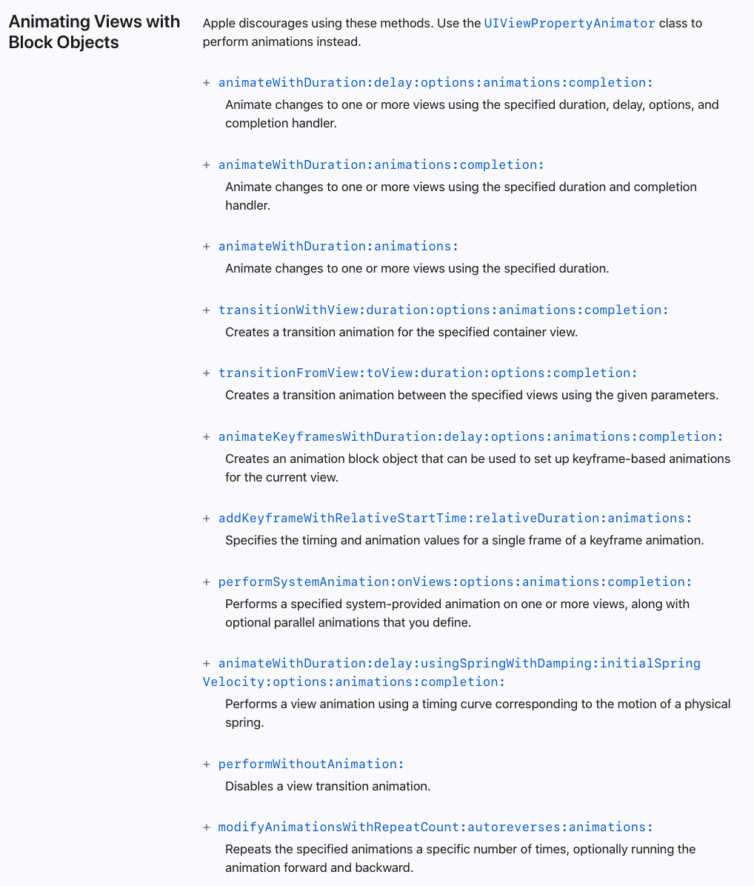
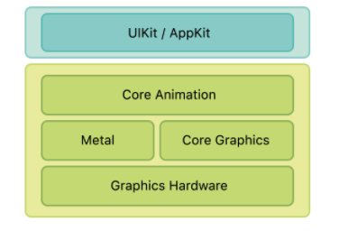
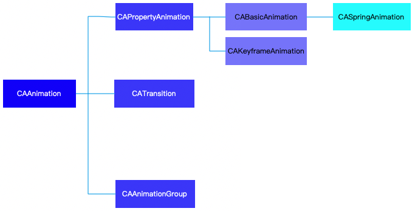
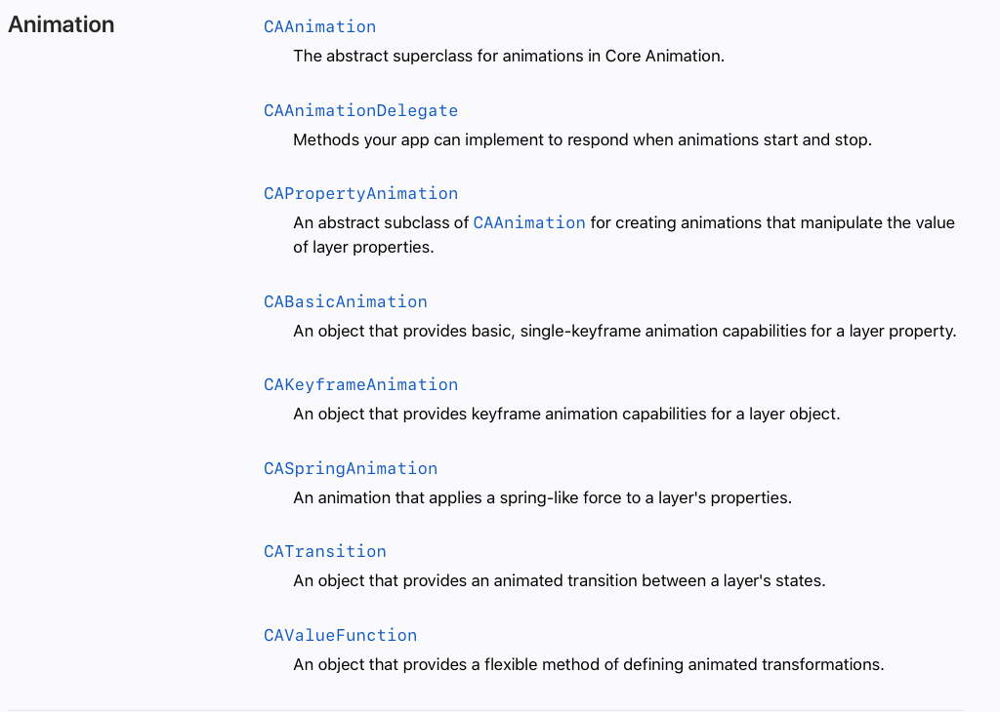

## iOS 动画相关整理

[toc]

### 1 UIView 动画

#### 1.1 UIKit提供给我们的 [动画接口](https://developer.apple.com/documentation/uikit/uiview?language=objc) 

足够的强大并且十分的灵活，足以满足我们开发中大部分的动画需求。

> **animateWithDuration:animations:completion:**
>
> Animate changes to one or more views using the specified duration and completion handler.
>
> **Parameters**
>
> - `duration`
>
>   The total duration of the animations, measured in seconds. If you specify a negative value or `0`, the changes are made without animating them.
>
> - `animations`
>
>   A block object containing the changes to commit to the views. This is where you programmatically change any animatable properties of the views in your view hierarchy. This block takes no parameters and has no return value. This parameter must not be `NULL`.
>
> - `completion`
>
>   A block object to be executed when the animation sequence ends. This block has no return value and takes a single Boolean argument that indicates whether or not the animations actually finished before the completion handler was called. If the duration of the animation is 0, this block is performed at the beginning of the next run loop cycle. This parameter may be `NULL`.
>   
>   
>   
>   **Discussion**
>   
>   This method performs the specified animations immediately using the `UIViewAnimationOptionCurveEaseInOut` and `UIViewAnimationOptionTransitionNone` animation options. 
>   
>   For example, if you want to fade a view until it is totally transparent and then remove it from your view hierarchy, you could use code similar to the following:
>   
>   ```objective-c
>   [UIView animateWithDuration:0.2 animations:^{
>     view.alpha = 0.0;
>   } completion:^(BOOL finished){ 
>     [view removeFromSuperview]; 
>   }];
>   ```
>   
>   During an animation, user interactions are temporarily disabled for the views being animated. (Prior to iOS 5, user interactions are disabled for the entire application.)




#### 1.2 可实现动画的属性

- 坐标尺寸变化

  - [bounds](https://developer.apple.com/documentation/uikit/uiview/1622580-bounds?language=objc)

    > The bounds rectangle, which describes the view’s location and size in its own coordinate system.

  - [frame](https://developer.apple.com/documentation/uikit/uiview/1622621-frame?language=objc)

    > The frame rectangle, which describes the view’s location and size in its superview’s coordinate system.

  - [center](https://developer.apple.com/documentation/uikit/uiview/1622627-center?language=objc)

    > The center point of the view's frame rectangle.

- 视图显示变化

  - [backgroundColor](https://developer.apple.com/documentation/uikit/uiview/1622591-backgroundcolor?language=objc)

    > Changes to this property can be animated. The default value is `nil`, which results in a transparent background color.

  - [alpha](https://developer.apple.com/documentation/uikit/uiview/1622417-alpha?language=objc)

    > a floating-point number in the range `0.0` to `1.0`

  - [hidden](https://developer.apple.com/documentation/uikit/uiview/1622585-hidden?language=objc)

- 视图形状变化

  - [transform](https://developer.apple.com/documentation/uikit/uiview/1622459-transform?language=objc)

    > Specifies the transform applied to the view, relative to the center of its bounds.


#### 1.3 动画参数

```objective-c
typedef NS_OPTIONS(NSUInteger, UIViewAnimationOptions) {
    UIViewAnimationOptionLayoutSubviews            = 1 <<  0,
    UIViewAnimationOptionAllowUserInteraction      = 1 <<  1, // turn on user interaction while animating
    UIViewAnimationOptionBeginFromCurrentState     = 1 <<  2, // start all views from current value, not initial value
    UIViewAnimationOptionRepeat                    = 1 <<  3, // repeat animation indefinitely
    UIViewAnimationOptionAutoreverse               = 1 <<  4, // if repeat, run animation back and forth
    UIViewAnimationOptionOverrideInheritedDuration = 1 <<  5, // ignore nested duration
    UIViewAnimationOptionOverrideInheritedCurve    = 1 <<  6, // ignore nested curve
    UIViewAnimationOptionAllowAnimatedContent      = 1 <<  7, // animate contents (applies to transitions only)
    UIViewAnimationOptionShowHideTransitionViews   = 1 <<  8, // flip to/from hidden state instead of adding/removing
    UIViewAnimationOptionOverrideInheritedOptions  = 1 <<  9, // do not inherit any options or animation type
    
    UIViewAnimationOptionCurveEaseInOut            = 0 << 16, // default
    UIViewAnimationOptionCurveEaseIn               = 1 << 16,
    UIViewAnimationOptionCurveEaseOut              = 2 << 16,
    UIViewAnimationOptionCurveLinear               = 3 << 16,
    
    UIViewAnimationOptionTransitionNone            = 0 << 20, // default
    UIViewAnimationOptionTransitionFlipFromLeft    = 1 << 20,
    UIViewAnimationOptionTransitionFlipFromRight   = 2 << 20,
    UIViewAnimationOptionTransitionCurlUp          = 3 << 20,
    UIViewAnimationOptionTransitionCurlDown        = 4 << 20,
    UIViewAnimationOptionTransitionCrossDissolve   = 5 << 20,
    UIViewAnimationOptionTransitionFlipFromTop     = 6 << 20,
    UIViewAnimationOptionTransitionFlipFromBottom  = 7 << 20,

    UIViewAnimationOptionPreferredFramesPerSecondDefault     = 0 << 24,
    UIViewAnimationOptionPreferredFramesPerSecond60          = 3 << 24,
    UIViewAnimationOptionPreferredFramesPerSecond30          = 7 << 24,
    
} API_AVAILABLE(ios(4.0));
```


#### 1.4 弹簧动画

> **animateWithDuration:delay:usingSpringWithDamping:initialSpringVelocity:options:animations:completion:**
>
> Performs a view animation using a timing curve corresponding to the motion of a physical spring.
>
> **Parameters**
>
> - `duration`
>
>   The total duration of the animations, measured in seconds. If you specify a negative value or `0`, the changes are made without animating them.
>
> - `delay`
>
>   The amount of time (measured in seconds) to wait before beginning the animations. Specify a value of `0` to begin the animations immediately.
>
> - `dampingRatio` （阻尼系数）
>
>   The damping ratio for the spring animation as it approaches its quiescent state.To smoothly decelerate the animation without oscillation, use a value of `1`. Employ a damping ratio closer to zero to increase oscillation.
>
> - `velocity` （间接指定弹簧的初始速度）
>
>   The initial spring velocity. For smooth start to the animation, match this value to the view’s velocity as it was prior to attachment.A value of `1` corresponds to the total animation distance traversed in one second. For example, if the total animation distance is 200 points and you want the start of the animation to match a view velocity of 100 pt/s, use a value of `0.5`.
>
> - `options`
>
>   A mask of options indicating how you want to perform the animations. For a list of valid constants, see [`UIViewAnimationOptions`](https://developer.apple.com/documentation/uikit/uiviewanimationoptions?language=objc).
>
> - `animations`
>
>   A block object containing the changes to commit to the views. This is where you programmatically change any animatable properties of the views in your view hierarchy. This block takes no parameters and has no return value. This parameter must not be `NULL`.
>
> - `completion`
>
>   A block object to be executed when the animation sequence ends. This block has no return value and takes a single Boolean argument that indicates whether or not the animations actually finished before the completion handler was called. If the duration of the animation is 0, this block is performed at the beginning of the next run loop cycle. This parameter may be `NULL`.


```objective-c
UIView.animateWithDuration(0.3, delay: 0.0, usingSpringWithDamping: 0.6, initialSpringVelocity: 0.0, options: .AllowUserInteraction, animations: {
    self.testButton.center.y += 10
}, completion: nil)
```


### 2 Core Animation

> [About Core Animation](https://developer.apple.com/library/archive/documentation/Cocoa/Conceptual/CoreAnimation_guide/Introduction/Introduction.html)
>
> Core Animation is a graphics rendering and animation infrastructure available on both iOS and OS X that you use to animate the views and other visual elements of your app. With Core Animation, most of the work required to draw each frame of an animation is done for you. All you have to do is configure a few animation parameters (such as the start and end points) and tell Core Animation to start. Core Animation does the rest, handing most of the actual drawing work off to the onboard graphics hardware to accelerate the rendering. This automatic graphics acceleration results in high frame rates and smooth animations without burdening the CPU and slowing down your app.
>
> If you are writing iOS apps, you are using Core Animation whether you know it or not. And if you are writing OS X apps, you can take advantage of Core Animation with extremely little effort. Core Animation sits beneath AppKit and UIKit and is integrated tightly into the view workflows of Cocoa and Cocoa Touch. Of course, Core Animation also has interfaces that extend the capabilities exposed by your app’s views and give you more fine-grained control over your app’s animations.



[Core Animation](https://developer.apple.com/documentation/quartzcore?language=objc)






#### 整理的不错的博客: [iOS动画专题·UIView二维形变动画与CAAnimation核心动画（transform动画，基础，关键帧，组动画，路径动画，贝塞尔曲线）](https://juejin.cn/post/6844903630663843847#heading-28)
