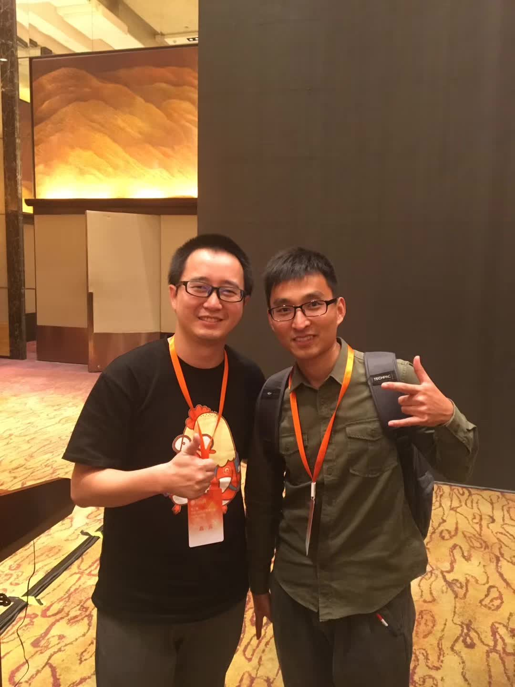
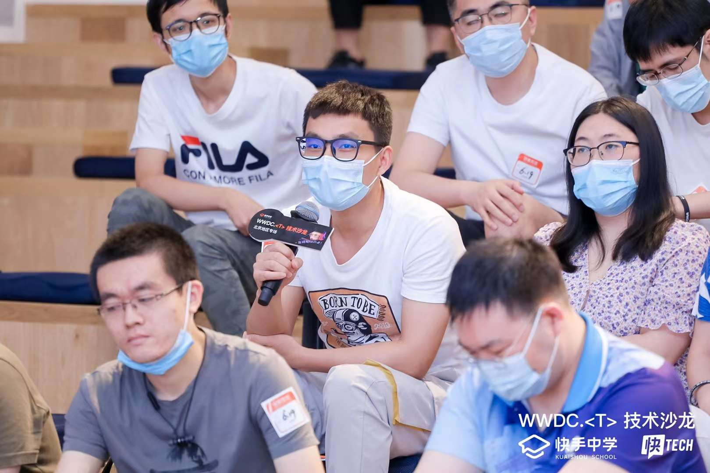

## 参加线下技术活动我学到了什么？

[toc]

我经常参加线下技术沙龙，有时候会写一些记录性的文章比如：

<table>
   <tr>
      <td>主题</td>
      <td>文章</td>
      <td>备注</td>
   </tr>
   <tr>
      <td rowspan="6">分享</td>
  	 <td><a href="./articles/2019/2019-6-小课堂.md">2019年小课堂</a></td>
    <td>✅</td>
   </tr>
   <tr>
  	 <td><a href="./articles/2018/2018-12-技术沙龙1.md">2018年技术沙龙part1</a></td>
    <td>✅</td>
   </tr>
   <tr>
  	 <td><a href="./articles/2018/2018-12-技术沙龙2.md">2018年技术沙龙part2</a></td>
    <td>✅</td>
   </tr>
   <tr>
  	 <td><a href="./articles/2018/2018-12-技术沙龙3.md">2018年技术沙龙part3</a></td>
    <td>✅</td>
   </tr>
   <tr>
  	 <td><a href="./articles/2021/2021-02-07-云.md">听了一场后端服务架构技术分享</a></td>
    <td>✅</td>
   </tr>
   <tr>
      <td><a href="./articles/2017/2017-12-29-老板讲互联网思维.md">老板讲互联网思维</a></td>
      <td>✅</td>
   </tr>
</table>

来一张照片😜😜😜

**一个技术活动本身的内容之外，参加线下技术活动（技术沙龙、技术大会等）可以说是一个非常好的社交机会！这应该是比较打的附加价值。**当然一点儿内容没有，纯搞基的就差点儿意思了。。。

下面我们就从一个好的技术活动应该具备的要素和我们应该或者可以从这次活动中体验到什么乐趣、get 到什么新颖的点子

### 一个好的技术活动

#### 内容优秀干货满满

这里说的干货满满，不仅仅指直接上代码 live coding 之类的，而是说分享者可以通过自身的实践和成果来分享他的成功或者失败的：

- 案例和方案：
  - 成功案例，优秀的方案
  - 失败案例，如何规避
- 观点和看法
  - 新的思考、看法
  - 深的思考、观点
- 知识和方法
  - 基础知识的夯实
  - 创新知识的分享
  - 新知识的传教

注意：

- **分享本身就带着极强的主观性，所以参会者务必要有自己的思考**
- 不要忽视分享者的表情和表述细节，这也是线下技术活动的魅力之一
- 带着自己的思考，不要打断别人，都会有Q&A环节的

#### 周边丰富且体验良好

一个宽敞明亮的会议室，起码可以让人不那么拘束。

现场的屏幕、话筒、灯光、座位等等这些是一些基础的会务，我今年参加快手的技术嘉年华的时候，还有漂亮小姐姐给你发矿泉水、零食以及公司周边等等让人感觉非常的人性化。

会上还放了一段国外分享者的视频，带字幕让我觉得很友好😁

Q&A 环节会赠送一些书籍之类的小礼物作为奖励，这也让问答环节非常的活跃！大家最好不要忽视这个环节，不管你是看热闹还是真的在思考，都会让你有意想不到的收获😏

---

除了上边说的快手，像美团、京东、华为等的技术活动体验也都很棒

而且，分享者在结尾一般都会发一个招聘信息，希望志同道合的小伙伴加入，收尾的招聘可以说已经深入人心里，哈哈哈

#### 志趣相投者线下面基

说道志趣相投，会议本身就是筛选。会把本在五湖四海的技术追求差不多的人拢到一起。所以，大家不要害羞，主动认识更多的人就是技术活动的价值之一。所以 QA 和 茶歇是非常宝贵的交流机会，不管是观点碰撞还是单纯的扯淡胡侃，一边聊技术一边交朋友岂不快哉！

当然，现在会后，一般会给视频观看地址和去掉敏感信息的 PPT。你可以不出门就享受这场技术干货。但是就像我上边说的，不出门永远无法体验到现场的氛围。就像你听MP3无法和看演唱会相比一样，线下的技术活动非常的精彩！

### 学到了什么？

**短时间的、高度集中的、沉浸式的、知识和观点的灌输，活动现场上的诸多细节。**如此高密度的场景，注定了你不可能全盘吸收，更不要奢望通过一场技术活动就可以变成技术大牛，多思考，多积累，量变到质变。

还是要重复一下，分享者分享本身就是非常主观的行为，所以，还是要有自己的思考。而且，参加什么样的技术活动，在参加之前一定是你筛选过的，自己的意愿参加的，那尽情享受就好。