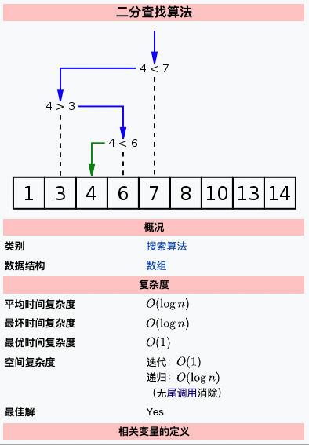

## 二分

> 下图来源于[维基百科 二分查找算法](https://zh.wikipedia.org/wiki/%E4%BA%8C%E5%88%86%E6%90%9C%E5%B0%8B%E6%BC%94%E7%AE%97%E6%B3%95)



### 1 查找一个数

算法描述：

- 先从数组的中间元素开始，如果中间元素正好是要查找的元素，则搜索过程结束；
- 如果目标元素大于中间元素，那么数组中小于中间元素的值都可以排除（由于数组有序，那么相当于是可以排除数组左侧的所有值），**解空间可以收缩为 [mid+1, right]。**
- 如果目标元素小于中间元素，那么数组中大于中间元素的值都可以排除（由于数组有序，那么相当于是可以排除数组右侧的所有值），**解空间可以收缩为 [left, mid - 1]。**
- 如果在某一步骤解空间为空，则代表找不到。

#### 1.1 典型的二分查找

```c++
int binarySearch(vector<int>& nums, int target){
  if(nums.size() == 0)
    return -1;

  int left = 0, right = nums.size() - 1;
  // 由于定义的搜索区间为 [left, right]，因此当 left <= right 的时候，搜索区间都不为空，此时我们都需要继续搜索。 也就是说终止搜索条件应该为 left <= right。
  while(left <= right){
    int mid = left + ((right - left) >> 1);
    if(nums[mid] == target){ return mid; }
    // 搜索区间变为 [mid+1, right]
    else if(nums[mid] < target)
	left = mid + 1;
    // 搜索区间变为 [left, mid - 1]
    else
	right = mid - 1;
  }
  return -1;
}
```


```swift
func binarySearch(nums: [Int]?, target: Int) -> Int {
  guard let nums = nums, nums.count>0 else { return -1 }
  var left = 0, right = nums.count - 1
  while left<=right {
    let mid = left + ((right-left) >> 1)
    if nums[mid] == target {
      return mid
    } else if (nums[mid] < target) {
      left = mid + 1
    } else {
      right = mid - 1
    }
  }
  return -1
}
```


平均时间复杂度：O(logN)

最坏时间复杂度：O(logN)

空间复杂度：

- 迭代：O(1)

- 递归：O(logN) （无尾递归消除）

  - 尾调用原则上都可以通过简化函数「调用栈」的结构而获得性能优化（称为“尾调用消除”），但是优化尾调用是否方便可行取决于运行环境对此类优化的支持程度如何。

    ```swift
    // 计算1-N的累加值（尾递归）
    func sumn(n: Int, sum: Int) -> Int {
      if n<=1 {
        return sum
      }
      return sumn(n: n-1, sum: sum+n)
    }
    print(sumn(n: 5, sum: 1))
    ```

    

#### 1.2 寻找最左边的满足条件的值

- 首先定义搜索区间为 [left, right]。
- 终止搜索条件为 left <= right。
- 循环体内，我们不断计算 mid ，并将 nums[mid] 与 目标值比对。
  - *如果 nums[mid] 等于目标值， 则收缩右边界，我们找到了一个备胎，继续看看左边还有没有*
  - 如果 nums[mid] 小于目标值， 说明目标值在 mid 右侧，这个时候搜索区间可缩小为 [mid + 1, right]
  - 如果 nums[mid] 大于目标值， 说明目标值在 mid 左侧，这个时候搜索区间可缩小为 [left, mid - 1]
- 由于不会提前返回，因此我们需要检查最终的 left，看 nums[left]是否等于 target。
  - 如果不等于 target，或者 left 出了右边边界了，说明至死都没有找到一个备胎，则返回 -1.
  - 否则返回 left 即可，备胎转正。

```c++
int binarySearchLeft(vector<int>& nums, int target) {
  int left = 0, right = nums.size() - 1;
  while (left <= right) {
    int mid = left + ((right - left) >> 1);
    if (nums[mid] >= target) {
      // [left, mid-1]
      right = mid - 1;
    }
    if (nums[mid] < target) {
      // [mid+1, right]
      left = mid + 1;
    }
  }
  // 如果不等于 target，或者 left 出了右边边界了，说明至死都没有找到一个备胎，则返回 -1.
  if (left >= nums.size() || nums[left] != target) {
    return -1;
  }
  return left;
}
```

```swift
func binarySearchLeft(nums: [Int]?, target: Int) -> Int {
  guard let nums = nums, nums.count>0 else { return -1 }
  var left = 0, right = nums.count - 1
  while left <= right {
    let mid = left + ((right-left) >> 1)
    if nums[mid] >= target {
      right = mid - 1
    }
    if nums[mid] < target {
      left = mid + 1
    }            
  }
  if left >= nums.count || nums[left] != target {
    return -1
  }

  return left
}
```


#### 1.3 寻找最右边的满足条件的值

- 首先定义搜索区间为 [left, right]。
- 终止搜索条件为 left <= right。

- 循环体内，我们不断计算 mid ，并将 nums[mid] 与 目标值比对。
  - 如果 nums[mid] 等于目标值， 则收缩左边界，我们找到了一个备胎，继续看看右边还有没有
  - 如果 nums[mid] 小于目标值， 说明目标值在 mid 右侧，这个时候搜索区间可缩小为 [mid + 1, right]
  - 如果 nums[mid] 大于目标值， 说明目标值在 mid 左侧，这个时候搜索区间可缩小为 [left, mid - 1]
- 由于不会提前返回，因此我们需要检查最终的 right，看 nums[right]是否等于 target。
  - 如果不等于 target，或者 right 出了左边边界了，说明至死都没有找到一个备胎，则返回 -1.
  - 否则返回 right 即可，备胎转正。

```c++
int binarySearchRight(vector<int>& nums, int target) {
	  // 搜索区间为 [left, right]
    int left = 0, right = nums.size() - 1;
    while (left <= right) {
        int mid = left + ((right - left) >> 1);
         if (nums[mid] <= target) {
            // 收缩左边界，搜索区间变为 [mid+1, right]
            left = mid + 1;
        }
        if (nums[mid] > target) {
			      // 搜索区间变为 [left, mid-1]
            right = mid - 1;
        }
    }
    // 检查是否越界
    if (right < 0 || nums[right] != target)
        return -1;
    return right;
}
```

```swift
func binarySearchRight(nums: [Int]?, target: Int) -> Int {
  guard let nums = nums, nums.count>0 else { return -1 }
  var left = 0, right = nums.count - 1
  while left <= right {
    let mid = left + ((right-left) >> 1)
    if nums[mid] <= target {
      left = mid + 1
    }
    if nums[mid] > target {
      right = mid - 1
    }          
  }
  if right < 0 || nums[right] != target {
    return -1
  }

  return right
}
```


### 2 最左or最右 插入

如果你将**寻找最左插入位置**看成是**寻找最左满足**大于等于 x 的值，那就可以和前面的知识产生联系，使得代码更加统一。

上述寻找满足条件的值。如果找不到，就返回 -1。那如果不是返回 -1，而是返回应该插入的位置，使得插入之后列表仍然有序呢？

比如一个数组 nums: [1,3,4]，target 是 2。我们应该将其插入（注意不是真的插入）的位置是索引 1 的位置，即 [1,**2**,3,4]。因此`寻找最左插入位置`应该返回 1。

另外如果有多个满足条件的值，我们返回最左侧的。 比如一个数组 nums: [1,2,2,2,3,4]，target 是 2，我们应该插入的位置是 1。

#### 2.1 寻找最左插入位置

- 首先定义解空间为 [left, right]，注意是左右都闭合。

- 由于我们定义的解空间为 [left, right]，因此当 left <= right 的时候，解空间都不为空。 也就是说我们的终止搜索条件为 left <= right。
- 当 nums[mid] >= target，说明找到一个备胎，我们令 right = mid - 1 将 mid 从解空间排除，继续看看有没有更好的备胎。
- 当 nums[mid] < target，说明 mid 根本就不是答案，直接更新 left = mid + 1，从而将 mid 从解空间排除。
- 最后解空间的 left 就是最好的备胎，备胎转正。

```swift
func binarySearchInsertLeft(nums: [Int]?, target: Int) -> Int {
  guard let nums = nums, nums.count>0 else { return -1 }
  var left = 0, right = nums.count - 1
  while left <= right {
    let mid = left + ((right-left) >> 1)
    if nums[mid] >= target {
      right = mid - 1
    } else {
      left = mid + 1
    }            
  }
  return left
}
```


#### 2.2 寻找最右插入位置

如果你将**寻找最右插入位置**看成是**寻找最右满足**大于 x 的值，那就可以和前面的知识产生联系，使得代码更加统一。

- 首先定义搜索区间为 [left, right]，注意是左右都闭合。

- 由于我们定义的搜索区间为 [left, right]，因此当 left <= right 的时候，搜索区间都不为空。 也就是说我们的终止搜索条件为 left <= right。
- 当 nums[mid] > target，说明找到一个备胎，我们令 right = mid - 1 将 mid 从搜索区间排除，继续看看有没有更好的备胎。
- 当 nums[mid] <= target，说明 mid 根本就不是答案，直接更新 left = mid + 1，从而将 mid 从搜索区间排除。
- 最后搜索区间的 left 就是最好的备胎，备胎转正。

```swift
func binarySearchInsertRight(nums: [Int]?, target: Int) -> Int {
  guard let nums = nums, nums.count>0 else { return -1 }
  var left = 0, right = nums.count - 1
  while left <= right {
    let mid = left + ((right-left) >> 1)
    if nums[mid] > target {
      right = mid - 1
    } else {
      left = mid + 1
    }         
  }
  return left
}
```


#### 2.3 小结

对于最左和最右二分：

1. 最左二分不断**收缩右边界**，最终返回左边界
2. 最右二分不断**收缩左边界**，最终返回右边界