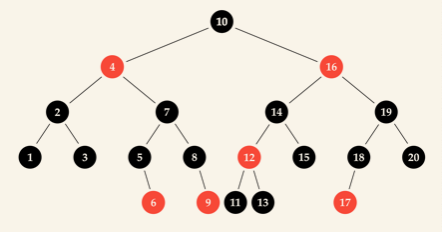

## Swift 实现红黑树



#### 性质：

- 根节点是黑色
- 红色节点只拥有黑色的子节点
  - 限定了红色节点的范围
- 从根节点到一个空位（一个左右节点都没有），树中存在的每一条路径都包含相同数量的黑色节点。
  - 红色节点不会被计算

要新增一个节点，我们需要用一个新节点替换它的一个空位即可。


```swift
public enum Color {
    case black
    case red
}
extension Color {
    var symbol: String {
        switch self {
        case .black: return "⚫️"
        case .red: return "🔴"
        }
    }
}

public enum RedBlackTree<Element:Comparable> {
    case empty
    indirect case node(Color, Element, RedBlackTree, RedBlackTree)
}

public extension RedBlackTree {
    func contains(_ element: Element) -> Bool {
        switch self {
        case .empty:
            return false
        case .node(_, element, _, _):
            return true
        case let .node(_, value, left, _) where value > element:
            return left.contains(element)
        case let .node(_, _, _, right):
            return right.contains(element)
        }
    }
}
    
public extension RedBlackTree {
    func forEach(_ body: (Element)throws -> Void) rethrows {
        switch self {
        case .empty:
            break
        case let .node(_, value, left, right):
            try left.forEach(body)
            try body(value)
            try right.forEach(body)
        }
    }
}
extension RedBlackTree: CustomStringConvertible {
    func diagram(_ top: String, _ root: String, _ bottom: String) -> String {
        switch self {
        case .empty:
            return root +  "•\n"
        case let .node(color, value, .empty, .empty):
            return root + "\(color.symbol)\(value)\n"
        case let .node(color, value, left, right):
            return right.diagram(top + "    ", top + "┌───", top + "│   ") + root + "\(color.symbol) \(value)\n" + left.diagram(bottom + "│   ", bottom + "└───", bottom + "    ")
        }
    }
    public var description: String {
        return self.diagram("", "", "")
    }
}

/// 插入
extension RedBlackTree {
    @discardableResult
    public mutating func insert(_ element: Element) -> (inserted: Bool, memberAfterInsert: Element) {
        let (tree, old) = inserting(element)
        self = tree
        
        return (old == nil, old ?? element)
    }
}

extension RedBlackTree {
    public func inserting(_ element: Element) -> (tree: RedBlackTree, existingMember: Element?) {
        let (tree, old) = _inserting(element)
        switch tree {
        case let .node(.red, value, left, right):
            return (.node(.black, value, left, right), old)
        default:
            return (tree, old)
        }
    }
}
extension RedBlackTree {
    func _inserting(_ element: Element) -> (tree: RedBlackTree, old: Element?) {
        switch self {
        case .empty:
            return (.node(.red, element, .empty, .empty), nil)
        case let .node(_, value, _, _) where value == element:
            return (self, value)
        case let .node(color, value, left, right) where value > element:
            let (l, old) = left._inserting(element)
            if let old = old {
                return (self, old)
            }
            return (balanced(color, value, l, right), nil)
        case let .node(color, value, left, right):
            let (r, old) = right._inserting(element)
            if let old = old {
                return (self, old)
            }
            return (balanced(color, value, left, r), nil)
        }
    }
}

/// 平衡
extension RedBlackTree {
    /// 检测现有的树是否违反了平衡要求，如果是，则重排节点
    /// 随即返回符合标准的树来进行修复
    /// balanced 只需要检查第二项要求，并且在不破坏第三项要求的同时修复它
    func balanced(_ color: Color, _ value: Element, _ left: RedBlackTree, _ right: RedBlackTree) -> RedBlackTree {
        switch (color, value, left, right) {
        case let (.black, z, .node(.red, y, .node(.red, x, a, b), c), d):
            return .node(.red, y, .node(.black, x, a, b), .node(.black, z, c, d))
        case let (.black, z, .node(.red, x, a, .node(.red, y, b, c)), d):
            return .node(.red, y, .node(.black, x, a, b), .node(.black, z, c, d))
        case let (.black, x, a, .node(.red, z, .node(.red, y, b, c), d)):
            return .node(.red, y, .node(.black, x, a, b), .node(.black, z, c, d))
        case let (.black, x, a, .node(.red, y, b, .node(.red, z, c, d))):
            return .node(.red, y, .node(.black, x, a, b), .node(.black, z, c, d))
        default:
            return .node(color, value, left, right)
        }
    }
}

```


```swift
/// 手动创建
let bigTree: RedBlackTree<Int> =
    .node(.black, 9,
        .node(.red, 5,
            .node(.black, 1, .empty, .node(.red, 4, .empty, .empty)),
            .node(.black, 8, .empty, .empty)),
        .node(.red, 12,
            .node(.black, 11, .empty, .empty),
            .node(.black, 16,
                  .node(.red, 14, .empty, .empty),
                  .node(.red, 17, .empty, .empty))))

print(bigTree)

        ┌───🔴17
    ┌───⚫️ 16
    │   └───🔴14
┌───🔴 12
│   └───⚫️11
⚫️ 9
│   ┌───⚫️8
└───🔴 5
    │   ┌───🔴4
    └───⚫️ 1
        └───•

/// 自动创建
var set = RedBlackTree<Int>.empty
for i in (1...10).shuffled() {
    set.insert(i)
}
print(set)

    ┌───⚫️10
┌───⚫️ 9
│   └───⚫️8
⚫️ 7
│       ┌───🔴6
│   ┌───⚫️ 5
│   │   └───🔴4
└───⚫️ 3
    │   ┌───🔴2
    └───⚫️ 1
        └───•
```


#### 平衡

> 
>
> ```swift
> /*
> let one: RedBlackTree<String> =
>     .node(.black, "z",
>             .node(.red, "y",
>                 .node(.red, "x", .empty, .empty),
>                 .empty),
>             .empty)
> print(one)
> 
> let two: RedBlackTree<String> =
>     .node(.black, "z",
>             .node(.red, "x",
>                 .empty,
>                 .node(.red, "y", .empty, .empty)),
>             .empty)
> print(two)
> 
> let three: RedBlackTree<String> =
>     .node(.black, "x",
>             .empty,
>             .node(.red, "z",
>                     .node(.red, "y", .empty, .empty),
>                     .empty))
> print(three)
> 
> let four: RedBlackTree<String> =
>     .node(.black, "x",
>             .empty,
>             .node(.red, "y",
>                 .empty,
>                 .node(.red, "z", .empty, .empty)))
> print(four)
> */
> 
> ┌───•
> ⚫️ z
> │   ┌───•
> └───🔴 y
>     └───🔴x
> 
> ┌───•
> ⚫️ z
> │   ┌───🔴y
> └───🔴 x
>     └───•
> 
>     ┌───•
> ┌───🔴 z
> │   └───🔴y
> ⚫️ x
> └───•
> 
>     ┌───🔴z
> ┌───🔴 y
> │   └───•
> ⚫️ x
> └───•
> ```
>
> 插入一个元素以后，一个红色节点用友红色子节点的四种可能的情况。 x、y 和 z 代表值。如果与上述四种模式匹配，则它的节点需要按照如下模式重组。
>
> ```swift
> /*
> let five: RedBlackTree<String> =
>     .node(.red, "y",
>             .node(.black, "x", .empty, .empty),
>             .node(.black, "y", .empty, .empty))
> print(five)
> */
> 
> ┌───⚫️y
> 🔴 y
> └───⚫️x
> 
> ```
>


